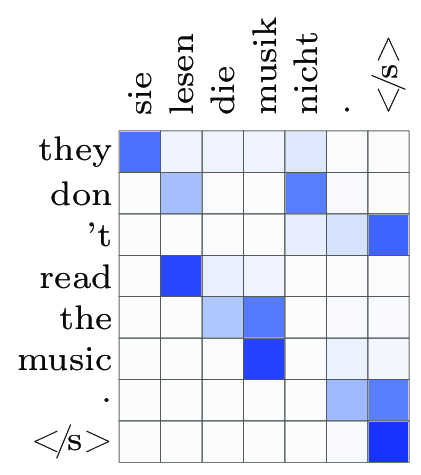

# RNN-based sequence processing
## Sequence processing with RNNs

Depending on the way inputs, outputs and hidden/cell states are handled,
RNNs can be used for a variety of sequence transformation and processing
tasks:

{width="100%"}

## Sequence processing with RNNs cont.

Perhaps the most basic is the many-to-many transformation of an
$\langle \mathbf{x}_1,\dots,\mathbf{x}_n \rangle$ input sequence to the
$\langle \mathbf{y}_1,\dots,\mathbf{y}_n\rangle$ sequence of
corresponding outputs at each time step.

This type of architecture can be used e.g., for sequence tagging, when
the outputs are distributions over the tags. Language modeling can be
considered a special case of sequence tagging, when the correct "tag" of
each word in a text is simply the next word:
$$\mathbf{x} = \langle w_1,\dots,w_{n-1}\rangle,$$
$$\mathbf{y} = \langle w_2,\dots,w_{n}\rangle.$$

## Sequence tagging

A simple tagging example: LSTM-based POS-tagger with word-embedding
input and softmax output layers.

{width="100%"}

## Bidirectional RNNs

Language modeling as a sequence tagging task has a very particular
property: models cannot have access to information about elements
*after* the element to be tagged.

For other sequence tagging tasks this does not hold: context *after* the
element is an important part of the input. But an RNN unit is inherently
one-directional: hidden states can contain information only about inputs
at earlier time steps. A widespread way of providing access to the full
context is using RNNs in *both directions* and concatenate their hidden
states at each element. This is a so-called __*bidirectional RNN*__ layer.

## Bidirectional RNNs cont.

Naturally, bidirectional RNN layers can be stacked similarly to
ordinary, one-directional RNNs:

```{=latex}
\center
```
{width="85%"}\


## Seq2vec: sequence encoding

There are many tasks for which a variable-length input sequence has to
be mapped to a fixed-length output, e.g., sequence classification tasks
like sentiment classification.

How can one or several stacked RNNs be used to map the input sequence to
a vector which is a useful representation of the whole input? The key is
that RNN *hidden states* (plus the cell states of LSTMs) can represent
the whole input sequence up to the given time step.

## Seq2vec: sequence encoding cont.

For one-directional RNN(s), the obvious solution is to use
the *last hidden state* (possibly together with the cell state in case
of LSTMs) to represent the whole input sequence. E.g., for
classification:

{width="70%"}


## Seq2vec: sequence encoding cont.

The hidden states of bi-RNNs, in contrast, contain information about the entire
input at each time step, so it makes more sense to aggregate all of them, e.g.,
using average or max pooling.

{width="70%"}

## Vec2seq: sequence generation

Sequence generation based on a fixed size vector is analogous to
language generation with a language model, but in this case generation
is *conditional*: we want to model sequence probabilities
$$P(\langle y_1,\dots, y_n\rangle ~|~ \mathbf{x})$$ where $\mathbf{x}$
is a fixed length vector. Similarly to RNN-based *uncoditional* language
models, we can reduce the problem to modeling the individual
$$P( y_n|~ \langle y_1,\dots,y_{n-1} \rangle, \mathbf{x})$$
*continuation probabilities* with RNNs.

## Vec2seq: sequence generation cont.

The standard RNN-based language model architecture can be reused with a
single modification: the RNN hidden states are also conditioned on the
condition vector $\mathbf{x}$. The model has the following conditional
independence structure:

{width="45%"}

## Vec2seq: sequence generation cont.

On the neural architecture level, conditioning the RNN hidden states on
$\mathbf{x}$ can be implemented in several ways:

-   use $\mathbf{x}$ (directly or after a transformation) as the
    *initial hidden state* of the RNN (also as the initial cell state
    for LSTMs);

-   use $\mathbf{x}$ (directly or transformed) as the *input* at the
    *first time step*;

-   use $\mathbf{x}$ (directly or transformed) as the *input* at *each
    time step* (in addition to the already generated sequence elements).

## Vec2seq: sequence generation cont.

The first two solutions are the most widely used, e.g., the following
image captioning model uses the image's feature vector as the first LSTM
input:

.](figures/image_captioning.eps){width="1.\\textwidth"}

## Vec2seq: sequence generation cont.

The training of Vec2seq models is, again, analogous to that of
unconditional language models:

-   The dominant strategy is __*teacher forcing*__: the training dataset's
    sequences are used as RNN input, the predicted continuation
    probabilities are used only for calculating the loss (negative log
    likelihood).

-   As in the unconditional case, teacher forcing leads to __*exposure
    bias*__ (an unhealthy gap between the training and inference setting),
    so alternative training strategies such as *scheduled sampling* are
    also used.

## RNN-based Seq2seq

By combining an RNN Seq2vec with an RNN Vec2seq module we can build a
Seq2seq model which transforms a variable-length input sequence into
another *unaligned* sequence by first *encoding* the input into a
fixed-size vector representation and then *decoding* this vector into
another sequence. The probabilistic structure of the combined model is:

{width="70%"}

## RNN-based Seq2seq cont.

Historically, RNN-based Seq2seq models were among the most successful
applications of RNNs (more concretely, of LSTM variants). Applications
included

-   machine translation (LSTM Seq2seq models were the first neural MT
    models competitive with and later superior to traditional
    phrase-based solutions),

-   summarization,

-   question answering, and

-   dialogue systems.

## RNN-based Seq2seq cont.

Architecturally, these models are typically

-   embedding-based,
-   use several LSTM layers in both the encoder and the decoder,
-   initialize the hidden state and the cell state of the decoder with
    the (last or aggregated) hidden states and cell states of the
    encoder,
-   are trained, as usual, with teacher forcing and negative log
    likelihood loss.

While the decoder cannot contain backward RNNs (for obvious reasons),
the encoder often contains bidirectional RNN layers.

## RNN-based Seq2seq cont.

A typical machine translation model:

{width="70%"}

# Attention
## Attention

In basic RNN Seq2seq models, as we have seen, the decoder could access
the encoded input sequence only in the form of the fixed-size vector
representation(s) produced by the encoder.

Significantly, this fixed-size "summary" did not depend on *where* the
decoder was in the decoding process, even though we know that for
typical Seq2seq tasks, e.g. for translation, different parts of the
input are relevant at different decoding stages.

Even if the fixed size vector was produced by pooling the whole sequence
of encoder hidden states, the decoder's context has no influence on the
pooling.

## Attention cont.

Attention mechanisms solve the problem by providing access to
*dynamically pooled* versions of the encoder hidden states at each
decoding time step, *based on the encoder's context*, i.e., the
$h_{t-1}^d$ hidden state:

{width="57%"}

## Attention cont.

Concretely, attention mechanisms *score* the
$\mathbf{h}^e=\langle h_1^e\dots,h_n^e \rangle$ encoder hidden states
based on the $h^d_{t-1}$ decoder context using an $s(\cdot, \cdot)$
scoring function, and produce a weighted sum with the softmax of the
scores:
$$\mathbf{s}(\mathbf{h}^e, h_{t-1}^d ) =\langle s({h}^e_1, h_{t-1}^d),\dots,
  s({h}^e_n, h_{t-1}^d) \rangle,$$

$$\mathcal A(\mathbf{h}^e, h_{t-1}^d) =  \mathop{\mathrm{softmax}}(\mathbf{s}(\mathbf{h}^e, h_{t-1}^d )) \cdot \mathbf{h}^e.$$

## Attention: scoring functions

There are two main types of attention according to the type of scoring
function they use:

-   __*Additive*__ or __*MLP*__ or __*Bahdanau*__ attention: the score is calculated
    by a simple feedforward network with one hidden layer:
    $$s_{add}(\mathbf{a}, \mathbf{b}) =
          \mathbf{v^\intercal}\tanh(\mathbf{W_1\mathbf{a} + \mathbf{W_2} \mathbf{b}}),$$
    where $\mathbf{v}$, $\mathbf{W}_1$ and $\mathbf{W}_2$ are learned
    parameters.
-   __*Multiplicative*__ or __*Luong*__ attention: the score is calculated as
    $$s_{mult}(\mathbf{a}, \mathbf{b}) =
          \mathbf{a}^{\intercal} \mathbf{W} \mathbf{b},$$
    where $\mathbf{W}$ is, again, learned.

## Dot product attention

__*Dot product*__ scoring is an important, simple multiplicative scoring
variant, in which $\mathbf{W}$ is identity, i.e.,
$$s_{dot}(\mathbf{a}, \mathbf{b}) = \frac{\mathbf{a} \cdot \mathbf{b}}{\sqrt d},$$
where $d$ is the dimensionality of $\mathbf{a}$ and $\mathbf{b}$, and
the division with $\sqrt d$ ensures that the scores have 0 mean and 1
variance if the $\mathbf{a}$ and $\mathbf{b}$ inputs have.

## Performance gains from attention

Adding attention mechanisms to RNN Seq2seq architectures typically
results in sizable performance gains, @luong2016neural [63], e.g.,
reports 11% perplexity and 20% BLEU score improvement on a translation
task.

As a result, state-of-the-art RNN Seq2seq models virtually always
contain some type of attention mechanism.

## Performance gains from attention cont.

Attention weight visualizations show how they reflect relevance to the
decoding step:

```{=latex}
\center
```
{width="40%"}

# Prologue: CNNs
## Prologue: CNNs as sequence models

Although our discussion has concentrated on RNNs, convolutional networks
are rather competitive in many NLP tasks. They use 1d convolutions:

```{=latex}
\center
```
{width="80%"}\

## Prologue: CNNs as sequence models

...and 1d (typically max- or average) pooling layers. In fact, the
surprisingly well performing fastText classification model uses pooling
*without* convolution:

{width="65%"}

# References

## References {.allowframebreaks}
\small

