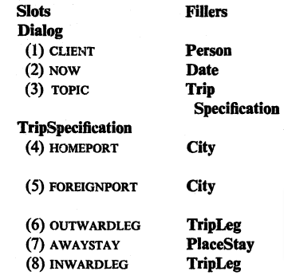
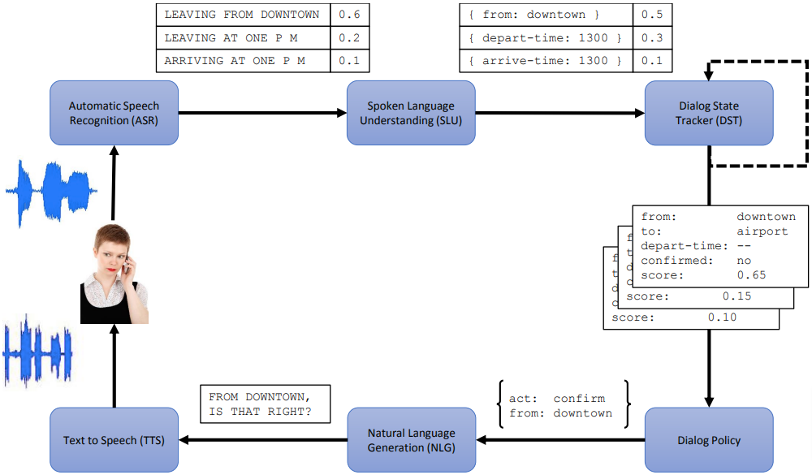
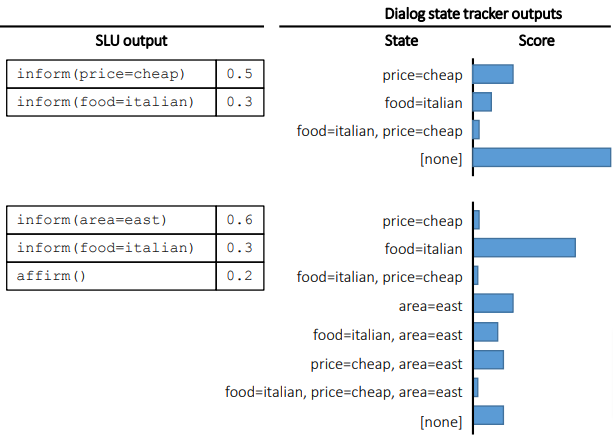
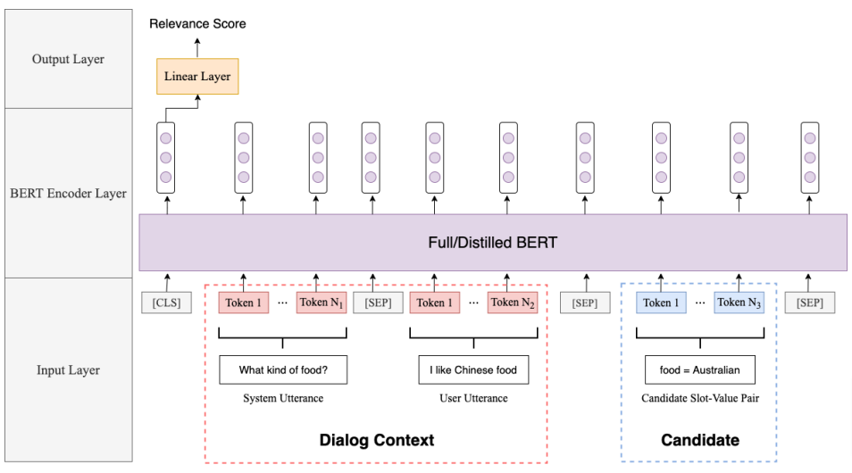
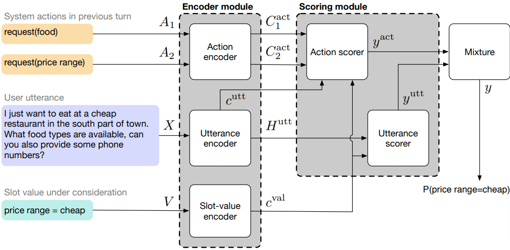
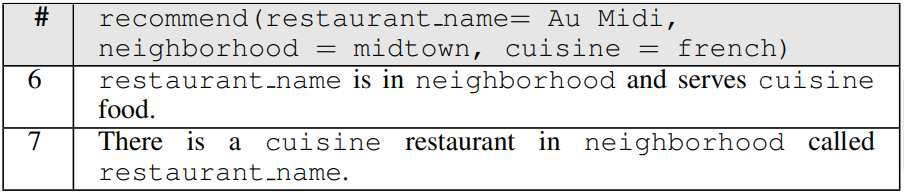
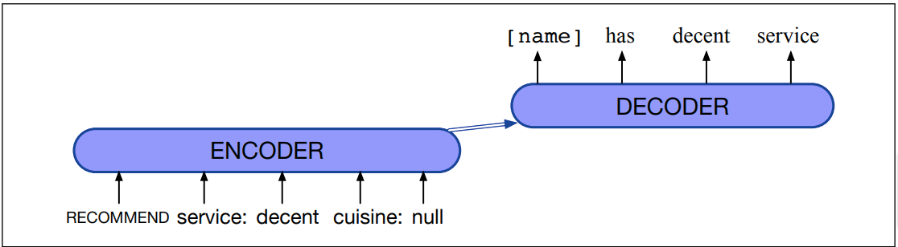
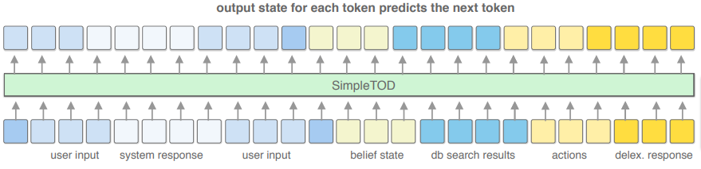
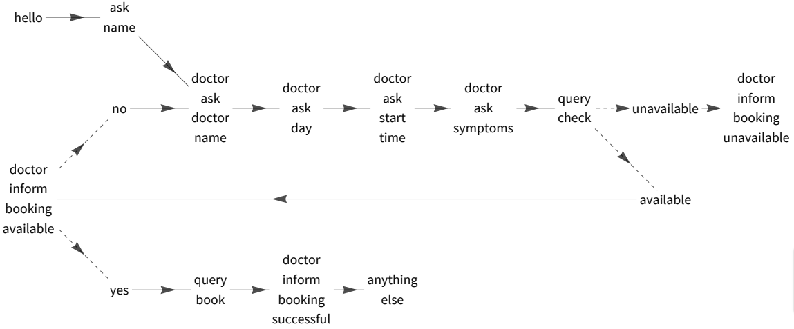

### Acknowledgement {.alert}

The following slides are based on and very closely follow the online freely
available Chapter 15 of @jurafsky2023speech, and also follow
@mctear2022conversational at certain points.

# Introduction

## Dialog systems

* They communicate with the user by conducting a dialog/conversation.
* The modality (form) of the conversation can be
  - __spoken__,
  - __written__ (text), or
  - __mixed__: in addition to speech and/or text dialogs can also contain GUI
    elements such as dialog boxes with buttons.
* Typical environments include
  * messaging platforms (e.g., Slack and Facebook Messenger),
  * smart phone assistants (Siri, Cortana etc.),
  * smart speakers (e.g., Alexa),
  * cars (e.g., Google Android Auto).

## Types of dialog systems

It is customary to distinguish __task-oriented__ and __open domain__ dialog
systems (the latter are also called __chatbots__).

* __Task-oriented dialog systems__: The goal is to complete a task or tasks in a
predefined task set, e.g., order something, make a call, transfer money, get
directions etc.

* __Open-domain dialog systems__:
  * The goal is open-ended and unstructured, extended conversation.
  * There is no predetermined task (or set of tasks) whose
    successful execution would be the goal.
  * The main result in many cases is simply "entertainment".
  * Can be additional components of mainly task-oriented systems.
  
## Types of dialog systems cont.

Another important classification is according to who initiates and controls the
conversation. A dialog can be

* __user-initiated__: e.g., a mobile phone assistant. Dialogs are typically very
  short, e.g., a user question and a system answer using a mobile assistant.
* __system-controlled__: variants include when
  * the system initiates and controls, e.g. by warning or reminding the user
    of something,
  * the user initiates by asking for instructions, from there the system
    instructs without essential user input,
  * the user initiates by asking for a service, from there the system helps the
    user to "fill in a questionnaire" by asking questions.
* __mixed initiative__: there are several turns and both the system and the user
  can take the initiative -- these are typically open-domain dialog systems.

## General conversational requirements

The system needs to be able to reproduce the important features of human-human
conversations, among others:

### Grounding

There is a constantly evolving **common ground** established by
the speakers who constantly acknowledge understanding what the other said.

\bigskip

Speakers 

* __introduce__ new pieces of information,
* __acknowledge__ the added information (by gestures of verbal confirmation),
* __ask for clarification__ if needed.

## General conversational requirements cont.

### Adjacency pairs

Utterance types are associated with response expectations:

* question $\Rightarrow$ answer
* proposal $\Rightarrow$ acceptance
* compliment $\Rightarrow$ downplayer etc.

### Pragmatic inferences

We infer speaker meaning by assuming that utterances are

* relevant,
* informative,
* truthful, and
* clear and brief (or at least that the speakers aim at this).

# Open-domain dialog systems 

## Approaches

1.  **Rule-based**

    Traditionally, rule-based, "pattern-match and substitute" type
    systems were used, famously

    -   **Eliza** (1966), simulating a Rogerian psychologist, and
    -   **PARRY** (1971), for studying schizophrenia.

2.  **Corpus-based**

    The more modern alternative is, of course, to build a corpus-based system,
    which is trained on a data set containing a large number of dialogues.

## Corpus-based approaches

-   **Response by retrieval**: Respond with the utterance in the data set
    that is
    -   most similar to the last turn, or
    -   is the response to the utterance which is most similar to the
        last turn.
    -   similarity can be totally pretrained, or trained/fine-tuned
        embedding based.
-   **Response by generation**: Train a genator model on the data set,
    typical architectures:
    -   RNN or Transformer based encoder-decoder, or
    -   a fine-tunded "Predict next", language-model, e.g., a GPT-like
        architecture. We will discuss that alternative in the next lecture.

# Task-oriented dialog systems 

## Frames

Most task-oriented dialog systems (TODs) are based on (some variant of)
__frames__, i.e., structured representations of the user's intentions, which
contain __slots__ that can be filled in with __values__. A slot value can be
another frame.

::: columns

:::: column

{width=85%}\

::::

:::: column

![Frames used in the GUS dialog system [@bobrow1977gus].](figures/gus_2.png){width=85%}

::::

:::

## Frames cont.

A frame-based TOD system asks questions that help filling the frame slots until
all slots are filled that are required for the current target task, and then
executes it.

{width=85%}

## Early frame-based architectures

Early frame-based TODs had the the following components:

* __Control structure__: A production rule system controlling how to manipulate
  the slot values and which question to ask based on the actual state and the
  user's input.
* __Natural language understanding__: A rule-based NLP module
  determining the __domain__ (general topic), __intent__ (concrete goal), and
  __slots and filler values__ of the utterance.
* __Natural language generation__ (NLG) module: A template-based system to
  generate appropriate system questions for the user.
* Optionally, an __ASR__ module which was typically based on a task-specific
  vocabulary and grammar/language-model.

## Early frame-based architectures: NLG

![Questions associated with the slots of a frame in the NLG component of a
traditional frame-based dialog system [from
@jurafsky2023speech].](figures/frame.png)

## Early frame-based architectures: NLU

The NLU task is to determine the domain, intent, and slot fillers for each
user utterance. E.g, for

*Show me morning flights from Boston to San Francisco on Tuesday*

We want the analysis

  ------------- ---------------
  DOMAIN        AIR-TRAVEL
  INTENT        SHOW-FLIGHTS
  ORIGIN-CITY   Boston
  ORIGIN-DATE   Tuesday
  ORIGIN-TIME   morning
  DEST-CITY     San Francisco
  ------------- ---------------

# Dialog-state systems

## Dialog-state systems

The modern, more sophisticated incarnation of the frame-based approach to TODs is
the **dialog-state system** architecture. 

Compared to early systems, the main differences are

* decomposing __control__ into two separate modules:
  * the __dialog state tracker__ (also called __belief state tracker__), which
    calculates the current, updated dialog state (user goals, i.e., filled in
    slot values etc.) based on the dialog history, and
  * __dialog policy__, which determines the next system action based on the
    actual state.
* extensive use of __machine learning methods__ in all modules, instead of the
  early systems' rule-based approach.

## Dialog-state systems cont.

The full architecture for a speech-based system:

{width=85%}

## Implementing the NLU component

Identifying the __domain__, __intent__ and __slot values/entities__ in a user
utterance can be implemented by classifiers and sequence tagging models:

![Identifying destination and time slot values using a pretrained encoder and
IOB tagging [from @jurafsky2023speech].](figures/slot_detection.png){width=85%}

## Dialog state tracking

Based on the NLU's (N-best) output and/or dialog history, the tracker determines
the __dialog act__ that took place, and the current (updated) __dialog state__.
This can happen by generating a set of candidate states and scoring them:

{width=57%}

## Dialog state tracking cont.

The scorer can be based on a pretrained encoder like BERT:

{width=95%}

## Dialog state tracking cont.

Instead of scoring full dialog states, it is also possible to score individual
(slot, value) pairs separately:

{width=98%}

## Dialog state tracking and NLU

* As in the previuos two examples, modern dialog state trackers frequently use
  user utterances as input directly, not requiring an independent NLU component
  in the dialog architecture.
* Dialog systems based on ML-based NLU and dialog state tracker modules are
  frequently bootstrapped by first developing a system with rule based modules
  and using it to produce a "silver" labelled dataset. (Of course, the
  validation dataset is still manually annotated in its entirety.)
  
  
## Dialog policy

The **dialogue policy** decides which action should the system take next, on the
basis of the dialogue state and possibly other elements of the dialog history.
The most important action types are __system dialog acts__ (e.g., asking a
question, confirmation request etc.), __querying a database__ and external __API
calls__.

Dialog policy can typically be implemented as a classifier, as usually there is
a finite (and often small) set of possible actions to choose from. Policy
modules can be implemented as

- __rule based__ systems,
- ML models using __supervised learning__, or
- ML models optimized using __reinforcement learning__ (possibly after
  supervised pretraining).

## Natural language generation (NLG)

Finally, when the required action is a type of system utterance, then the
**NLG** component generates the actual sentence based on the concrete action,
the dialog state, and (optionally) the dialog history.

The NLG task is frequently decomposed into

+ __utterance planning__: planing the content of the utterance (which slots/values
  should be mentioned, perhaps also their order and grouping),
* __utterance realization__: actually generating the natural language expression
  of the planned content.

## Natural language generation cont.

![Alternative realizations of planned content in a dialog
[@nayak2017plan].](figures/content_planning.png){width=98%}

## Natural language generation cont.

A widely used strategy for simplifying the generation task and alleviating data
sparsity is to generate __delexicalized templates__, which contain place holders
for slot values, and then replace them with the required slot values.

{width=98%}

## Natural language generation cont.

The generation of the utterances or their templates can be implemented as a
rule-based system or as an ML model; recent implementations typically use
__sequence-to-sequence models__:

{width=98%}

## Simplified architectures and models

The extensive use of seq2seq models for implementing separate dialog state
system modules and the error propagation between separately trained modules
led to the idea [@hosseini2020simple] of training a (pretrained LM-based)
single multi-task seq2seq model, __SimpleTOD__, simultaneously for
 
+ dialog (belief) state tracking,
+ dialog policy, and 
  + NLG [figure from @hosseini2020simple]:

{width=98%}

## Simplified architectures and models cont.

![A SimpleTOD dialog fragment
[from @hosseini2020simple].](figures/simple_tod_1.png){width=98%}

## Simplified architectures and models cont.

Of course, a SimpleTOD-like approach still requires a dataset of dialogs
annotated with dialog actions and dialog states to train on, together with
general information about the domain's intent and entity types/slots. As a
consequence, models trained for a concrete task or tasks cannot be used for
other tasks without retraining.

An interesting research area is to train fully general task-oriented dialog
models that explicitly condition on task-oriented dialog descriptions, so-called
__dialog schema graphs__.

## Dialog schema graphs

{width=100%}

## Schema-guided task-oriented dialog datasets

Several schema-guided task-oriented dialog datasets are available that 
contain schema graphs in addition to the annotated dialogs:

+ The __STAR__ dataset [@mosig2020star] contains 5,820 task-oriented dialogs in
  13 domains with 127,833 utterances,
+ the __SGD__ [Schema-Guided Dialog, @rastogi2020towards] dataset contains
  20,000 dialogs, while
+ the __SGD-X__ dataset "extends the SGD dataset with 5 crowdsourced
  variants for every schema, where variants are semantically similar yet
  stylistically diverse" [@lee2022sgd].

# Evaluation

## Evaluating open-domain dialog systems

Metrics based on some type of distance from the predefined correct behavior do
not work, because the set of correct responses at any given turn is too large.
Instead, human __participants__ or __observers__ evaluate the dialog acts
produced by the system with respect to various quality aspects, e.g.,

+ how __engaging__ was the dialog,
+ are the utterances __human__(-like),
+ do responses __make sense__ in the context,
+ are they __fluent__, 
+ do they avoid __repetitions__.

## Evaluating task-oriented dialog systems

A central metric is __absolute task success__: what percentage of the dialogs leads to
the successful execution of the task according to the user's intentions.

For slot-based systems, it is also possible to measure __slot error rate__:
what percentage of the slots is filled correctly by the system.

In addition to these success-related metrics, user evaluation in terms of __user
satisfaction__ and __general dialog quality__ can also be very useful.
(Fine-grained metrics can measure aspects similar to those used for
open-domain systems.)

# References

## References {.allowframebreaks}
\footnotesize-

