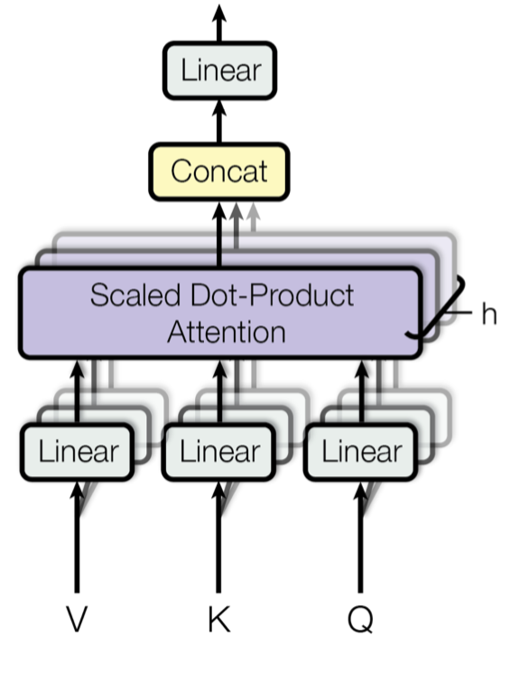
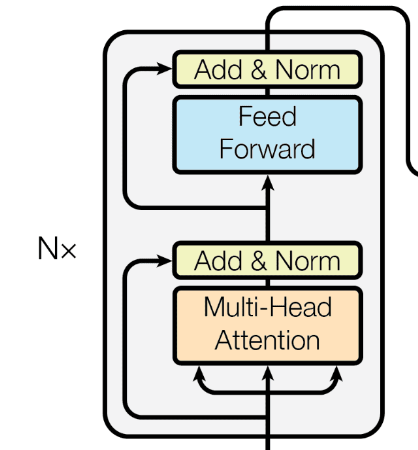
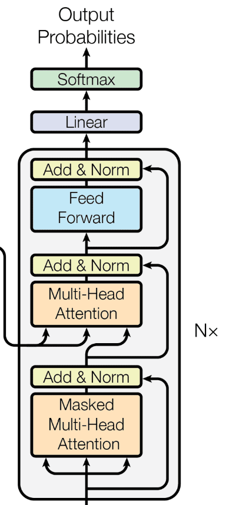
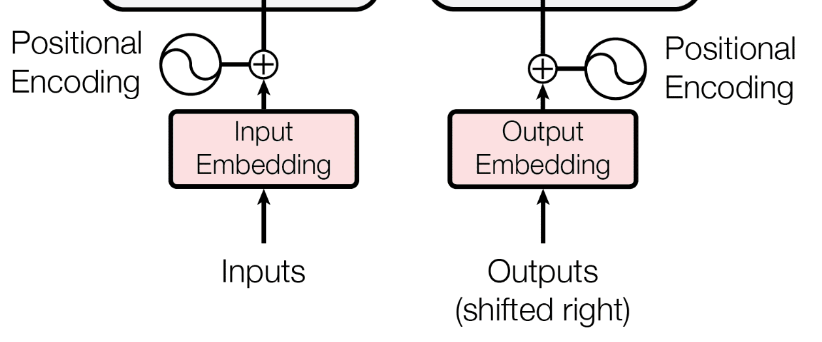

# Transformers

## Introduction

The first influental seq2seq models were RNNs, but later developments were made possible by the invention of *transformers* [@vaswani2017attention], a new type of architecture using attention mechanisms as full-fledged layers, not as auxiliary RNN components.

The new architecture's main building blocks were:

-   attention as soft dictionary lookup,
-   self-attention layers, and
-   transformer modules.

## Intuition

Classic database query (pet shop):

Query: Key **=** "cat"

+---------------+---------------+
| Key (animal)  | Value (price) |
+===============+===============+
| cat           |  1            |
+---------------+---------------+
| dog           |  2            |
+---------------+---------------+
| cat           |  3            |
+---------------+---------------+
| parrot        |  4            |
+---------------+---------------+

## Intuition

Classic database query (pet shop):

Query: Key **=** "cat"

+---------------+---------------+--------------------+
| Key (animal)  | Value (price) | Selection weight   |
+===============+===============+====================+
| cat           |  1            |  1                 |
+---------------+---------------+--------------------+
| dog           |  2            |  0                 |
+---------------+---------------+--------------------+
| cat           |  3            |  1                 |
+---------------+---------------+--------------------+
| parrot        |  4            |  0                 |
+---------------+---------------+--------------------+

## Intuition

Classic database query (pet shop):

Query: Key **=** "cat"

+---------------+---------------+--------------------+
| Key (animal)  | Value (price) | Selection weight   |
+===============+===============+====================+
| cat           |  1            |  1                 |
+---------------+---------------+--------------------+
| dog           |  2            |  0                 |
+---------------+---------------+--------------------+
| cat           |  3            |  1                 |
+---------------+---------------+--------------------+
| parrot        |  4            |  0                 |
+---------------+---------------+--------------------+

Output = $1 \cdot 1 + 2 \cdot 0 + 3 \cdot 1 + 4 \cdot 0 = 4$

## Intuition

**Soft** database query (pet shop):

Query: Key **~** "cat"

+---------------+---------------+--------------------+
| Key (animal)  | Value (price) | Selection weight   |
+===============+===============+====================+
| cat           |  1            |  **0.4**           |
+---------------+---------------+--------------------+
| dog           |  2            |  **0.15**          |
+---------------+---------------+--------------------+
| cat           |  3            |  **0.4**           |
+---------------+---------------+--------------------+
| parrot        |  4            |  **0.05**          |
+---------------+---------------+--------------------+

Output = $1 \cdot 0.4 + 2 \cdot 0.15 + 3 \cdot 0.4 + 4 \cdot 0.05 = 2.1$

## Mathematical formulation

Recall that attention mechanisms provide *query-based aggregation* of an $\langle \mathbf{x}_1,\dots, \mathbf{x}_n\rangle$ vector sequence: given an $\mathbf{x^*}$ *query vector*, they calculate a sequence of relevance scores
$$\mathbf{s} = \langle s(\mathbf{x}_1, \mathbf{x}^*),\dots, s(\mathbf{x}_n, \mathbf{x}^*) \rangle$$ and returned the weighted sum
$$\mathop{\mathrm{softmax}}(\mathbf{s})\cdot \langle \mathbf{x}_1,\dots, \mathbf{x}_n\rangle$$
as a summary or aggregation of the $\mathbf{x}_i$-s according to their relevance score.

## Mathematical formulation

The $s(\cdot, \cdot)$ scoring function varies, we saw that one option is to use the scaled dot-product: $$s(\mathbf{x}_i, \mathbf{x}^*) = \frac{\mathbf{x}_i\cdot \mathbf{x}^*}{\sqrt{d}}.$$ where $d$ is the dimensionality of $\mathbf{x_i}$ and $\mathbf{x^*}$.

Building on this schema, the transformer attention mechanism makes a
crucial change: treats $\langle \mathbf{x}_1,\dots, \mathbf{x}_n\rangle$
as a *dictionary*, for which there are $\mathcal K(\cdot)$ and
$\mathcal V(\cdot)$ mappings that map each $\mathbf{x}_i$ to a
corresponding $\mathcal K(\mathbf{x}_i)$ key and
$\mathcal V(\mathbf{x}_i)$ value.

## Mathematical formulation

Assuming also a $\mathcal Q(\cdot)$ *query* mapping which maps $\mathbf{x}^*$ to the range of $\mathcal K$(.) (the "key-space"), scoring can be reformulated as calculating dot-product based similarity scores between the query and keys
$$s(\mathbf{x}_i, \mathbf{x}^*) = \frac{\mathcal K (\mathbf{x}_i)\cdot \mathcal Q (\mathbf{x}^*)}{\sqrt{d}},$$ 
($d$ is now the dimensionality of the "key-space") and the retrieved value will be the weighted sum 
$$\mathop{\mathrm{softmax}}(\langle s(\mathbf{x}_1,\mathbf{x}^*),\dots,s(\mathbf{x}_n,\mathbf{x}^*) \rangle)\cdot \mathcal V(\langle \mathbf{x_1},\dots,\mathbf{x}_n)\rangle.$$

## Scaling

::: columns

:::: column

This attention however has a problem. Assuming that each vector element of all sequences come from a standard normal distribution $\mathcal{N}(0, 1)$. Their dot-product $\sum\limits_{d}\mathbf{x}_i\cdot\mathbf{x}_i^*$ will have a distribution of $\mathcal{N}(0, d)$, where $d$ is the dimensionality of the vectors. To scale the output back to a standard normal distribution, the dot-product is scaled by $\frac{1}{\sqrt{d}}$.

::::

:::: column

{height=60%}

::::

:::

## Attention as a layer

The outlined attention mechanism can be used as a standalone layer for transforming an input vector sequence $\mathbf{I} = \langle \mathbf{i}_1,\dots, \mathbf{i}_n \rangle$:

Given another $\mathbf{X} = \langle \mathbf{x}_1,\dots, \mathbf{x}_m \rangle$ sequence
and $\mathcal K(\cdot),\mathcal V(\cdot),\mathcal Q(\cdot)$ mappings,
for each $\mathbf{i_k}$ input, we can calculate the corresponding
$\mathcal Q(\mathbf{i}_k)$ query, and use this with $\mathcal K$ and
$\mathcal V$ to *attend to* $\mathbf{X}$ and compute a corresponding
attention response $\mathbf{o}_k$.

The result is an
$\mathbf{O}=\langle \mathbf{o}_1,\dots,\mathbf{o}_n \rangle$ sequence of
outputs, which collectively is the layer's output for the input
$\mathbf{I}$.

## Attention layer types

Depending on where the layer attends to
(where $\mathbf{X}$ comes from) we can distinguish self- and cross-attention layers.

-   In __*self-attention*__ layers, the queries generated from the input are
    used to query the input iself: $\mathbf{X}=\mathbf{I}$.
-   In a __*cross-attention*__ layer, an external vector sequence is
    queried, e.g., in encoder-decoder transformer architectures a
    sequence created by an encoder.

As for the mappings
$\mathcal K(\cdot),\mathcal V(\cdot),\mathcal Q(\cdot)$, all three are
commonly implemented as *linear projections*, with learned weight
matrices $W_K, W_V, W_Q$.

## Multi-head attention

To be able to attend to multiple aspects of the
input, the attention layers in transformers contain several parallel
attention "heads" with different $W_K, W_V, W_Q$ triplets:

{height=57%}

## Multi-head attention

The head outputs are combined into a layer
output:

{height=70%}

## Multi-head attention

{height=65%}

## Transformer modules

The building blocks of transformers are *transformer
modules* consisting of attention and simple piecewise feedforward
layers. The simplest variant contains only a single self-attention
layer:

{height=50%}

## Encoder

::: columns

:::: column

The encoder consists of $N$ identical layers with self-attention and
element-wise FFN modules, plus residuals. The encoded sequence (context) is the
output of the last encoder layer. Each self-attention is bidirectional.

::::

:::: column

{height=70%}

::::

:::

## Decoder

::: columns

:::: column

The decoder consists of $N$ identical layers with self-attention,
cross-attention, and FFN modules, plus residuals. The cross-attention takes the
encoded sequence as the key and value, while the query comes from the decoder.
Each self-attention is unidirectional, cross-attention is bidirectional.

::::

:::: column

{height=70%}

::::

:::

## Embeddings and positional encoding

Transformers were invented for symbolic sequences (e.g. text), thus an embedding layer is used to convert the input tokens to a vector representation. This embedding is then added to a positional encoding vector, which is used to convey positional information to the model.

{height=30%}

## Embeddings and positional encoding

![Sinusoid positional encoding [from @erdem2021].](figures/positional.png){height=84%}

## Embeddings and positional encoding

{height=35%}

![Cosine similarity of positional encodings [@wang2020position].](figures/posenc2.png){height=30%}

## Seq2seq Transformer

::: columns

:::: column

{height=75%}

::::

:::: column

The original *full transformer model* of [@vaswani2017attention] was a
Seq2seq encoder-decoder model built exclusively of transformer blocks.
During inference the decoder part predicts step-by-step, consuming
already predicted output similary to RNNs, but during training it
requires only a single forward pass with teacher forcing.

::::

:::

## Training

By adding a classification head to the decoder, the model can be trained on two sequences. Given the full input sequence, the decoder is trained to predict the next element in the output sequence.

To generate a full sequence, the model is used in an auto-regressive manner. The output of the model is used as the input for the next step. However a single bad prediction will result in a cascade of errors. To avoid this, the model is trained with teacher-forcing.

## Masks

::: columns

:::: column

Masks are used to prevent the model from attending to certain elements. There are two main types of masks used in Transformers:

- Padding masks
- Look-ahead masks (causal masks)

::::

:::: column

.](figures/diagram_bartpost_gpt2.jpg){height=70%}

::::

:::

## Encoder-style, decoder-style models

Some applications require the model to process a single sequence only (e.g. language modeling). In this case there is no need for cross-attention and two modules. We use the encoder, or the decoder (without cross-attention) only. An encoder-style model is used when bidirectional information is present, while a decoder-style model is utilized for causal problems. Thus the only difference between the two is causal masking.

# Contextual embeddings

## Word embeddings limitations

Traditional co-occurrence matrix-based word
vectors and the first generation of neural word embeddings had several
important limitations:

-   *Context independence:* One surface form has only one
    representation. E.g., *bank* will have the same embedding in the
    sentences

    *I went to my bank to withdraw some money.*

    *We explored the river bank.*

    even though the two meanings are clearly different.

## Word embeddings limitations

-   *Words are black boxes:* Words have internal structure: they consist
    of characters and can be composed of several morphemes, but
    Word2vec, GloVe etc. ignore word internals.
-   *No useful representation for unseen or rare words:* As words are
    treated as black boxes, these models cannot produce useful
    representations for words that do not occur or are very rare in the
    training corpus.
-   *Good coverage requires huge model dimensions:* A word gets a
    meaningful representation only if it's explicitly included in the
    vocabulary of the model, but the memory consumption is typically a
    linear function of the covered vocabulary.

## Word embeddings limitations

The problem of utilizing internal word
structure, handling OOV words and reducing the vocabulary size was
efficiently solved both by

-   fastText embeddings, and, especially,
-   subword embeddings,

but these embeddings were still *static*, i.e., mapped tokens of the
same form to the same embedding vector.

One of the most important recent developments in NLP has been the
appearance of *contextual embeddings*, which, in contrast, can vary the
embedding of the same surface form from context to context to reflect
linguistic differences.

## Contextual embeddings

*Contextual embeddings* are word or subword
representations produced by deep networks (commonly LSTM or
self-attention based) that are (pre)trained on self-supervised, broadly
language modeling objectives.

Unlike static embeddings, these representations cannot be simply stored
and deployed in the form of lookup tables, because they are
*dynamically* computed for each token based on their context: For a
$\mathbf{w} = \langle w_1,\dots ,w_n \rangle$ input token sequence the
network produces an $$E(\langle w_1,\dots ,w_n \rangle) = \langle E_\mathbf{w}(w_1),\dots,E_\mathbf{w}(w_n)\rangle$$ embedding sequence.

## Contextual embeddings

Because of this dynamic nature, the network itself has to be used as a *feature extractor module*.

The envisaged use of contextual embedding producing networks in NLP is similar to the role of processing pipelines in traditional NLP: they are supposed to produce feature vectors that are useful for downstream tasks, in fact, the hope is that only little further processing (e.g., in the form of shallow neural networks) is needed to build useful NLP models.

The huge difference is that contextual embeddings can be learned in a *self-supervised fashion*, without costly supervised training sets.

## ELMo (Allen Institute for AI, 2018)

ELMo (Embeddings from Language Models, [@peters2018deep]), the first historically important contextual embedding model, learns word representations via two standard one-directional language modeling tasks.

The architecture starts with producing context-independent embeddings using character-level convolutions, and then uses forward and backward bidirectional LSTM layers (their number, $n$, is a changeable hyperparameter) to predict the next/previous token via weight-shared softmax layers.

## ELMo (Allen Institute for AI, 2018)

{height=50%}

At first approximation, the context dependent embeddings are all the $2n +1$ intermediate representations produced by the model ($2n$ contextual LSTM-based and one static character-based).

## ELMo (Allen Institute for AI, 2018)

Although these vectors together can be considered the "full" ELMo representation, for actual downstream NLP tasks ELMo's creators actually suggest not to use this very high-dimensional representation, but a lower dimensional combination of these vectors. Solutions they suggest are

-   simply taking the concatenation of the output of the top LSTM layers (forward and backward);
-   learning a task-specific linear combination of the ELMO representations on the supervised task.

## FLAIR (Zalando, 2018)

FLAIR [@akbik2018contextual] is a contextual embedding model closely related to ELMo, but

-   consists exclusively of recurrent *character level* language models (a forward and a backward one),
-   produces token-level embeddings from the LSTM hidden states at the first and last character of tokens (first character from the backward and last from the forward LM).

FLAIR embeddings proved to be pretty useful in sequence tagging tasks, and shallow models using them are currently 2nd best (!) in NER and POS-tagging.

## FLAIR (Zalando, 2018)

![Figure from [@akbik2018contextual]](figures/flair.eps){height=80%}

## Transformer-based contextual embeddings

The transformer architecture was first used for translation (2017), but starting from 2018, a series of transformer-based models producing contextual embeddings were developed. The most important research areas were

-   finding self-supervised tasks conducive to learning high-quality representations;
-   architectural improvements, importantly, finding more efficient attention variants;
-   how to adapt/fine-tune the pretrained representation networks for downstream tasks.

## GPT (Generative Pre-Training, OpenAI, 2018)

GPT is a BPE-based, decoder only transformer model trained with a traditional "predict the next token" language modeling objective. The contextual embeddings are simply the outputs of the top transformer module.

Similarly to ELMo, the main goal of GPT is to provide a useful pretrained "feature extractor" module, which can be fine-tuned for supervised NLP tasks. Fine-tuning means changing also the pretrained GPT weights in an end-to-end fashion on the supervised downstream task.

## GPT (Generative Pre-Training, OpenAI, 2018)

{height=90%}

## BERT (Google, 2018)

The next highly influential model was Google's BERT (Bidirectional Encoder Representations from Transformers, [@devlin2018bert]), whose main innovations were

-   the use of two new self-supervised objectives instead of traditional language-modeling:
    -   masked language modeling, and
    -   next sentence prediction (NSP); and
-   a corresponding architectural change: the model is based on the *transformer encoder* architecture.

## BERT: masked language modeling

The objective is to guess randomly masked tokens:

{height=65%}

## BERT: next sentence prediction

The second objective was deciding whether two sentences followed each other in the training corpus or were randomly sampled:

{height=50%}

## Fine-tuning contextual embeddings

The contextual embeddings produced by a pretrained language model are not necesserily optimal for concrete downstream tasks (classification, semantic search etc.), and therefore the pretrained weights can be *fine-tuned* to increase performance.

Fine-tuning can performed

-   using *unsupervised tasks* on a corpus that is more representative of the target domain (the tasks are frequently identical to the pretraining tasks); or
-   on a *supervised task* that is identical or related to the target task, e.g., similarity ranking for semantic search.

## Later trends

Newer models have been able to improve on the state-of-the-art in NLP tasks again and again, but typically with an *increased number of parameters* and *on larger datasets*:

While the original ELMo model had 93.6 million parameters, GPT-3 has 175 billion(!) parameters, and the dataset size increased from 800 million to 300 billion tokens.

## Knowledge distillation

The huge increases in size led to intensive research into *knowledge distillation* methods to be able to produce smaller and more efficient models based on the original ones without significant performance loss.

A good example is *DistilBERT*, a distilled version of BERT trained to mimic BERT's output [@sanh2019distilbert]. DistilBERT retains 97% of BERT's performance, but with 40% fewer parameters and is 39% faster during inference.

## Sparse attention variants

Another way of improving efficiency has been reducing the scope of attention in the self-attention layers, since in full attention the number of dot products to be calculated is quadratic in the number of input tokens. Linear alternatives include

-   *global attention*: a set of global tokens that attend to the whole sequence;
-   *random attention*: for each query, a set of $r$ random keys is calculated to which that query attends;
-   *window attention*: only local neighbors within a fix radius are attended to.

## Sparse attention variants

The Big Bird contextual embedding model [@zaheer2020big] combines all these linear attention types to increase the number of input tokens significantly without significant change in memory requirements:

{height=50%}

## Few- one- and zero-shot learning

An interesting direction is to try to use the model directly, without added layers and gradient updates on downstream tasks. Some recent models, most importantly, GPT-3 [@brown2020language] can perform surprisingly well on various downstream tasks that are explained in the input. There are three learning settings:

-   __*zero-shot*__: The input only contains a short description of the supervised task, and a concrete input instance prompt , e.g. "Translate English to French: cheese =$>$ ".
-   __*one-*__ and __*few-shot*__: In addition to the short task description, the input also contains one or a few training examples before the prompt.

# References {.allowframebreaks} 
\footnotesize
