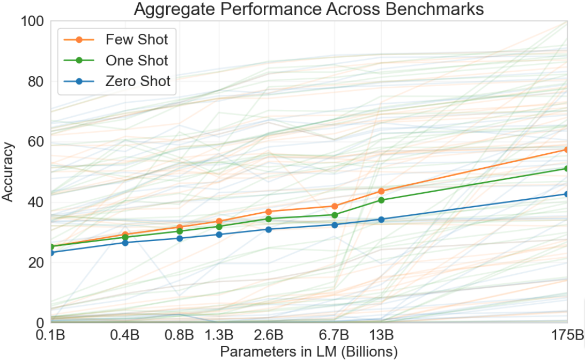
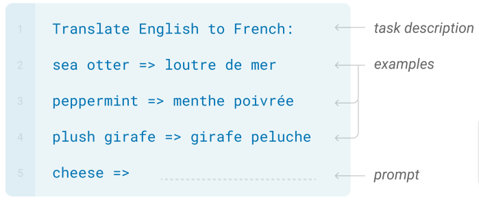
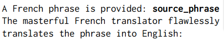
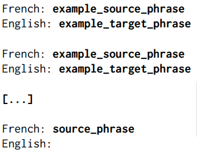
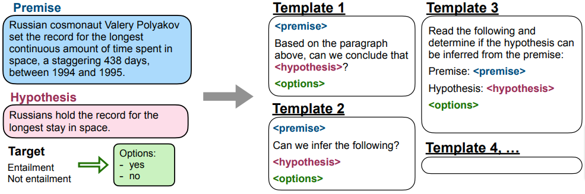
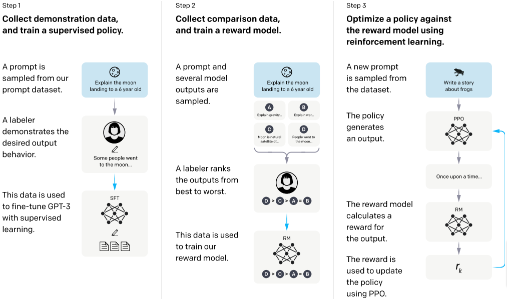

# AI alignment in general

## AI alignment 

The __alignment__ of an AI system is ensuring that it operates in accordance
("is aligned") with

+ the intended __goals__ and __preferences__ of humans (users, operators etc.), and

+ general __ethical principles__.

## AI alignment cont.

The behavior of machine learning-based AI systems is influenced by their
developers in several ways. Most importantly, they select/develop the

+ the __dataset__ on which data-driven models are trained, 

+ the __reward function__ if the model is trained using reinforced
  learning, and

+ in general, the __loss__ or __objective function__ that is minimized or
  maximized by the used parameter optimization method (e.g., gradient descent)
  during training.

  
## AI alignment cont.

Instances of __misalignment__ (lack of alignment) are sometimes classified into
two (not necessarily easily distinguishable) types:

+ __outer misalignment__: a divergence between the developer specified
  __objective__ or __reward__ of the system and the intended human goals, and

+ __inner misalignment__: a divergence between the explicitly specified training
  objective and what the system actually pursues, its so-called __emergent
  goals__.

# Instruction following 

## Emergent few-shot abilities in LLMs

As GPT-3 demonstrated, LLMs trained using the standard MLE-based objective
show remarkable __0-, 1- and few-shot performance__ on many tasks [figure from
@brown2020language]:

{width=80%}

## Emergent few-shot abilities in LLMs cont.

In many cases, MLE-trained LLMs need only a prompt containing a simple
description of the task and, optionally, few examples to perform well:

{width=80%}

## Emergent few-shot abilities in LLMs cont.

The tasks on which the MLE-trained GPT-3 was reported [by @brown2020language] to
have done well without task-specific fine-tuning included

+ translation,
+ question answering,
+ reading comprehension,
+ SAT-style analogies,
+ detecting logical relationships between sentences,
+ simple arithmetic,
+ word scrambling and manipulation (anagrams, word reversal etc.),
+ poem writing with a given title and style.

## Instruction following models

These observations naturally lead to the idea of LLM-based general __instruction
following assistants__ that can carry out a wide, open-ended range of tasks based on
their descriptions.

From the perspective of this intended usage, the expectations toward such a
model include being 

+ __helpful__: it should genuinely (attempt to) carry out the described task;
+ __honest__: it should give accurate information including the expression of
  uncertainty if appropriate;
+ __harmless__: it shouldn't be offensive, discriminatory, and shouldn't recommend
  or help dangerous or unethical acts.^[The list follows @askell2021general.]

## Misalignment with instruction following

With respect to these human goals and expectations (they should act as __helpful
assistants__) GPT-3-like LLMs trained

+ (mostly) on unfiltered web crawl data,
+ using a standard MLE-based language modeling objective

will be __misaligned__: depending on the received prompt they

+ can easily generate __harmful__ (dangerous, discriminatory etc.)
  content, 
+ produce plausibly sounding but non-factual, misleading statements
  (__"hallucinations"__), and
+ can fail to (attempt to) genuinely carry out the described task.

## Misalignment with instruction following cont.

An important type of misalignment regarding properly carrying out tasks in
solely MLE-trained LLMs is being overly __sensitive__ to small and (to a user)
seemingly inessential __prompt differences__. Minor changes in the

+ description of the task,
+ the selection of examples, and
+ the order of examples

were reported to have caused large performance differences.

## Misalignment with instruction following cont.

An illustrative example from @reynolds2021prompt: experimenting with the  prompt template pair

::: columns

:::: column

{width=100%}\ 

::::

:::: column

{width=70%}\ 

::::

:::

they found that the 0-shot template on the left performed better that the 1-shot
and even the 10-shot instantiation of that on the right on a GPT-3 version.
(BLEU score on the WMT’14 Fr-En dataset was 18.0 for the 1-shot, 24.1 for the
10-shot but 26.5 for the 0-shot prompt.)

## Misalignment with instruction following cont.

### Alignment vs misalignment is use-case relative!

MLE-trained LMs can still be (and are) __well aligned__ with other legitimate
use cases, e.g., language modeling for __OCR__ or __speech recognition__ where
the task is nothing else than to assess the probability of a piece of text or
speech being produced by a human in a certain context.

# Alignment with instruction following

## Supervised fine-tuning 

The most obvious approach to improving the low and/or inconsistent performance
on instruction execution is to create a __supervised dataset__ containing
$$(\mathrm{task~instruction}, \mathrm{correct~response})$$ pairs for a large
number of diverse tasks and __fine-tune__ the MLE-pretrained LLM on it.

## Supervised fine-tuning cont.

Given a good instruction dataset, supervised fine-tuning itself doesn't require special
techniques, e.g., for a transformer-decoder type language model

+ the $(\mathrm{instruction}, \mathrm{response})$ pairs are transformed into
  single sequences with a fixed separator between the two (e.g., Flan
  [@wei2021finetuned] uses a "special EOS token" between them), and

+ training loss is the usual __cross-entropy loss__ (with teacher-forcing), and
  it can include the loss for tokens in the instruction, but possibly with a
  lower weight.

## Instruction datasets

The more serious challenge is to create high quality __instruction datasets__.
The main strategies for creating data points are

+ __manual creation__: correct responses are written by human
  annotators, instructions are either collected from user--LLM interactions or
  also manually created;
+ __data integration__: converting existing supervised NLP task datasets into
  natural language $(\mathrm{instruction}, \mathrm{response})$ pairs using
  manually created templates,
+ LLM-based __synthetic generation__: the responses are generated by LLMs (but are
  possibly filtered by humans), while instructions are either
  + collected from user prompts, or 
  + also generated by LLMs based on manually created seed prompts.

## Data integration: Flan

Starting from 2020 several instruction tuning datasets were published, among
them highly influential Flan [@wei2021finetuned] based on a large number of NLP
task datasets:

![Flan datasets [from @wei2021finetuned].](figures/flan_datasets.png){width=100%}

## Data integration: Flan cont.

Flan used 10 manually created conversion templates for each dataset for
converting data points:

{width=100%}

## Synthetic generation

Radical synthetic generation approaches like Self-Instruct [S-I, @wang2022self]
use 

* a small manually created starting pool of __seed task instructions__ (S-I uses 175) 
  and concrete examples (S-I uses 1 example per task), and
* randomly sample the pool to __prompt an LLM__ to generate further 
  instructions and examples.

The generated new instructions and examples are __filtered__ using heuristic
rules, and the high quality ones are added to the pool. The sampling,
generation, filtering and pool extension steps can be __recursively repeated__
until the desired dataset size is reached.

## Synthetic generation cont.

Self-Instruct-style synthetically generated datasets can be surprisingly useful
for instruction fine-tuning even if the generator model is a vanilla MLE-trained
LLM. @wang2022self reports that measuring performance on the SuperNatural
Instructions dataset [@wang2022super] with ROUGE-L scoring,

* vanilla GPT-3's performance improved by 33% after fine-tuning on a
  self-generated Self-Instruct dataset, and
+ it was very close to InstructGPT's (39.9 vs 40.8%).

Because of their diversity, they can also be useful additions to manually
created instruct datasets.

## Reinforcement learning from human feedback

Perhaps the most influential methodology has been OpenAI's approach to
fine-tuning GPT-3 [@ouyang2022training]:

* The starting point is an MLE-pretrained GPT-3 and a __supervised dataset__ of
  instruction prompts (collected from API calls) with __manually created
  demonstrations__ of the preferred output.
* The pretrained model is __MLE-fine-tuned__ on this dataset.
* The fine-tuned model and supervised signal from labelers is used to train a
  regression **reward model** which assigns scalar rewards to prompt-response
  pairs.
* Finally, the fine-tuned model is further tuned using **reinforcement
  learning** with the signal provided by the reward model.

## RLHF cont.

{width=100%}

## Text generation as an RL problem

- __States__ are token sequences to be continued -- possibly consisting of a
  single $\langle \textsc{start}\rangle$ token.
- __Actions__ are adding a new token to the sequence from the vocabulary,
  consequently $|\textrm{Actions}|=|\textrm{Vocabulary}|$.
- __State transitions__ are __deterministic__ (adding a token deterministically
  produces the extended sequence).
- __A policy__ is basically a "predict the next" type language model, and is
  typically stochastic, because there are usually several alternative
  continuations.
- __Reward__ is typically sparse, i.e., based on the whole finished sequence. 

## The reward model

+ The __starting point__ for the reward model (RM) was a relatively small (6B)
  __MLE-pretrained__ GPT version which was also __instruction fine-tuned__ on the
  supervised dataset.

+ The __initial reward model__ was simply this LM with the unembedding layer
  replaced with a regression head.

+ The __reward model__ was trained on a manually created dataset of __quality
  comparisons__ between pairs of alternative model outputs (by the
  MLE-fine-tuned large GPT-3) to prompts in the supervised dataset.
  
## The reward model cont.

The reward model's __loss__ on an $(x, y_{better}, y_{worse})$ triplet, where $x$ is an
instruction sampled from the prompt dataset and $y_{better}, y_{worse}$ are two
ranked alternative model outputs, was

$$-\log(\sigma(RM_{\Theta}(x, y_{better})-RM_{\Theta}(x, y_{worse}))), $$

steering the model towards giving larger reward to the "better" outputs for a
given instruction prompt. 

## Reinforcement learning training

The final step is to use the reward model to further fine-tune the LM using
__reinforcement learning__.

* The used algorithm is typically __Proximal Policy Optimization (PPO)__, a
  policy gradient variant which avoids making too large policy changes by
  clipping the updates to a certain range.^[See, e.g., @ppo for an
  introduction.]

* The RL training objective is to __maximize the expected reward__ from the
  reward model for (instruction, model-response) pairs, but also to __minimize__
  (a scaled version of) the __KL divergence__ between the conditional
  distributions predicted by the policy and by the instruct language model used
  for its initialization.

---
TODO: Effects of instruction tuning
---

# Assistant chatbots

## Instruction-tuned LMs as dialog systems

The success of instruction dataset generating and fine-tuning methods in recent
years led to the development of a sizable set of instruction-finetuned LLMs:
Google's FLAN, OpenAI's InstructGPT, Stanford Alpaca etc.

Seen as dialog systems, these models support conversations that are

* __user-initiated__, 
* consist of exactly __two turns__, and
* their __goal__ is to __perform the described task__, but
* in contrast to traditional task-oriented systems, there is no predefined
  domain and task list, the scope is genuinely __open-ended__.

## Assistant chatbots

The most obvious limitation of the instruction fine-tuned models was their lack
of support for __multi-turn dialogs__, and the main goal of the next development
cycle of aligned LLMs was to remove this restriction.

The dominant solution is to keep the framework used for instruction-finetuning:

* start with an __MLE-pretrained LLM__,
* collect a $D$ __conditional text generation dataset__ of $(x, y)$  input-output pairs ,
* __fine-tune the pretrained LLM__ on $D$ using supervised and, optionally,
  RLHF-based training. (The latter requires additional data and training for the
  reward model.)

## Assistant chatbots cont.

The main difference is that instead of a single instruction, the input of
conditional text generation is a complex __representation of the assistive
dialog's context__, including its __history__:
	
![Dialog context representation in a ChatGPT call [from
@xinzhe2023call].](figures/simple_dialog_api_call.png){width=100%}

## Representing dialog history

The simplest representation is, of course, the full 

$$[u_1, s_1, u_2, \dots, s_{N-1}, u_N]$$

list of alternating user and system utterances from the beginning, but this
might exceed the model's maximal input size, so is typically __truncated__ in
the case of very long dialogs.

More sophisticated solutions do not simply drop early parts of the dialog but
replace it with some kind of compressed representation, e.g., a __summary__.

## Challenges

Despite the undeniable progress that has been made, the current iteration of
LLM-based open-domain assistive chatbots can still

* provide information that is inaccurate or misleading "__hallucinations__"),
* produce __offensive or dangerous__ output, or
* fail at genuinely attempting to perform a task,

so further alignment along the dimensions of being __honest__, __harmless__ and
__helpful__ remains an active research area.

# References

## References {.allowframebreaks}
\footnotesize

