# Pretrain, prompt and predict

## Pretrain, prompt and predict

The paper describing GPT-3 [@brown2020language]  introduced a new paradigm of using
pretrained LMs for downstream tasks: just prompt the model suitably, and map the
output onto the task's output domain without any fine-tuning. They
distinguish 3 scenarios:

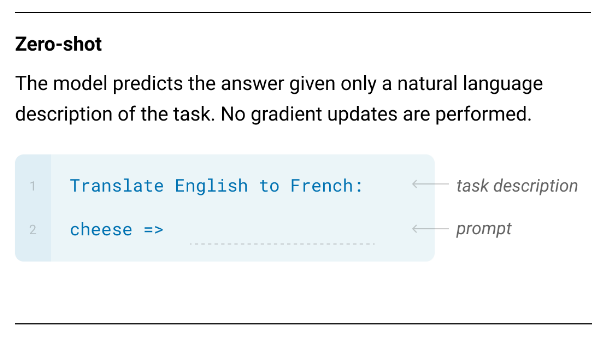{width=70%}

## Pretrain, prompt and predict cont.

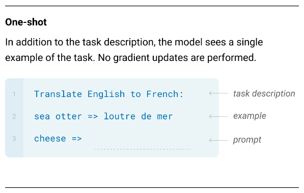

## Pretrain, prompt and predict cont.

![Few-shot or in-context learning [from @brown2020language].](./figures/few-shot.png){width=80%}

## General prompting rules of thumb

-   Instructions should be as __detailed, specific__ and __precise__ as possible;
-   Specifying the __intended audience__ of the output, if applicable, is typically useful;
-   Complex prompts can also include
    -   persona description,
    -   in context examples,
    -   constraints (e.g., template for the expected output format),
    -   required steps for solution &#x2013; this leads to the idea of "Chain of
        thought prompting".

## Pretrain, prompt and predict cont.

An important feature of the the prompting paradigm is that task performance is
very sensitive to the prompt's details:

-   example selection,
-   example ordering, and
-   task formulation

can all have a huge effect, because the models have various biases, among them:

-   **majority label** (imbalance) bias,
-   **recency** bias (later label(s) are more influential), and
-   **common token** bias (more common tokens are more probably predicted).

## Prompt engineering

The listed biases (and others) make it imperative to **optimize** the prompt used
for a large language model-based, zero- or few-shot solutions for a task, that is,
to use suitable **prompt engineering** methods.

# Task formulation

## Prompt mining

Given a supervised dataset $\{\langle x_i, y_i \rangle\}_{i=1}^{N}$, one can
take a corpus (e.g., Wikipedia) and **search for words or syntactic constructs
that connect** the $x$-es with the corresponding $y$-s. Variants [the
examples are from @jiang2020can]:

###  Middle-word prompts
*Barack Obama was born in Hawaii* $\Rightarrow$ [x] *was born in* [y]

###  Dependency-based prompts\

Take the minimal span containing the shortest dependency path between $x$ and $y$:
    
France $\xleftarrow{pobj}$ of $\xleftarrow{prep}$ capital $\xleftarrow{nsubj}$ is 
    $\xrightarrow{attr}$ Paris	$\Rightarrow$\
	*capital of* [x] *is* [y]

## Prompt paraphrasing

Starts with a **seed prompt** and generates candidate prompts by **paraphrasing** it
(e.g., by translation and back translation).

::: {.block}
### Example

seed: [x] *shares a border with* [y] $\Rightarrow$\
[x] *has a common border with* [y]
  
$\vdots$
   
[x] *adjoins* [y]
::: 

[Example from @jiang2020can.] The optimal prompt then can be selected
 by choosing the candidate which performs best on the target task's training
 data.

## Gradient-based search

Builds a prompt template consisting of **trigger tokens**, e.g., the AutoPrompt
algorithm [@shin2020autoprompt]:

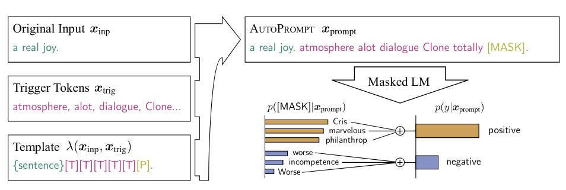

## Gradient-based search cont.

The tokens are found by an algorithm related to coordinate-descent:

1.  Initialize a starting list of length $L$ filled with mask tokens.
2.  For each $i \in 1 \dots L$ token position:
    * compute the $\mathbf{g}$ gradient of the log-likelihood of the training
      data for the token embedding in the position,
    * select the top $k$ words with the closest embeddings to $\mathbf{g}$
      [@shin2020autoprompt uses dot-product as a metric],
    * of these, select the one with the largest log-likelihood and replace the
      current token in position $i$ with it.

###  
This obviously assumes that the gradients are accessible, although
doesn't require __changing__ the parameters.

## Prompt generation

One can treat prompt generation as a conditional text generation problem and use
a standard seq2seq model to solve it. E.g., @gao2020making uses a 
pretrained T5 to generate prompt candidates having high log-likelihood on the
dataset (using beam search):

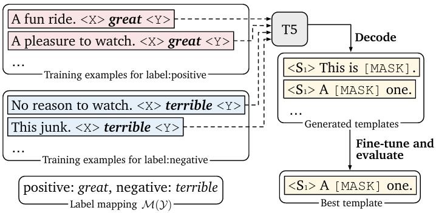{width=80%}

## Prompt generation cont.

A more radical approach is prompting LLMs
to generate instructions:

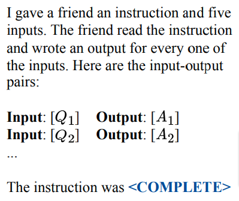{width=50%}

## Prompt scoring

::: columns

:::: column

Finally, the BERT-based common sense knowledge extractor of
@davison2019commonsense is based on a set of hand-engineered prompt templates,
but for any concrete data point selects the template instantiation which has the
highest probability according to a second, pretrained unidirectional language
model (measuring "coherence").

::::

:::: column

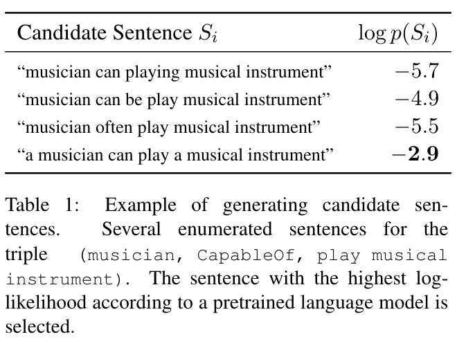{width=100%}

::::

:::

# Example selection

## Similar examples in embedding space

@liu2021makes chooses both similar and random examples from the training data
for few-shot prediction:

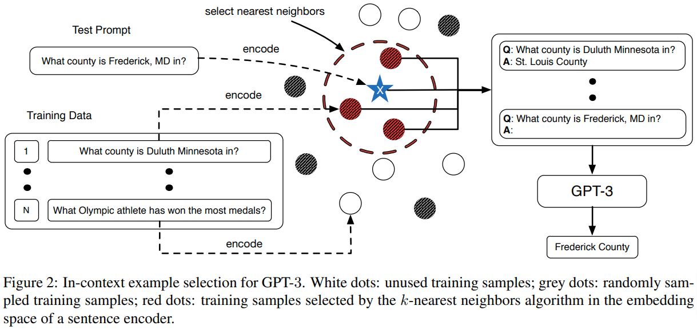\

## Contrastive learning

@rubin2022learning rely on contrastive learning to find the most useful examples.
The proposed method is to

-   Use a (typically smaller) scoring $LM$ to find positive and negative $( e
      , x)$ pairs in the training data, where the score is simply $P_{LM}(y | e,
      x)$.
-   Using contrastive learning train a metric embedding model that can be used to
    assign a score to *any* (example, $x$) pair.
-   For any $x$, retrieve positive and negative examples that contain the top and
    bottom $k$ scoring examples according to the model and use those in the
    few-shot prompt.

# Continuous ("soft") strategies
## Prefix tuning

Learns task-specific embedding vector sequences to be prefixed to the actual
input (and output for encoder-decoders) embeddings [@li2021prefix]:

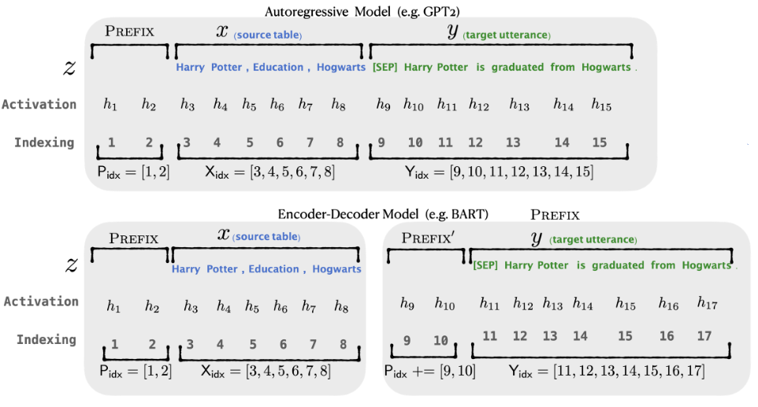

## Prefix tuning cont.

-   The vectors are fine-tuned simply using a log-likelihood objective on the training set.
-   The authors experimented with treating only the **input** embeddings of the
    prefix as learnable parameters vs. the prefix embeddings in **all layers** and
    the latter approach led to radically better results.
-   The method was performing similarly to full fine-tuning.

## Prefix tuning variants

Variations on the continuous prefix tuning theme:

-   **Discrete initialization**: Instead of random initialization,
    the optimization can start from an (automatically or manually) created
    discrete prompt for the task.
-   **Discrete-continuous hybrid tuning**: It is also possible to fix some discrete
    parts of the prompt (using "anchor tokens") and treat only the rest of the
    prefix as learnable parameters.
-   **Auxiliary network**: It turned out to be very useful to model the interactions
    between the prefix embeddings using (relatively) simple networks, e.g., LSTMs.

# Answer engineering
## Answer engineering

The mapping from LM outputs to the output domain of the downstream task can also
be optimized.

\smallskip

Depending on the architecture and the task, the output to be
mapped can be a

-   **Token**: this is a frequent choice for classification tasks.
-   **Span**: containing a few tokens, typically used with "cloze prompts".
-   **Sentence**: natural choice for language generation tasks.

\bigskip

Using the LM output "as is" can work for some tasks, e.g., for text generation,
but a mapping is needed when the $\mathcal{Y}$ output space is different or constrained,
e.g., for classification  or NER tasks.

## Answer engineering cont.

A trivial mapping example: a $v(\cdot)$ "verbalizer" function maps the
downstream topic classication task's class labels to answer tokens. (The input
is a "cloze question" with a gap whose content the model predicts.)

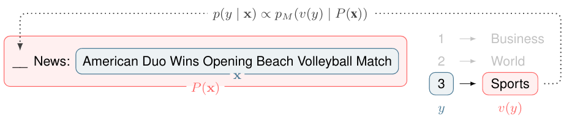

## Answer engineering cont.

Methods for finding suitable answer sets corresponding to each $y\in \mathcal Y$
include

###  Answer paraphrasing

A manually engineered seed answer set for $y$ is extended with paraphrases.

### Prune-then-search

An initial set is created, e.g., by paraphrasing, and this set is searched for
the optimal answer for $y$, e.g., by choosing the alternative with the largest
log-likelihood on the training dataset.

# Combining prompts
## Prompt ensembling

Like model ensembling, combining the LM's answers to multiple
*unanswered* prompts for the same $x$ input can lead to better or more stable
performance. The combination method can be

-   **uniform averaging**: the answer probability distributions to the combined
    prompts are simply averaged;
-   **weighted averaging**: the final distribution is the weighted average of the
    answer distributions -- weights can come from the prompts' performance
    on the training dataset;
-   simple **majority voting** can also be used for classification.

Combining prompts for text generation is not so straightforward, but one way of
doing it is to use the average of all next word probability distributions for
generating the next word at every generation time step.

# Reasoning-structure based prompting 

## Chain of thought prompting

For tasks involving complex reasoning, e.g. math problem solving or planning,
providing step by steps demonstrations can significantly improve performance.
E.g.,

### 
\footnotesize
Question: Tom and Elizabeth have a competition to climb a hill. Elizabeth takes
30 minutes to climb the hill. Tom takes four times as long as Elizabeth does to
climb the hill. How many hours does it take Tom to climb up the hill?

Answer: It takes Tom 30*4 = 120 minutes to climb the hill. It takes
Tom 120/60 = 2 hours to climb the hill. So the answer is 2.

--

Question: Jack is a soccer player. He needs to buy two pairs of socks and a pair
of soccer shoes. Each pair of socks cost $9.50, and the shoes cost $92. Jack has
$40. How much more money does Jack need?

Answer: The total cost of two pairs of
socks is $9.50 x 2 = 19. The total cost of the socks and the shoes
is $19 + $92 = 111. Jack need $111 - $40 = $71 more.
So the answer is 71.

--

## Chain of thought prompting cont.

::: {.block}
#### 
\small

Question: Marty has 100 centimeters of ribbon that he
must cut into 4 equal parts. Each of the cut parts must be divided into 5 equal
parts. How long will each final cut be?\
Answer:

\normalsize

:::

[The example is from @weng2023prompt.]
Even more surprisingly, "zero-shot chain of thought", without examples also
works [the example is also from @weng2023prompt]:

### 
\small Question: Marty has 100 centimeters of ribbon that he must cut
into 4 equal parts. Each of the cut parts must be divided into 5 equal parts.
How long will each final cut be?

Answer: Let's think step by step.

## Self-consistency sampling for COT

Results can often be improved by sampling several answers, i.e., several
reasoning paths instead of a single, say, greedy, decoding, and ensembling the
results, e.g., by taking the majority vote:

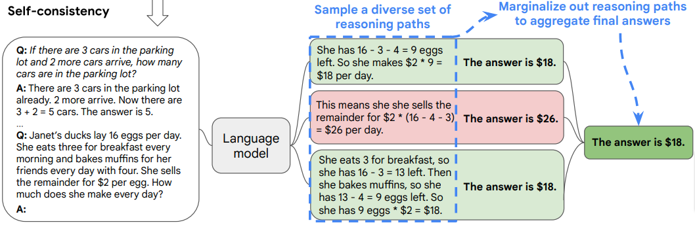{width=100%}

## Self-ask

Prompting the model to explicitly ask and answer follow up questions is also a
useful strategy [@press2023measuring]:

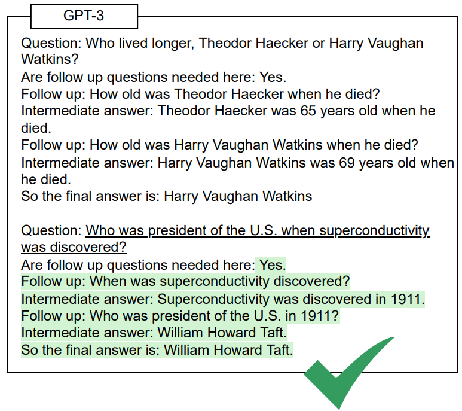{width=70%}

## Knowledge generation

For common sense reasoning task, prompting LLMs to generate relevant knowledge
can also be beneficial. (Details of formulation and examples are task-specific.)
The generated pieces of knowledge are used to answer the question:

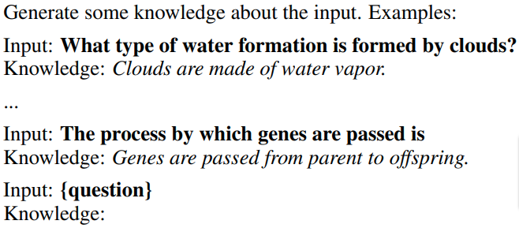{width=80%}

## Knowledge generation cont.

@liu2021generated generate several answers to the knowledge prompt by sampling,
and use  them to generate an answer to the question. The best answer
can be selected, e.g., by majority voting [figure from @liu2021generated]:

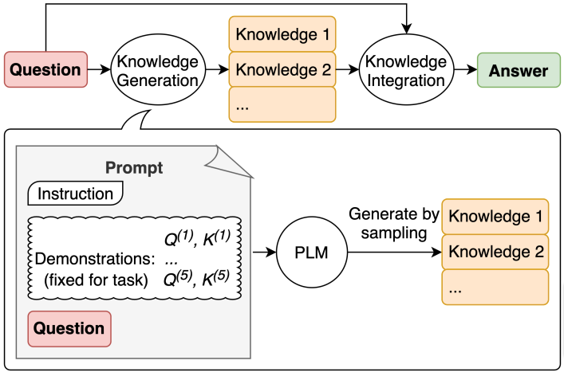{width=68%}

## More complex thought structures

A frequent observation about CoT prompting is that it assumes a __sequential
chain__ of thought directly leading to the answer, but complex human reasoning frequently
involves

* exploring alternative thought sequences that are __branching__ from a common
  start,
* __discarding__ some thought branches,
* and __backtracking__

until the final conclusion is found. 

__Tree-of-thought__ prompting frameworks like that of @yao2023tree support
performing this type of reasoning steps using LLMs with suitable prompting.

## Tree-of-thoughts prompting

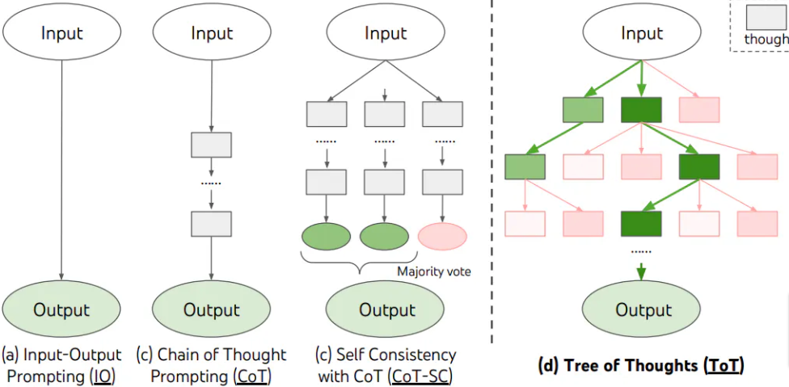{width=100%}

## Tree-of-thoughts prompting cont.

The main components  are:

* explicitly defining what a __unit thought__ is for the current task (a paragraph,
  a formula etc.),
* continuation thoughts __generation__ for a branch (e.g., by sampling), 
* thought __evaluation__,
* a __search strategy__ to decide which node to expand next (e.g., BFS).

## Tree-of-thoughts prompting cont.

![An application of T-o-T prompting to the game of 24 task [from @yao2023tree].
The task is to find arithmetic operations on the input numbers that lead to 24
as their result.](./figures/t-o-t-2.png){width=100%}

## Tree-of-thoughts prompting cont.

There are attempts to elicit tree-of-thought like reasoning with a single prompt, e.g., 
@tree-of-thought-prompting uses the following example prompt:

### 
Imagine three different experts are answering this question.
All experts will write down 1 step of their thinking,
then share it with the group.
Then all experts will go on to the next step, etc.
If any expert realises they're wrong at any point then they leave.
The question is...

## Graph-of-thoughts prompting

A natural extension of the tree of thought idea is to add __aggregation__ of
thought paths. This leads to generalizing T-o-t prompting to a
__Graph-of-thoughts__ framework supporting arbitrary directed acyclic graph
topologies [@besta2023graph]:

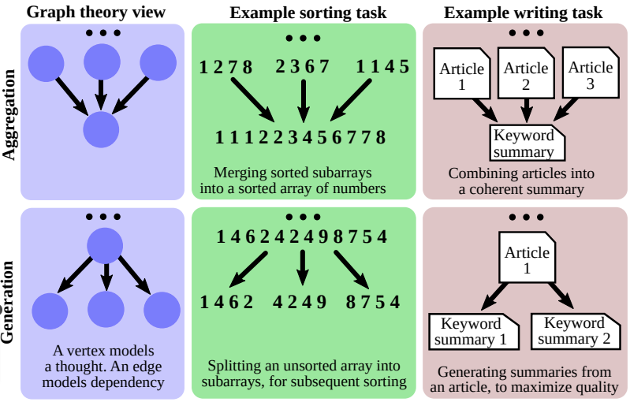{width=70%}

## Graph-of-thoughts prompting cont.

Of course, the added complexity requires a more complex architecture, e.g., the
framework of @besta2023graph uses the following modules (that are adapted to the
actual task): a

* __Prompter__ for preparing prompts that encode graph structure,
* __Parser__ that extracts __thought states__ from outputs and updates a dynamic
  __Graph Reasoning State__ structure,
* __Scorer__ and __Validator__ for evaluating thoughts, and
* __Controller__ for controlling the steps of the graph building process.

## Program-aided CoT reasoning with LLMs

::: columns

:::: column

\bigskip An interesting research direction in CoT prompting [@lyu2023faithful;
@gao2023pal] is to prompt an LLM for __formal reasoning__ or __calculation__
steps (e.g., Python statements) and generate the final answer by executing the
steps with an external interpreter or reasoner [figure from @gao2023pal].

::::

:::: column

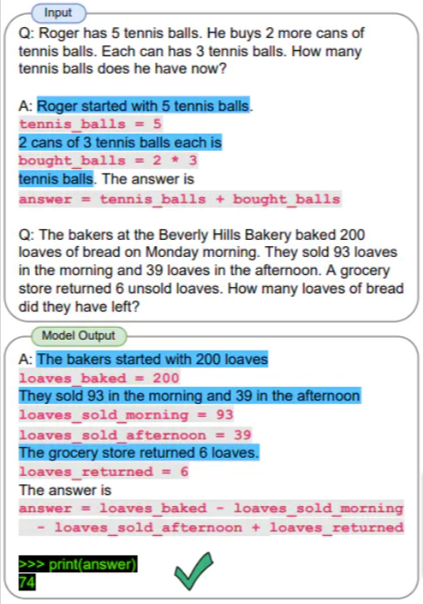{width=95%}\

::::

:::

# Vulnerabilities

## Vulnerabilities

In addition to the usual problems associated with LLMs (possible hallucinations,
dangerous or toxic content etc.), prompting methods that incorporate external
input into LLM prompts can be vulnerable to and have to be safeguarded against
various types of __adversarial prompting__:

+ __prompt injection__ influences the behavior of the LLM to do something
  unintended by ignoring the original instructions, and, specifically
* __prompt leaking__ injects content that makes the LLM leak
  details of their prompts that may contain sensitive information.

# References

## References {.allowframebreaks}
\footnotesize
