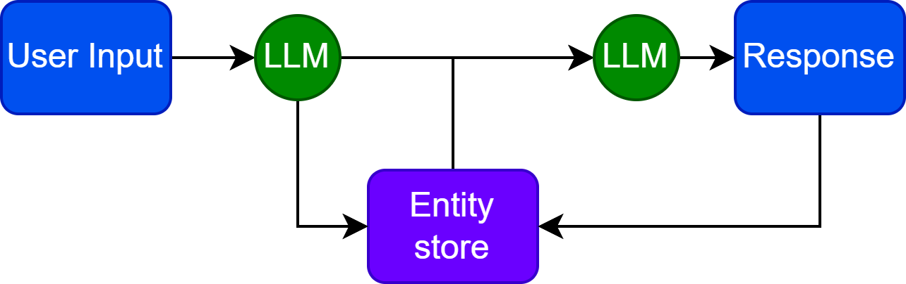

# Augmenting Language Models

## Motivations
From the early 2020s language models could be characterized by the following properties:

- Few-shot learners [@brown2020language].
- Capable of inferring logical problems. [@chang2023survey]
- Prone to hallucinations (due to active knowledge gaps). [@zheng2023does]
- Able to follow instructions in a step-by-step manner. [@wei2022chain]

## Motivations

Knowledge can be injected in a few-shot manner, which could be interpreted to overcome hallucinations. With step-by-step processing, an augmented model can use low-complexity knowledge sources to answer complex questions.

{height=45%}

## Connection to prompting

There are two ways of injecting external information into a transformer-like Language Model:

- Vector sequence in the embedding space (cross-attn, prefix, etc.)
- Injecting text information to a prompt (special tokens, format etc.)

Important! Using proper prompting techniques should be considered alongside augmentation. Transformer-based models' context windows have a fixed length, which is a limitation!

## Retrieval

Easiest solution: Retrieval Augmented Generation (RAG).

Take an external knowledge base and query it. The resulting answer could then be utilized by the model.

Example prompt:

\footnotesize
Answer the following question using the provided context only!

Question: \<USER_INPUT\>

Context: \<RETRIEVED_CONTEXT\>

Answer: \<LLM\>

## How to retrieve information?

The most common methods for finding related information are:

- Keyword-based search (occurence, regex, etc.)
- **Vector-similarity search (TF-IDF, LM-embedding, etc.)**
- Relational queries
- Taxonomy-based search (lexicon, wiki, WordNet)
- Direct access (links, documents)

# Search methods

## Vector-similarity based search methods

Let's assume that we have feature vectors ($e^i$) of certain documents ($i\in I$), where $||e^i||_2^2 = 1$.

The retrieval process should return the closest documents to the embedded user query $e^q$.

This is achieved by classical nearest-neighbor search. Assuming that $e \in \mathcal{R}^d$ and $|I| = N$ the complexity of retrieval is $O(Nd)$.

This scales hard with embedding size (quality) and the number of documents. Searching for the $k$ nearest neighbors is the same.

## Approximate nearest neighbor search

Prebuilt indices can reduce inference time, but memory and building time are still a limitation. Approximation is needed for storing and index building.

Possible solutions:

- Hashing
- Quantization
- Tree structure
- Graph-based

The above principles are refined and often combined in practice.

## Hashing

Instead of returning an exact result bins are constructed with a hashing function. The family of LSH (Locality-Sensitive Hashing) functions is used as with them the probability of collision monotonically decreases with the increasing distance of two vectors.

](figures/LSH_hash.png){height=30%}

## Hashing

Complexity is reduced via binning. Fine-grained search is possible after finding the closest bins.
For more advanced solutions refer to [@wang2021comprehensive]!

](figures/LSH_cluster.png){height=45%}

## Tree-based solutions

In tree structures, the branching factor $b$ reduces the search complexity to $\log_b(N)$. 

In case of a binary KD-tree $b=2$ a simple solution for building such a tree is just drawing a hyper-plane at the median orthogonal to the highest-variance data dimension. Then each half is split using the same principle. This continues until each node contains a single element only.

Then combined tree and embedding space search algorithms could be used to find nearest neighbors. For example: priority search.

## Priority search

::: columns

:::: column

First, the node (or cell) containing the query is selected, then the closest neighboring tree nodes are visited bounded by a maximal embedding space distance initialized by the distance between the query and the embedding vector in the query's cell.

::::

:::: column

![Geometric visualization of priority search. From [@silpa2008optimised]](figures/approxnn_priority_search.png){width=95%}

::::

:::

## Quantization

Given a codebook defined by centroids $\mathcal{C} = {c_i | i\in I}$ where $I = {0, 1, ... m-1}$ is finite.

We map $q(\cdot)$ each real vector to the closest centroids. The set of real vectors mapped to $c_i$ is the Voronoi cell of it denoted by $V_i$.

Meaning that $q(x) = \text{arg}\min\limits_{c_i \in C}d(x, c_i)$, where $d(\cdot)$ is the distance function.

$c_i = E_x[x|i] = \int_{V_i}p(x)\cdot x dx$, then should be defined as the center of the Voronoi cell.

## Product Quantization

Simple quantization is still inefficient as cluster centers are to be calculated using demanding algorithms such as k-means (complexity $O(dm)$). In the case of a simple 1 bit/component $128$-dimensional quantized vector, it would take $m = 2^{128}$ centroids to calculate and store.

That's too much!

Solution: We should factor the vector into multiple segments (similar to MHA).

## Product Quantization

In case of a vector split into $L$ segments, each can be quantized by its specific quantizer. That means $\mathcal{C} = \mathcal{C}_1 \times \mathcal{C}_2 \times ... \times \mathcal{C}_L$ and $I = I_1 \times I_2 \times ... \times I_L$ should be decomposed into the Cartesian-product of the sub-quantizers and sub-indices.

In this case the complexity is reduced to $O(dm^{\frac{1}{L}})$ according to @jegou2010product.

Distances between quantized values of each segment can be calculated and stored for the search step.

## Product Quantization

Using pre-computed tables of $d(c_i, c_j)$, we can easily calculate the distance of the full vectors $e^i$ and $e^q$. Which, in the Euclidean distance case equals:

\small
$d(e^i, e^q)=d(q(e^i), q(e^q))=\sqrt{\sum\limits_{l \in L} d(q_l(e^i), q_l(e^q))^2}$
\normalsize

This results in an average search complexity of $N$ comparisons plus looking up and summing the corresponding distances in the $L$ lookup tables. This boils down to $O(N + L\ \log L \cdot \log\ \log N )$ if $N>>L$ according to @jegou2010product.

## Product Quantization

![Symmetric search using product-quantized approximate NN, from [@jegou2010product]](figures/prodquant_voronoi.png){height=60%}

## Graph-based

Graph methods build an index, that takes the form that suits neighbor-relationship representation. Such as Delaunay-graphs, relative nearest neighbor graphs, k-nearest neighbor graphs, minimal spanning trees, etc...

![Example graphs to be used as a Graph index for ANN search, from [@wang2021comprehensive]](figures/graph_types.png){height=35%}

## Graph-based

These graphs are hard to construct and store, thus approximation comes in during this building process. Usually, graphs with the "small world" property are built. These networks have the following properties given a regular network's edge rewiring probability $p$:

- $L(p)$ shortest path between two vertices on average should be small.
- $C(p)$ clustering coefficient (ratio of the fully connected triples (triangles) and all triples in the graph), should be large.

## Small world

![Graphs with different $p$ rewiring probabilities. [@watts1998collective]](figures/small_world_graphs.png){height=50%}

## Small world

![Small world networks are located in the high $C$ low $L$ interval of randomity. [@watts1998collective]](figures/small_world.png){height=50%}

## Building graphs

NSW (navigable small worlds) is used to create navigable small worlds. Here, vertices are iteratively inserted into the network. Connections are selected with a randomity level that creates a small world network while making sure that the whole network is traversable.

HNSW (hierarchical NSW) takes one further step by organizing the nodes and links into layers. Those layers, that have a long link distance should be inserted into the top layer, while smaller distance (later inserted) nodes are placed in the lower layers.

## HNSW inference

::: columns

:::: column

A greedy search algorithm is initialized from one of the top nodes. It then looks for a local minimum (in the layer), and upon finding it switches to a lower layer, until the closest point to the query is found. The algorithm's average complexity is $O(\log(N))$.

::::

:::: column

![HNSW inference from [@malkov2018efficient]](figures/hnsw_infer.png){height=70%}

::::

:::

## Graph inference

In general other graph-based solutions work according to similar principles. They start from a seed vertex, then travel through the graph taking steps in the direction of a lower distance from the query.

![How graph-based ANN search works: [@wang2021comprehensive]](figures/approx_nn_example.png){height=30%}

# Retrieval Augmentation

## Embedding models

::: columns

:::: column

Semantic vectors are used to retrieve documents. These documents are usually split into shorter chunks. Semantic vectors could come from TF-IDF, Word2Vec embeddings, Masked- or Causal-LM embeddings. Multimodal options are also possible.

::::

:::: column

{height=70%}

::::

:::

## Specialized embedding models

Language model pretraining might not produce an embedding space with the required properties.

Some additional goals could help condition it:

- Supervised semantic similarity
- Classification
- Clustering
- Supervised retrieval or reranking
- Q&A mapping
- Longer (sentence, paragraph) text representations 

## Sentence embeddings

Sentence-level finetuning is needed for the correct semantic representation of longer text.

![Sentence-BERT siamese network during supervised training and inference. [@reimers2019sentence]](figures/sentence_embedding.png){height=80%}

## Sentence embeddings

Sentence-level supervised dataset examples include: sentence similarity datasets, sentiment analysis datasets, natural language inference datasets (premise and either an entailment, a contradiction, or a neutral pair), etc.

![Using NLI datasets as similar-dissimilar (positive-negative) examples for sentence embedding improvement. [@gao2021simcse]](figures/supervised_sent_embed.png){height=35%}

## Instruct-embeddings

Instruction embeddings emerge as multi-task trained embeddings, where the executed task depends on the natural language instruction given to the model. Instruction training improves domain adaptability as well.

## Instruct-embedings

![InstructOR [@su2022one]](figures/instruct_embed.png){height=75%}

## Retrieval Augmented Generation

RAG usually consists of the following steps:

- **Question-forming**: Reformulating user query as a standalone query (accounting for history), list of keywords, etc.
- **Retrieval**: Using an embedding and a vector storage system or search engines, etc. to retrieve useful passages.
- **Document aggregation**: *Stuff* all documents together or *Map* a transform (for example summarization).
- **Answer-forming**: The query and the context are fed to the LM that produces an answer.

## Hypothetical document embedding

Hypothetical document embedding [@gao2022precise] helps with generating better queries for embedding vector-based retrieval systems. The HyDE question-forming step is replaced with a generative step that produces a "fake" example answer to the question and uses that as a query in the database.

![From [@gao2022precise]](figures/hyde.png){height=30%}

## Entity memory

Another possible, more complex use-case is when the LLM has the ability to modify a database as well. In this database a list of entities and related knowledge is stored. The model is iteratively prompted to update this database, then it can retrieve from the entity information the database stores.

{height=30%}

## RAG pre-trained models

Transferring information decoded to text is actually inefficient.

Retrieval augmented pre-training is possible for models, where either pre-embedded vectors are appended to the encoded input, or the information is provided via cross-attention-like mechanisms.

## REALM

Retrieaval Augmented Language Model Pretraining [@guu2020retrieval] uses a neural retriever composed of BERT-like embedding models. These models are part of the trained network. The retriever concatenates the retrieved document embeddings with the query, during MLM training.

## REALM

![REALM pretraining [@guu2020retrieval]](figures/realm.png){height=80%}

## RETRO

Retrieval-Enhanced Transformer [@borgeaud2022improving] introduces a technique where the relevant context information is processed by cross-attention.
The retrieval is performed by frozen BERT embeddings. The retrieved chunks are then modified based-on the input information using cross attention in the encoder as well.

In the decoder cross-attention then incorporates the modified retrieved information into the input.

## RETRO

![RETRO architecture from [@borgeaud2022improving]](figures/retro_arch.png){height=70%}

## RETRO Chunks

The input is sliced up into chunks, which retrieve information separately. Previous chunks (and related information) are processed causally.

The whole model is differentiable, gradients can flow through the network.

During training the retrieved information is pre-computed.

## RETRO Chunks

![Chunked cross-attention from [@borgeaud2022improving]](figures/chunked_cross_attn.png){height=70%}

# Tooling

## API calls

Text-based API-s are easy to call using the API's input and output definition. Most LLMs are fine-tuned to handle JSON or XML formats well.

Some examples of such API-s include:

- Search-engines
- Web-scraping
- Real-time data streams
- Executables, commands (e.g.: calculator)
- Code interpreters, simulators
- Other LLM instances

## AutoGPT - Self-monologue

AutoGPT is capable of higher-order planning by applying multiple turns of generation in a Chain of Thought and Reflexion type prompting.
AutoGPT applies $4+1$ steps of CoT-like process to control actions:

- Thoughts: Interpretation of the user input with respect to the goals.
- Reasoning: CoT about what to do for this input.
- Plan: Planned actions to execute.
- *Action*: Actions with inputs generated by AutoGPT.
- Criticism: Reflexion on action results.

## AutoGPT - Self-monologue

During the planning and action phase additional expert LLMs, and external tools could be called.
AutoGPT systems are usually prompted with a set of goals only, the rest is figured out by the model.   
Example workflow (sending an email):

\footnotesize
**Thoughts**: Contact Natabara at natabara@inf.elte.hu, Send a polite email indicating that he should finalize the NLP slides.   
**Reasoning**: The goals are clear. I need to send an email to Natabara at natabara@inf.elte.hu, politely asking him to finalize the NLP slides and indicating that I am an AI assistant.   
**Plan**: Use the send_email action.   
{ "action": "send_email", "action_input": \<JSON\>}   
**Observation** (Criticism): Mail sent.

## AutoGPT - Self-monologue

![A single step of AutoGPT [@yang2023autogpt]](figures/AutoGPT.png){height=70%}

## Tool-finetuned models

Fine-tuning a model for tool selection is hard. Bootstrapping could be a solution, where a graph of API calls is constructed using a multitude of LLM calls. These successive calls are then ranked by success rate, and the best few passing solutions are selected to be included in the dataset. Such fine-tuning can enhance the tool utilization of language models.

![Dataset construction pipeline for tool-finetuned models [@qin2023toolllm]](figures/tool_llm.png){height=30%}

# Summary 

## Summary I.

Augmented language models use external information sources to enhance their capabilities. One significant group of these sources are vectorized document databases. Embedding models are utilized to retrieve related information via approximate NN search algorithms.
Other tools include web API-s, or even code interpreters. Models applying a self-monologue process are capable of fulfilling goals by planning and executing successive actions.

## Summary II.

During retrieval augmented generation the retrieved documents are concatenated or summarized, then fed to the model to generate answers in a second LLM step.

Fine-tuning models to use retrieved information or external tools is possible and increases performance.

# References {.allowframebreaks} 
\footnotesize
