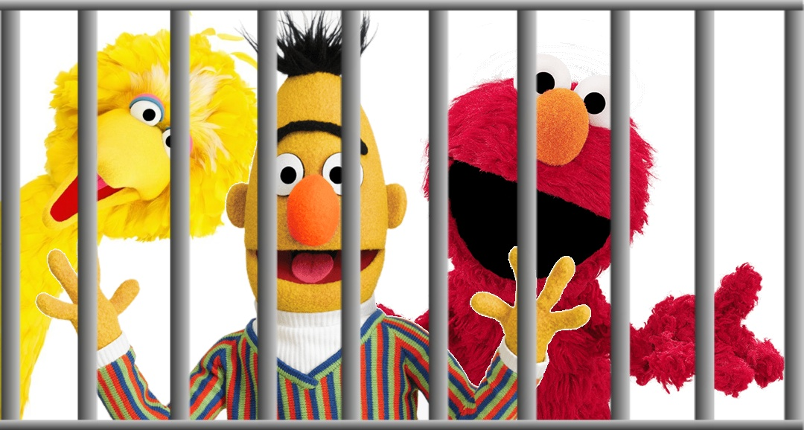
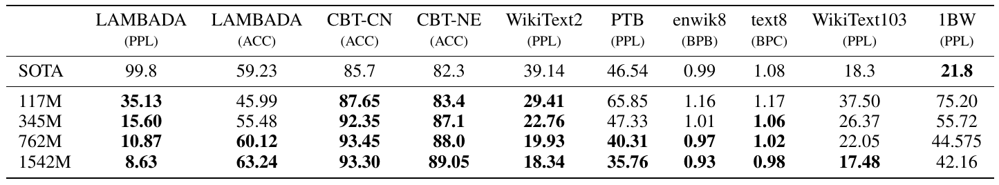
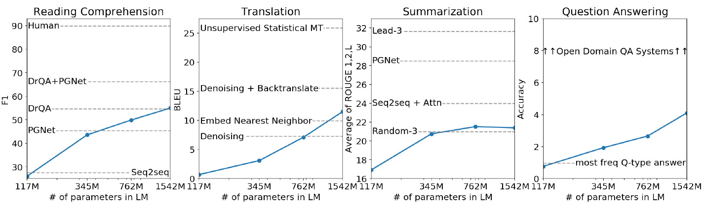
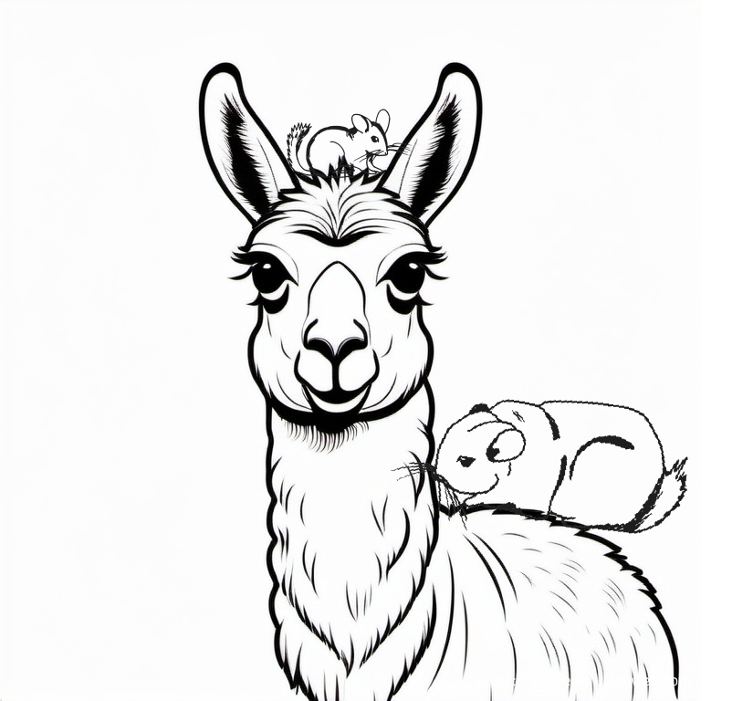
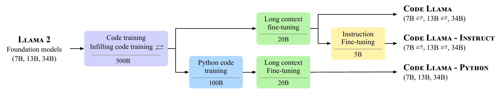
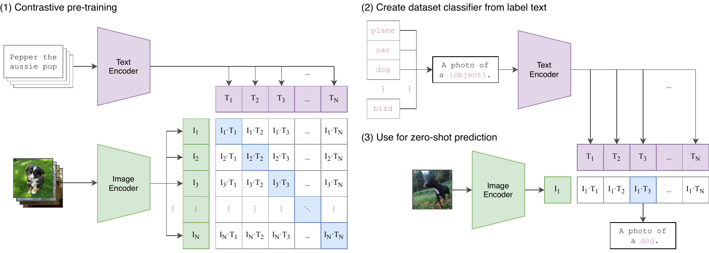
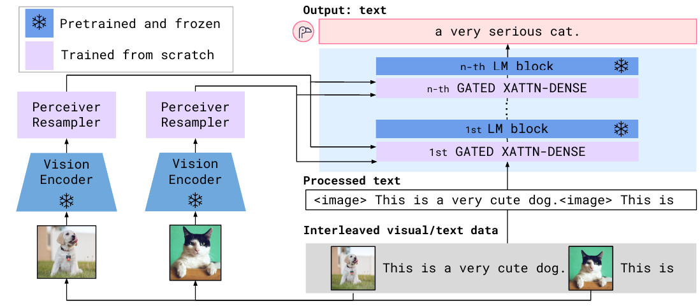

# LLM Zoo

## LLM Zoo

We have already seen a few denizens of the Zoo...
```{=latex}
\begin{center}
```

{height=45%}

```{=latex}
\end{center}
```

But there are many more! In this lecture, we are taking a look at some of the most
important language models.

\footnotesize
(Note: most of the models achieved state of the art on many NLP/NLU datasets
when released. We won't mention this under each model.)
\normalsize

# The BERT Family

## BERT

As a reminder: [BERT](https://github.com/google-research/bert) [@devlin2018bert]
is a contextual (sub)word representation
based on the **transformer encoder** architecture. It was trained on two
self- supervised tasks:

- masked language modeling (MLM)
- next sentence prediction (NSP)

It is available in several sizes:

- Base: 12 Transformer blocks, 110M parameters
- Large: 24 Transformer blocks, 340M parameters

BERT begat a whole family of models, which kept the architecture and sought
improvements by fine-tuning the details.

## Hyperparameters

BERT came with two new training task, but NSP proved to be too easy.

- ALBERT replaced it with sentence order prediction;
- RoBERTa dropped the task entirely.

[RoBERTa](https://github.com/facebookresearch/fairseq/tree/main/examples/roberta)
[@liu2019roberta] proved the importance of training _longer_ and on
_more_ data.

- data size: 16GB $\rightarrow$ 160GB
- batch size: 256 $\rightarrow$ 8K
- training steps: 100K (relative) $\rightarrow$ 500K
- dynamic masking: the position of the `[MASK]` tokens change each run

These changes yielded a $3-4\%$ improvement on various tasks (meaning e.g. $60\%$
error reduction on SQuaD).


## Spans

BERT's masking scheme (`[MASK]` replaces a single token) makes it hard to use
in generation (e.g. for answer filling in question answering):

_What is the oldest settlement on the Orkneys?_

- `The oldest settlement is [MASK] .`
- `The oldest settlement is [MASK] [MASK] .`
- ...

(Skara Brae is actually 4 tokens: `S ##kara B ##rae`)

Another problem is that the masked tokens are presumed conditionally
independent.

## Spans cont.

[SpanBERT](https://github.com/facebookresearch/SpanBERT) [@joshi-etal-2020-spanbert]

- masks random-length spans (3.8 tokens on average)
- predicts them based on the tokens around the span: $\mathbf{y}_i = f(\mathbf{x}_{s-1}, \mathbf{x}_{e+1}, \mathbf{p}_{i-s+1})$
- introduces a Span Boundary Objective $\mathcal{L}_{SBO}$ so that

\vspace{-2em}
\begin{align*}
  \mathcal{L}(x_i) &= \mathcal{L}_{MLM}(x_i) + \mathcal{L}_{SBO}(x_i) \\
                   &= -\log P(x_i|\mathbf{x}_i) - \log P(x_i|\mathbf{y}_i)
\end{align*}

[XLNet](https://github.com/zihangdai/xlnet) [@yang2019xlnet]

- does not use `[MASK]` tokens or MLM at all
- **autoregressive** training task on a **permutated** sequence (still
  bidirectional context!) 
- can model dependencies between context and target

## Performance

Training BERT-like models is slow and uses lots of memory[^1].
[ALBERT](https://github.com/google-research/albert) [@Lan2020ALBERT]
addresses the problems by

1. Factoring the $V \times H$ embedding matrix to two matrices: $V \times E$ and
   $E \times H$; \newline
   ($V$: vocabulary, $H$: hidden size, $E$: embedding size; in BERT, $E = H$).
1. Weight sharing between layers.

The resulting models have 18x less parameters than the corresponding BERT models
and train about 1.7x faster. Yet larger models (xxlarge) outperform
BERT Large[^2].

[^1]: This is less of a problem nowadays compared 100B models.
[^2]: If they converge, that is...

## New techniques

DeBERTa [@he2021deberta] improves on regular BERT with technical innovations:

1. The **disentangled attention** mechanism assigns two vectors to each token:
    - content
    - position
1. *Relative positional encoding*
1. *Absolute positions* are incorporated just before the softmax layer.

It outperforms the human baseline in SuperGLUE (90.3 vs 89.8).

## Modernization

In the five years since DeBERTa, encoder-based models have been stagnating,
while decoder-based LLMs have seen a lot of development:

- larger context sizes;
- more effective architectures and training procedures;
- optimized hyperparameter choices;
- much larger training corpora.

ModernBERT [@Warner:2025] and NeoBERT [@Breton:2025] both aim to introduce these
improvements into the encoder lineage.

## Embedding vs. Embedding

The models thus far are all called "contextual embedding". We have seen that
embeddings can have multiple functions:

1. To serve as features in NLP applications.
1. To assign similar representations to similar things.

BERT-like models excel at the first. However, with the
advent of dense IR and RAG, users have become more interested in the second
function.

While BERT can be trained to decide if two sentences are similar, for performance
reasons, independent encoding of inputs is preferred. 

## Text similarity

Embeddings for text similarity are typically trained in a contrastive fashion.
BERT-based encoders are fine-tuned with paired inputs (sentences,
question-answer pairs) with a similarity objective, presenting both positive
and negative samples.

1. [Sentence Transformers](https://huggingface.co/sentence-transformers)
   (SBERT) fine-tunes BERT models in a siamese network
   structure with classification and regression (cosine similarity)
   objectives [@reimers-gurevych-2019-sentence].
1. [bge-m3](https://huggingface.co/BAAI/bge-m3) is fine-tuned on synthetic
   Q&A pairs generated by GPT 3.5. It can support both dense and sparse
   retrieval and used _self-knowledge distillation_ during training to allow
   information flow between the tasks [@Chen:2024].

# Full stack models

## T5

The **Text-To-Text Transfer Transformer** [@raffel-t5] solves NLP tasks by

1. converting them into a seq2seq problem with a prompt, or/by
1. replacing the classifier head on BERT with the decoder.

It is trained as:

1. **Denoising** objective: drops 15\% of the tokens (like MLM; better than the
   autoregressive objective);
1. Multi-task pretraining;
1. Fine-tuning on individual NLP tasks.

The largest model has 11B parameters and was trained on 1T tokens.

# Decoder models

## The GPT family

The GPT family are the most well-known LLMs. They are being created by
~~Closed~~[OpenAI](https://openai.com/), in ever increasing sizes:

| Model                               | Params | Corpus | Context |
|:------------------------------------|-------:|-------:|--------:|
| [GPT-1](https://huggingface.co/openai-gpt) [@radford2018improving] | 110M | 1B | 512 |
| [GPT-2](https://huggingface.co/gpt2) [@radford2019language] | 1.5B | 40GB | 1024|
| GPT-3 [@brown2020language] | 175B| 300B | 2048 |
| \footnotesize InstructGPT [@instructgpt_neurips] \normalsize | 175B | 77k | 2048 |
| GPT-4 [@gpt4techreport] | ? | ? | 8192^\*^ |
| [GPT-5](https://cdn.openai.com/gpt-5-system-card.pdf) | ? | ? | 400k^\*^ |

^\*^Details for the models GPT-3.5 and up are not disclosed. There are estimates, but
[many of them](https://tooabstractive.com/how-to-tech/difference-between-gpt-1-gpt-2-gpt-3-gpt-4/)
cannot even get the previous models right.

## GPT-1

Originally, GPT was meant to be a NLU framework, similar to ELMo or BERT:

- it was the first model to popularize the pretraining + finetuning approach on
NLP tasks; 
- autoregressive pretraining was **not** motivated by text generation.

Results:

- GPT-1 achieves state of the art on 9 out of the 12 tasks it was tested on;
- it exhibited some zero-shot capabilities.

## GPT-2

Larger model size allowed better zero-shot performance:

{width=80%}

{width=80%}

## GPT-3

Architectural and training changes:

- Alternating dense and sparse attention layers;
- Sampled training (not all training data is used).

Few-shot performance very close to SOTA on several tasks.

Problems:

- preventing memoization of benchmarks;
- bias in the output (gender, race, religion);
- high energy use during training (alleviated by the relatively small
  training corpus).

## InstructGPT

Adds instruction support.

- RLHF (talked about it earlier)
- Mix with updates that increase the log-likelihood of the pretraining
  distribution so the model doesn't regress;
- 1.3B InstructGPT was preferable to the 175B GPT-3;
- API prompts were better than FLAN or T0 datasets;
- Decreased toxicity, but not bias.

## GPT-4

Bigger, better, multimodal (visual). Human-level performance on exams (top 10\%)

Instructions:

- Didn't help with the exams;
- Skews **confidence calibration** (correlation of log-likelihood of the answer
  with the actual performance).

Two approaches to safety:

- RLHF;
- rule-based reward models (RBRMs).

## "Thinking" and Reasoning Models

After GPT-4, a new line of models have been introduced: the so-called
"**thinking**" (GPT o1-4) and later, "**reasoning**" models (GPT 5, gpt-oss).
These models automatically include Chain-of-Thought reasoning in their output
before the actual output tokens are generated.

- Qwen 3 returns the reasoning text in a `<think>...</think>` tag;
- GPT models return the reasoning under a separate key in the reply.

The reasoning effort can usually be governed by an API parameter, such as
`reasoning_effort`. Unfortunately, the accepted values vary from model to model.

## Other model families

GPT is not the only LLM model "family". There are competitors, both open- and
closed source.

1. Closed
    - [Claude](https://claude.ai/) (at version 3)
    - Google's [Gemini](https://gemini.google.com/)
1. Open
    - Meta's Llama (at version [4](https://huggingface.co/meta-llama))
    - [Mistral](https://docs.mistral.ai/) (at version 3.2) 
    - Alibaba's [Qwen](https://huggingface.co/Qwen) (at version 3)
    - [Deepseek](https://huggingface.co/deepseek-ai/DeepSeek-V3.1) (at version 3.2)
    - ...

## Model types

To summarize, the following model types can be distinguished:

- _Fundamental (or base) models_: pre-trained only;
- _Instruct models_: also trained for instruction following in a supervised
  manner;
- _Reasoning (thinking) models_: as discussed above.

Most model families release separate fundamental / instruct models. In the last
generation, a separate reasoning version was added to this list. However,
some families only make the "most capable" version public.

## Other models 

Decoder-only autoregressive models have become the de facto LLM standard and
many other models have been proposed. A few notable examples follow.

- **Megatron** [@shoeybi2019megatron]
  - GPT (8.3B) and BERT (3.9B) flavors. Trained on 174GB text;
  - Introduces **model parallelism**.
- **Gopher** [@rae2021scaling]
  - 280B, trained on _MassiveText_, but only on 300B tokens out of 2350B (12.8\%);
  - Uses **relative positional encoding**, which allows inference on sequences
    longer than those seen during training.

## Other models cont.

- **GLaM** [@du2022glam]
  - A sparse model with 1.2T parameters, trained on 1.6T tokens.
  - Uses **Mixture of Experts** layers interleaved with transformer layers.
  - Each token only activates 8\% (96.6B) of the model.
    Costs $\frac{1}{3}$ of GPT-3 to train.
- **LaMDA** [@thoppilan2022lamda]
  - 137B, trained on 1.56T tokens;
  - A model specialized in dialogs; 50\% of the training corpus consists of dialogs;
  - Fine-tuned for Quality, Safety and Groundedness (the ``foundation metrics'');
  - End-to-end model inc. calling external IR system for groundedness.

## Other models cont.

- **FLAN** [@wei2022finetuned]
  - Based on LaMDA. Instruction fine-tuning with the **data integration**
    approach, from 62 NLP datasets;
  - Better zero-shot performance than LaMDA, GPT-3 or GLaM.
- **PaLM** [@chowdhery2022palm]
  - One of the largest models: 540B parameters, trained on 780B text;
  - Uses the **Pathways** technique to train on 6144 TPU v4 chips in 2 Pods;
  - Discontinuous improvement: drastic jump in accuracy after a certain model
    size (instead of continuous power law);
  - Breakthrough performance. On several tasks, it is better than
    - the average human performance,
    - supervised systems.

# Negative Trends

## Scaling Laws

It has been shown that increasing model sizes improves performance along a
power law curve [@kaplan2020scaling]. This has resulted in ever larger models
being released

](figures/model_size_growth2.png){width=80%}

<!-- https://medium.com/@wangzihan8898/bert-compression-2-parameter-factorization-parameter-sharing-pruning-6ca7005e8c9c -->

## Problems

Large models have several problems:

- They are expensive to train and use in inference;
- Only a few actors can afford to train them;
- Even getting them to run on ``low end'' equipment (e.g. 8 A100s) is problematic;
- They have such a considerable **carbon footprint** that papers now customarily
  report it;
- Most of the models are proprietary and closed source.

## A New Trend

{width=80%}

## Chinchilla

Recently, a new trend emerged, where smaller models are trained on more tokens
to achieve comparable or even superior results. This is possible because

- The models above are usually undertrained;
- Instruct fine-tuning is very effective and cheap.

**Chinchilla** [@hoffmann2022an]

- 70B parameters, trained on 1.5T tokens;
- Uses the same number of FLOPs and same training set as Gopher;
- Outperforms both GPT-3 and Gopher.

## LLaMa

Chinchilla is closed source. **LLaMa** [@touvron2023llama] is an attempt to
create a Chinchilla-like model based on open data sources.

- The largest model is 65B, trained on 1.4T tokens.
- Includes architectural ``best practices'':
  - Pre-normalization (GPT3): normalize on input, not output
  - SwiGLU activation (PaLM): [@shazeer2020glu]
  - Rotary Position Embeddings (GPTNeo): [@su2021roformer]
- Even the 13B model outperforms GPT-3.

Gotcha: cannot be used commercially.

## LLaMa variants

- **LLaMa2** [@touvron2023llama2]
  - Bigger (70B params, 2.0T tokens, 4k context);
  - Chat instructions;
  - Can be used commercially.
- **Alpaca** [@alpaca]
  - Stanford's instruct model based on LLaMa 7B. Cheap ($600);
  - Self-instruct based on ChatGPT (no commercial use).
- **Vicuna** [@zheng2023judging]
  - Based on LLaMa 13B + 70k interactions from [ShareGPT](https://sharegpt.com/)
    for $300;
  - 90\% better than Alpaca, within 10\% of ChapGPT as judged by GPT-4.

## Mixture-of-Experts models

While Llama-style models (of maximum about 70B parameters) are smaller than the
previous norm, even these models are very slow at inference time. The **Mixture of
Experts** architecture provides a way to have large models that can also be run
efficiently.

The model's parameters are divided into "experts". During inference, each token
is processed only by a few (1-2) experts. Hence, the number of active parameters
is much smaller; e.g. 5.1B / 117B for gpt-oss-120b.

On 2 H200 GPUs:

- Llama 3.3 70B: 40 tokens/s
- GLM-4.5 Air FP8 (106B): 120 tokens/s

# Multilingual models

## Multilingual models

Up to about 2023, most models were trained on English data only, or contained at most
10\% non-English texts. Still, several models have multilingual versions.

- **mBERT**:
  - A multilingual BERT Base model;
  - Trained on Wikipedia across 104 languages.
- **XLM-RoBERTa** [@conneau-etal-2020-unsupervised]
  - Trained on 2.5TB Common Crawl (CC) data across 100 languages;
  - Outperforms mBERT by 23\% on low-resource languages;
  - Competitive performance to monolingual RoBERTa.

XLM-RoBERTa proved that Wikipedia is not enough to train a competitive model.

## Multilingual models cont.

- **mT5** [@xue-etal-2021-mt5]
  - Trained on the 101 languages that contain 10,000 or more pages in CC;
  - Monolingual performance is close to T5;
  - Cross-language zero-shot performance is SOTA, but accidental translations
    into English occur.
- **BLOOM** [@scao2022bloom]
  - A decoder model trained on 46 natural and 13 programming languages;
  - The 1.61TB ROOTS corpus was compiled by a collaboration of international
    researchers (Hungarian was not part of it, unfortunately);
  - The BLOOMZ variant went through multilingual multitask fine-tuning;
  - The most powerful multilingual LLM to date.

## Current Landscape

Nowadays most models are multilingual, which means good support for the most
popular languages (English, Chinese, Spanish, French, etc). The quality of
support for smaller languages is questionable. Of particular
interest for this class, Hungarian is (mostly) adequately supported by the current
generation of open-source models. However, quantization usually degrades
performance.

| Model | Size | Quality |
| ----- | ---: | ------- |
| Llama 4 Maverick | 400B | Virtually no errors |
| GLM-4.5 Air (FP8) | 106B | Few errors |
| Llama 4 Scout | 109B | Few errors |
| Qwen 3 Next A3b | 80B | Quite a few noticeable errors |
| GPT OSS 120B | 117B | Syntactic and semantic errors |

# Coding

```{=latex}
\begin{center}
```
{width=60%}
```{=latex}
\end{center}
```

## Coding

Many LLMs use some source code as part of their pretraining corpus. This helps in
reasoning and allows them some level of code generation. Coding models, on the
other hand, are trained explicitly for the latter task.

**Code Llama** [@roziere2023code] is a model based on LLaMa 2. It is available
in the same sizes. Since coding models also need to understand natural
language (NL) instructions, basing them on regular LLMs results in better
performance.

It has three versions:

- _Code Llama_: the basic model
- _Code Llama_ - Instruct: fine-tuned
- _Code Llama_ - Python: further trained on Python code

## Code Llama Details

{width=100%}

Training corpus (500B):

- 85\% source code from GitHub;
- 8\% code-related NL discussions (StackOverflow, etc.);
- 7\% NL batches to retain NLU performance.

The Python model is trained with 100B additional tokens of Python code.

## Training peculiarities

Code Llama had two additional training goals:

1. **Infilling**: predicting the missing part of a program given a surrounding
   context
   - For code completion, docstring generation, etc;
   - Only the smaller models are trained for it.
1. **Long input context**: to enable repository-level reasoning
   - Increases the maximum context length from 4096 to 100,000;
   - Trained in a dedicated _long context fine tuning_ stage.

**Instruction fine-tuning** is done with self-instruct:

   - Generates both unit tests and code;
   - Adds the first code snippet that passes the tests.

## Results

](figures/code_llama_results.png){width=100%}

Instructions: LLaMa 2 + self-instruct. Generates unit tests and code, and adds the code that passes the unit tests.

## Other models

Closed:

  - Codex/copilot [@chen2021evaluating]
  - AlphaCode [@li2022competition]
  - phi-1 [@gunasekar2023textbooks]
  - GPT-4

Open:

  - SantaCoder [@allal2023santacoder]
  - StarCoder [@li2023starcoder]

Nowadays most models are capable of solving codings tasks and separate "coding"
models are rare.

# Multimodality

## Image-text Models

The main novelty of GPT-4 (compared to GPT-3) is its multimodality; in
particular, its ability to use image inputs. However, it
is not the first system to have image-to-text capability. 

The main visual ML goal is **image classification**: given an image, the system
has to return a (set of) tag(s) that describe its contents. This is done
traditionally with supervised systems trained on millions of labeled images.

With LLMs, it has become possible to pretrain generalist models with good
zero-shot performance on large unlabeled text+image corpora (web data). Two
examples follow.

## CLIP

CLIP [@radford2021learning] performs image classification by encoding both the
image and text into the same embedding space.

{width=100%}

During training, the encoders are trained with a **contrastive objective**. At
test time, the class labels are encoded and the one(s) most (cosine) similar to
the image are returned.

## Flamingo

Flamingo [@alayrac2022flamingo] is a ``_visual language model_'' that can
generate text based on a mixed textual and visual input.

{width=100%}

It uses frozen vision and text encoders (e.g. CLIP and Chinchilla) and only
trains the LM that operates on their output.

## Adoption and regulation

As with coding, visual language models have become all but ubiquitous. The main
models of all closed-source providers are VLMs (or even "**omni-**"), and many
open-source models have `-VL` variants. Meta did not even release non-VLM
versions of its Llama 4 models.

VLM models need more resources to train than similar-sized LLMs and as a result,
fall under different regulatory considerations. Under the EU AI Act, models
above a certain resource threshold have data transparency and risk requirements.
Since Meta elected not to comply with those, Llama 4 models cannot be used in the EU.


# Open Source Models

## Open Source Models

Many of the models discussed above are closed source; often, the training data
consists of proprietary corpora as well. However, now there are several
open source LLMs available on the Hugging Face Hub:

- BLOOM is fully open source, both the data and the model. However, its
  development is finished and it is not updated further;
- LLaMa was trained on open data, and LLaMa 2 and above are free to use. Llama
  3.x provides models from 1B up to 405B.
- Mistral is another alternative with instruction-finetuned and MoE models
  available to download.

## LAION

[LAION](https://laion.ai/) (Large-scale Artificial Intelligence Open Network)
aims to provide a 100\% free and open LLM pipeline including datasets, tools
and models.

A few select projects:

- [Openclip](https://github.com/mlfoundations/open_clip): an open source
  reimplementation of CLIP
- LAION5B: a corpus of almost 6B image-text pairs
- [OpenAssistant](https://open-assistant.io/): open source conversational AI
  in development. You can also help by
  - adding new conversations,
  - labelling existing ones,
  - etc.

# References

## References {.allowframebreaks} 
\footnotesize

