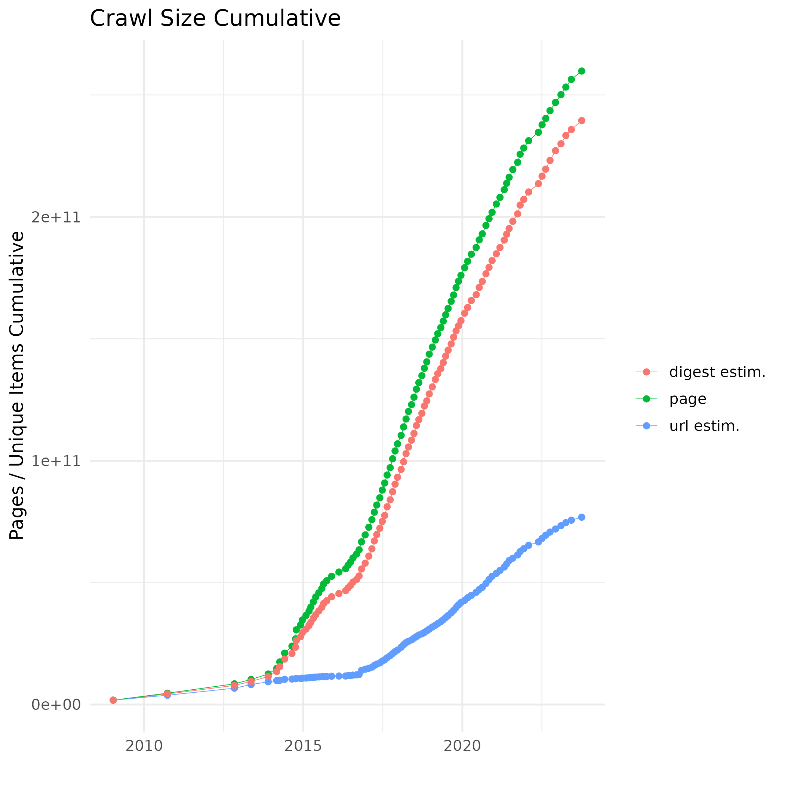

# Introduction

It is common knowledge that LLMs require huge text corpora to (pre-)train.
In actual fact, there are several types of datasets we use to train and/or
evaluate LLMs:

- pretraining corpora,
- fine-tuning datasets,
- instruction fine-tuning datasets,
- benchmarks.

In this lecture, we shall talk about these types in detail and also get
acquainted with the most popular examples for each.

# Pretraining

LLMs (as their name implies) are always trained with some form of language
modeling objective:

- causal (autoregressive) language modeling,
- masked language modeling (MLM),
- etc.

This type of pretraining can only be done on huge text corpora (depending on
model size). LLMs require much more textual data than what a human child / young
adult ever encounters.  On the other hand,

- LLMs don't have multisensory input (some do to some extent);
- we have seen previously that the one-shot labels slow down convergence.

## Pretraining Corpora Sizes

{width=100%}

## Sources

Pretraining corpora usually come from a mixture of sources:

1. Web text
1. Books and entertainment
1. Academic repositories
1. Program code
1. Dialog data
1. Miscellaneous

## Source -- an Example

Composition of **the Pile** [@gao2020pile]: a 800GB English corpus for LLM
pretraining. It was created from 22 datasets with the following composition:

{width=80%}

## Web Text

Usually the largest component in any pretraining corpus. 

Pros:

- readily accessible, usually in a web crawl format;
- lots of data.

Cons:

- quality varies, in general lower than other sources;
- even good pages contain non-content elements (e.g. ads);
- text duplication; 
- biased, toxic, extremist content;
- AI generated / auto-translated content.

## Web Text Corpora

**[Common Crawl (CC)](https://commoncrawl.org/)**:

\small
\vspace{-1em}

- a free, open repository of web crawl data, made available in WARC format[^1];
- a new crawl roughly each month;
- petabytes of data; the 2023 Sept/Oct crawl is 100TB;
- forms the base of most web text corpora used for pretraining.

\normalsize

```{=latex}
\begin{minipage}{.5\textwidth}
\vspace{-1em}
\begin{center}
```
{width=75%}
```{=latex}
\end{center}
\end{minipage}%
\begin{minipage}{.5\textwidth}
\vspace{-1em}
\begin{center}
```
{width=75%}
```{=latex}
\end{center}
\end{minipage}
```

[^1]: [Web ARChive format](https://en.wikipedia.org/wiki/WARC_(file_format))

## Web Text Corpora (English)

**C4** [@raffel-t5]:

- created from the April 2019 CC dump; 750GB;
- used to pretrain T5;
- filters documents with bad words ($3\times$ decrease);

**WebText** [@radford2019language]:

- GPT-2's pretraining corpus;
- 8 million documents, 40GB;
- created from ``curated'' documents: outbound links from Reddit with at least
  3 karma;
- does not include Wikipedia to avoid test-on-train issues for GPT-2;
- proprietary.

**OpenWebText** [@Gokaslan2019OpenWeb]:

- open-source reimplementation of WebText.

## Web Text Corpora (Multilingual)

**OSCAR** [@abadji-etal-2022-towards]:

- huge multilingual corpus created from a single monthly CC crawl
- [Ungoliant](https://github.com/oscar-project/ungoliant) data pipeline
- token numbers:
  - English: 377B
  - Hungarian: 4.6B
  - Yoruba: 1k

**ROOTS** [@laurencon2022the]:

- a 1.6TB corpus
- compiled by [BigScience](https://bigscience.huggingface.co/)
    - collaboration of international researchers
    - backed by Hugging Face
- used to pretrain BLOOM.

## Languages in ROOTS

Language distribution of ROOTS. Hungarian is unfortunately missing. Also,
English is highly downsampled compared to other corpora, e.g. OSCAR.

{width=100%}

## Web Text Corpora (Multilingual) -- cont.

There are corpora now with sufficient data for Hungarian and similar-sized languages:

**mC4** [@xue-etal-2021-mt5]:

- the multilingual version of C4 ([Hugging Face HUB](https://huggingface.co/datasets/allenai/c4));
- based on the whole CC corpus (up to 2021), so has enough data for medium-sized languages, such as Hungarian (39B tokens);
- not really cleaned, so the token counts are a bit optimistic.

**llm-datasets**

- [GitHub repository](https://github.com/malteos/llm-datasets) of datasets and scripts;
- contains corpora other than Common Crawl.


## How to Preprocess Common Crawl

Creating a web text corpus for a particular language based on Common Crawl seems
trivial, but it is a multi-step process with several pitfalls. Here we
review the steps taken by [cc_corpus](https://github.com/DavidNemeskey/cc_corpus),
the pipeline used to create Webcorpus 2 [@Nemeskey:2020].

**Requirement**: download all (multiple) monthly dumps, because only English has
enough tokens in one.

1. Downloading the index
    - CC index is per-domain, not per-language;
    - as an example, for Hungarian we download 
        - the `.hu` top level domain,
        - other domains that contain many Hungarian pages, based on OSCAR
          statistics;
    - deduplicate the URLs between monthly index dumps.

## How to Preprocess Common Crawl cont.

2. Downloading the data
    - CC should not be DDoS'ed;
    - the WARC files need a _lot_ of space.

3. Boilerplate removal
    - remove the non-content part of web pages (navigation, ads, images,
      tables (!), etc.);
    - we use jusText [@pomikalek2011removing] with custom code to remove
      JS / cookie warnings;
    - need to handle various file types (HTML, RSS, text, etc).

4. Filtering
    - language filtering;
    - quality-based filtering:
        - document length,
        - could also have used e.g. boilerplate ratio, lengths of certain HTML
          tags, etc.

## How to Preprocess Common Crawl cont.

5. Deduplication
    - document-level deduplication to maintain text integrity:
        - MinHash--LSH setup
        - needs a lot of memory or will be very slow;
    - optional: deduplicate frequent paragraphs per domain (content-based
      boilerplate removal).

Hardware setup:

- runs on individual servers; multi-server communication is in the works;
- all map-like steps are highly parallel to fully utilize multicore/CPU servers;
- one server with 768GB memory for deduplication.

## Special Web Text Datasets

**Wikipedia**:

- very good quality, edited resource, mostly truthful
- size is language-dependent, e.g. English is $10\times$ the size of Hungarian
- preprocessing is not trivial because of the markup format:
    - [wikiextractor](https://github.com/attardi/wikiextractor) attempts this
    - [zim_to_corpus](https://github.com/DavidNemeskey/zim_to_corpus) extracts
      the text from already preprocessed .zim archives from
      [Kiwix](https://kiwix.org/)

**Stack Overflow**, **Reddit**:

- curated datasets (points / karma)
- can be used for question answering, programming, etc.

## Edited Texts

Edited texts are an important source of high quality text. Unfortunately, it is
much harder to come by in quantity than web text.

Edited texts usually come in two formats:

1. _Born digital_: texts that have been prepared for digital consumption
                   (from the beginning). Usually usable as-is, but
    - might need boilerplate removal: tables, figures, headers/footers
    - encoding issues do happen, esp. with PDFs
2. Scanned: digitized documents originally on paper. The quality of the
            _layout analysis_ and _optical character recognition (OCR)_
            can range from acceptable to very bad.

## Edited Texts / Prose

Regular prose, such as books, have been part of the LLM training regime since
BERT. The level of the text varies by genre, which results in a diverse
training corpus.

**BookCorpus**

\footnotesize
\vspace{-1em}

- A 985M word corpus created from 7,185 self-published books.
- Used to train GPT and BERT, but it has since been withdrawn and is not
  publicly available[^3].
- BookCorpus2 (the Pile): an extension of BookCorpus, around 17k books.

\normalsize
\vspace{-1em}

**Published book corpora**:

\footnotesize
\vspace{-1em}

- Books1-2 (GPT-3): 67B tokens
- Books3, Project Gutenberg (the Pile): approx 187k and 27k books, resp.
- Hungarian Elektronic Library (MEK): 32,830 books, 800M tokens.

\normalsize

[^3]: Although https://huggingface.co/datasets/bookcorpus.

## Edited Texts / Prose

**OpenSubtitles**:

- @lison-tiedemann-2016-opensubtitles2016 created 1689 bitexts from movie and
  TV subtitles;
- it is possible to extract an approx. 300M words corpus from it;
- the corpus consists mostly of dialogs.

Books, etc. are a large and very useful part of pretraining corpora. However,
they are not fully safe:

- there might be problematic content (pornography, toxicity, etc);
- using them in models might result in **copyright violation**.

## Edited Text / Professional

Very high quality, usually professional texts with their own terminology.

1. **Academic repositories**:
    - very high level text;
    - many tables, figures, etc., which break the text flow;
    - usually university access (and a crawler) is required to download the papers.
2. **Parliamentary proceedings**:
    - national / EU / etc.
    - some might provide REST APIs, some have to be crawled.
3. Laws, rulings, regulations, etc.

## Edited Text / Professional cont.

4. **News**:
    - large and important source, but can also be biased and toxic;
    - extreme duplication;
    - often behind a paywall.
5. **Private data**:
    - company rules and intra-company communications;
    - know-how, etc.

## Miscellaneous Data

**Dialogs**

- very important for chat bots;
- for generic conversation: movies, books, etc.
- most important sources: internet forums, actual customer service interactions.

**Programming**

- open source projects from CVS services (GitHub, SourceForge, etc.);
- **copyright** and **licence violation** are a problem with possible
  [legal consequences](https://www.theverge.com/2022/11/8/23446821/microsoft-openai-github-copilot-class-action-lawsuit-ai-copyright-violation-training-data).


# Instructions

## Instruction Acquisition

We discussed in a previous lecture how instruction fine-tuning datasets are
compiled:

1. Manual / crowdsourcing effort;
1. Data collection from users;
1. Conversion of NLP tasks into instructions;
1. Self-instruct.

We have seen how FLAN [@wei2022finetuned] converts NLP tasks into instructions,
but we skipped over the first category.

## Manual Instructions

Creating an instruction dataset manually requires crowdsourcing. Two examples:

1. Databricks' **[Dolly](https://github.com/databrickslabs/dolly)**
   [@DatabricksBlog2023DollyV2]:
    - contains 15,000 prompt/response pairs,
    - created by 5,000+ Databricks employees.
2. **[ShareGPT](https://sharegpt.com/)**:
    - users share their conversations with ChatGPT,
    - very good quality, but problematic due to OpenAI's license,
    - was used to train Vicuna [@zheng2023judging].

## Manual Instructions -- cont.

3. LAION's **[Open-Assistant](https://open-assistant.io/)**
    - Compiled by volunteers
    - English and Spanish are well represented, but the rest of the languages 
      are not:

{width=100%}

## Self-instruct

Two examples for self-instruct datasets:

1. [Alpaca](https://huggingface.co/datasets/tatsu-lab/alpaca):
    - the most famous example for a self-instruct dataset created using OpenAI's `text-davinci-003`;
    - the page contains good advice on how to use GPT3 for instruction generation;
    - due to the GPT3 license, it cannot be used for commercial purposes.
2. [WizardLM](https://huggingface.co/datasets/WizardLM/WizardLM_evol_instruct_70k):
    - created from Alpaca using Evol-Instruct.

More on these in the Bootstrapping section!


# Fine-tuning

## Fine-tuning Datasets

It has been shown that LLMs with a classifier head can be fine-tuned on NLP
datasets to achieve state-of-the-art results. This includes

- traditional NLP tasks (NP chunking, NER, dependency parsing, etc.)
- NLU tasks (question answering, natural language inference, etc.)
- various classification datasets (sentiment analysis, topic classification, etc.)
which are usually trained
on treebanks 

Fine-tuning datasets have train-devel-test splits, so they function as benchmark
datasets as well.

## Traditional Datasets

\scriptsize
+-----------------------------------+--------------------------------------------------------------------------+---------------------------------------------------------------------------------+
| Task                              | English                                                                  | Hungarian                                                                       |
+:==================================+:=========================================================================+:================================================================================+
| NER                               | [CONLL 2003](https://huggingface.co/datasets/conll2003)                  | [NYTK NerKor](https://github.com/nytud/NYTK-NerKor)                             |
+                                   +--------------------------------------------------------------------------+---------------------------------------------------------------------------------+
|                                   | [other datasets](https://github.com/juand-r/entity-recognition-datasets) |                                                                                 |
+-----------------------------------+--------------------------------------------------------------------------+---------------------------------------------------------------------------------+
| NP Chunking                       | [CONLL 2003](https://huggingface.co/datasets/conll2003)                  | [Szeged TreeBank](https://rgai.inf.u-szeged.hu/node/113)                        |
+-----------------------------------+--------------------------------------------------------------------------+---------------------------------------------------------------------------------+
| Dependency                        | [Universal Dependencies](https://universaldependencies.org/)                                                                                               |
+-----------------------------------+--------------------------------------------------------------------------+---------------------------------------------------------------------------------+
| Parsing                           | [Penn TreeBank](https://catalog.ldc.upenn.edu/LDC99T42)                  | [Szeged Dependecy TreeBank](https://rgai.inf.u-szeged.hu/node/158)              |
+-----------------------------------+--------------------------------------------------------------------------+---------------------------------------------------------------------------------+
\normalsize

**Other resources**

- Progress on NLP tasks can tracked on the aptly named
[NLP-progress page](http://nlpprogress.com/);
- There are various lists for NLP datasets:
    - [Awesome NLP / Datasets](https://github.com/niderhoff/nlp-datasets)
    - [nlp-datasets](https://github.com/niderhoff/nlp-datasets)
    - [Awesome Hungarian NLP / Datasets](https://github.com/oroszgy/awesome-hungarian-nlp#datasets)

## NLU Datasets

These include tasks that traditional NLP could (and cannot) solve, but LLMs can.
Consequently, these datasets serve as handy benchmarks for LLMs.

\footnotesize
1. **[GLUE](https://gluebenchmark.com/)** [@wang-etal-2018-glue]:
    - a NLU benchmark with 9 tasks (sentence similarity, paraphrasing, QA, etc.)
    - test set is not shared; online leaderboard.
2. **[SuperGLUE](https://super.gluebenchmark.com/)** [@wang-etal-2019-superglue]:
    - 8 curated tasks (open, hard, permissive licence, etc.)
3. **[SQuAD2.0](https://rajpurkar.github.io/SQuAD-explorer/)** [@rajpurkar-etal-2018-know]
    - Compiled by crowdworkers;
    - 100k questions plus 50k adversarial, unanswerable questions.
4. **[MMLU](https://github.com/hendrycks/test)** [@hendrycks2021measuring]
    - A test-only benchmark with 15,687 multiple choice questions in 57 topics

\normalsize

## Adversarial Benchmarking

**Problem**: benchmarks are ``cleared'' too quickly by ever better models. Can
we create really hard benchmarks that last longer?

**Model brittleness**: Evidence [@gururangan-etal-2018-annotation,
@poliak-etal-2018-hypothesis, ...] shows that 

- Natural Language Inference (NLI) datasets exhibit spurious statistical
  patterns due to (annotator) bias;
- models actually learn these patterns, _not reasoning_;
- as such, they are brittle and can be broken by non-expert annotators.

**Idea**: Human-And-Model-in-the-Loop Enabled Training (HAMLET).

## Adversarial NLI

**Adversarial NLI (ANLI)** [@nie-etal-2020-adversarial] was compiled by
introducing an ``arms race'' between annotators and models.

{width=100%}

This results in

- a good training set that transfers well to other NLI benchmarks;
- a very hard training set.

## Test Harnesses

LLM testing is increasingly becoming automatized via **test harnesses**:

- Google's [BIG-bench](https://github.com/google/BIG-bench)
- EleutherAI's [lm-evaluation-harness](https://github.com/EleutherAI/lm-evaluation-harness)

Both contain 200+ tasks and offer

- easy integration for new tasks;
- evaluating a model with all of them.

Reproducible testing enables competition such as the
**[Open LLM Leaderboard](https://huggingface.co/spaces/HuggingFaceH4/open_llm_leaderboard)**.

## Agentic Systems

LLMs are increasingly being used in interactive, cooperative scenarios as
parts of an **agentic system**. In such a system, human interaction is limited
and LLMs ("agents") reason and act independently to achieve pre-defined goals.
Importantly, the agents have access to _tools_ (usually API endpoints) they
can use if the task requires it.

Fine-tuning LLMs to function in such an environment requires specialized
training datasets. At the minimum, the LLMs should learn how to reason with,
and invoke, tools.

## Training Agentic Systems

Agentic systems are usually trained with reinforcement learning (RL). Both
positive and negative samples are used with corresponding rewards. Evaluation
can be _rule-based_, when the result can be verified by a tool (e.g. a compiler
that checks if the generated code runs).

Additional aspects of quality:

- number of tokens used for reasoning;
- language consistency. 

Examples:

- Agent-FLAN[@Chen:2024]: supervised training method with negative samples
  against hallucination;
- SWEET-RL [@zhou2025sweetrltrainingmultiturnllm]: RL algorithm that
  incorporates training-time information in a critic model.


## Agentic Benchmark Datasets

- [GAIA Benchmark](https://huggingface.co/spaces/gaia-benchmark/leaderboard)
  [@Gregoire:2024]: "real world" tasks that require multi-modal
  reasoning, web browsing, etc.
- [AgentBench](https://github.com/THUDM/AgentBench) [@liu2024agentbench]: 
  includes 3 task types: code, game and web with tasks such as OS (command line)
  and knowledge graph interaction, games, "web shopping".
  - VisualAgentBench is the visual version with tasks such as playing Minecraft,
    handling UI and visual design with CSS.
- ColBench [@zhou2025sweetrltrainingmultiturnllm]: human--LLM collaborative
  tasks, such as front-end design and back-end programming.

A few agentic benchmarks are collected on [this page](https://www.evidentlyai.com/blog/ai-agent-benchmarks).

# Bootstrapping

## What is Bootstrapping?

**Bootstrapping** is a method for using existing resources to create new ones. 

In our case, we are going to use the existing pre-trained models to create new datasets for training new models.
We typically use the largest, best performing models available. In late-$2023$ these models are GPT-4 for private and LLaMa2-70B for open models.

Bootstrapping is:

- Cost-effective
- Fast
- Easy to implement
- Able to generate high-complexity data
- Risky (license issues, quality issues)

# Data Generation with Existing Models

## "Self"-Instruct

Here we use the existing model to generate data for our own model. In this case the other model is the teacher, and our model is the student.

**Important difference**: Opposed to distillation, we do not use the teacher's predictions on the vector level, but rather the teacher's output on the token level in the dataset. This way direct access is not needed to the teacher model.

Stanford Alpaca [@alpaca] claims that this way instruct fine-tuning is cost-effective and fast. It can be accomplished in a few hundred dollars.

{width=50%}

## Zero-Shot Chain-of-Thought

Reliable chain-of-thought (CoT) prompting [@weng2023prompt] needs a few examples to work. By using CoT prompts we can generate a large dataset of CoT completions for a given topic.

WizardLM [@xu2023wizardlm] utilizes a more abstract method for instruction generation by using *Evol-Instruct* to step-by-step evolve the instructions for a given task. This way the instructions that are generated will cover a wider range of the task's space with more complex prompts.

We prompt our LLM to generate modified versions of the instructions, and then use these to generate the dataset. These modificaiton steps can be chained.

## Evol-Instruct

Examples for task evolution (for base task "1+1=?"):

\small
- Deepening: In what situation does 
1+1 not equal to 2?
- Increase reasoning: What is the value of x, if x^3 + 2x + 3 = 7?
- Concretizing: If you have one apple and someone 
gives you another banana, how 
many fruits do you have?
- Add constraint: How to prove 1 + 1 = 2 in 
the Goldbach Conjecture?
- Complicate Input: 1/(sqrt(2) + 4^2) = ?
- In-Breadth Evolving (mutation): What is the speed of light in a vacuum?
- Increase reasoning of Evolved (above): How many times faster is light 
than sound in a vacuum?

## Evolution steps

![Figure from [@xu2023wizardlm]](figures/evolinstruct.png){height=90%}

## Removing evolution

Elimination of intermediate results happens when:

1. The evolved instruction does not provide any information gain compared to the original one. ChatGPT is used to make this decision.
2. The evolved instruction makes it difficult for the LLM to generate a response. If the generated response contains “sorry” and is relatively short in length (i.e., less than 80 words), it often indicates that the LLM struggles to respond to the evolved instruction.
3. The response generated by the LLM only contains punctuation and stop words.
4. The evolved instruction obviously copies some words from the evolving prompt, such as “given prompt”, “rewritten prompt”, “#Rewritten Prompt#”, etc.

## Effect of EvolInstruct

EvolInstruct fine-tuning is able to improve performance on high-complexity tasks as shown in the figure below.

![Figure from [@xu2023wizardlm]](figures/wizard_results.png){height=70%}

## Orca

EvolInstruct introduced variety in the instruction generation side. Opposed to this Orca [@mukherjee2023orca] dives into the response generation side, especially the reasoning and explanation generation. In the original paper they define various system prompts for the LLM, that guide the response generation style.

Some examples include:

- You are an AI assistant. Provide a detailed answer so user don’t need to search outside to
understand the answer.
- You should describe the task and explain your answer. While answering a multiple choice
question, first output the correct answer(s). Then explain why other answers are wrong.
Think like you are answering to a five year old.

## Advantages of Explanation Tuning

Hard and professional tasks are easily solved by small models that are tuned with explanations.

![Figure from [@mukherjee2023orca]](figures/orca_results.png){height=65%}

## Advantages of Explanation Tuning

Hard and professional tasks are easily solved by small models that are tuned with explanations.

![Figure from [@mukherjee2023orca]](figures/orca_results2.png){height=65%}

## Model Evaluation

Evaluating complex models is hard, as there is no clear way to assess open-domain performance. Common methods include human and LLM judges.

Human judges are expensive and slow, but crowd-sourcing can be used to speed up and stabilize the process, such is the case with Chatbot Arena [@zheng2023judging]. Chatbot Arena is a platform for evaluating chatbots, where the users chat with multiple bots and denote their preferences.

LLM judges are faster and cheaper but more biased. Utilization methods include: Pairwise comparison of two answers, Single answer grading (score assignment), Reference-guided grading (score assignment).

## Model bias

According to @zheng2023judging the LLM judges are biased towards the first answer, as well as the longer answer. It is worth to use symmetric evaluation. "Rename" prompts demonstrate that some models (Claude-v1) are also biased towards names (such as Assistant A, Assistant B, etc.).

\footnotesize
| Judge      |   Prompt  | Consistency | Biased <br> toward <br> first | Biased <br> toward <br> second | Error |
|------------|------------|--------------|--------|--------|-------|
| Claude-v1  |  default   |  23.8%       | 75.0%  | 0.0%   | 1.2%  |
| Claude-v1  |  rename    |  56.2%       | 11.2%  | 28.7%  | 3.8%  |
| GPT-3.5    |  default   |  46.2%       | 50.0%  | 1.2%   | 2.5%  |
| GPT-3.5    |  rename    |  51.2%       | 38.8%  | 6.2%   | 3.8%  |
| GPT-4      |  default   |  65.0%       | 30.0%  | 5.0%   | 0.0%  |
| GPT-4      |  rename    |  66.2%       | 28.7%  | 5.0%   | 0.0%  |


# References

## References {.allowframebreaks} 
\footnotesize
