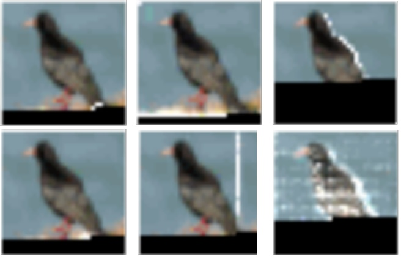
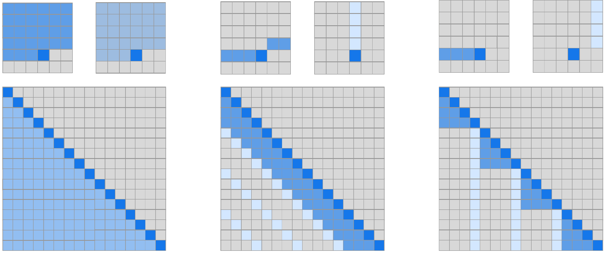
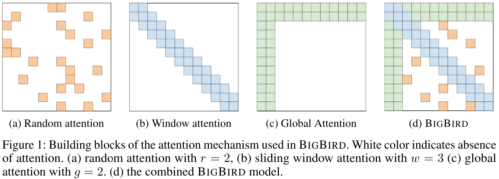
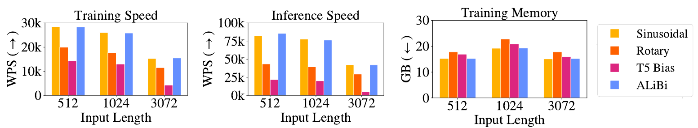
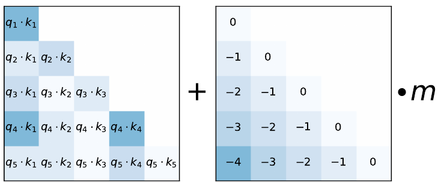
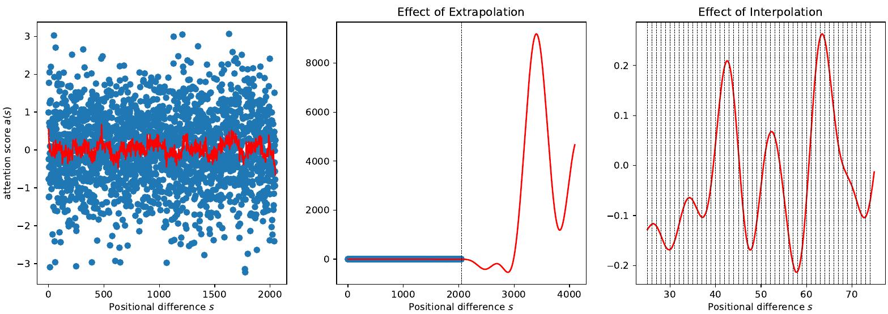
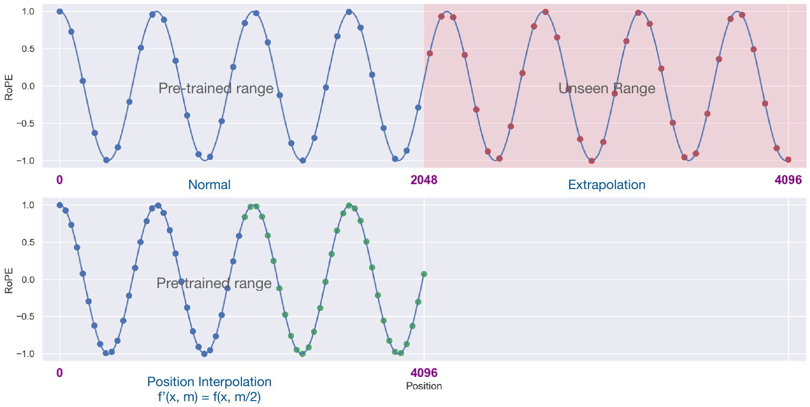
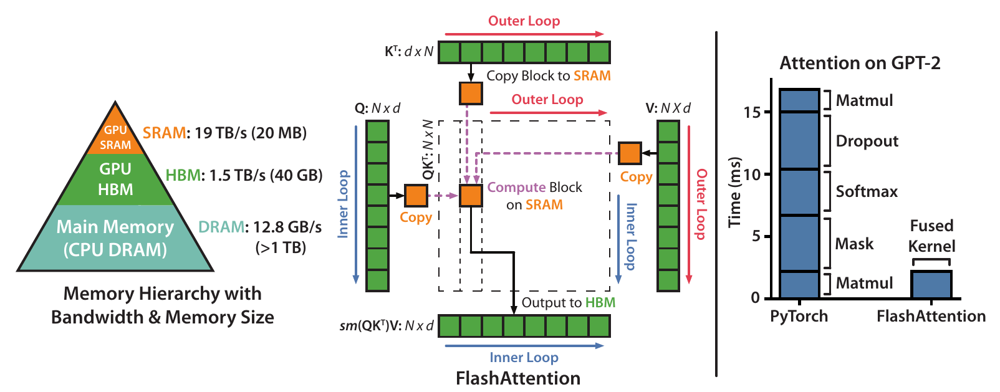

# Efficient Attention

## Motivation

Transformers are very powerful, mostly thanks to the **attention mechanism**
that avoids the bottleneck in the traditional seq2seq models. Attention comes
with its own costs, however.

Recall how in the attention layer, each vector in the input sequence
$\mathbf{I} = \langle\mathbf{i}_1, ..., \mathbf{i}_n\rangle$ is compared to each vector in
another sequence
$\mathbf{X} = \langle\mathbf{x}_1, ..., \mathbf{x}_m\rangle$ by computing (e.g.) the similarity

$$
s(\mathbf{i}_i, \mathbf{x}_j) = \frac{\mathbf{i}^\intercal_i \mathbf{x}_j}{\sqrt{d}}.
$$

## Motivation cont.

Most transformer models use **global attention**, where (in the self attention
layer) $\mathbf{X}=\mathbf{I}$. This means that both the computation and 
storage complexity of the

$$
\mathbf{S} = \frac{\mathbf{Q^\intercal}\mathbf{K}}{\sqrt{d}}
$$

matrix will be quadratic: $\mathcal{O}(n^2)$. This limits

- the _context_ a transformer can use,
- the _size_ of the model that fits the GPU memory,
- the model's _throughput_ and hence, it increases its carbon footprint.

In the following, we shall see techniques that try to address these issues.

# Sparse Attention

## Sparsity in Dense Layers

@child2019generating trained a 128-layer image Transformer on the CIFAR-10
dataset and observed that in many layers, the attention patterns are sparse:

{width=80%}

## Factorized Self-Attention

An attention layer can be characterized by a **connectivity pattern**
$S = \{S_1, ..., S_n\}$, where $S_i$ is the set of input indices the $i$th output
vector attends to. For regular self-attention, this is $S_i = \{j: j \leq i\}$.

**Factorized self-attention**

- has $p$ separate heads, as opposed to 1 for regular attention (or $\times p$
  in case of multi-head attention);
- for the $m$th head, $S_i = A^{(m)}_i \subset \{j: j \leq i\}$, a **subset**
  of dense attention;
- these are applied consecutively: $A_i = A^{(1)}_i \cdots A^{(p)}_i$.

If $|A^{(m)}_i| \propto \sqrt[p]{n}$, then the complexity of factorized
self-attention is $\mathcal{O}(n\sqrt[p]{n})$. From now on, $p=2$ is assumed.

## Factorization patterns

A factorization is **valid** if $A$ can connect all input and output positions.
Two examples:

**Strided attention**

\footnotesize
- Given a _stride_ $l \approx \sqrt{n}$,
- $A^{(1)}_i = \{i-l, i-l+1, ..., i\}$ (previous $l$ locations),
- $A^{(2)}_i = \{j: (i - j)\mod l = 0\}$ (every $l^{th}$).

\normalsize

**Fixed attention**

\footnotesize
- $A^{(1)}_i = \{j: (\lfloor j/l \rfloor = \lfloor i/l \rfloor)\}$
  (each output vector attends to its block),
- $A^{(2)}_i = \{j: j\mod l \in \{l-c,l-c+1,...,l\} \}$ (future outputs
  attend the last $c$ items in a block).

\normalsize

Fixed attention is better for text, strided for images.

## Factorization patterns cont.

An illustration of the two sparse attention types:

{width=80%}

## Architecture

The $p$ heads can be integrated in three ways ($W_p$ is the FF):

1. One head in each layer:
   $\textrm{attention}(X) = W_p \cdot \textrm{attend}(X, A^{(r\mod p)})$;
1. A _merged head_:
   $\textrm{attention}(X) = W_p \cdot \textrm{attend}(X, \bigcup^p_{m=1}A^m)$;
1. Multi-head ($n_h$) attention:
   $\textrm{attention}(X) = W_p\bigl(\textrm{attend}(X, A)^{(i)}\bigr)_{i \in \{1, ..., n_h\}}$.

With these changes, @child2019generating could train Transformers with hundreds
of layers and / or very long contexts (12,160 for text, $2^{20}$ for music).

## Other Sparse Attention Variants

The multi-head attention option works with other sparse attention patterns
as well:

- **global attention**: a few global tokens attend to the whole sequence;
  (Note: this sparse global attention is not the same as dense global attention,
   because only a few tokens attend to everything);
- **random attention**: for each query, a set of $r$ random keys is calculated
  to which the query attends;
- **window attention**: only local neighbors within a fix radius are attended
  to.

## Big Bird

The Big Bird contextual embedding model [@zaheer2020big] combines all
these linear attention types to increase the number of input tokens
significantly without significant change in memory requirements:

{width=100%}

# Long Sequences

## Extrapolation for Longer Sequences

RNNs can be trained on short sequences, but then can be run on much longer
sequences during inference. Transformer decoders can **extrapolate** like this
but are not very good at it:

![Extrapolation performance of various position methods. From [@press2022train].](figures/alibi_comparison.png){width=100%}

## Position methods

The following position methods were tested:

\small
1. **Sinusoidal positional embeddings**: the "default" Transformer embedding.
   Performance degrades after $5-10\%$ extra tokens.
1. **Rotary Positional Embeddings (RoPE)**: used e.g. in GPT-3. Applies
   sinusoidal embeddings to $\mathcal{K}$ and $\mathcal{Q}$ in every attention
   layer (but not to $\mathcal{V}$ and the embedding). Extrapolates to
   $+10-40\%$ tokens, but is much slower.
1. **T5 bias**: a relative position method that adds a _learned_ bias to $\mathcal{V}$
   depending on the distance between the key and query pair in each layer. The
   embedding is not modified. Extrapolates to $+80-120\%$, but is very slow.

{width=100%}

## ALiBi [@press2022train]

ALiBi (Attention with Linear Biases) is a simple method that adds a _static_
(non-learned) bias based on the query-key distance:

```{=latex}
\begin{center}
```
{width=50%}
```{=latex}
\end{center}
```
\vspace{-2em}

$$ \textrm{softmax}(\mathbf{q}_i\mathbf{K}^\intercal + m\cdot[-(i-1),...,-1,0]),$$

For $n$ heads, the slopes form a geometric sequence between
$\bigl(1, \frac{1}{2^8}\bigr]$; e.g. for 8 heads $\frac{1}{2^1}, ..., \frac{1}{2^8}$.

Models with ALiBi easily extrapolate to $2-10$ times their training context
($L$), often performing best at $2L$ (!)

## Analysis of RoPE

\small
Why doesn't _direct extrapolation_ of RoPE work?

{width=100%}

While the self-attention score in RoPE should only depend on the relative
distance between two positions, it becomes arbitrarily large
outside the training context $L$ (middle).

The trigonometric family is a **universal approximator**, and can fit arbitrary
functions. Since we only train RoPE in ($[0, L]$), we
don't know how the function looks above $L$.

\normalsize

## Position Interpolation

Position Interpolation (PI) [@chen2023extending] solves the problem by
mapping the longer context window $L'$ into $L$.

- each position $m' \in L'$ is transformed to $m = m'\frac{L}{L'}$;
- the model is then fine-tuned for 1000 steps.

{width=100%}

## Results

Experiments show that

- Llama's 2k context can be extended to 32k;
- a model fine-tuned for $L'=8k$ shows minimal degradation ($2\%$) in the
  original $L$ regime.

[Other](https://github.com/ggerganov/llama.cpp/discussions/1965) sources
[implementing](https://kaiokendev.github.io/context) similar strategies
[report](https://www.reddit.com/r/LocalLLaMA/comments/14lz7j5/ntkaware_scaled_rope_allows_llama_models_to_have/)
that a $2-4\times$ extension might be possible even without fine-tuning.

# Flash Attention

## Theory vs. Practice

Many approximate methods (e.g. sparse attention) manage to reduce FLOPs, but not
**wall-clock time**. This is because memory access speed (IO) is ignored.

Regular attention computes the output $\mathbf{O} \in \mathbb{R}^{N\times d}$
from $Q, K, V \in \mathbb{R}^{N\times d}$ by materializing

\vspace{-2em}
\begin{align*}
  \mathbf{S} &= \mathbf{QK}^\intercal \in \mathbb{R}^{N\times N}, \\
  \mathbf{P} &= \textrm{softmax}(\mathbf{S}) \in \mathbb{R}^{N\times N}, \\
  \mathbf{O} &= \mathbf{PV} \in \mathbb{R}^{N\times d}
\end{align*}
\vspace{-2em}

in the GPU's _high bandwidth memory_ (_HBM_). This is because

- these are separate instructions in PyTorch / TF;
- the matrices are needed for backpropagation.

## GPU hierarchy

The main problem is that

\vspace{-1em}
\small
- HBM is very slow compared to computation and SRAM;
- the softmax, dropout, norm operations are all **memory-bound**, and need
  $\mathcal{O}(N^2)$ HBM access.

\normalsize

\vspace{-1em}
{width=100%}

**FlashAttention** [@dao2022flashattention] solves these problems by optimizing
memory access.

## FlashAttention

Optimizations:

- $\mathbf{S}$ and $\mathbf{P}$ are not computed block-by-block using _tiling_;
- they are never materialized on the HBM, but recomputed for the backward pass;
- all operations for a single block are performed at the same time in a single
  _kernel_.

Even though recomputation results in more instructions (FLOPs), the total
number of HBM accesses decreases

- from $\Theta(Nd+N^2)$ (standard attention)
- to $\Theta(N^2d^2M^{-1})$ (FlashAttention),

where the SRAM size $M > d^2$ "many times".

## FlashAttention cont.

FlashAttention

- achieves a $15\%$ (vs. BERT speed record) to $3\times$ (GPT-2) speed-up over
  standard attention;
- memory scales linearly with $N$;
- allows longer contexts (4k for GPT-2).

**Sparse FlashAttention**

- block-sparse attention can be sped up by FlashAttention;
- even faster ($2-4\times$, depending on sparsity), contexts up to 64k.

**FlashAttention2** [@dao2023flashattention] yields another $2\times$ speed-up
by optimizing job allocation among GPU threads.

# References

## References {.allowframebreaks} 
\footnotesize
