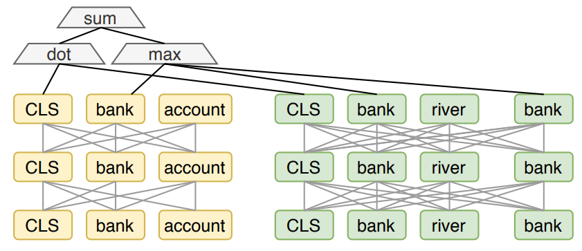

### Acknowledgement {.alert}

**Acknowledgement**: This notebook was inspired and follows in many details the following two sets of slides:

- [Stanford IR and Web Search course slides](https://web.stanford.edu/class/cs276/)
- [Sebastian Hoefstatter's IR course slides](https://github.com/sebastian-hofstaetter/teaching)

# Classical methods recap

- Term-based approach
- Calculating __inverted index__, requires heavy preprocessing
- Using __Bag-of-Words__ for calculating document vectors (sparse vectors)
- __Tf-Idf__ for getting the term weights in a document
- Memorable method is __BM25__ still a strong baseline
- Using Approximate Nearest Neighbor (ANN) for searching relevant documents in the embedding space
- Fast retrieving through inverted index

## Problem with classical methods

What about words in the queries that are not in the documents? $\rightarrow$ __Vocabulary mismatch problem__

__Example:__

__Query:__ "How does physical activity affect joint health?"

__Document containing:__ "Regular exercise improves mobility and prevents osteoarthritis in the knees."

In this case BM25 could not connect the two phrase __"Physical activity"__ and __"Exercise"__ besides __semantically__ they are close to each other.

## Solutions for that problem

__We need them__

```{=latex}
\begin{center}
\includegraphics[width=0.8\textwidth]{figures/transformers.png}
\end{center}
```

## Solutions for that problem

__Especially him__

```{=latex}
\begin{center}
\includegraphics[width=0.8\textwidth]{figures/bert.png}
\end{center}
```

# Transformer-based reranking (Mono reranking)

- First influential approach is from @nogueira2020passagererankingbert, with applying pretrain and fine-tuning on the ranking task:
  - input is the concatenation of the query and the passage to be ranked (truncated to fit context window)
  - standard binary classification head produces the relevance probability ranking score (often using the [CLS] token embedding for classification)

{width=85%}

## Advantages and Disadvantages

__Pros__:

- average performance is better compared to classical and neural scoring methods 
- BERT doubled the performance of BM25 (on MS-MARCO and TREC-CAR benchmarks)

__Cons__:

- models needs to be fine-tuned on IR datasets
- Ranking D documents for Q requires D $\times$ Q inferences
- The scores are difficult to interpret

## Advantages Disadvantages cont.

{width=95%}

## Expando-Mono-Duo

- originally made by @pradeep2021expandomonoduodesignpatterntext
- improve monoLM (monoBERT) architecture by adding a __pairwise reranking__ stage
- model gets __(query, document_1, document_2)__ triplets and outputs the __probability__ of document_1 is more relevant than document_2
- pairwise scores __aggregated__ to produce final ranking (multiple aggregation strategies, simplest is __summing__ or __multiplying__ each pairwise score of a document)
- The complexity is __quadratic__ ("expensive"), can be used as the final stage of a multi-stage ranking system

## Expando-Mono-Duo cont.

In the original paper authors used it together with a keyword-based and MonoLM stages:

- __Document Expansion__: enrich documents with additions reflects their content, implemented as a Seq-2-Seq model generates possible queries concatenated to the documents. inverted index built after this
- __Do BM25 keyword retrieval__. It can be enchanced with "pseudo-relevance feedback"
- __Do Mono reranking__
- __Do a Duo pairwise reranking__

Good results reaching more than __0.40MRR@10__ on the MS MARCO dataset

## Expando-Mono-Duo cont.

{width=95%}

# Encoder-Only transformers for first-stage IR

- using BERT-based transformers as first-stage retrievals, not just as rerankers
- __BERT-like__ models were dominant in the beginning with their __encoder-only__ architecture, but later decoder-only architectures surpassed them
- BERT models are used for 
  - __Dense information retrieval__
  - __Sparse information retrieval__

<!-- {width=55%} -->

## Dense information retrieval

- Dense (floating point) representation vectors for documents and queries
- Retrieval is done by scoring either outside of the models (dot-product, cosine similarity) or inside the model (using a network that outputs a score directly)
- First-stage retrieval is usually external and relies heavily on __ANN__
- Reranking is usually done within the model
- Dense retrieval is mainly semantic, considering the surface form less
- Architectures include:
  - __Cross-encoder based solutions__
  - __Bi-Encoder based Solutions__
  - Hybrid solutions (PolyEncoder, ColBERT)

## Bi-Encoder based information retrieval

- __less performant__ but __faster__ than Cross-Encoder
- the query and the document is encoded via 
  - __different encoder__ (could be the same weights initially, but weights updated separately from each other)
  - __same encoder__, classical embedding approach (difference could be only in the prompts, ex: @muennighoff2023mtebmassivetextembedding)
- the score will be the __dot product between the query and the document__ vector
- both encoders separately learn semantic representation of the queries and the documents
- Embeddings for the query and the document is either [CLS] token embedding or averaging all embeddings
- Document embeddings can be calculated __offline__

## Bi-Encoder architecture

{width=85%}

## Cross-Encoder based information retreival

- The query and the document is __concatenated together__ and separated with a [SEP] token
- The embedding in the end will be:
  - The embedding of the __[CLS] token__ (@qiao2019understandingbehaviorsbertranking)
  - __Averaging__ all token embeddings (@reimers2019sentencebertsentenceembeddingsusing)
- can perform __self-attention between query and the document__
- decrease dimension of the embedding vector to get score between the document and the query (usually single MLP head)
- It has __good accuracy__ but __slow__ inference time

## Cross-Encoder architecture

{width=75%}

## Combining Bi-Encoder and Cross-Encoder

- using Cross-Encoder is a resource heavy operation
- In contrast Bi-Encoder is much faster due to the offline document embedding calculation
- multiple approaches tried to combine the qualities of Cross-Encoder (__self-attention on query and the document__) and the advantage of Bi-Encoder (can calculate __document embeddings offline__)

## Combining Bi-Encoder and Cross-Encoder cont.

__PolyEncoder__

- Similar to a Bi-Encoder, it uses __two separate transformers__ for context and candidates.
- Contexts are converted into M vectors, instead of one, due to their larger size.
- M context codes are learned to capture global features, attending to all context embeddings.
- The candidate embedding attends to these global feature vectors to compute the final combined embedding.
- The final score is the dot product between the combined context embedding and the candidate embedding

## PolyEncoder Architecture

{width=80%}

## Combining Bi-Encoder and Cross-Encoder cont.

__ColBERT__

- uses separate encoder for query and document
- combine embeddings with a technique called __Late interaction__
- after the both the query and the document is embedded uses a __MaxSim__ operator, which is sum the __sum of maximum similarity__ (often dot-product) between query and document
- the final score is the sum of all tokens

$$
 s_{q,d} = \sum_{i\in [\left | E_{q}\right |]}^{}\max_{j\in[\left | E_{q}\right |]} E_{q_{i}} \cdot E_{d_{j}}^{T}
$$

## ColBERT architecture

{width=85%}

## Advantages and disadvantages

__Pros:__

- (query, document) score is relatively lightweigth compared to complex SOTA rerankers
- performance can be still competitive with them

__Cons:__

- __huge index__ without sophisticated compression -- the Colbert paper reports that Wikipedia's index was 600GB!!!
- __increased search latency__: scoring each document is still more expensive than just taking a __single__ dot product or cosine similarity!

## Improvements

Introduced by @santhanam2022colbertv2effectiveefficientretrieval, trying to address the issues mentioned above:

- __sophisticated index compression__: only __residual__ contextual token representations are stored in a radically __quantized__ form (based on KNN clustering).
- __fully score only promising documents__: prefilters documents by first doing individual NN searches for the individual query word embeddings and collecting the highest ranked documents, but this brings the system close to late stage reranking.


## Sparse Information Retrieval with transformers

- classic information retrieval is sparse, using frequency based terms (Bag-of-Words, Tf-Idf)
  - these vectors are __static__
  - __vocabulary mismatch problem__
  - __over interpretable dimensions__ (the dimensions are terms
in the dictionary)
- can be easily used by traditional search engines (inverted index)
- embedding vectors are vocabulary sized 

Trying use transformers in order make sparse retrieval better.

## DocT5Query

- used by previously mentioned model __Expando-Mono-Duo__, where a Seq-2-Seq model is trained for generate queries for every document, which were appended to the indexing
- solving the __vocabulary mismatch problem__ by adding relevant phrases to the document
- this approaach (among others) called __DocT5Query__ (see @nogueira2019documentexpansionqueryprediction)

## DocT5Query cont.
{width=75%}

## SPARTA (Sparse Transformer Matching)

- introduced by @zhao2020spartaefficientopendomainquestion, trains a neural ranker working with full token-level interaction matrix 
- query tokens represented by __static embeddings__, while document embeddings are __contextual__
- replacing BoW based inverted index

{width=95%}

## SPARTA (Sparse Transformer Matching) cont.

<!-- For any document ("answer candidate"), the query token scores indicate semantic closeness to dictionary terms. These sparse scores, shaped by the  -->
- b bias and ReLU, serve as a __"synthetic BoW representation,"__ capturing the document's content more effectively than the original.
- __token-level contextual interaction__ between query and answer
- because query terms are non-contextual, for every term in the vocabulary the rank feature can be calculated with every document candidate $\rightarrow$ __huge preprocessing__ effort is required
- Compared to classic inverted index, SPARTA learns which term should be inserted into the index

Importantly, these "synthetic BoW" representations can be __calculated during indexing__ and __used in a traditional reverse index__.

## SPLADE (SParse Lexical AnD Expansion model)

- dominated IR leaderboards across sparse alternatives
- uses __Masked Language Modelling Head__ of BERT to assign local importance scores to terms
- it uses a custom transformation on top of the MLM head
- Both the __output layer__ and the __training objective__ forces it to produce sparse distributions over the vocabulary
- the importance $w_{ij}$ of the token j (vocabulary) for a token i (of the input sequence) with input embedding $h_i$

$$
w_{ij} = transform(h_i)^T E_j + b_j \quad j \in {1, \cdots , \left | V\right |}
$$
$$
w_{j} = \sum_{i \in t}^{}log( 1 + RELU(w_{ij}))
$$

## Expanded SPLADE 

- SPLADE uses traditional dictionary representations, making it more interpretable and compatible with inverted-index systems.
- Problem: 
  - __Subword-Based Dictionary:__ SPLADE relies on a transformer's tokenizer, reducing interpretability and index integration.
- The paper @dudek2023learning solves these by modifying the SPLADE output heads to work with any independently specified dictionary, and the results show that this can be done __without performance degradation__.

## COIL (COntextualized Inverted List)

__Problem__:

- BM25 lacks semantic understanding.
- Neural retrievers (e.g., ColBERT) are computationally expensive.

__Solution:__ COIL combines lexical matching with deep embeddings for efficient and semantic-aware retrieval.

__How It Works:__

- Stores contextualized token embeddings in inverted (calculate document embeddings offline)
- Uses vector similarity for exact token matching.
- Efficient like BM25, semantic-aware like deep models.

## COIL (COntextualized Inverted List) cont.

__Calculating score__

\small

$$s_{tok}(q, d) = \sum_{q_i\in q\cap d}^{} \max_{d_j = q_i}(v_i^{qT} \cdot v_j^d)$$

\normalfont

where $v_i^{qT}$ is the vector for token i from the query q, and $v_j^d$ is the vector of token j from document d.
Note that it only uses __matching terms!!__


{width=65%}

## (Pre)Train Embedder model

- embedder models typically pre-trained on __representation learning tasks__ specifically designed for this purpose
- usually this pre-training happens __after a pre-training__ on another task frequently __language modelling__
- Trained with __unsupervised learning__, the dominant methods are:
  - __Contrastive Learning__: The training task is to map "semantically similar" texts to close representations and randomly sampled pairs of texts to distant ones (see @neelakantan2022textcodeembeddingscontrastive). Training objective often minimizing the negative log-likelihood. More on that in the C module. 
  - __Knowledge Distillation__: Use a more expensive and powerful model, such as a MonoLM or DuoLM as a teacher and train the embedder to approximate their output. 

## Negative sample selection for Contrastive Learning

- contrastive learning requires good negative samples
- different negative sample selection techniques:
  - __In-batch negatives__(@henderson2017efficientnaturallanguageresponse, @karpukhin2020densepassageretrievalopendomain): random selection, in a batch every query has one relevant document and B-1 negatives, with batch size B
  - __Cross-batch negatives__(@qu2021rocketqaoptimizedtrainingapproach, @gao2021scalingdeepcontrastivelearning): Using text embeddings computed on other GPUs as negatives for a query. This means $a \cdot b - 1$ negatives where a is the number of GPUs
- __hard negatives__: a document with high semantic similarity with the query but irrelevant

## Hard Negative Mining for CL

__Problem with negative samples__:

- hard to find quality negative samples because they can be false bnegatives (unlabeled positives)
- This is especially true for __Hard Negatives__

__Mining Hard Negatives__:

- __static hard negatives__: negative selector is fixed during the training, multiple studies selects hard negatives based on BM25 (@karpukhin2020densepassageretrievalopendomain)
- __dynamic hard negatives__:  instead of using static hard negatives, the model picks hard negatives from the top results retrieved by the current state of the trained retriever. Leading to faster convergence(@qu2021rocketqaoptimizedtrainingapproach).

## What is next?

```{=latex}
\begin{center}
\includegraphics[width=0.5\textwidth]{figures/decoder_meme.jpg}
\end{center}
```

# Decoder-Only transformers for first-stage IR

## Question


### Are decoder only models capable of producing meaningful semantic embeddings?

## Producing embeddings with decoder-only models

__Problems__

- token embeddings represent __local semantics__ due to next token generation objective
- the causal attention restircts the model to look forward in time

__Solution__: The solution went trough on an evolution

1. Prompt model take the representation of the last token in the last layer's hidden embedding
2. Usage of "Echo Embeddings"
3. New attention, new training objective and unsupervised contrastive learning

## First tries

- Using the __same approach__ as in the encoder-only models
- As decoder-only models do not have [CLS] token, two potential case is done:
  - use the __last token__'s representation (@jiang2023scalingsentenceembeddingslarge prompted the model to summarize the input text in __one word__, and take the last layer’s hidden embedding for the last token as the text’s representation)
  - make a __position-weighted pooling__ to calculate final embedding (@muennighoff2022sgptgptsentenceembeddings)
- in both approach they used contrastive learning objective

## We are getting there soon

- More interesting approach is to use the so-called __Echo Embeddings__
- Suggested by @springer2024repetitionimproveslanguagemodel, used in other models as well (@doshi2024mistralspladellmsbetterlearned)
- __Echo Embeddings__ means they duplicate the input and take the embeddings from the second set
- So the first tokens also know about the end of the input

## We are getting there soon

{width=80%}

## Modify decoder-only model a little bit

- based on the work of @behnamghader2024llm2veclargelanguagemodels, they suggested some modifications:
  - __bidirectional attention__ instead of causal: replace causal attention mask by __an all-ones matrix__
  - use new objective called __Masked Next token Generation__: Combines next token prediction with masked Language Modelling. When predicting a masked token at position i, we compute the loss based on the logits obtained from the token representation at the previous position i - 1.
  - use unsupervised contrastive learning with batch negatives


## Modify decoder-only model a little bit

{width=95%}

<!-- Potentially put COIL in, not sure due length issues -->

## Sparse embeddings with decoder-only models

Some examples of Decoder-only sparse models:

- __Mistral-SPLADE__ by @doshi2024mistralspladellmsbetterlearned, they use __Echo embeddings__ for and make the sparse embeddings the same way as BERT based SPLADE and build an index
- @nie2024textworthtokenstext find out that LLMs can produce high-quality sparse representations via the decoding layer and
simple __top-k masking__ (not keeping all terms, masking (zero out) low-scoring terms and retain only the top-k most important terms based on weights.) (ex. @zhuang2024promptrepspromptinglargelanguage)


## Sparse or Dense?

```{=latex}
\begin{center}
\includegraphics[width=0.4\textwidth]{figures/retrieval_meme.jpg}
\end{center}
```

## Sparse or Dense? cont

__Dense Pros__:

- better in semantic related tasks
- in the beginning better on becnhmarks than sparse models
- based on latent semantic embeddings

__Dense Cons__:

- relying on labeled data
- worse on zero-shot(without relevance judgement data from the target domain) setting than sparse models
- heavily dependent on the corpus scale

## Sparse or Dense? cont.

__Sparse models:__

- Consume less memory than dense models
- more capable of solving task which requires exact match (keyword or entity retrieval)
- based on lexical matching
- builds lexical matching based on term representations

## Hybrid Search

- Combinig dense and sparse approaches, to overcome each others weaknesses
- running both of them independently to obtain two top-K scored result lists,
- standardizing the two score lists (e.g., min-max scaling them to [0, 1])
- and computing the final scores as the (possibly weighted) average of the two scores for each documents.

## Which approach is optimal?

So which approach should one use? There are too many moving parts:

- domain
- document collection size
- availability of training data
- availability of pretrained models
- available computational resources

## Which approach is optimal? cont.

- if data available fine-tuning produce best results (but huge cost)
- zero-shot(without relevance judgement data from the target domain) is complicated:

{width=65%}

## Which approach is optimal? cont.

- hybrid approaches getting more attention

{width=60%}

## Which approach is optimal? cont.

__Conclusion__: In a __really zero-shot__ setting, one can do worse than using a __hybrid combination__ of

- __good general IR-tuned (!!) dense representation__ based scoring (typically using dot-product or cosine), and 
- a __SOTA sparse representation__ (usually SPLADE) based scoring.  

# Reranking with rank fusion

## Multi-stage retrieval

__Multi-stage retrieval recap__

- __First-stage model__ (embedding model/retriever) gives a set of __relevant documents__ from the large dataset
- __Second stage model__ (reranker) used to __rerank__ the documents retrieved by the first-stage model

{width=95%}

## Rank fusion

- using multiple rerankers and combine their scores

__Reciprocal rank fusion__

- introduced in the paper of @rrf_fusion
- combines the ranks of multiple rerankers, gives more weight to higher ranks
- __RFF formula__ 

$$
 RRF(d) = \sum_{r \in R}^{}\frac{1}{k + r(d)}
$$

where _d_ is a document, _R_ is the set of rerankers, _k_ is a constant (they use 60 in the paper), r(d) is the score of _d_ using ranker _r_

## Rank fusion cont.

__Distribution-based Score Fusion__

- introduced by @Michelangiolo, used in @kim2024autoragautomatedframeworkoptimization
- can combine scores from different rerankers using __different scales__
- first algorithm which can combine __image and text scores__ as well
- instead of regular normalization it uses __MinMax__ scaling
- using weighted sum to aggregate scores

## DBSF cont.

__Formula__:

$$
 S \left (\bigcup_{i \in E} \frac{x_i - (\mu_i - 3\sigma_i)}{(\mu_i + 3\sigma_i) - (\mu_i - 3\sigma_i)}\right )
$$

where _E_ is a set of _n_ embeddings and _x_ represents a search result obtained from one embedding, the new ranked scores are computed by merging all search scores into _U_ and scaling them using a min-max scaler, where the feature range is defined by three standard deviations from the mean. Finally, the function S(x) sorts the combined scores to produce the final ranking.

## DBSF cont.

{width=75%}


## Specialized embedding models

Language model pretraining might not produce an embedding space with the required properties.

Some additional goals could help condition it:

- Supervised semantic similarity
- Classification
- Clustering
- Supervised retrieval or reranking
- Q&A mapping
- Longer (sentence, paragraph) text representations 

## Sentence embeddings

Sentence-level supervised dataset examples include: sentence similarity datasets, sentiment analysis datasets, natural language inference datasets (premise and either an entailment, a contradiction, or a neutral pair), etc.

![Using NLI datasets as similar-dissimilar (positive-negative) examples for sentence embedding improvement. [@gao2021simcse]](figures/supervised_sent_embed.png){height=35%}

## Instruct-embeddings

Instruction embeddings emerge as multi-task trained embeddings, where the executed task depends on the natural language instruction given to the model. Instruction training improves domain adaptability as well.

## Instruct-embedings

![InstructOR [@su2022one]](figures/instruct_embed.png){height=75%}

# Retrieval Augmented Generation

RAG usually consists of the following steps:

- **Question-forming**: Reformulating user query as a standalone query (accounting for history), list of keywords, etc.
- **Retrieval**: Using an embedding and a vector storage system or search engines, etc. to retrieve useful passages.
- **Document aggregation**: *Stuff* all documents together or *Map* a transform (for example summarization).
- **Answer-forming**: The query and the context are fed to the LM that produces an answer.


## Two-step RAG system

- user questions are not always similar to relevant knowledge
- __different__ question-forming and answer forming step
- from the user question making a general query (with different expanding techniques) which is more similar to the relevant knowledge
- potential methods for generating general query: __Hyde, stepback prompting, standalone general questions__

Example:

__User Query__: "What are the benefits of RAG?"

__General Query__: "Explain the advantages of retrieval-augmented generation in improving LLM responses."


## Two-step RAG system

{width=85%}

## Hypothetical document embedding

Hypothetical document embedding [@gao2022precise] helps with generating better queries for embedding vector-based retrieval systems. The HyDE question-forming step is replaced with a generative step that produces a "fake" example answer to the question and uses that as a query in the database.

![From [@gao2022precise]](figures/hyde.png){height=30%}


## Step-back prompting

- prompting technique which defines a question from the original one with a higher level of abstraction, called __Step-back question__
- usually a step-back question is __easier__, and provides the necessary information to reason about the original question
- __Steps__
  - __Abstraction:__ prompt the LLM to ask a generic step-back question, unique for each task, about a higher-level principle
  - __Reasoning:__ based on the facts of the higher-level principle, LLM can reason about the original question


## Step-back prompting

{width=80%}

## Standalone general question

- reformulating user queries into self-contained, well-structured questions based on user history
- __Self-Containment__ – The question should be understandable without requiring context from previous interactions.
- __Generalization__ – It aims to broaden or clarify ambiguous or underspecified queries.
- __Explicit Detail__ – The reformulated question should explicitly state the core information needs.

## Metadata Filtering

- __metadata__ = Extra fields in the vector database which contains additional information about the vector embeddings
- __filtering out__ vector embeddings before doing the similarity search based on __metadata fields__
- metadata could be: dates, times, genres, categories, names types, descriptions, etc.
- works as a "WHERE" statement in an SQL query

## Metadata Filtering

{width=55%}

## Entity memory

Another possible, more complex use-case is when the LLM has the ability to modify a database as well. In this database a list of entities and related knowledge is stored. The model is iteratively prompted to update this database, then it can retrieve from the entity information the database stores.

{height=30%}

## RAG pre-trained models

Transferring information decoded to text is actually inefficient.

Retrieval augmented pre-training is possible for models, where either pre-embedded vectors are appended to the encoded input, or the information is provided via cross-attention-like mechanisms.

## REALM

Retrieaval Augmented Language Model Pretraining [@guu2020retrieval] uses a neural retriever composed of BERT-like embedding models. These models are part of the trained network. The retriever concatenates the retrieved document embeddings with the query, during MLM training.

## REALM

![REALM pretraining [@guu2020retrieval]](figures/realm.png){height=80%}

## RETRO

Retrieval-Enhanced Transformer [@borgeaud2022improving] introduces a technique where the relevant context information is processed by cross-attention.
The retrieval is performed by frozen BERT embeddings. The retrieved chunks are then modified based on the input information using cross attention in the encoder as well.

In the decoder cross-attention then incorporates the modified retrieved information into the input.

## RETRO

![RETRO architecture from [@borgeaud2022improving]](figures/retro_arch.png){height=70%}

## RETRO Chunks

The input is sliced up into chunks, which retrieve information separately. Previous chunks (and related information) are processed causally.

The whole model is differentiable, gradients can flow through the network.

During training the retrieved information is pre-computed.

## RETRO Chunks

![Chunked cross-attention from [@borgeaud2022improving]](figures/chunked_cross_attn.png){height=70%}

## RAG metrics:

{width=85%}

## Retriever evaluation 

- Similarly, the basic retrieval evalution metrics are applicable here 
- __Precision at k (P@k)__: Measures the fraction of relevant documents among the top k retrieved.
- __Recall__: Assesses the proportion of relevant documents retrieved from the total relevant documents available.
- __Mean Average Precision (MAP)__: Calculates the average precision across all queries, providing a single-figure measure of quality across recall levels.
- __Normalized Discounted Cumulative Gain (nDCG)__: Evaluates the ranking quality by considering the position of relevant documents in the retrieval list.

## Generation Component evaluation:

- using general machine text evaluation metrics
- __BLEU Score__: Evaluates the overlap between the generated text and reference text based on n-gram precision.
- __ROUGE Score__: Measures the overlap of n-grams, particularly useful for assessing recall in generated summaries.
- __BERTScore__: Utilizes BERT embeddings to compute semantic similarity between the generated and reference texts.
- __Perplexity__: Indicates how well a probability model predicts a sample, reflecting the fluency of the generated text.

## Generation Component evaluation cont.

- more complex metrics, introduced by @es2023ragasautomatedevaluationretrieval
- __Faithfulness__: an answer faithful to a context if the claims that are made in the answer can be inferred from the context.  first use an LLM to extract a set of statements, then calculate the final faithfulness score by: 
\small

$$
F = \frac{\left | V\right |}{\left | S\right |} 
$$
where |V| number of statements supported by the LLM, |S| total number of statements


## Generation Component evaluation cont.
- __Answer Relevance__: an answer is relevant if it directly addresses the question in an appropriate way. For the given
answer, an LLM is prompted to generate potential questions, then calculate relevance score the following way:
\small
$$
   AR = \frac{1}{n}\sum_{i=1}^{n}sim(q, q_i)
$$

\normalfont

- __Context Relevance__: context is considered relevant to the extent that it exclusively contains information that is needed to answer the question. Extracts sentences from the context which potentially can help using LLM then calculate relevance of context:

\small

$$
 CR = \frac{\text{number of extracted sentences}}{\text{total number of sentences in c(q)}}
$$

# Tooling

## API calls

Text-based API-s are easy to call using the API's input and output definition. Most LLMs are fine-tuned to handle JSON or XML formats well.

Some examples of such API-s include:

- Search-engines
- Web-scraping
- Real-time data streams
- Executables, commands (e.g.: calculator)
- Code interpreters, simulators
- Other LLM instances

## AutoGPT - Self-monologue

AutoGPT is capable of higher-order planning by applying multiple turns of generation in a Chain of Thought and Reflexion type prompting.
AutoGPT applies $4+1$ steps of CoT-like process to control actions:

- Thoughts: Interpretation of the user input with respect to the goals.
- Reasoning: CoT about what to do for this input.
- Plan: Planned actions to execute.
- Criticism: Reflexion on action results.
- *Action*: Actions with inputs generated by AutoGPT.

## AutoGPT - Self-monologue

During the planning and action phase additional expert LLMs, and external tools could be called.
AutoGPT systems are usually prompted with a set of goals only, the rest is figured out by the model.   
Example workflow (sending an email):

\footnotesize
**Thoughts**: Contact Natabara at natabara@inf.elte.hu, Send a polite email indicating that he should finalize the NLP slides.   
**Reasoning**: The goals are clear. I need to send an email to Natabara at natabara@inf.elte.hu, politely asking him to finalize the NLP slides and indicating that I am an AI assistant.   
**Plan** (+Criticism): Use the send_email action.   
{ "action": "send_email", "action_input": \<JSON\>}   
**Observation**: Mail sent.

## Agent loop

{height=70%}

## AutoGPT - Self-monologue

![A single step of AutoGPT [@yang2023autogpt]](figures/AutoGPT.png){height=70%}

## Conversational specialist agents

{height=65%}


## Tool-finetuned models

Fine-tuning a model for tool selection is hard. Bootstrapping could be a solution, where a graph of API calls is constructed using a multitude of LLM calls. These successive calls are then ranked by success rate, and the best few passing solutions are selected to be included in the dataset. Such fine-tuning can enhance the tool utilization of language models.

![Dataset construction pipeline for tool-finetuned models [@qin2023toolllm]](figures/tool_llm.png){height=30%}

# Summary 

## Summary I.

Augmented language models use external information sources to enhance their capabilities. One significant group of these sources are vectorized document databases. Embedding models are utilized to retrieve related information via approximate NN search algorithms.
Other tools include web API-s, or even code interpreters. Models applying a self-monologue process are capable of fulfilling goals by planning and executing successive actions.

## Summary II.

During retrieval augmented generation the retrieved documents are concatenated or summarized, then fed to the model to generate answers in a second LLM step.

Fine-tuning models to use retrieved information or external tools is possible and increases performance.

# References {.allowframebreaks} 

\footnotesize
