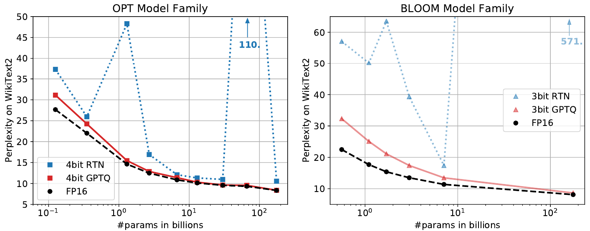
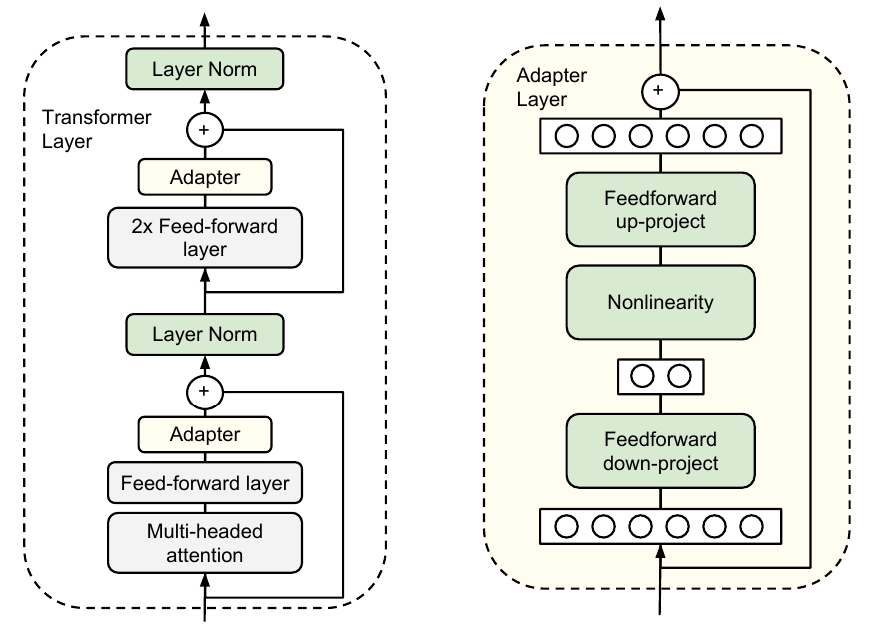
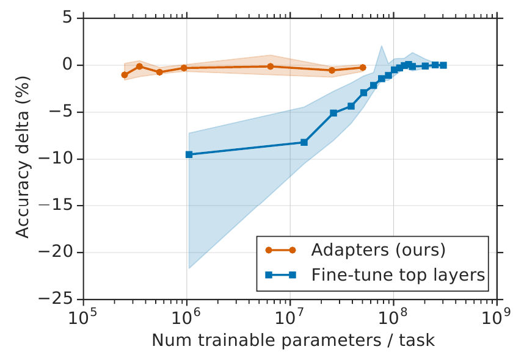
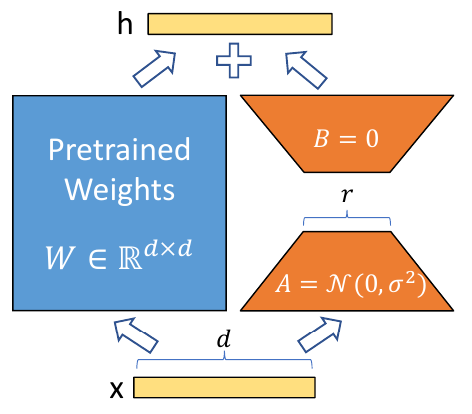
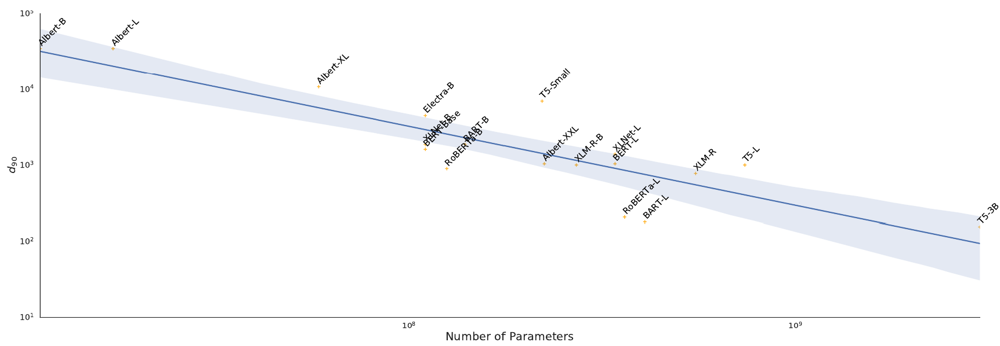
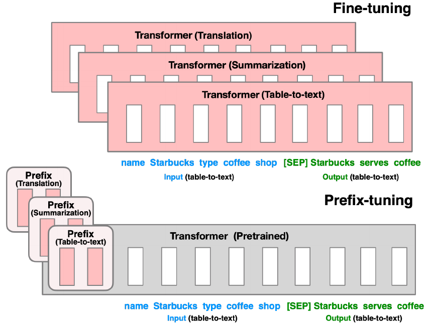

# Reduced Complexity

## Introduction

LLMs have been increasing in parameter count from day 1 even before scaling
laws[^1] for neural LMs were were established [@kaplan2020scaling]. As
discussed earlier, large models have various problems:

- adverse environmental effects [@schwartz2020green; @strubell-etal-2019-energy];
- very high HW requirements for
    - inference
    - fine-tuning.

In today's lecture, we are going to see a few methods that may alleviate some
of these problems.

[^1]: These ``laws'' are not hard mathematical constructs are so are more like Moore's.

# Distillation

## Knowledge Distillation -- Fluff

LMs (or any classification models in general) are usually trained by
minimizing the cross-entropy between the model's predictions and the _one-hot_
training labels.

This setup disregards the relationship between words (such as synonyms)
For instance, the model will learn eventually that
_cars_, _trains_, and _trucks_ are all vehicles, but in any training sentence
only one will be correct, and only its probability is increased. This slows
down training.

**Knowledge distillation** [@buciluǎ2006model; @hinton2015distilling] uses the
output of a larger model (the _teacher_) to replace the one-hot labels when
training a (usually) smaller model: the _student_.

## Knowledge Distillation -- Crunch

The student is trained with _distillation loss_: the cross-entropy against the
(soft) target distribution of the teacher:

\vspace{-1em}
$$L_{ce} = \sum_i t_i * log(s_i).$$

\vspace{-0.5em}
@hinton2015distilling also uses a parameterized version of softmax

\vspace{-0.5em}
$$p_i = \frac{\exp{(z_i / T)}}{\sum_j \exp{(z_j/T)}},$$

\vspace{-0.5em}
where $T$ is a _temperature_ that controls the smoothness of the
distribution. During training, a $T>1$ value is used to amplify the
implicit generalization in teacher's knowledge.

## DistilBERT

DistilBERT [@sanh2019distilbert] distills BERT-base to a model with half the
number of layers. The training loss has three components:

- the distillation loss $L_{ce}$;
- the _masked language modeling_ loss $L_{mlm}$;
- a _cosine embedding loss_ $L_{cos}$ to align the hidden vectors.

The small model retains $97\%$ of BERT's performance on GLUE, while being
$40\%$ smaller and $60\%$ faster at inference time.

Distillation was mainly used in pretraining, but in one task, the fine-tuned
model was also trained via distillation.

## Switch Transformer

The Switch Transformer [@fedus2022switch] is an LLM with 1.6T parameters. The
model uses a **Mixture of Experts** setup to achieve sparsity:

- ``Hard'' expert switch: only one expert is active at a time;
- MoE is applied to the FF layer only;
- $7\times$ increase in pre-training speed.

The model is very powerful, but too large to be used effectively. Using the
same techniques as DistilBERT:

- initializing student weights from teacher,
- $75$--$25\%$ mix of hard and soft (teacher) loss;

the distilled _dense_ model (at $80-99\%$ compression) still retains about
$30\%$ of the teacher's quality gains.

# Quantization

## Quantization

**Quantization** is the process of mapping continuous values to a small set of
discrete values.
Besides distillation, it is another method to decrease the memory
usage of LLMs, making it possible to run large models on a single GPU.

Formally, the goal of quantization is that given the (layer) weight matrix
$\mathbf{W}$ and layer input $\mathbf{X}$, find the quantized weight matrix
$\mathbf{\hat{W}}$ so that

\vspace{-1em}
$$\mathbf{\hat{W}} = \textrm{argmin}_\mathbf{W_q} \|\mathbf{WX} - \mathbf{W_qX}\|_2^2.$$

## Quantizing LLMs

Quantizing LLMs is not a simple task:

- the simplest _round-to-nearest_ (_RTN_) methods only work well down to
  8bit / weight;
- advanced methods that require _model retraining_ are very expensive on
  GPT-3-sized models (such as OPT-175B or BLOOM);
- _post-training_ (one-shot) are complex and stop being feasible at around
  1.5B parameters.

@frantar2023optq introduced the GPTQ / OPTQ algorithm, the first that could
quantize OPT or BLOOM to 3-4 bits.

## The Algorithm

The algorithm is an enhanced version of the _Optimal Brain Quantization_
algorithm. OBQ quantizes $\mathbf{W}$ row-by-row, one weight at a time, always
updating the remaining weights to compansate for the quantization error.

It takes OBQ 4 hours to quantize a 100M model. To handle large LLMs, the algorithm

- updates weights only once per column,
- uses lazy batches for high memory-throughput,
- addresses numerical instability.

Quantization only improves the memory requirements of the model. To speed up
inference ($3.2-4.5\times$), special dequantizing kernels were implemented. 

## Results

GPTQ can quantize OPT and BLOOM to 4 and 3 bits per weight, respectively, in
about 4 hours.


```{=latex}
\begin{center}
```
{width=100%}
```{=latex}
\end{center}
```

Observations:

- The perplexity of the largest quantized models is within 1-2 points of the fp16
models;
- The difference is much bigger for smaller sizes, where quantization is not so
  important.

# Efficient Adaptation

## Motivation

Ever since BERT, transferring LLM knowledge to NLP tasks by fine-tuning them
has been the way to achieve state-of-the-art performance. However, fine-tuning
is parameter-inefficient: a new model is required for every task.

Two related concepts:

- **Multi-task learning**: fine-tune the model on multiple tasks. However, not
  all tasks might be available at the time of fine-tuning -- the task we are
  interested in might be missing.
- **Continual learning** systems aim to learn from a stream of tasks. Whenever
  a new task pops up, the model needs to be able to tackle it _without
  forgetting previous tasks_.

## Adapters

Adapters [@rebuffi2017adapter] solve the problem of
continual learning and the wastefulness of fine-tuning by

- adding task-specific, small **adapter modules** to the original model;
- freezing the original model's weights;
- training only the adapter modules during fine-tuning.

@houlsby2019parameter

- inserts adapters after both sublayers of a transformer layer;
- initializes them to be near-identity;
- limits the number of additional parameters by using a
  **bottleneck adapter** that projects the $d$-dimensional data down to $m$
dimensions and back.

## Adapters cont.

{width=80%}

## Adapters: Performance

An alternative to the adapter approach is to fine-tune _only the top layers_.
The lower layers usually compute generic features; the top layers task-specific.

However, adapters achieve the same results with two magnitudes less parameters
($1.14-3.6\%$):

```{=latex}
\begin{center}
```
{width=80%}
```{=latex}
\end{center}
```

## Low-Rank Adaptation (LoRA)

Low-rank adaptation [@hu2022lora] solves the same problem as adapters but in a
slightly different way. Instead of adding new, trainable layers _after_
components of the original model, it adds _low rank decomposition matrices_ to
represent the changes needed by the adaptation _parallelly_ to the original,
frozen matrices:

```{=latex}
\begin{center}
```
{height=50%}
```{=latex}
\end{center}
```

## LoRA cont.

LoRA is similar to adapters:

- adds small, low-dimensional modules -- often $r=2$ or $4$ is enough;
- a different set of modules is trained for each task;
- the modules are of similar size to adapters;
- ensures efficient fine-tuning.

However, there are key differences:

- LoRA is only applied to the self-attention matrices ($W_k, W_q, W_v, W_o$);
- LoRA modules can be merged with the frozen matrices at inference time, which
  incurs no _inference latency_ compared to adapters;
- LoRA generally achieves slightly better results on downstream tasks.

## Intrinsic Dimensions

Why can we fine-tune million/billion-parameter models on tiny task-specific
datasets simply with SGD, without normalization? Why do low-rank adaptation
techniques (bottleneck adapters, LoRA) work for fine-tuning? Intrinsic
dimensionality might provide an answer.

The **intrinsic dimension** [@li2018measuring] of an objective function is the
minimum number of dimensions needed to solve the optimization task
``satisfactorily''. In our case, this translates to:

How many parameters do we need (in addition to a non-fine-tuned, pretrained
model) to reach at least $90\%$ of a fully fine-tuned model's performance?

## Mathematical Formulation

Computing the lowest dimension $d$ is intractable; we can only approximate it
heuristically. Let $\theta^D$ be the $D$-dimensional parameters of the
fine-tuned model and $\theta_0^D$ the parameters of the original model. Then,
we are looking for the lowest $d$ so that

$$\theta^D = \theta_0^D + P(\theta^d),$$

where $P: \mathbb{R}^d \rightarrow \mathbb{R}^D$.

In the original formulation, $\theta_0^D$ are the parameters of the
_full model_. @aghajanyan-etal-2021-intrinsic extends this to take multiple
layers into account. LoRA is defined in this framework with $P(\theta^d) = B$.

## Finding $d$

The only way to find $d$ is via hyperparameter search. The paper does this, and
finds that

\vspace{-1em}
\small
- the intrinsic dimension is the _minimal description length_ of a downstream
  task w.r.t. the pre-trained model;
- viewed as such, the intrinsic dimension is related to compression and so it
  also correlates with the the generatlization capability of the model;
- larger models allow for _smaller_ intrinsic dimensions:

\normalsize

```{=latex}
\begin{center}
```
{width=100%}
```{=latex}
\end{center}
```
\vspace{-2em}

## P^\*^-Tuning

**p^\*^-tuning** is a family of methods for _lightweight
fine-tuning_. It was inspired by prompting. Here the trainable components are
task-specific free-parameter ``token'' inserted before the actual
input (also called _soft prompt_).

```{=latex}
\begin{center}
```
{width=50%}
```{=latex}
\end{center}
```

p^\*^-tuning works for both decoder-only and full-stack models.

## Prefix Tuning

**Prefix tuning** [@li-liang-2021-prefix] prepends the soft tokens
(the **prefix**) to the input embeddings and to the input of each layer.

- Prefix tuning needs about $0.1\%$ additional parameters;
- Compared to adapters, this is a $30\times$ decrease;
- Prefix tuning
  - outperforms adapters,
  - obtains comparable performance to fine-tuning,
  - outperforms fine-tuning in low-data setting.

## The Rest of the Family

**Prompt tuning** [@lester-etal-2021-power] is similar to prefix tuning, but
the prompt is only prepended to the input embeddings.

**P-tuning** [@liu2023gpt] trains an LSTM to generate soft prompts (not just
prefixes). It outperforms prompt tuning by $15-20$ points on several datasets.

**P-tuning V2** [@liu-etal-2022-p] is effectively the same as prefix tuning
for Transformer _encoder_ models.

[comment]: # (https://www.reddit.com/r/MachineLearning/comments/14pkibg/d_is_there_a_difference_between_ptuning_and/)

## The PEFT Library

The Parameter Efficient Fine-Tuning
[(PEFT) library](https://huggingface.co/docs/peft/index) supports all these
methods (and more).

You can also find the papers associated with the methods.

# References

## References {.allowframebreaks} 
\footnotesize
