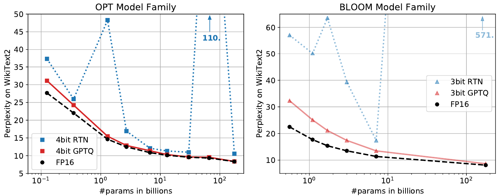
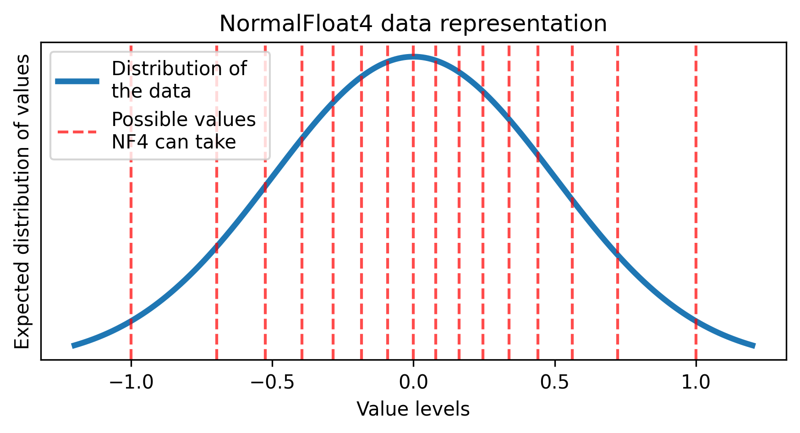
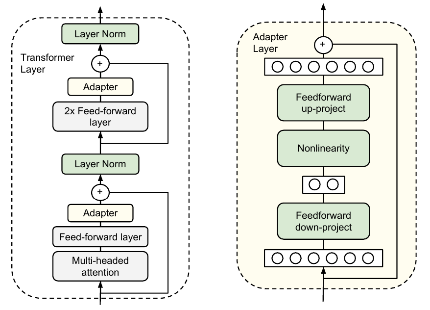
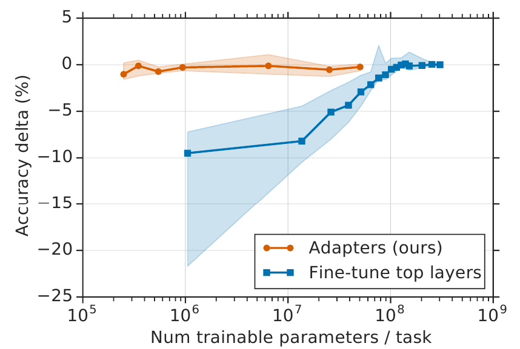
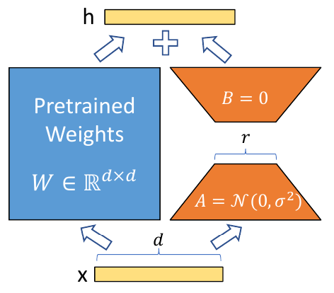

# Reduced Complexity

## Introduction

LLMs have been increasing in parameter count from day 1 even before scaling
laws[^1] for neural LMs were were established [@kaplan2020scaling]. As
discussed earlier, large models have various problems:

- adverse environmental effects [@schwartz2020green; @strubell-etal-2019-energy];
- very high HW requirements for
    - inference
    - fine-tuning.

In today's lecture, we are going to see a few methods that may alleviate some
of these problems.

[^1]: These ``laws'' are not hard mathematical constructs are so are more like Moore's.

# Distillation

## Knowledge Distillation -- Fluff

LMs (or any classification models in general) are usually trained by
minimizing the cross-entropy between the model's predictions and the _one-hot_
training labels.

This setup disregards the relationship between words (such as synonyms)
For instance, the model will learn eventually that
_cars_, _trains_, and _trucks_ are all vehicles, but in any training sentence
only one will be correct, and only its probability is increased. This slows
down training.

**Knowledge distillation** [@buciluǎ2006model; @hinton2015distilling] uses the
output of a larger model (the _teacher_) to replace the one-hot labels when
training a (usually) smaller model: the _student_.

## Knowledge Distillation -- Crunch

The student is trained with _distillation loss_: the cross-entropy against the
(soft) target distribution of the teacher:

\vspace{-1em}
$$L_{ce} = \sum_i t_i * log(s_i).$$

\vspace{-0.5em}
@hinton2015distilling also uses a parameterized version of softmax

\vspace{-0.5em}
$$p_i = \frac{\exp{(z_i / T)}}{\sum_j \exp{(z_j/T)}},$$

\vspace{-0.5em}
where $T$ is a _temperature_ that controls the smoothness of the
distribution. During training, a $T>1$ value is used to amplify the
implicit generalization in teacher's knowledge.

## DistilBERT

DistilBERT [@sanh2019distilbert] distills BERT-base to a model with half the
number of layers. The training loss has three components:

- the distillation loss $L_{ce}$;
- the _masked language modeling_ loss $L_{mlm}$;
- a _cosine embedding loss_ $L_{cos}$ to align the hidden vectors.

The small model retains $97\%$ of BERT's performance on GLUE, while being
$40\%$ smaller and $60\%$ faster at inference time.

Distillation was mainly used in pretraining, but in one task, the fine-tuned
model was also trained via distillation.

## Switch Transformer

The Switch Transformer [@fedus2022switch] is an LLM with 1.6T parameters. The
model uses a **Mixture of Experts** setup to achieve sparsity:

- ``Hard'' expert switch: only one expert is active at a time;
- MoE is applied to the FF layer only;
- $7\times$ increase in pre-training speed.

The model is very powerful, but too large to be used effectively. Using the
same techniques as DistilBERT:

- initializing student weights from teacher,
- $75$--$25\%$ mix of hard and soft (teacher) loss;

the distilled _dense_ model (at $80-99\%$ compression) still retains about
$30\%$ of the teacher's quality gains.

# Quantization

## Quantization

**Quantization** is the process of mapping continuous values to a small set of
discrete values.
Besides distillation, it is another method to decrease the memory
usage of LLMs, making it possible to run large models on a single GPU.

Formally, the goal of quantization is that given the (layer) weight matrix
$\mathbf{W}$ and layer input $\mathbf{X}$, find the quantized weight matrix
$\mathbf{\hat{W}}$ so that

\vspace{-1em}
$$\mathbf{\hat{W}} = \textrm{argmin}_\mathbf{W_q} \|\mathbf{WX} - \mathbf{W_qX}\|_2^2.$$

## Quantizing LLMs

Quantizing LLMs is not a simple task:

- the simplest _round-to-nearest_ (_RTN_) methods only work well down to
  8bit / weight;
- advanced methods that require _model retraining_ are very expensive on
  GPT-3-sized models (such as OPT-175B or BLOOM);
- _post-training_ (one-shot) are complex and stop being feasible at around
  1.5B parameters.

@frantar2023optq introduced the GPTQ / OPTQ algorithm, the first that could
quantize OPT or BLOOM to 3-4 bits.

## The Algorithm

The algorithm is an enhanced version of the _Optimal Brain Quantization_
algorithm. OBQ quantizes $\mathbf{W}$ row-by-row, one weight at a time, always
updating the remaining weights to compansate for the quantization error.

It takes OBQ 4 hours to quantize a 100M model. To handle large LLMs, the algorithm

- updates weights only once per column,
- uses lazy batches for high memory-throughput,
- addresses numerical instability.

Quantization only improves the memory requirements of the model. To speed up
inference ($3.2-4.5\times$), special dequantizing kernels were implemented. 

## Results

GPTQ can quantize OPT and BLOOM to 4 and 3 bits per weight, respectively, in
about 4 hours.


```{=latex}
\begin{center}
```
{width=100%}
```{=latex}
\end{center}
```

Observations:

- The perplexity of the largest quantized models is within 1-2 points of the fp16
models;
- The difference is much bigger for smaller sizes, where quantization is not so
  important.

## Data Efficient Quantization

The GPTQ algorithm definitely needs a significant amount of quality data to optimize quantized weights as it aims to match activations between the quantized and the original model. Modern approaches to quantization utilize different assumptions/metrics that allow for more data-efficient quantization.

- NormalFloat 4-bit ("bitsnbytes" or "bnb" style)[@qlora] quantization assumes a certain distribution of weights to design optimal quantization levels. It does not require any data to quantize weights.
- Activation-aware Weight Quantization (AWQ) [@awq] uses activation magnitudes only to selectively quantize weights thus making it more robust to shifts or lack of data.

## Basic Quantization

Standard quantization maps the original representation range to a smaller range rounding to a fixed (smaller) number of quantized levels

$$\mathbf{X}^{\text{Int8}} = \text{round}(c^{\text{FP32}} \cdot \mathbf{X}^{\text{FP32}})$$

Where $c^{FP32} = \frac{127}{\text{absmax}(\mathbf{X}^{\text{FP32}})}$ is an optimal maximum value-based quantization constant. 

To prevent outliers weights from affecting the max values we can select a quantization constant based on the *quantiles* of the weight distribution, and also select *blocks* of the weight matrix we quantize separately [@blockwise].

## "BitsnBytes" or QLoRA-style Quantization

@qlora combines both blockwise and quantile-based. 

As most of DL model weights are trained with normalization they mostly follow a normal distribution. Scaling these weights is easy as only a $\sigma$ parameter is needed if we assume a mean of 0.

This will result in a scaled normal distribution where the data format of Normal Float comes in handy. Here instead of arithmetic rounding, we define quantization levels that equalize the probability masses among themselves.

To further reduce memory consumption: quantization constants (in this case $\sigma$ values) of the blocks are quantized again (double quantization). 

## NF4 Possible values

{width=100%}

## Activation-Aware Weight Quantization (AWQ)

AWQ [@awq] is a data-efficient method, with the main novelty of keeping a set of salient weights in the original precision (fp16) and scaling weights before quantization proportionally to their importance (while dividing input channels by this scaling factor) $Q(w) = 1/c \cdot \text{round}(c\cdot w \cdot s)$, while inputs are scaled inversely passing $x/s$ to the layers. Here we use blockwise linear absolute max scaling ($c$) and a channel-wise scaling factor ($s$) which is determined by the activation magnitudes over a small dataset.

Activation magnitude is calculated as: $A_d = \sum_{i=1}^{N} |x_{i,d}|$ where $N$ is the number of samples in the dataset and $d$ is the channel index. Weights of channel $\hat{d} = \text{argmax}_d (A_d)$ are kept as fp16 and quantized for the rest.

## AWQ Benchmark results

The scaling factor $s$ is determined for each channel as $s_d = A_d^{\alpha}$ where $\alpha$ is a tunable parameter found by grid search. Using $\alpha=0$ means no scaling, while at most linear scaling $\alpha=1$ is usually considered. Upscaled weights are spread out more before quantization which leads to smaller quantization errors for the given channel while possibly increasing the error for other channels. AWQ does not use gradient-based optimization but uses a small dataset for $A_d$ and $\alpha$ calculation in the forward pass.

![AWQ benchmark results for simple rounding (RTN), random, weight magnitude and activation magnitude-based quantization setups. From [@awq]](figures/awq_results.png){width=100%}

## Efficient quantized inference

CPUs and GPUs are not always prepared for mixed precision operations (so each operation might need to momentarily dequantize weights before using them on full precision inputs.)
Thus, specialized kernels or representations are needed for storing and processing quantized models, to avoid memory or computation overhead. MARLIN kernels are preferred currently [@marlin].

For memory-efficient weight storage, platform specific-packed data types should be used (e.g.: storing 8x 4-bit weights in a 32-bit variable [@weightpacking]).

# Efficient Adaptation

## Motivation

Ever since BERT, transferring LLM knowledge to NLP tasks by fine-tuning them
has been the way to achieve state-of-the-art performance. However, fine-tuning
is parameter-inefficient: a new model is required for every task.

Two related concepts:

- **Multi-task learning**: fine-tune the model on multiple tasks. However, not
  all tasks might be available at the time of fine-tuning -- the task we are
  interested in might be missing.
- **Continual learning** systems aim to learn from a stream of tasks. Whenever
  a new task pops up, the model needs to be able to tackle it _without
  forgetting previous tasks_.

## Adapters

Adapters [@rebuffi2017adapter] solve the problem of
continual learning and the wastefulness of fine-tuning by

- adding task-specific, small **adapter modules** to the original model;
- freezing the original model's weights;
- training only the adapter modules during fine-tuning.

@houlsby2019parameter

- inserts adapters after both sublayers of a transformer layer;
- initializes them to be near-identity;
- limits the number of additional parameters by using a
  **bottleneck adapter** that projects the $d$-dimensional data down to $m$
dimensions and back.

## Adapters cont.

{width=80%}

## Adapters: Performance

An alternative to the adapter approach is to fine-tune _only the top layers_.
The lower layers usually compute generic features; the top layers task-specific.

However, adapters achieve the same results with two magnitudes less parameters
($1.14-3.6\%$):

```{=latex}
\begin{center}
```
{width=80%}
```{=latex}
\end{center}
```

## Low-Rank Adaptation (LoRA)

Low-rank adaptation [@hu2022lora] solves the same problem as adapters but in a
slightly different way. Instead of adding new, trainable layers _after_
components of the original model, it adds _low rank decomposition matrices_ to
represent the changes needed by the adaptation _parallelly_ to the original,
frozen matrices:

```{=latex}
\begin{center}
```
{height=50%}
```{=latex}
\end{center}
```

## LoRA cont.

LoRA is similar to adapters:

- adds small, low-dimensional modules -- often $r=2$ or $4$ is enough;
- a different set of modules is trained for each task;
- the modules are of similar size to adapters;
- ensures efficient fine-tuning.

However, there are key differences:

- LoRA is only applied to the self-attention matrices ($W_k, W_q, W_v, W_o$);
- LoRA modules can be merged with the frozen matrices at inference time, which
  incurs no _inference latency_ compared to adapters;
- LoRA generally achieves slightly better results on downstream tasks.

## Intrinsic Dimensions

Why can we fine-tune million/billion-parameter models on tiny task-specific
datasets simply with SGD, without normalization? Why do low-rank adaptation
techniques (bottleneck adapters, LoRA) work for fine-tuning? Intrinsic
dimensionality might provide an answer.

The **intrinsic dimension** [@li2018measuring] of an objective function is the
minimum number of dimensions needed to solve the optimization task
``satisfactorily''. In our case, this translates to:

How many parameters do we need (in addition to a non-fine-tuned, pretrained
model) to reach at least $90\%$ of a fully fine-tuned model's performance?

## Mathematical Formulation

Computing the lowest dimension $d$ is intractable; we can only approximate it
heuristically. Let $\theta^D$ be the $D$-dimensional parameters of the
fine-tuned model and $\theta_0^D$ the parameters of the original model. Then,
we are looking for the lowest $d$ so that

$$\theta^D = \theta_0^D + P(\theta^d),$$

where $P: \mathbb{R}^d \rightarrow \mathbb{R}^D$.

In the original formulation, $\theta_0^D$ are the parameters of the
_full model_. @aghajanyan-etal-2021-intrinsic extends this to take multiple
layers into account. LoRA is defined in this framework with $P(\theta^d) = B$.

## Finding $d$

The only way to find $d$ is via hyperparameter search. The paper does this, and
finds that

\vspace{-1em}
\small
- the intrinsic dimension is the _minimal description length_ of a downstream
  task w.r.t. the pre-trained model;
- viewed as such, the intrinsic dimension is related to compression and so it
  also correlates with the the generatlization capability of the model;
- larger models allow for _smaller_ intrinsic dimensions:

\normalsize

```{=latex}
\begin{center}
```
{width=100%}
```{=latex}
\end{center}
```
\vspace{-2em}

## P^\*^-Tuning

**p^\*^-tuning** is a family of methods for _lightweight
fine-tuning_. It was inspired by prompting. Here the trainable components are
task-specific free-parameter ``token'' inserted before the actual
input (also called _soft prompt_).

```{=latex}
\begin{center}
```
{width=50%}
```{=latex}
\end{center}
```

p^\*^-tuning works for both decoder-only and full-stack models.

## Prefix Tuning

**Prefix tuning** [@li-liang-2021-prefix] prepends the soft tokens
(the **prefix**) to the input embeddings and to the input of each layer.

- Prefix tuning needs about $0.1\%$ additional parameters;
- Compared to adapters, this is a $30\times$ decrease;
- Prefix tuning
  - outperforms adapters,
  - obtains comparable performance to fine-tuning,
  - outperforms fine-tuning in low-data setting.

## The Rest of the Family

**Prompt tuning** [@lester-etal-2021-power] is similar to prefix tuning, but
the prompt is only prepended to the input embeddings.

**P-tuning** [@liu2023gpt] trains an LSTM to generate soft prompts (not just
prefixes). It outperforms prompt tuning by $15-20$ points on several datasets.

**P-tuning V2** [@liu-etal-2022-p] is effectively the same as prefix tuning
for Transformer _encoder_ models.

[comment]: # (https://www.reddit.com/r/MachineLearning/comments/14pkibg/d_is_there_a_difference_between_ptuning_and/)

## The PEFT Library

The Parameter Efficient Fine-Tuning
[(PEFT) library](https://huggingface.co/docs/peft/index) supports all these
methods (and more).

You can also find the papers associated with the methods.

# References

## References {.allowframebreaks} 
\footnotesize
