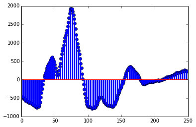
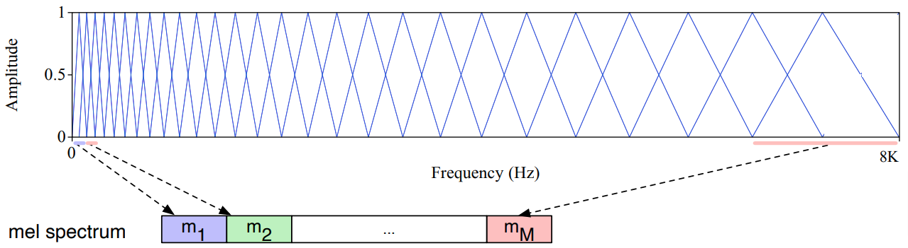
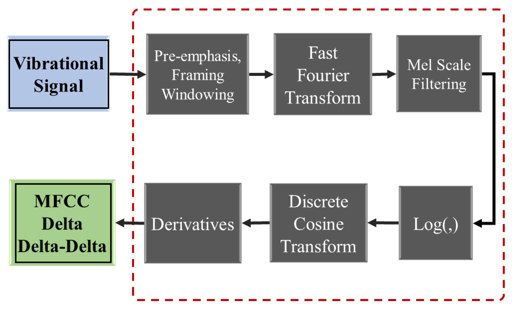
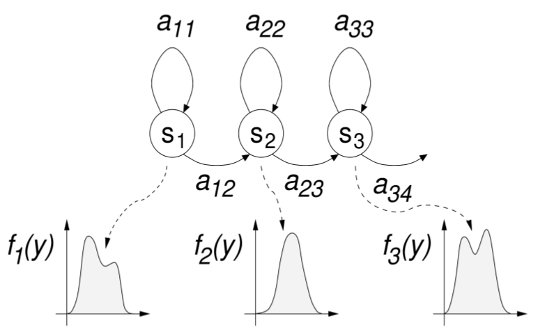
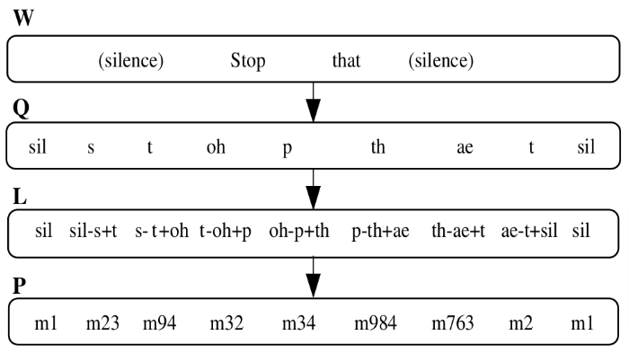
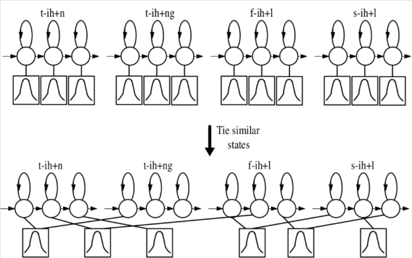
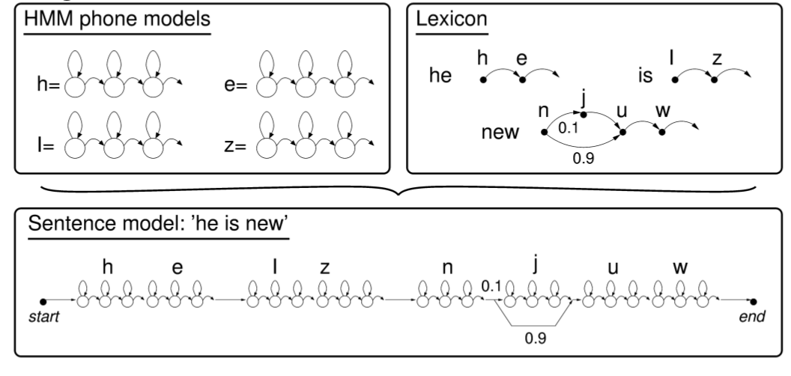

# The speech-to-text task
## The speech-to-text task

The **speech-to-text** (STT) task, also called **automatic speech recognition** (ASR):

* The input is acoustic signal containing speech (e.g., a `wav` file).
* Output is a written transcript of the spoken content, frequently without
  punctuation and capitalization.
* The produced transcripts are not necessarily segmented into sentences or
  contain proper punctuation and capitalization.
* The task is _supervised_: models are trained on transcribed speech corpora.
   
## Challenges

Challenges stem from the differences between speech and writing, and context
dependence:

* **Segmentation**: word boundaries in writing are frequently not indicated by
  the acoustic segmentation of speech by silences, and, vice versa, speech
  silences are not necessarily indicative of word boundaries.
* **Ambiguity**: differently written texts can be pronounced the same way, e.g.,
  in English *bare* and *bear* has the same pronunciation.
* The phenomenon of **coarticulation**: speech sounds following each other can
  interact and influence each other's pronunciation, e.g., the *v* in *I have
  to* is pronounced as *f* (in fast speech) because of the following voiceless
  *t*.

## Challenges cont. 

* The so-called **Lombard effect**: One cannot augment data sets simply by adding
  noise because people change the way they speak in noisy environments (and it
  is not just speaking louder...).
* Speech, in contrast to typical written language, can contain agrammatical
  constructs, incomplete sentences or words, corrections, word/syllable
  repetitions and interruptions.
* **Speaker adaptation**: there are huge differences between how people of
  different gender, age, cultural background etc. pronounce words.
* Human speech understanding heavily relies on contextual background information on
  admissible interpretations -- we actively "perceive"/"hear" speech using
  contextual clues. A dramatic example from @hiphi2019 can be heard
  [here.](http://drive.google.com/uc?export=view&id=1ICNa4Hj-lU_4POjdSCk_-Zyly93SUTNK)

## Task variants

* __Continuous__ vs __isolated__ recognition: 
  * In the __isolated__ case the input either consists of or can easily be
    segmented into single words (because there are separating bits of silence).
  * In the __continuous__ case words can follow each other without any silence
    between them, as in normal speech. Continuous speech recognition is
    significantly harder.
* __Joint__ recognition (possibly with __diarization__): Basic speech
  recognition is for one speaker: a more complex variant is where there are more
  speakers (e.g., in a dialogue), and, optionally, the transcript has to
  indicate who says what (diarization). Overlapping speech can be an especially
  difficult problem in this setting.
  
## Evaluation

The most common metric is __word error rate__ (WER), which is based on the
word-level edit distance compared to the correct transcript. If $\hat{W}$ is the
output and $W$ is the correct transcript then the WER is simply defined as

$$
\frac{\mathrm{Levenshtein}(\hat W, W)}{\mathrm{length}(W)},
$$

i.e., the average number of word-level editing operations per word necessary to
get the output from the correct transcript.

# Training data
## Training data

In general, training data consists of __recorded speech audio__ with
__time-aligned written transcipts__.

In the past, transcripts were __phonetic__, and aligned at the phone level, so
annotators had to determine phone boundaries by listening and looking at
wave forms:

\

## Training data cont.

Improvements in training methods made phone level alignmemt obsolete: modern ASR
data sets contain __normally written__ transcripts which have to be time aligned
only at a __sentence level__.

Despite these improvements, it is still a huge amount of work to create good ASR
data sets, since usable corpus size starts at 20 hours of speech from several
speakers, both male and female. Because of the associated costs, the number of
freely available corpora is low even for the most widely spoken languages, and
for many languages no free data set exists at all.

## LCD data sets

For English, until recently, most public data sets were published by the LDC,
the Linguistic Data Consortium. These include the

* Wall Street Journal audio corpus (read newspaper articles, 80h, 1993)
* Fisher corpus (telephone speech, 1600h, 2004/2005)
* Switchboard corpus (telephone speech. 300h, 1993/1997/2000)
* TIMIT corpus (read example sentences, limited grammatical/vocab. variability, 1986) 
  
More recently, data sets in other languages got added to the LDC catalog, now it
contains, among others, Spanish, Mandarin and Arabic.

## Open initiatives

Unfortunately, LCD data sets are typically not free, either LCD membership or
payment is required for accessing most of them.

Recent initiatives to create and curate freely available data sets:

* The [Open Speech and Language Resources
  page](https://www.openslr.org/resources.php) lists several free data sets for
  various languages, among them the important __LibriSpeech__ corpus, which
  contains ~1000h speech from audio books.

*  __Common voice__: A Mozilla project to collect ASR data sets for as many
   languages as possible. Already collected and validated 2484hs of transcribed
   English speech and other languages are progressing as well, German is at
   1290hs, French at 958hs at the time of writing.

# Speech signal processing

## Continuous speech signal in time

When speech  is recorded the air pressure changes move the
microphone's diaphragm, and these movements are converted to changes in
electronic current -- as a consequence, the speech gets represented as a
continuous signal:

{width=60%}

## Sampling

This is a continuous, analog signal, which can be digitalized by sampling with a
certain rate (at least 8kHz to to represent the 100 Hz–4 kHz range where
phonemes can be typically found):

{width=60%}

## Windowing

The digital signal is, in turn, converted into a sequence of short signals by
taking overlapping windows (20-40 ms is a typical length, and 10 ms is a typical
step size):

.](figures/asr_windowing.png){width=60%}

## Windowing cont.

The windows often contain **weighted** values that gradually fade out approaching the
window ends. A popular weighting scheme is based on the cosine function: for a
window with original signal values $s_0,\dots,s_{N-1}$ the weights are

$$w(n) = a - (1 - a)\cos\left(\frac{2\pi n}{N}\right).$$

The choice of $a = 0.54$ leads to the frequently used __Hamming__ window.

## Windowing cont.

![Hamming windowing [from @jurafsky2019speech].](figures/hamming.png){width=80%}

## Fourier transform

The windowed signals are, in turn, transformed into individual __spectra__
using __discrete Fourier transform__ (DFT):

{width=80%}

## Further processing

Although many recent approaches work directly with the spectrum, traditionally,
further transformations were done, e.g.,

* using a [filter bank](https://en.wikipedia.org/wiki/Filter_bank),
* taking the logarithm of the (smoothed) spectrum,
* performing a further Fourier transform.

The goal was to provide a compressed representation in terms of features that are
close to how humans perceive and process speech. The historically most important
representation has been MFCC (Mel-Frequency Cepstral Coefficients), wich
combines several of the listed steps.

## The mel scale

The spectral information returned by FFT does not correspond to important
characteristics of how humans perceive sounds:

* our hearing is more sensitive and discriminative as frequencies get lower,
* the auditory frequency scale, which reflects the perceptual distances between
  sounds, is actually logarithmic.
  
The perceived pitch corresponding to an $f$ frequency can be expressed by
calculating its location on the logarithmic __mel scale__ (where __mel__ [from
melody] is a unit of auditory pitch distance): $$ mel(f) = 1127 \ln
\left(1+\frac{f}{700} \right ). $$
  
## Mel filter bank 

A __mel filter bank__ is a set of overlapping (typically triangle or cosine
shaped) filters that are spaced evenly according to the mel scale. It can be
used to convert a spectrum to a __mel spectrum__ containing perceptually
informative frequency bands.

{width=90%}

## MFCC (Mel-Frequency Cepstral Coefficients)

MFCC has been the most widely used spectral representation in the domain of
speech recognition. The "cepstrum" is the result of the DST step.

{width=70%}

## MFCC cont.

A typical MFCC frame feature vector contains the following 39 values:

* 12 basic MFCC features (12 energy values in the "cepstrum"),
* the total energy in the cepstrum,
* 12 delta MFCC features (MFCC derivatives),
* 12 double delta MFCC features (MFCC double derivatives),
* 1 total delta energy feature,
* 1 total double delta enegry feature.

# Modeling speech

## Modeling speech 

We try to find the most probable $\mathbf w=\langle w_1,\dots,w_n\rangle$ word sequence
given our (preprocessed) speech signal $\mathbf s$, i.e.,

$$ \underset{\mathbf w}{\operatorname{argmax}} P(\mathbf w \vert \mathbf s). $$

Using Bayes' Rule, this can be reformulated as

$$
\underset{\mathbf w}{\operatorname{argmax}}(P(\mathbf s \vert \mathbf w) \cdot P(\mathbf w)).
$$

Here $P(\mathbf w)$ can be modeled by a __language model__, while the the
conditional $P(\mathbf s \vert \mathbf w)$ probability of the sound signal
given a sequence of words by an __acoustic model__.

## The acoustic model

In classical STT, the acoustic model typically contains HMM models for the
phones of the target language. A frequent choice is to model phones with 3-state
HMMs with self-loops (the 3 states are for phone onset, middle and ending) and
Gaussian Mixtures as emission distributions:

\centering
{width=60%}\

## Context dependent phone models

Phones in natural languages are context dependent: their physical realization
depends on the preceding and succeeding phone. Because of this, more
sophisticated speech recognizers work with context dependent or "triphon"
models:

{width=65%}

## Context dependent phone models cont.

Because of the large number of phone combinations, some HMM states are shared or
__"tied"__ together: they are assumed to have the same emission distributions to
reduce the number of model parameters.

{width=60%}

## Context dependent phone models cont.

MLE-optimized phonetic decision trees are used to cluster hidden states into
groups whose members can be tied together.

![Decision tree for a class of states
[@zhao1999decision].](figures/state_tying_tree.png){width=70%}

## Acoustic model training 

HMM based acoustic models with GMM emission distributions are trained with
expectation maximization (EM) using

- transcribed speech samples, in which the transcripts are precisely
  time-aligned, and
- a __phonetic lexicon__ describing the pronunciation of all words occurring
  in the transcripts.

In the early days, transcripts were phonetic and time-aligned phone-by-phone,
but modern systems work with word or sentence aligned transcripts, whose
phonetic transcription is automatically generated using the phonetic lexicon.

## Acoustic model training cont.

Since HMMs can be composed (in this case concatenated), using the phonetic
lexicon the phone models can be used to build word models, and word models in
turn can provide word sequence models for higher-level training: 

{width=80%}

## Acoustic model training cont.

Modern HMM-based systems like [Kaldi ASR](https://kaldi-asr.org/) do not train
directly their most complex model on the training dataset but train a sequence
of models:

+ First a __monophone acoustic model__ is trained, and this model is aligned with
  the audio.
+ The trained monophone model is used to start training a __triphone__ model.
+ The steps of further training and alignment are repeated with additional
  training algorithms for higher quality models (e.g., using delta features
  etc.).

## Adding a language model

Since traditional N-gram language models are also based on the
Markov-assumption, HMM-based acoustic models can easily be combined with them to
form a __joint acoustic + language HMM $\mathcal A + \mathcal L$__, which can be
used to find the most probable word sequence given an acoustic input.

$$ \underset{\mathbf w}{\operatorname{argmax}}~P_{\mathcal A + \mathcal
L}(\mathbf w \vert \mathbf s). $$

In theory, the full Viterbi algorithm could be used, but its quadratic time
complexity in terms of the number of states makes this unfeasable as the combined
HMMs for continuous, large vocabulary speech recognition are really large.

# References

## References {.allowframebreaks}

\footnotesize

