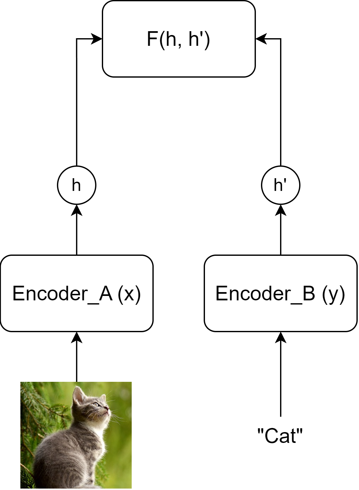
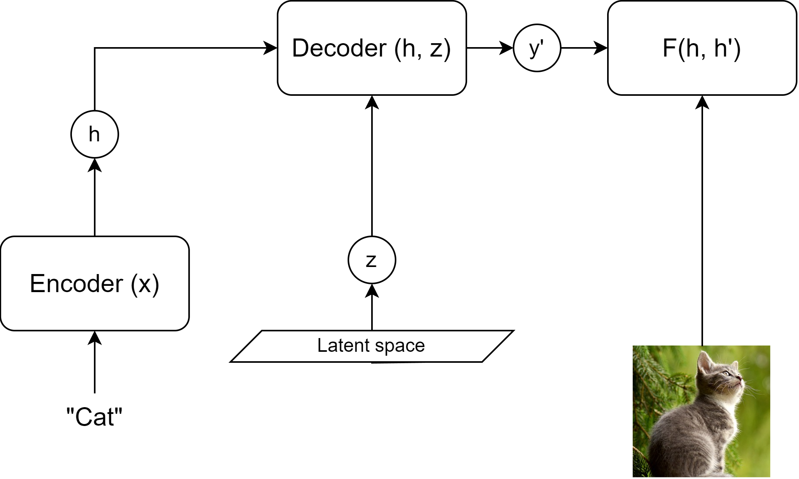
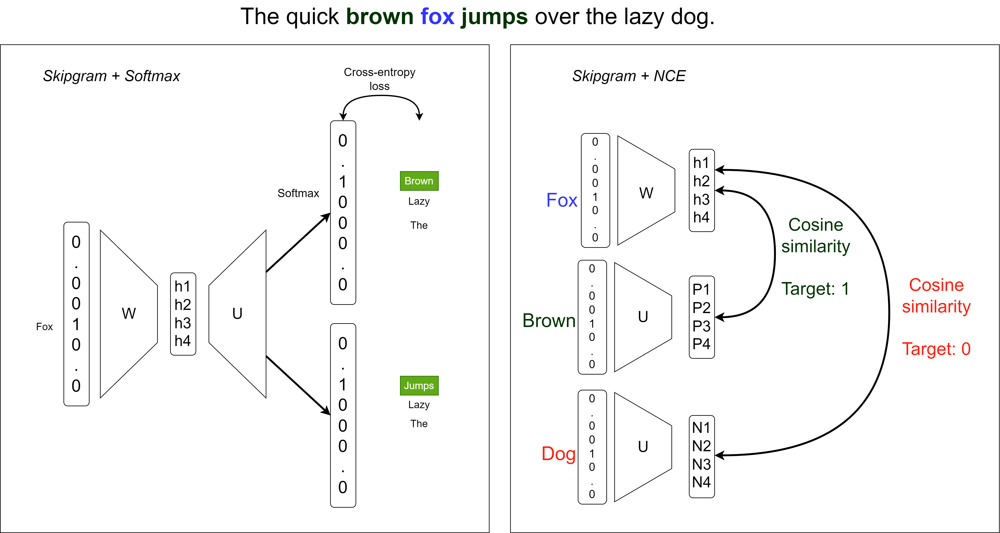
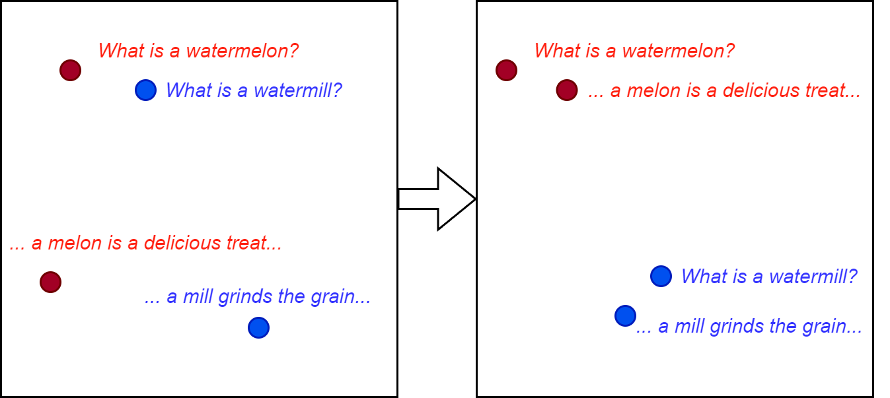

## Acknowledgement

### Acknowledgement {.alert}

The following slides are based on the following review articles [@le2020contrastive; @jaiswal2020survey] as well as Yann LeCun's hybrid lecture on Energy-based SSL available [online](https://www.youtube.com/watch?v=4lthJd3DNTM).

# Self-supervised learning

## Main objective
Self-supervised learning (SSL) aims to obtain supervision from the data itself.

"Predict everything from everything else."   
*Yann Lecun*

The data is partially known, and partially unknown.
An underlying structure of the data is utilized (e.g. sequentiality in language modeling).

## Main objective

![From [@dawid2023introduction]](figures/ssl_meme.png){height=65% alt="A three-layer cake is used as a metaphor for the relationships among learning paradigms. A pale pink arrow labeled ‘supervised learning (SL)’ points from the upper left to the cake’s frosted top, while a dark red arrow labeled ‘reinforcement learning (RL)’ curves down from the upper right toward two cherries on top. A brown arrow labeled ‘self-supervised learning (SSL)’ rises from below and points into the cake’s broad interior. The cake’s cut-away slice exposes several distinct horizontal layers, emphasizing that SSL is a foundational component rather than merely surface decoration; supervised learning sits on that learned representation, and reinforcement learning is shown as the topmost, task-directed layer."}

Why not reinforcement learning?   
*Trial-and-error is ineffective.*

## Advantages

Self-supervised learning:

- Reduces the cost and complexity of labeling
- Adds extra generalization capabilities to the system
- Gives control to use the internal structure of the data
- Is able to reconstruct latent variables governing an input set

## Energy-based Modeling
Energy-based modeling (EBM) is a unifying principle of most SSL methods.

EBM solves the "averaging problem" of $L_2$-like losses.

- Imagine a case with multiple viable outputs (such as neighboring words in a Skipgram model)
- The loss will be minimal to the "average" of these individual outputs
- We want a loss function that will be close to minimal for each and every viable solution

## Energy function

An energy function $F(x, y)$ over the $x \in X$ input space and $y \in Y$ output space is designed to solve this problem, where low energy means a viable solution.

The inference of such a model could happen by: $\hat{y} = argmin_y F(x, y)$   
*It is important to note that multiple $\hat{y}$-s could be viable!*

The energy function $F(x, y)$ measures compatibility between $x$ and $y$.

## EBM as a probabilistic model

Using the Gibbs-Boltzmann distribution a generative (joint "distribution") EBM can be converted into a discriminative probabilistic model:

$P(y|x) = \frac{e^{-\beta F(x, y)}}{\int_{\acute{y}} e^{-\beta F(x, \acute{y})}}$

Here $\beta$ is a positive constant, and $\acute{y} \in Y$.

## Multimodal EBM architectures I.

EBMs are useful for creating joint multimodal representations.

{ height=55% alt="Diagram of a joint-embedding contrastive model: a photo of a gray kitten at lower left and the text ‘Cat’ at lower right each feed upward through separate rounded rectangles, Encoder_A(x) and Encoder_B(y). The image encoder produces a circular representation labeled h; the text encoder produces a matching circular representation labeled h′. Vertical arrows show the two inputs becoming these embeddings, and two bent upward paths carry h and h′ into a single large rounded box labeled F(h, h′). This final function compares or scores the two modality-specific representations, illustrating how an image and its corresponding caption are mapped into a shared space so their semantic similarity can be learned." }

## Multimodal EBM architectures II.

Latent variables could be used for generative processes (e.g. diffusion).
$z$ is an independent "explanatory" variable of variation.
Inference is possible with joint minimization with respect to $y$ and $z$.

{ width=60% alt="Flow diagram of latent-variable image generation: the word ‘Cat’ enters an Encoder (x), which produces representation h. h travels right into a Decoder (h, z), alongside latent variable z sampled from the slanted ‘Latent space’ region below. The decoder outputs y′, then an arrow leads to an objective F(h, h′), while an upward arrow from a photograph of a gray cat supplies h′. This shows how an encoded text representation plus a latent-space sample can generate an image representation that is compared with the representation of a real cat image." }

## Methods of learning in EBMs
Main objective: Acquire low energy for viable $x$-$y$ pairs, while maintaining high energy for incompatible pairs.

### Contrastive Methods
- Push down $F(x, y)$ for each compatible pair (i.e. for *positive* elements of the dataset).
- Push up $F(x, y')$ for every other possible combination (i.e. for *negative* examples).

## Methods of learning in EBMs
Main objective: Acquire low energy for viable $x$-$y$ pairs, while maintaining high energy for incompatible pairs.

### Regularized Methods
- Ensure that the extent of low-energy regions is limited or minimized.
- Regularization, quantization, clustering, etc.

## Methods of learning in EBMs
Main objective: Acquire low energy for viable $x$-$y$ pairs, while maintaining high energy for incompatible pairs.

![Visualization of learning methods from [@dawid2023introduction]](figures/ebm_method_compare.png){ width=100% alt="Three side-by-side x–y plots compare how an energy-based model shapes low-energy areas around blue training points. In panel (a), a single winding orange region marks low energy; it follows many blue points but leaves a compact blue cluster near the lower right outside the orange shape, illustrating an imperfect landscape fit. Panel (b) adds scattered green dots outside the orange bands, with green arrows identifying them as contrastive samples; these negatives distinguish the learned low-energy paths from surrounding space. Panel (c) removes the green dots and instead shows large green arrows directed inward around three separated orange bands, illustrating a regularizing force that contracts and smooths the low-energy regions around the blue data points, reducing unsupported low-energy space." }

# Contrastive Learning & Variants

## Learning method
Contrastive learning generally includes the following main steps:

1. Select a $q$ query and sample the positive key $k^+\sim p^+(.|q)$ and negative key $k^-\sim p^-(.|q)$ distributions.
2. Apply model transformations that map $\mathcal{X} \rightarrow \mathcal{R}^N$ where $N$ is the resulting embedding dimension and $x \in \mathcal{X} | x = (q, k)$
3. Scoring the positive and negative pairs using an energy-based or probabilistic approach.
4. Parameter update

## Scoring functions

Scoring functions are the backbone of loss calculation and are determined by the desired embedding space's properties. They are simple functions such as:

- L1 or L2 distance
- Dot-product
- Bi-linear models $S(q, k) = qAk$

Distance and probabilistic loss functions are built on top of these measures.

## Distance-based loss functions

### Pair-loss
$\mathcal{L}_{pair} = \begin{cases} ||q-k^+||_2^2\\ max(0, m-||q-k^-||_2^2) \end{cases}$

where $m$ is a predefined margin around x.
This minimizes positive distance and tries to push the negative distance over the margin.

### Triplet-loss
$\mathcal{L}_{triplet} = max(0, ||q-k^+||_2^2 - ||q-k^-||_2^2 + m)$
This method enforces that the relative distance between the positive and negative examples.

## Softmax-based probabilistic loss functions
Motivation: Classify the pairs correctly.
As a classification problem using scoring function $S(.,.)$ we can formulate this as:

$p(k^+|q) = \frac{exp(S(q, k^+))}{\sum_k exp(S(q, k))}$

Introducing negative sampling to the process we can avoid calculating the denominator for all $k$. Instead, we reformulate the calculation as a binary problem.

## Noise Contrastive Estimation (NCE)
The probability of a pair being positive (C=1), if we sample negative examples $M$ times more frequently from a uniform distribution, is:
$p(C=1|q,k) = \frac{p(k^+|q)}{p(k^+|q)+m\cdot p(k^-|q)}$

Thus the binary classification loss is (using negative loglikelihoods) over all possible pairs:
\begin{align*}\begin{split} \mathcal{L}_{bin\_NCE} = - \mathbb{E}_{p^+}[logp(C=1|q,k)] \\ - \mathbb{E}_{p^-}[log(1-p(C=1|q,k))] \end{split}\end{align*}
where $p^-(.|q)$ is the noise (negative sample) distribution and $p^+(.,.)$ is the positive distribution.

 
## InfoNCE 
Instead of a binary classification, we could construct a set of several negative examples and a single positive example $K = \{k^+, k^-_1, k^-_2, ..., k^-_{M}\}$. Then the modified task would be to determine which element is the positive. This results in a softmax-like measure called InfoNCE:

$\mathcal{L}_{InfoNCE} = -log\frac{exp(S(q, k^+))}{\sum_{i=0}^{M+1}exp(S(q, k[i]))}$

$\mathcal{L}_{InfoNCE} = - S(q, k^+) + log\sum_{i=0}^{M+1}e^{S(q, k[i])}$

## Why does it work?
Training a model $f$ with an InfoNCE-like loss function inverts (decodes) the unknown generative process of data generation $g$.
Thus the latent distribution behind our data is reconstructed and made accessible.

![From [@zimmermann2022contrastive]](figures/latent_reconstruct.png){height=50% alt="A left-to-right schematic shows how contrastive learning reconstructs an otherwise unobservable latent space. On the left, a grey oval labeled ‘Unobservable Latent Space Z’ contains many red points spread uniformly as negative samples, a black anchor point near the right edge, and a nearby green point inside a blue density cloud representing a likely positive sample. Curved black paths pass through the anchor and several red points; dashed green, black, and orange arrows carry the positive, anchor, and negatives through a tall ‘Unknown Generative Process g’ block. The resulting observations are a green-bordered bear image, a central bear image, and a stacked set of orange-bordered negative images including a ship. These observed examples pass through an encoder f into a second grey oval labeled ‘Reconstructed Latent Space Z′ = AZ.’ Here the central black embedding is connected by black curves to red negative points, while a green positive point lies close above it. Green branches draw the positive toward the anchor and orange arrows push surrounding red negatives away. The displayed objective highlights the positive similarity term in green, ‘attract,’ and negative terms in orange, ‘repel,’ illustrating how an InfoNCE-style loss learns an accessible representation that reverses the hidden data-generating process."}

## Examples of sampling
Data generation processes could include a wide range of self-supervised processes, such as:

- Neighborhood information (spatial or temporal)
- Masking
- Various augmentations (visual or audio noise, etc)

## Examples of sampling
![Visual augmentations from [@le2020contrastive]](figures/sample_example.png){height=60% alt="Six-panel comparison of one woodpecker photograph and common training augmentations: the original bird upright beside a diagonal weathered log; a tight random crop; an elastic warp that produces a mirrored, distorted strip at the left; a 90-degree rotation; warm pink-and-yellow color jitter; and a softened blurred version. The consistent bird subject despite changed framing, geometry, orientation, color, and sharpness illustrates augmentations used to create different views of the same example for contrastive learning."}

## Examples of sampling
![Data generation from temporal streams from [@le2020contrastive]](figures/sample_example_temporal.png){height=60% alt="A horizontal sequence of frames shows a black cat gradually changing from lying belly-up to curling into a ball. The central third frame is outlined blue and labeled ‘Query.’ Its immediate temporal neighbors, the second and fourth frames, are outlined green and labeled ‘Positive key’; a green double-ended arrow above them marks the nearby ‘Positive range,’ indicating that close moments from the same video are treated as semantically related. Farther-right frames, where the cat has changed pose substantially, are grouped in orange outlines beneath ‘Negative keys.’ An orange arrow beginning at a small square marker and pointing right labels this distant portion the ‘Negative range,’ illustrating temporal contrastive sampling: nearby frames provide positive matches for the query, while sufficiently separated frames supply negatives."}

## Adding label supervision

Data generation is possible via incorporating label information as well (adding classical supervision). In this case the normal InfoNCE equation will change, as multiple positive examples are present. Resulting in a sum over InfoNCE terms. There are two variants present with the sum inside and outside of the log.

$\mathcal{L}^{sup}_{in} = \sum\limits_{q \in J}-log\left(\frac{1}{|P(q)|}\sum\limits_{k^p\in P(q)}\frac{exp(S(q, k^p))}{\sum\limits_{i\in I}exp(S(q, k[i]))}\right)$

where $J$ is the set of batch elements, $q$ is the selected query element, $I$ is the set of batch elements excluding $q$, $P(q)$ is the set of elements with the same label as $q$.

## Adding label supervision

$\mathcal{L}^{sup}_{out} = \sum\limits_{q \in J}\frac{-1}{|P(q)|}log\sum\limits_{k^p\in P(q)}\frac{exp(S(q, k^p))}{\sum\limits_{i\in I}exp(S(q, k[i]))}$

where $J$ is the set of batch elements, $q$ is the selected query element, $I$ is the set of batch elements excluding $q$, $P(q)$ is the set of elements with the same label as $q$.

![From [@khosla2020supervised]](figures/supcl.png){height=40% alt="Side-by-side comparison of instance-based self-supervised contrastive learning and label-aware supervised contrastive learning. In each half, a fluffy dog anchor image at upper left connects by a gray line to a gray point on the edge of a large pale-gray, dotted-circle embedding space. A cropped view of that same dog connects by an orange line to a nearby orange point, marking an augmented view as a positive. Red lines from red edge points lead to elephant and kitten images on the right, indicating negatives. On the self-supervised side, a second photograph of a black-and-white dog at the bottom is also connected in red and framed red: despite depicting a dog, it is treated as a negative because it is a different image instance. On the supervised side, that same dog photograph is instead framed green and placed beneath the ‘Positives’ label; its orange connection shows that examples sharing the dog class are additionally pulled toward the anchor, while the elephant and cats remain red negatives. The vertical black divider and bottom labels emphasize the distinction: self-supervision forms positives from alternate views of one instance, whereas supervision can use class labels to group multiple distinct instances as positives."}

## Invariant, Equivariant traits

In standard contrastive learning, the positive pairs have a required invariancy. $S(q, k)$ should be high.
Standard similarity metrics yield this behavior best when $q=k$.
This behavior will negate the effect of certain differences between the two original inputs $x_q$ and $x_k$

Let $T(\cdot)$ transform represent this difference and $f(\cdot)$ represent our function (or network) trained with CL.
In the invariant optimal case:

$x_k = T(x_q) \rightarrow k = q$

## Invariant, Equivariant traits

There are some cases where we would like to keep this transformation in the embedding space as well. Meaning that we would require that the same, or a similar transformation ($\acute{T}(\cdot)$) be present in the embedding space as in the input space.

$x_k = T(x_q) \rightarrow k = \acute{T}(q)$

## Invariant, Equivariant traits

![Rotation equivariant and flip invariant contrastive training. From [@dangovski2021equivariant]](figures/equiv_inv.png){width=90% alt="A single bird photograph at the bottom branches into six derived views. Two larger upright crops on the left, labeled ‘view 1’ and ‘view 2,’ each flow upward through a blue ‘backbone f’ block and an orange ‘projector p1’ block; curved arrows join the two projector outputs beneath the heading ‘invariance,’ indicating that ordinary augmented views should receive the same representation. Four smaller bird crops on the right show the same bird at different rotations, each flowing through its own blue backbone and green ‘predictor p2’ block. Their outputs are linked by curved arrows beneath ‘equivariance,’ indicating that the representation of a transformed input should change in a corresponding, predictable way rather than stay identical. The diagram contrasts learning transformation-insensitive features for the two main views with learning to predict or preserve the structured effect of rotations across the prediction views."}

# Contrastive methods in NLP
## Word2Vec as Contrastive Learning

{height=70% alt="Side-by-side diagram comparing two ways to train skip-gram word embeddings for the sentence ‘The quick brown fox jumps over the lazy dog,’ with brown highlighted green, fox blue, and dog red. On the left, labeled ‘Skipgram + Softmax,’ a one-hot vector for the center word Fox passes through input matrix W to a four-value hidden embedding h1–h4, then through output matrix U and softmax to two full-vocabulary prediction columns. In each output, the correct context word—Brown in one, Jumps in the other—is highlighted green among alternative vocabulary words, and arrows from a cross-entropy loss indicate that the model scores every word in the vocabulary. On the right, labeled ‘Skipgram + NCE,’ separate one-hot inputs for Fox, Brown, and Dog pass through matrices to embeddings h1–h4, P1–P4, and N1–N4. Curved arrows compare Fox with Brown in green, marked cosine similarity and target 1, while a larger black curve compares Fox with Dog in red, marked cosine similarity and target 0. The geometry emphasizes contrastive negative sampling: instead of normalizing over all possible output words, the model pulls the center word toward a true neighboring word and pushes it away from a sampled unrelated word."}

## Word2Vec as Contrastive Learning

Reformulating skipgram, to a multi-encoder joint embedding-type self-supervised problem.

Instead of Softmax we use the Noise Contrastive Estimation loss (SGNS).

Positive pairs maximize similarity (minimize energy according to EBM modeling).

Negative pairs minimize similarity (maximize energy according to EBM modeling).

## BERT Next Sentence Prediction

](figures/bert_nsp.png){height=80% alt="BERT’s next-sentence prediction head: two tokenized sentences are concatenated along the bottom, beginning with [CLS], followed by Sentence A, ‘the man [MASK] to the store [SEP],’ then Sentence B, ‘penguin [MASK] are flightless birds [SEP].’ Upward arrows feed each token position into a large yellow rounded BERT encoder block, whose 512 contextual output vectors emerge along its top edge. Only the first output, corresponding to [CLS], travels upward into a blue ‘FFNN + Softmax’ classifier. A stacked two-part probability bar above it assigns 1% to ‘IsNext’ and 99% to pink-highlighted ‘NotNext,’ showing how the special [CLS] representation summarizes both sentences to decide whether B truly follows A; the [MASK] tokens also indicate BERT’s concurrent masked-language-model pretraining context."}

## Text-embedding models

Pre-trained and fine-tuned LMs could be used to produce semantic embeddings of text.

- This is good in terms of general language semantics only

{height=50% alt="Two square embedding-space panels compare representations before and after fine-tuning. In the left panel, two red sentence embeddings about ‘watermelon’ and ‘melon’ occupy separate upper-left and lower-left areas, while two blue embeddings about the misspelling ‘watermill’ and ‘mill’ lie far away toward the upper center and lower right; semantic continuation pairs are therefore dispersed. A large arrow points to the right panel, where the two red food-related sentences have moved close together near the upper left and the two blue mill-related sentences cluster near the lower right. The geometry shows fine-tuning reshaping a pretrained embedding space so sentences with the intended related meanings form compact color-coded groups and misleading lexical similarity does not determine proximity."}

## Text-embedding models

Contrastive fine-tuning on additional SSL tasks comes in handy in the case of domain-dependent embeddings or multi-task embedders.
Such tasks could include [@su2022one]:

- Retrieval, reranking (find/rank documents based on query)
- Clustering (creating clusters in the embedding space)
- Text classification
- Summarization
- Deduplication

# Contrastive Multimodal Methods
## CLIP

Contrastive Language-Image Pre-training [@radford2021learning]

**Problem**: Visual classifiers are bound to a finite set of supervised labels.

**Solution**: Use natural language to describe visual features and try to achieve zero/few-shot learning.

**Data**: (image, text) pairs from web crawls (even filenames), including Instagram, Wikipedia-based Image Text, YFCC100M and MS-COCO.
Open-source large-scale datasets include Laion5B [@schuhmann2022laion5b].

## CLIP Structure

Image embedding ($E_I$) ResNet or **ViT** $[n \times d_I]$

Text embedding ($E_T$) Transformer LM $[n \times d_T]$

Linear projections ($W_I$, $W_T$) $[d_I \times d_E]$, $[d_T \times d_E]$

$t$ temperature parameter for classification (similar to softmax temperature)

$L$ labels of similarity usually a unit matrix $[n \times n]$

$CE_{col | row}$ cross-entropy loss by columns (text) or rows (image) of the first argument.

$S_{scaled} = \frac{E_I \cdot W_I}{||E_I \cdot W_I||_{L2}} \cdot \left(\frac{E_T \cdot W_T}{||E_T \cdot W_T||_{L2}}\right)^T \cdot exp(t)$ $[n \times n]$

$loss = 0.5 CE_{col}(S_{scaled}, L) + 0.5 CE_{row}(S_{scaled}, L)$

## CLIP Encoder details

- Modified global pooling: attentional pooling [@lee2019set]   
Cross-attention where the image features are K, V and Q is defined by a learned constant vector (or a set of vectors).
- ViT (Vision Transformer): Transformer that uses small patches (rectangular parts) of the image as tokens. (Covered in upcoming lectures.)
- The text encoder is a GPT-2 style model.

## CLIP Training

![CLIP training by [@radford2021learning]](figures/clip_train.png){height=70% alt="CLIP contrastive pre-training diagram. A batch of text captions at upper left, one reading ‘Pepper the aussie pup,’ passes through a purple Text Encoder and becomes a horizontal row of text embeddings T₁ through Tₙ. Below, a matching batch of photographs, with a puppy image in front, passes through a green Image Encoder and becomes a vertical column of image embeddings I₁ through Iₙ. Arrows from the encoders feed these embeddings into a square similarity matrix: each cell is the dot product Iᵢ·Tⱼ between one image and one text. Blue-highlighted cells run along the matrix diagonal, pairing I₁ with T₁, I₂ with T₂, and so on through Iₙ with Tₙ; all off-diagonal cells represent mismatched image–text pairs. The layout shows how CLIP jointly encodes an entire batch, then uses the similarity matrix to increase scores for aligned caption–image pairs and distinguish them from every other pairing in the batch."}

## CLIP Zero-shot inference

![CLIP inference by [@radford2021learning]](figures/clip_infer.png){height=70% alt="Two-stage CLIP zero-shot classification pipeline. Across the top, a vertical list of class labels—plane, car, dog, ellipsis, and bird—feeds into the shared prompt template ‘A photo of a {object}.’ A purple Text Encoder converts every completed prompt into a horizontal bank of purple text embeddings, T₁ through Tₙ. In the lower half, a test photograph of a black dog in a wooded outdoor setting passes through a green Image Encoder, producing the green image embedding I₁. To its right, a row of similarity cells compares I₁ with each text embedding using dot products I₁·T₁, I₁·T₂, I₁·T₃, through I₁·Tₙ. The I₁·T₃ cell is highlighted blue, and a downward arrow selects the corresponding prompt, ‘A photo of a dog.’ The branching arrows and aligned rows show that CLIP turns label names into classifier prototypes in its shared embedding space, then predicts an unseen image’s class by choosing the label prompt with the highest image–text similarity."}

## CLIP Zero-shot inference

CLIP can classify images based on a corresponding text definition of classes.

Selection is done by finding the most similar class definition.

Other use-cases include:

- Base-model for custom classifiers
- Base-model for transfer-learning (outperforms previous ImageNet models)
- Image retrieval (search-engine)
- Condition vectors for image generation
- Multi-modal semantics

## SigLIP

Sigmoid Loss for Language Image Pre-Training [@zhai2023sigmoidlosslanguageimage]

**Question:** Does learning a shared image-text embedding space require a softmax over the other examples in a batch?

**Idea:** Train a binary matching classifier (falling back to NCE-style loss) on every image-text pair using a sigmoid loss.

- Retain separate image and text encoders.
- Replace the batch-normalized contrastive objective with binary contrastive formulation
- Improve efficiency and performance, especially at smaller batch sizes.

Data remains the same type of CLIP.

## SigLIP Structure

SigLIP objective: $${{L}_{\mathrm{SigLIP}}=-\frac{1}{n}\sum_{i=1}^{n}\sum_{j=1}^{n}log\sigma(y_{ij}x_{ij})}$$
$x_{ij}$ is the image-text similarity logit scaled by a learned exponential factor and shifted by a bias $x_{ij}=e^{\tau}\cdot txt_{i}^{\top} img_{j} + b$, and $y_{ij}=+1$ for the original paired examples and $y_{ij}=-1$ otherwise.

As it is using $\ell_{ij} = -log\sigma(y_{ij}x_{ij})$, where $\sigma(v)=\frac{1}{1+e^{-v}}$, confidently incorrect predictions produce stronger gradients, while confidently correct predictions produce weak gradients.

The architecture uses a dual-encoder setup and L2 embedding normalization just as with CLIP.

## Zero-shot classification with SigLIP

For zero-shot classification, encode each candidate class as a text prompt,
such as “a photo of a cat”. Given the normalized image embedding
$\mathbf{v}$ and normalized text embeddings $\mathbf{t}_c$, predict:

$$
\hat{c}=\arg\max_c \mathbf{v}^{\top}\mathbf{t}_c.
$$

The sigmoid scores need not sum to 1 across classes, and multiple classes can receive high scores.

## Memory efficiency and better results on small batchsize

Independent loss computation allows for flexible memory management: calculating the loss in small blocks instead of keeping the whole batch in memory, as well as enabling gradient accumulation across multiple GPUs. Thus higher batch sizes could also be used.

SigLIP outperforms a CLIP-style baseline in smaller batch size of ~1k training (~4.1% on zero-shot ImageNet accuracy). This advantage is attributed to the absence of competing gradients in the softmax scaling. As the batch size grows, the gap gets narrower.

## Decomposed batch loss calculation

![Steps to calculate the loss in smaller units from [@zhai2023sigmoidlosslanguageimage], each GPU holds a portion of the embeddings only. One of the modalities gets iterated (shifted) around the GPUs before aggregating gradients.](figures/siglip_factorized_batch.png){width=100% alt="Four left-to-right panels depict distributed computation of a 12-by-12 text–image pairing matrix across three color-coded devices: rose Device 1, purple Device 2, and blue Device 3. Rows are text embeddings T₁–T₁₂ and columns are image embeddings I₁–I₁₂, each grouped into four-item device-local blocks. The first panel shows only the global diagonal shaded, representing correct matching pairs. The next three panels successively outline three 4-by-4 local comparison blocks per device: plus signs mark each block’s diagonal positive pairs and minus signs mark its local negatives. In the second panel every device compares its own text and image block; in the third and fourth panels, pale check marks show comparisons already completed while the outlined blocks shift cyclically so each device’s text embeddings compare against image embeddings from another device. Below each stage, arrows feed device-specific loss boxes: each begins at 33%, then progresses to 66%, and finally shows completed check marks before arrows converge at ‘Cross Device Σ.’ The sequence illustrates SigLIP’s factorized-batch loss: devices retain only a portion of embeddings, rotate one modality between devices, accumulate partial pairwise losses, and sum them after all cross-device pairings have been evaluated."}

## ImageBind

CLIP demonstrated that additional generalization capabilities can originate from incorporating multiple modalities in one representation space.
ImageBind [@girdhar2023imagebind] takes it one step further and joins $7$ modalities in one embedding space.

![Modalities and data sources of ImageBind [@girdhar2023imagebind]](figures/imagebind_sources.png){height=50% alt="Wide, left-to-right chart showing data sources used to connect six modalities—images, videos, text, audio, depth, thermal, and IMU motion signals—into ImageBind’s shared representation. A top legend assigns each modality a colored icon and distinguishes solid links as naturally aligned data from dashed links as emergent alignment. Below, five labeled example groups pair modalities: a sheep photograph with its written caption for web image–text; an indoor kitchen RGB image beside its grayscale depth map for depth-sensor data; surfing footage paired with sound for web videos; a false-color orange-red street scene paired with a thermal icon for thermal data; and a first-person video of washing dishes paired with a purple IMU-motion icon for egocentric video. Solid and dashed bordered stacks around the examples indicate which modality correspondences are directly available in the source data and which can be learned indirectly through shared connections. The layout shows that multimodal alignment need not require every modality pair to be explicitly labeled together: links through images, videos, and other naturally synchronized sources can produce additional cross-modal alignments."}

## Emergent Alignment
::: columns

:::: column

Using InfoNCE again we can construct alignments of $(\mathcal{I}, \mathcal{M}_1)$ and $(\mathcal{I}, \mathcal{M}_2)$.
It is observed that this alignment is transitive and results in a partial $(\mathcal{M}_1, \mathcal{M}_2)$ alignment.
Encoders are now initialized from pre-trained models (e.g.: CLIP)

::::

:::: column

![Natural and emergent alignment in ImageBind [@girdhar2023imagebind]](figures/imagebind_pentagram.png){height=40% alt="ImageBind diagram arranged as a five-point star: a central blue image icon connects by thick gray spokes to text at left, a green 3D/depth cube above, a yellow thermal-sensor icon at right, blue audio waves at lower left, and purple motion arrows at lower right. Gray dashed lines complete the star’s outer and crossing edges, indicating additional possible links between modalities; a second purple stacked-image icon sits below the center for video. The prominent solid connections emphasize that images act as the shared bridge: image–text, image–depth, image–thermal, image–audio, and image–video/motion pairs can align their representations. The ImageBind label and bold arrow point into this network, supporting the idea that training on selected naturally paired modalities can create one shared embedding space and enable indirect alignment between modalities that were not directly paired."}

::::

:::

## ImageBind Results

Multimodal contrastive embeddings outperform supervised modality converters in the absence of naturally present multimodal signals (e.g.: text-to-audio).

ImageBind use-case examples include:

- Cross-modal retrieval
- Embedding-space arithmetics
- Cross-modal decoder re-utilization

## Cross-modal retrieval
![ImageBind retrievals of non-trivial modality pairs [@girdhar2023imagebind]](figures/imagebind_crossmod_1.png){width=90% margin=auto alt="Two-row, three-column alignment chart. The left Audio column shows blue speaker icons labeled ‘Crackle of a Fire’ and ‘Baby Cooing.’ Across the center, Images & Videos supplies corresponding RGB examples for each sound: night photographs and video frames of a large bonfire in the first row, and indoor views of a baby in the second. The right Depth column shows grayscale depth maps of the same kinds of scenes—fireplaces and rooms above, nursery furniture and crib scenes below—where brightness encodes estimated distance and object shape rather than natural color. By arranging each audio cue beside multiple visual and depth observations, the figure illustrates ImageBind’s cross-modal learning: semantically related samples from different sensors can be mapped into a shared representation even though their raw appearances are very different."}

## Cross-modal retrieval

![ImageBind retrievals of non-trivial modality pairs (with object detection in the visual modality) [@girdhar2023imagebind]](figures/imagebind_crossmod_2.png){width=90% align=center alt="Two side-by-side examples show ImageBind recognizing sound sources in images. Left, a dog standing on a surfboard in rippling water is overlaid with a green box labeled ‘dog barking 95%’ and a wider red box labeled ‘sea waves 95%’; speaker icons and the two sound labels below identify the matched audio concepts. Right, a desktop scene has a blue box around the keyboard labeled ‘keyboard typing 94%’ and a red box around an alarm clock labeled ‘clock alarm’; matching speaker-icon labels appear below. The colored bounding boxes localize distinct visual sources for each predicted sound, illustrating cross-modal image–audio alignment: one image can be associated with several audible events."}

## Cross-modal retrieval

![ImageBind retrievals of non-trivial modality pairs [@girdhar2023imagebind]](figures/imagebind_crossmod_3.png){width=90% alt="Text query ‘Cooking a meal’ heads a two-column example of cross-modal retrieval. On the left, two stacked time-series plots show three colored inertial-sensor channels across roughly 2,000 samples: the upper plot, labeled Acc., includes a flat blue line near 1.0, a red line that drops unevenly later in the sequence, and a purple line with large swings; the lower Gyro. plot has blue, red, and purple traces clustered near zero except for pronounced peaks and dips around the middle. On the right, a first-person video frame looks down on hands preparing food at a counter, with ingredients, utensils, a recipe sheet, and a phone visible. The side-by-side layout links the visual cooking activity to its corresponding accelerometer and gyroscope motion patterns, supporting ImageBind’s claim that a text concept can retrieve semantically matching sensor data and video through a shared representation."}

## Embedding-space Arithmetics

![ImageBind multi-modal embedding arithmetics [@girdhar2023imagebind]](figures/imagebind_vector.png){width=90% alt="Four horizontal examples show audio-guided image retrieval. In each row, a source photograph on the left is combined with a blue speaker icon and an audio label, then a black rightward arrow leads to four visually related images on the right. ‘Chirping birds’ maps from a fruit bowl to photos of trees and branches containing small birds; ‘Claps’ maps from a wedding guest to wedding scenes; ‘Church Bells’ maps from a decorative wall clock to church towers and clock faces; and ‘Thunderstorm’ maps from street signs to night and daytime stormy intersections. The repeated image-plus-sound-to-image layout illustrates ImageBind’s shared multimodal representation: an audio concept can retrieve images that depict its likely source or setting even when the query image itself has no obvious visual resemblance to the retrieved images."}

## Cross-modal decoder re-utilization

![ImageBind re-utilizing text-to-image decoder as audio-to-image using the text-to-audio alignment [@girdhar2023imagebind]](figures/imagebind_decoder.png){width=90% alt="Four horizontal sound–image pairs alternate blue speaker icons and photographs: Dog with a standing dog, Engine with a fire truck, Fire with burning logs, and Rain with a rain-soaked landscape. The repeated left-to-right pairing shows ImageBind’s shared representation linking an audio concept to the visually corresponding source or scene, even across different data modalities."}

# Decoding Methods

## How to invert a joint embedding?

- Iterative method
- Prefix decoder
- Zero-shot decoder
- Contrastive Captioners (CoCa)
- *Diffusion processes (detailed later in upcoming lectures)*

Our examples focus on the visual-language modality pair (mainly captioning), but these methods are adaptable for other pairs as well.

## Iterative decoder

Simplest solution, no training involved.

The method relies on a language model. During generation intermediate text outputs are iteratively encoded to the joint CLIP space, where the ones with the best similarities to the encoded image representation are selected.
New candidate captions (or continuations) are then generated based on these.

Problems: 

- Inaccurate (no proper guiding)
- Inefficient (scales with vocabulary size / caption length)

## Prefix decoders

Prefix-decoders use classical seq2seq decoding methods. By joining CLIP and a LM (typically GPT) the data needed for such a captioner decreases.

A small mapping network is enough to make the CLIP image embedding space and the LM compatible. Fine-tuning the LM as well usually results in a slight performance increase.

Let's imagine that the mapper is a small MLP or Transformer generating $[p_1^i, ..., p_k^i] = MAP(CLIP(x^i))$ prefix from input image $x^i$.

## Mapping in Prefix decoders

### Why do we need mapping?

- Contrastive loss does not ensure the exact match of positive text-image pair embeddings.
- Domain-dependent captioning could need a slightly different alignment/structure in the embedding space.

## Training of Prefix decoders
The model is finetuned on captioned images. Using the following loss function:

$L = - \sum_{i=1}^N\sum_{j=1}^M log p_\theta(c_j^i | p_1^i, ..., p_k^i, c_1^i, ..., c_{j-1}^i)$

Where $c_1^i, ..., c_{j-1}^i$ are the previous caption tokens, and $\theta$ represents the trainable params.

![ClipCap architecture with frozen CLIP and GPT. [@mokady2021clipcap]](figures/clipcap.png){height=35% alt="Left-to-right CLIPCap captioning pipeline: a photograph of a curled, sleeping cat enters CLIP, producing one large blue image-feature vector. Curved branches split this vector into four smaller components that enter a gray Mapping Network; four colored constant inputs rise from below into the same network. Four curved arrows then place its outputs into the first four blue slots of a horizontal token sequence labeled prefix embeddings, ahead of empty gray token positions. A downward arrow labeled GPT2 transforms this sequence into a second row where the blue prefix slots remain fixed and following yellow slots are generated caption tokens. A final arrow yields the sentence describing the cat sleeping on a blanket on a bed. The layout shows how a learned mapping converts CLIP’s visual representation into a short continuous prefix that conditions GPT-2 to generate a natural-language caption autoregressively."}

## Zero-shot decoders

While prefix decoders are effective and have acceptable performance, they still need domain-dependent (image, caption) training data. 

Most popular solutions use text-only prefix-finetuned decoders with different tricks to replace CLIP space mapping:

- Non-trained projection based on previously encoded text embeddings [@li2023decap]
- Noise injection to train a robust decoder [@nukrai2022text]

## DeCap
![DeCap with a text-only finetuned decoder (reconstruction loss) and training-free projection [@li2023decap]](figures/DeCap.png){height=60% alt="Three-panel workflow for DeCap, which converts a contrastively trained image representation into a text caption without training a new image-to-text projector. Left: weakly paired text and images enter pink Text Encoder and green Visual Encoder boxes, producing two oval embedding spaces containing pink and green dots; a two-way arrow labeled Aligned connects the spaces, and arrows from both sets of embeddings meet at Contrastive Loss, showing CLIP-style pre-training that brings matching image and text representations together. Center: a text-only pipeline sends text through the Text Encoder, its pink embedding space, and a Text Decoder to reconstruct text, labeled reconstruction loss; a curved bracket identifies this as decoder training. A dotted arrow labeled Store to memory carries the text-embedding space to the right. Right: an image passes through the frozen Visual Encoder and produces a green image embedding. A vertical arrow labeled Training-free Projection maps it to a central pink point within the stored text-embedding space; dashed blue spokes point from that projected point toward nearby stored pink embeddings, indicating neighborhood-based projection. The projected text-space vector then enters the existing Text Decoder and produces text, illustrating zero-shot captioning by reusing the aligned embedding geometry and text decoder rather than learning image-caption pairs."}

## CapDec
![CapDec with a noise-robust decoder (step b) is similar to a denoising VAE) [@nukrai2022text]](figures/CapDec.png){height=60% alt="Three vertical panels show CapDec separating CLIP’s shared image–text embedding space from caption-decoder training and image-captioning inference. Left: a road photograph and its description enter green image and orange text encoders; black arrows place their nearby green and orange points inside a large blue embedding-space oval, with a dotted neighborhood around them indicating a semantically aligned region. Middle: a text caption is encoded, then Gaussian noise, labeled n ∼ N(0, ε), is added at a plus symbol before a purple text decoder reconstructs the same caption; this trains the decoder to tolerate embeddings that are close but not identical to text-encoder outputs. Right: an elephant photograph is encoded by the image encoder and sent directly to that trained text decoder, producing the caption ‘People Standing Next to an Elephant.’ Blue dashed vertical dividers emphasize the pipeline: CLIP first aligns modalities, CapDec learns to decode noisy text-space representations, then it transfers that decoder to image embeddings for zero-shot caption generation."}

## Contrastive Captioners (CoCa)

Performance and efficiency concerns related prefix decoders:

- Do we need a prefix when we have cross-attention?
- Why not design the original model with decoding capabilities by training a decoder parallel to the contrastive training phase?
- Encoders should be transfer-learned.

## CoCa Architecture
![From [@yu2022coca]](figures/coca_detailed.png){height=75% alt="Paired dog images and captions enter parallel encoders: the image is tokenized into a row of visual patches and processed by the peach Image Encoder, while [s] two dogs running in a field [CLS] is processed by the peach Unimodal Text Decoder. The text decoder’s final CLS token and the image encoder’s attentional-pooled representation meet along a horizontal Contrastive Loss arrow, aligning each whole image with its caption. Meanwhile, multiple blue visual-token outputs fan upward through curved Cross-Attention links into a blue Multimodal Text Decoder, which generates ‘two dogs running in a field [/s]’ word by word under Captioning Loss. The branching layout shows CoCa combining global image–text contrastive alignment with cross-attentive caption generation from the same paired training data."}

## CoCa Training

1. Initialize models from single-modality pre-trained models
2. Change vision heads (different attentive pooling for captioning and contrastive learning)
3. Split the text omitting cross-attention from the first half
4. Perform simultaneous contrastive and reconstruction (captioning) training.   
Image-only datasets could also be used in the reconstruction task if the vocabulary is exactly the set of possible classes.

## CoCa Inference

Contrastive Captioner models can be used with further fine-tuning or in a zero-shot manner as any combination of its building blocks.
CoCa-s are not limited to the visual-language modalities.

![CoCa use cases from [@yu2022coca]](figures/coca_applications.png){height=60% alt="CoCa architecture and downstream uses. At left, image and text enter separate peach blocks labeled Image Encoder and Unimodal Text Decoder. Their representations are linked by a black curved arrow labeled Contrastive Loss, while a second curved cross-attention arrow enters a blue Multimodal Text Decoder above, under Captioning Loss, forming the pretraining objective. A large rightward arrow leads to three vertically separated application panels: an image encoder alone produces classification for visual recognition; parallel image-encoder and text-decoder blocks curve toward one another for alignment, representing dual-encoder crossmodal alignment; and the same two components feed upward into the blue multimodal decoder, which outputs image captioning and multimodal representation. The bottom labels contrast shared CoCa pretraining with zero-shot, frozen-feature, or fine-tuned use for single-encoder recognition, dual-encoder alignment, and encoder–decoder captioning or multimodal understanding."}

# Joint-Embedding Predictive Architectures 

## Three SSL architectures

- **Joint embedding:** align compatible views; avoid collapse using negatives, regularization, or architectural asymmetry.
- **Generative:** reconstruct the missing input in pixel or token space.
- **Joint-embedding predictive:** predict the missing input's representation.

![Three common self-supervised learning architectures [@assran2023ijepa]](figures/ijepa_architectures.png){width=100% alt="Comparison of three self-supervised learning architectures. Left: a joint-embedding architecture encodes x and y into representations s_x and s_y and compares them using a compatibility function D. Center: a generative architecture encodes x and combines its representation with latent variable z in a decoder to predict y-hat, which is compared with target y. Right: a joint-embedding predictive architecture encodes x and combines its representation with z in a predictor to estimate s_y-hat, which is compared with target representation s_y produced by a separate y-encoder."}

## Image Joint-Embedding Predictive Architectures 

I-JEPA [@assran2023ijepa] is a self-supervised learning method for images, which predicts **latent representations** of masked target regions, encouraging the model to preserve predictable, semantically meaningful information while ignoring unpredictable pixel-level details.

## I-JEPA contexts and targets

![Examples of I-JEPA context and target-masking strategy [@assran2023ijepa]](figures/ijepa_target_visualization.png){height=75%
alt="Four rows illustrate I-JEPA’s context and target masking strategy. In each row, the first column shows the original image, the second shows the visible context with several regions masked out, and the next four columns show separate rectangular target regions sampled from different locations. The examples include animals and an outdoor scene, demonstrating how I-JEPA predicts representations of multiple local image regions from a larger, partially visible context."}

## I-JEPA architecture

**Context encoder:** A ViT that processes only the visible context patches, producing one representation per visible patch.

**Target Encoder:** EMA of the context encoder, that processes the full image, creating patch-level targets. Masking blocks happen **after** the full image forward, thus contextualized by the entire image.

**Predictor:** A narrower ViT receiving the context encoder's patch representations and one mask token per target patch. Prediction happens per target block using the target's PE and the ViT's narrowness acts as a bottleneck.

## I-JEPA objective

$$
\mathcal{L}_{\text{I-JEPA}}
=\frac{1}{M}\sum_{i=1}^{M}\sum_{j\in B_i}
\left\|\hat{\mathbf{s}}_{y_j}-\mathbf{s}_{y_j}\right\|_2^2.
$$

The important point is that the loss is evaluated in the learned representation space and that the target encoder receives **no** gradient, it's updated only via EMA.

## Multi-block masking strategy

- four possibly overlapping target blocks;
- target scale sampled from (0.15) to (0.20) of the image;
- target aspect ratio sampled from (0.75) to (1.5);
- one context block whose initial scale is sampled from (0.85) to (1.0);
- a unit aspect ratio for the initial context block;
- removal of all target-overlapping patches from the context.

The resulting visible context is spatially distributed rather than one compact crop. In the paper's masking comparison, the average visible context contains approximately 25% of the image patches.

## Why predict representations instead of pixels?

Pixel prediction requires reconstructing exact colors, textures, and other low-level details.

- These details may be unpredictable from the visible context.
- Several pixel-level completions may be equally valid.
- An $L_2$ loss can encourage an average of these possible completions.

I-JEPA instead predicts representations instead.

- Target representations can encode: object identity, part, position, pose.
- Unpredictable pixel details don't need exact reconstruction, encouraging semantic, not low-level, features.

## From I-JEPA to world models

- **I-JEPA:** predict hidden image regions in representation space. [@assran2023ijepa]
- **V-JEPA:** extend feature prediction across space and time in video. [@bardes2024revisitingfeaturepredictionlearning]
- **V-JEPA 2:** combine internet video pretraining with action-conditioned latent dynamics for robotic planning. [@assran2025vjepa2selfsupervisedvideo]
- **LLM-JEPA / VL-JEPA:** investigate latent prediction for language and vision-language models. [@huang2025llmjepalargelanguagemodels] [@chen2026vljepajointembeddingpredictive]

The shared idea is to model predictable structure in representation space rather than reconstructing every observation.

# Summary

## Summary

Self-supervised learning (SSL) is a strong and cost-efficient training method that can capture the underlying latent distribution of a given dataset. A widespread neural formulation is via Contrastive Learning (defined by InfoNCE-like losses).

Contrastive methods produce joint embeddings of multiple modalities, which create powerful semantic representations by cross-modality alignment.
These methods are useful for retrieval and zero-shot classification tasks. Decoders (e.g.: captioners) can also be constructed to perform inverse tasks.

# References {.allowframebreaks} 
\footnotesize
