# Introduction

## Conditional language modeling

The task is to model the conditional distribution
$$
P(\langle y_1,\dots,y_n\rangle|C)
$$
where $C$ expresses some conditions on the generated $\langle y_1,\dots,y_n\rangle$ text, 
e.g., 

+ text in a certain style,
+ text about a certain topic,
+ machine translation,
+ question answering,
+ natural language generation from structured data (e.g., news),
+ image captioning.

## Visual conditions

Image captioning is not the only language modeling task in which the condition
is -- at least in part -- visual, others include

+ __optical character recognition (OCR)__,
+ __visual question answering (VQA)__: answer a question about an image,
+ __natural language visual reasoning (NLVR)__: determine whether a natural
language statement is true about two images,
+ __multimodal translation__: translate from a language to another based on a
  context image,
+ __multimodal chat__: chat with mixed image and text user input.

## Encoder-decoder based solutions

It is a natural approach to use an __encoder--decoder__ architecture to solve
these modeling tasks, in which

+ text is generated using an __autoregressive text decoder__ typically used for
  language modeling (e.g., an LSTM or a transformer decoder), and
+ the decoder's text output is conditioned on the (partly) visual input by
  receiving it in a suitably encoded form from an __encoder__.
  
## Encoder-decoder based solutions cont.

A classic example we have already seen is an image captioning model using a
CNN-based encoder and an LSTM as decoder:

](figures/image_captioner.png)

## Challenges

Within the context of the recent advances in transformer-based pretrained LLMs, the
main challenges in applying this encoder-decoder approach to visually
conditioned text generation are

+ __encoding images__, especially high-resolution ones, into suitable input for
  a transformer text decoder. Since the standard input is a symbol sequence,
  this requires some kind of __"visual tokenization"__.
+ __extending pretrained LLM decoders__ to be able to handle
  visual input:
  + __architecturally__: exactly how to connect the encoder, and 
  + with respect to __training__: how to utilize __pretrained__ encoder and
    decoder components?

# Visual Tokenization

## Symbolic representations

Transformers [@vaswani2017attention] are designed to work with symbolic
sequences. This poses a series of questions in the case of visual data:

- How does an image become a sequence of symbols?
- How do we assign meaningful embedding vectors to these symbols?
- What kind of positional encoding is needed?
- What about multi-scale processing?

## Visual Tokenizers

Visual tokenization generally contains the following steps:

- Patching (splitting up the image into smaller parts)
- Patch embedding (via learned layers, CNNs, etc.)
- Positional encoding (learned, fixed, 1D, 2D, etc.)

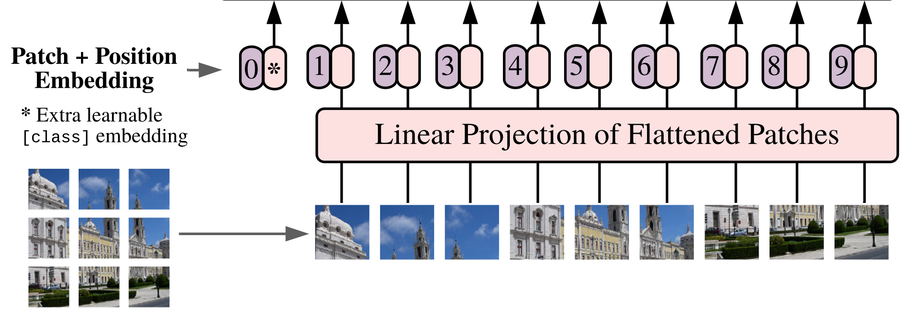{height=85%}

## Visual Tokenizers cont.

The most radical visual tokenizers do not embed the image patches using a
__continuous__ transformation into an embedding space, but
map patches to embeddings in a finite __codebook__ typically containing only a
few thousand embedding entries. 

The result is that encoded image representations are almost fully analogous to
the text representations used in modern language models:

+ there is a visual __vocabulary__,
+ with associated __embeddings__ in the codebook, and
+ images are represented as vocabulary elements ("visual words") arranged in a
  sequence or grid.
  
A prominent way of producing these discrete representations relies on 
__Discrete Variational Autoencoders__.

# Variational Autoencoders^[This and the next section on discrete VAEs closely follow the "Variational autoencoders" chapter of @pml2Book.]

## Variational methods

The following situation frequently arises in probabilistic modeling:

+ We are interested in the properties of a complex $p^{*}$ distribution,

+ but can calculate only the values of an unnormalized $\tilde{p}$ function, for
  which $$ p^*(\mathbf x) = \frac{\tilde{p}(\mathbf x)}{Z} $$ with the $Z$
  constant normalizer ($=\int \tilde{p}(\mathbf x)d\mathbf x$ for a continuous $p^*$)
  being intractable to calculate.
 
## Variational methods cont.

The variational approach to the problem is to approximate the complex
$p^*$ target distribution with a simpler, tractable $q$ distribution
parameterized by some $\Theta$ adjustable parameters.
  
Approximation requires some kind of distance metric, and the KL-divergence

$$ \mathbb{KL}(p^*\Vert q) = \mathbb E_{\mathbf x \sim p^*}\log\frac{p^*(\mathbf
x)}{q(\mathbf x)} $$

would be a natural choice, but, of course, calculating this is also problematic,
because it would require calculating an expectation over $p^*$.

## Variational methods cont.

Choosing the reverse KL-divergence

$$ \mathbb{KL}(q\Vert p^*) = \mathbb E_{\mathbf x\sim q}\log\frac{q(\mathbf
x)}{p^*(\mathbf x)} $$

would take the expectation over $q$ which is assumed to be tractable but still
requires pointwise evaluation of $p^*$, so the __variational objective__ is to
minimize the "quasi KL-divergence" between $q$ and the unnormalized $\tilde
p$: We try to find

$$ \underset{\Theta}{\operatorname{argmin}} \left(\mathbb E_{\mathbf x \sim q_\Theta}\log\frac{q_\Theta(\mathbf
x)}{\tilde p(\mathbf x)}\right).$$

## Variational methods cont.

In terms of our target $p^*$ the objective can be written as 

$$ \mathbb E_ {\mathbf x \sim q_\Theta}\log\frac{q_\Theta(\mathbf x)}{p^*(\mathbf
x)Z} = \mathbb{KL}(q_\Theta\Vert p^*)-\log Z.$$

Since $\mathbb{KL}(q_\Theta\Vert p^*)\geq 0$ is guaranteed by the Gibbs
inequality, all values will be upper bounds of $-\log Z$, and the task is to
find the least (so-called variational) upper bound. 

The equivalent maximization task's objective: $$
\mathbb E_{\mathbf x\sim q_\Theta}\log\frac{p^*(\mathbf x)Z}{q_\Theta(\mathbf x)}d\mathbf
x = \log Z - \mathbb{KL}(q_\Theta\Vert p^*)$$ is to find the largest
(variational) lower bound of $\log Z$.

## Applications

+ Approximating __energy function-based distributions__ of the form $$ p(\mathbf x)
  = \frac{e^{-E(\mathbf x)}}{Z}, $$ where $E(\cdot)$ is an energy function and
  the upper bounded  $- \log Z$ quantity is known as the __free energy__. 
+ __Variational Bayes__: approximating the $$p_\Theta(\mathbf z | \mathbf x)
  =\frac{p_\Theta(\mathbf x | \mathbf z) p_\Theta(\mathbf z )}{p_\Theta(\mathbf
  x)}$$ posterior distribution of the $\mathbf z$ latent variables of a
  generative model. In that case the objective is to find the variational lower
  bound of the __evidence__ $\log p_\Theta(\mathbf x)$ (ELBO).

## Variational autoencoder (VAE)

The starting point is a latent variable-based  model containing

+ a latent variable $\mathbf z$ with a distribution $p(\mathbf z)$ from the
  exponential family, e.g., a Gaussian, and an
+ observable $\mathbf x | \mathbf z$ with a distribution $p_\Theta(\mathbf x |
  \mathbf z ) = \pi_d (\mathbf x | d_\Theta(\mathbf z))$ where $d_\Theta(\cdot)$
  is a _decoder_, e.g., an ANN, and $\pi_d$ is a simpler distribution, e.g., a
   Gaussian centered at $d_\Theta(\mathbf z)$.
  
Because of the presence of the complicated decoder, computing the $p(\mathbf z |
\mathbf x)$ posterior or $p(\mathbf x)$ is intractable, so an auxiliary
_encoder_ is introduced to variationally approximate the posterior:

+ the approximation is $q_\Phi(\mathbf z | \mathbf x)= \pi_e(\mathbf z |
  e_\Phi(\mathbf x))$ where $\pi_e$ is again a simpler distribution, frequently
  a Gaussian with mean and variance outputted by the $e_\Phi(\cdot)$ encoder.

## Variational autoencoder cont.

The combined components can be considered to be a probabilistic version of the
deterministic autoencoder:

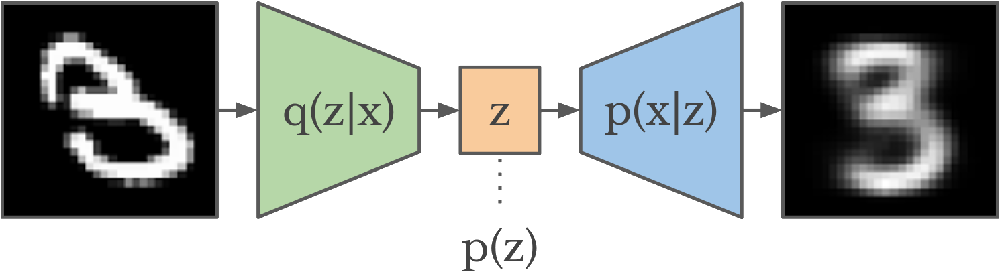{width=85%}

## Variational autoencoder cont.

The variational objective for approximating the true posterior with
$q_\Phi(\mathbf z | \mathbf x)$ for a concrete $\mathbf x$ is to minimize 
\begin{align*}
\mathbb E_{\mathbf z \sim q_\Phi(\mathbf z | \mathbf x)}\log\frac{q_\Phi(\mathbf z | \mathbf
x)}{p_\Theta(\mathbf x | \mathbf z)p(\mathbf z)} &= \\
= \mathbb{KL}(q_\Phi(\mathbf z | \mathbf x)&\Vert p(\mathbf z))-\mathbb E_{\mathbf z \sim q_\Phi(\mathbf z | \mathbf x)}(\log p_\Theta(\mathbf x | \mathbf z)).
\end{align*}
In the second form, 

* the $\mathbb{KL}(q_\Phi(\mathbf z | \mathbf x) \Vert p(\mathbf z))$
  __similarity__ between the prior on $\mathbf z$ and approximated posterior
  $q_\Phi(\mathbf z | \mathbf x)$ can be computed in a closed form, while
* $-\mathbb E_{\mathbf z \sim q_\Phi(\mathbf z | \mathbf x)}(\log p_\Theta(\mathbf x | \mathbf
  z))$ can be interpreted as the expected __reconstruction error__.
  
## Variational autoencoder: reconstuction error

The reconstruction error interpretation of the 
$$-\mathbb E_{\mathbf z \sim q_\Phi(\mathbf z | \mathbf x)}\log p_\Theta(\mathbf x | \mathbf
  z)$$
part of the VAE loss requires rewriting 
$$- \log p_\Theta(\mathbf x | \mathbf z) = -\log \pi_d(d_\Theta(\mathbf z))$$
as some kind of distance between $\mathbf x$ and the mode of the
$p_\Theta(\mathbf x | \mathbf z)$ distribution, but this can be done very easily
in most cases. 

E.g., if $\pi_d$ is a standard spherical $m$-dimensional
Gaussian with $d_\Theta(\mathbf z)$ mean then
$$p_\Theta(\mathbf x | \mathbf z)= (2\pi)^{-m/2}\exp(-\Vert d_\Theta(\mathbf
z) - \mathbf x\Vert^2/2).$$

## Variational autoencoder: reconstuction error

Hence $$ - \log p_\Theta(\mathbf x | \mathbf z)= \Vert d_\Theta(\mathbf z) -
\mathbf x\Vert^2/2 - \log ((2\pi)^{-m/2}), $$ that is, the negative log
probability is a shifted and scaled version of the squared Eucledian distance
between $\mathbf x$ and the $d_e(\mathbf z)$ mean of the distribution, which can
be seen as the "reconstructed $\mathbf x$", that is, $\mathbf{\hat{x}}$.

## Variational autoencoder cont.

Accordingly, using Gaussians for $\pi_e$, $\pi_d$ and $p(\mathbf z)$ we have

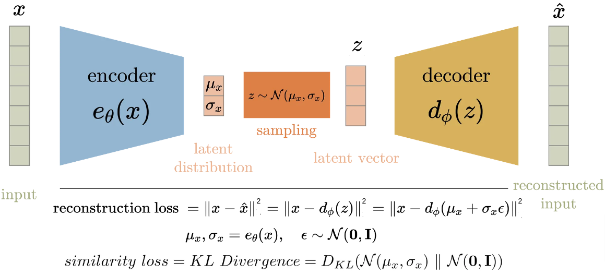

## Variational autoencoder cont.

How does minimizing the variational objective under discussion relate to the
usual MLE objective of maximizing $p_\Theta(\mathbf x)$ for data points in the
training set? As we have seen, the objective
$$
\underset{\Theta, \Phi}{\operatorname{argmin}}\left(\mathbb E_{\mathbf z \sim q_\Phi(\mathbf z | \mathbf x)}\log\frac{q_\Phi(\mathbf z | \mathbf
x)}{p_\Theta(\mathbf x | \mathbf z)p(\mathbf z)}\right) 
$$
can also be rewritten in the form of
$$
\underset{\Theta, \Phi}{\operatorname{argmax}}\left(
\log p_\Theta(\mathbf x)- \mathbb{KL}(q_\Phi(\mathbf z | \mathbf x) \Vert p_\Theta(\mathbf z | \mathbf
x))\right)
$$

so finding the minimizer $\Theta$ and $\Phi$ is actually equivalent to finding
the largest possible variational lower bound of the log likelihood, i.e., we have a
variational approximation of MLE optimization.

## The reparameterization trick

::: columns

:::: {.column width=40%}

\ 

\

VAEs are typically optimized using gradient descent, but  the
reconstruction loss $-\mathbb E_{\mathbf z \sim q_\Phi(\mathbf z | \mathbf x)}(\log
p_\Theta(\mathbf x | \mathbf z))$ involves sampling from $q_\Phi(\mathbf z |
\mathbf x)$, which  makes it non-differentiable.

::::

:::: {.column width=60%}

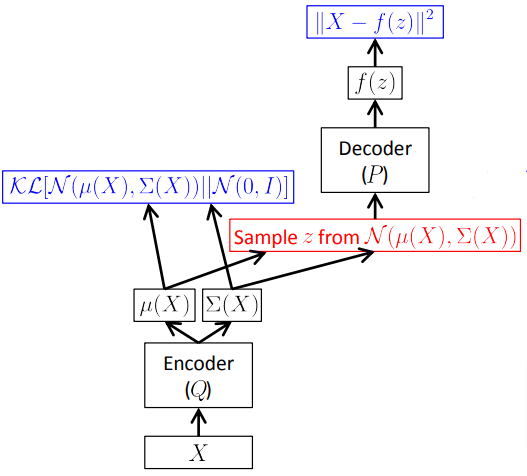

::::

:::

## The reparameterization trick cont.

::: columns

:::: {.column width=40%}

\ 

\

The "reparameterization trick" solves this problem by factoring the sampling
operation into sampling from a standard distribution, which is
independent of the parameters, and a dependent transformation of the sample.

::::

:::: {.column width=60%}

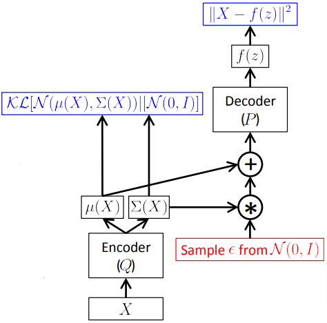{height=75%}

::::

:::

## The reparameterization trick cont.

Reparameterizing in terms of sampling from a constant distribution $q_0$ (e.g.,
a standard normal) and a $t$ transformation based on the encoder's output we can
push the gradient operator inside the expectation:
$$
\nabla_{\Phi, \Theta}-\mathbb E_{\mathbf z \sim q_\Phi(\mathbf z | \mathbf x)}\log
p_\Theta(\mathbf x | \mathbf z)
$$
can be rewritten as
$$ 
-\mathbb E_{\epsilon \sim q_0}\nabla_{\Phi, \Theta} \log p_\Theta(\mathbf x 
| t(e_\Phi(\mathbf x), \epsilon)), 
$$
and approximated, using Monte Carlo, by
$$
-\frac{1}{n}\sum_{i=1}^{n}\nabla_{\Phi, \Theta} \log p_\Theta(\mathbf x 
| t(e_\Phi(\mathbf x), \epsilon_i)).
$$

## Deterministic vs variational autoencoders

In contrast to deterministic autoencoders, VAEs are genuine generative models
with well-defined distributions. One consequence is that they can be
used to generate good-quality new samples by sampling the latent prior and decoding it:

![Deterministic (1st row) vs variational (2nd row) autoencoder generated new images
[from @pml2Book].](figures/ae_vs_vae.png){width=85%}

## $\beta$-VAE

Image VAEs with the standard VAE loss are prone to produce blurred images
because the loss incentivizes the optimized decoder to output an
$\mathbf{\hat{x}}=d_\Theta(\mathbf z)$ reconstruction which is the _average_ of
all inputs that are mapped to $\mathbf z$ by the decoder.

A simple way of reducing this problem is to decrease the weight of the
similarity loss and bring the autoencoder closer to a deterministic one:
$$\mathcal L_{\beta-VAE} = \beta\mathbb{KL}(q_\Phi(\mathbf z | \mathbf x) \Vert p(\mathbf z))-\mathbb E_{\mathbf z \sim q_\Phi(\mathbf z | \mathbf x)}(\log p_\Theta(\mathbf x | \mathbf z))$$

With $\beta< 1$ the weight of the reconstruction loss is larger than in the
normal VAE loss and $\beta=0$ results in a fully deterministic autoencoder.

# Discrete VAEs

## Discrete VAEs

So far we have assumed that the latent $p(\mathbf z)$ variable is continuous,
but the architecture can also be used with __discrete latent variables__.

Compared to the continuous case, this requires

+ a __discretization layer__ in the encoder, which maps the input to discrete codes, and
+ a __training method__ which is compatible with $p_\Theta(\mathbf z)$ and
  $q_\Phi(\mathbf z | \mathbf x)$ being discrete.

## Discretization

Strategies to discretize the output of the encder include

+ simply __rounding__ input coordinates individually to the nearest integer code,
  e.g., to 0 or 1 in the case when the latent variable is assumed to be a binary vector, and
+ full fledged __vector quantization__ [__VQ-VAE,__ @van2017neural]: if the
  latent variable is a collection (e.g., a vector or matrix) of categoricals
  with $K$ discrete values, then input vectors from $\mathbb R^D$ can be mapped
  to categorical values using a learned __codebook__ $\{\mathbf e_k\in \mathbb
  R^D\}_{k\in[1\dots K]}$. Each $\mathbf e_i$ input embedding is mapped to the
  index of the closest codebook entry as its latent representation $z_i$: $$ z_i
  = \underset{k}{\operatorname{argmin}}(\Vert \mathbf e_i - \mathbf e_k\Vert_2).
  $$

## VQ-VAE discretization

In the VQ-VAE approach, the $q(\mathbf z| \mathbf x)$ latent codes are mapped back to the
corresponding cookbook entry $\mathbf e_{z_i}$ in the first decoding step:

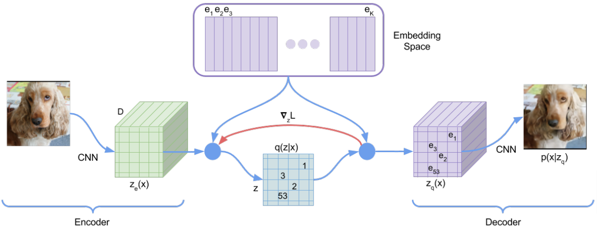

## VQ-VAE distributions and loss

As the VQ-VAE decoder is deterministic and the prior is uniform, the
$\mathbb {KL}(q(\mathbf z| \mathbf x)\Vert p(\mathbf z))$ similarity loss is
constant and can be ignored. Quantization is non-differentiable, so only the
so-called __straight-through estimator__ can be used, in which the gradient from
the decoder is passed through the quantization layer as it was the identity
function [figure from @askary2020intuitive]:

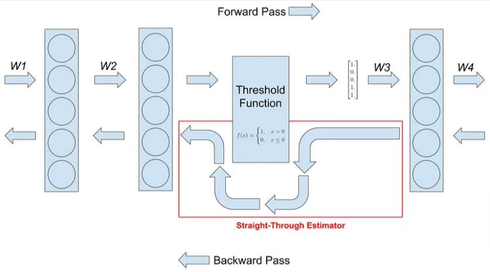{width=80%}

## Learning the codebook with straight-through

One of the consequences of the straight-through based approach is that there
are no gradients for the codebook.
Solutions to learn the codebook include

+ Introducing an additional __codebook loss__ term measuring the distance between the
  encoder output and the closest codebook entry. The total loss becomes
  $$
  \mathcal L=-\log p_\Theta (\mathbf x |  \mathbf z_q(\mathbf x)) +
  \Vert sg(\mathbf z_{\mathbf e}(\mathbf x)) - \mathbf e\Vert_2^2,
  $$
  where $sg$ is the `stop_gradient` operator.
+ Regularly updating codebook entries to be closer to the __moving average__ of
  the inputs they were assigned to.

## Discrete VAE with Gumbel-softmax

A more principled approach to train a discrete, codebook-based, but genuinely
probabilistic VAE uses a version of the reparameterization trick which is
applicable to categorical latent variables.

The approach is based on the fact that, similarly to sampling from any Gaussian,
sampling from any categorical distribution can also be factored into sampling
from a constant distribution and then deterministically transforming the samples.

The distribution in question is the __standard Gumbel distribution__ with
density function

$$
\mathcal G(x) = e^{-(x+e^{-x})}.
$$

## Discrete VAE with Gumbel-softmax cont.

An important property of the $\mathcal G$ standard Gumbel distribution is that
if a categorical distribution is described by the log odds (logits)
$$ 
a_1, \dots, a_n,
$$
then one can sample from it by drawing $n$ samples from $\mathcal G$:
$$
g_1, \dots, g_n\sim\mathcal G
$$
and then calculating
$$
\underset{i}{\operatorname{argmax}} (a_i + g_i).
$$

## Discrete VAE with Gumbel-softmax cont.

The presence of _argmax_ in the transformation of the samples
makes it non-differentiable, but this can be helped by 

+ replacing it with the _softmax_ operator,
+ letting the $\mathbf z$ latent variables have any vector describing a
  categorical distribution as a value instead of just one-hots,
+ and passing the $\mathbf z$-weighted sums of
  the codebook entries to the decoder.

For example, for an  $e_\Phi$ encoder outputting logits for a single
categorical latent variable this __Gumbel-softmax reparameterization__ 
results in the reconstruction loss
$$
\mathcal L_{rec}= - \mathbb E_{g_1,\dots,g_n \sim \mathcal G}
\log p_\Theta(\mathbf x | softmax_\tau(e_\Phi(\mathbf x)+ \langle g_1,\dots,g_n\rangle)),
$$
and the gradients can be estimated by the usual Monte Carlo method.

## Discrete VAE with Gumbel-softmax cont.

The tightness of the softmax approximation of argmax depends on the $\tau$
temperature parameter:

$$
softmax_\tau(\langle x_1,\dots,x_n\rangle)=
\left\langle\frac{e^{ x_1/\tau}}{\sum_{i=1}^n e^{ x_i/ \tau}},\dots,
\frac{e^{x_n/\tau}}{\sum_{i=1}^n e^{x_n  / \tau}}\right\rangle
$$

and therefore $\tau$ is gradually decreased during the training until it reaches
a value close to 0.

## The DALL-E visual tokenizer 

An important example of a discrete VAE-based visual tokenizer is the one used
in DALL-E [1st version, @ramesh2021zero]:

+ input images are 256x256,
+ both the encoder and decoder are convolutional,
+ the latent $\mathbf z$ is a $32x32$ grid of categorical variables with a uniform
  prior over a 8192-element "visual vocabulary",
+ the decoder uses a special "logit-Laplace" distribution instead of the usual
  Gaussian and Laplace distributions (corresponding to $L_2$ and
  $L_1$ reconstruction error metrics),
+ the KL-similarity loss is weighted with $\beta=6.6$ which led to a better
  codebook usage and led to better(!) reconstruction error at the end of training,
+ the $\tau$ softmax temperature starts with 1 and is annealed to 1/16 during training.

# Vision Transformers (ViT)

## General ViT Architecture

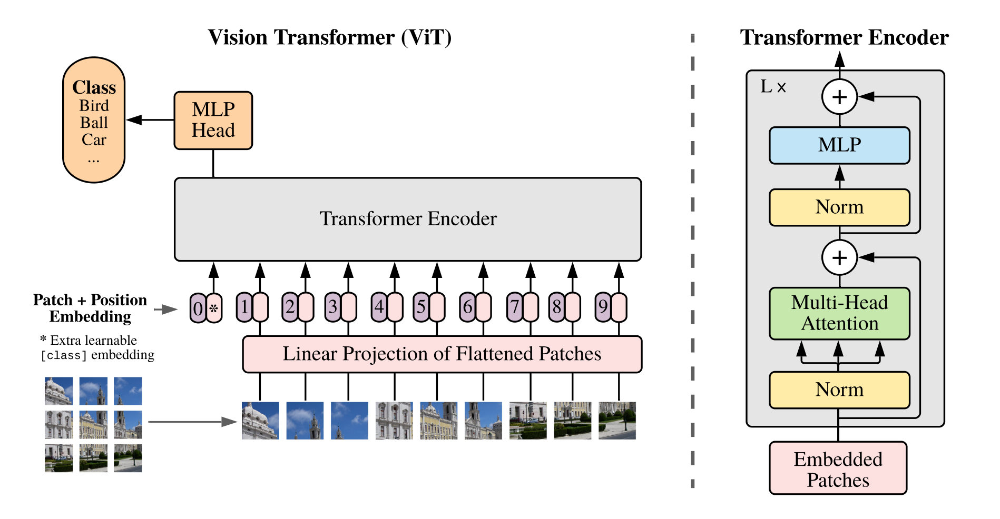{height=85%}

## ViT Embeddings

Embeddings are created by patching the image with a certain patch size $P$. Stride can also be used, $1\times1$ patches are also possible for pixel-wise processing.

Each pach is then fed to either:

- A linear projection layer after flattening (learned)
- CNN-backbone (usually fixed)

Experiments show that 1D absolute positional encoding works best for a vanilla ViT.

## ViT Classification token

While the patch embeddings are suitable for local image representations, a global representation is also needed for classification.
This is done by a learnable pooling process wich is facilitated by a special token called the classification token.

This CLS (or "class") token is prepended to the patch embeddings. The initial value of this token is learned during training.

## ViT Classification token

::: columns

:::: column

\ 

The output corresponding to this token is used for classification. During pre-training this is fed to a 3-layer MLP, while during fine-tuning a single linear layer is used.

::::

:::: column

![ViT CLS attentions to other regions [@dosovitskiy2021image]](figures/vit_cls.png){height=70%}

::::

:::

## Higher resolution processing

Since a larger image would be decomposed into a longer patch sequence, we should check if the model is able to process this.

MHA and FFN contain pointwise layers only, so they are able to process longer sequences. (Degrading performance could be expected as the $W_Q, W_K, W_V$ matrices are not trained for this.)

## Higher resolution processing

::: columns

:::: column

\ 

The only limiting factor is the learned positional encoding. To extend this, it is possible to interpolate the positional encoding values for a longer sequence with a simple linear method, to keep the information intact.

::::

:::: column

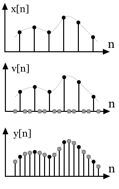{height=70%}

::::

:::

# Multi-scale processing

## SWIN - Hierarchical Transformer

SWIN [@liu2021swin] is a \textbf{S}hifted \textbf{Win}dow-based Transformer architecture that is able to process images of arbitrary size using multiple resolution levels.
This method is based on the idea of local attention, where the attention is limited to a certain region of the input only. This is achieved by a windowing mechanism of non-overlapping attention windows.

Tokens are merged (pooled) by a learnable projection at each level of hierarchy (other methods, such as T2T [@yuan2021tokenstotoken] concatenate these vectors). The merging factor is usually smaller than the attention window size (e.g.: 2x2 pooling, 4x4 attention window).

## SWIN - Hierarchical Transformer

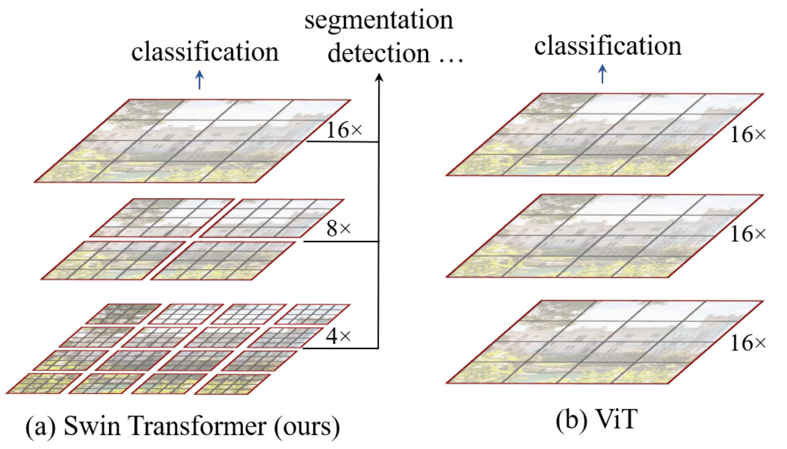{height=60%}

## SWIN - Window-based MHA

By using this windowed attention mechanism, the computational complexity of the MHA is reduced from quadratic to linear, where $h$ and $w$ are the height and width of a $C$ channel image in patches.

To give a lower-bound of computation complexity we could assume:

$\Omega(MHA) = 4\cdot hw \cdot C^2 + 2\cdot(hw)^2\cdot C$

$\Omega(MHA_{Windowed}) = 4\cdot hw \cdot C^2 + 2\cdot M^2 hwC$

Assuming that $M$ is the attention window size.

## SWIN - Window shift

This simplification disables information flow between far-away patches. To solve this, a window shift mechanism is introduced.
This shift mechanism ensures that in consecutive layers attention windows are shifted, thus information flow is possible through multiple layers.

By shifting the windows, some of them will be partially empty. Although padding could be used to fill these, it is more efficient to cyclically roll the image during these shifting operations.

## SWIN - Window shift

![SWIN repartitioning [@liu2021swin]](figures/swin_shift_1.png){width=90%}

## SWIN - Window shift

![SWIN cyclic window shift instead of zero-padding [@liu2021swin]](figures/swin_shift_2.png){width=90%}

## SWIN - Learnable Relative Attention Bias

Instead of absolute positional encoding, the authors find, that a simple learnable bias term is better suited for encoding relative positional information in the attention windows.

Given that each window is an $M \times M$ square, the relative position of each axis is in $[-M+1, M-1]$ range. Thus the bias matrix is of size $[(2M-1)^2\cdot heads]$.
$B$ is assembled from this learned matrix and applied in the attention:

$O = softmax(QK^T/ \sqrt{d_k} + B)V$

Bicubic interpolation is used to upsample the bias matrix in case of higher resolution inputs.

## SWIN - Learnable Relative Attention Bias

![Visualization of learned relative bias terms by the upgraded Swin Transformer v2 [@liu2022swin]](figures/swin_bias.png){height=60%}

## Advantages of hierarchical ViT

![Detailed Swin Transformer architecture
[@liu2021swin]](figures/swin_arch_detail.png){height=60%}

Studies show that these hierarchical transformers provide an elevated
performance-accuracy pair compared to the original ViT.

## Learning general representations

General purpose models have been around for a while (ImageNet challenge, etc.),
large-scale pre-training of these models usually consinst of a single
classification task.

However, with the rise of foundational transformer representation models, the
need for stronger pre-training methods has emerged. With additional pre-training
tasks, these models have a better generalization capability, and even a
possibility for few-shot learning.

# Mini Model Zoo

## TrOCR

TrOCR [@li2023trocr] is a simple, transformer-based encoder-decoder model
performing __optical character recognition__.

It is based on the original, full encoder-decoder transformer architecture, and
consists of 

+ a __visual transformer__ as encoder, and
+ a __text transformer__ decoder.

Both the encoder and decoder's weights are initalized from pretrained unimodal
models, and are pretrained and fine-tuned on OCR-specific training data.

## TrOCR: encoder

::: columns
:::: {.column width=40%}
\ 

The encoder resizes the input to a fixed size, decomposes it into patches, and
linearly projects each flattened patch to an embedding. The absolute spatial positions of
the patches are represented by learnable 1D (!) positional embeddings.
::::
:::: {.column width=60%}
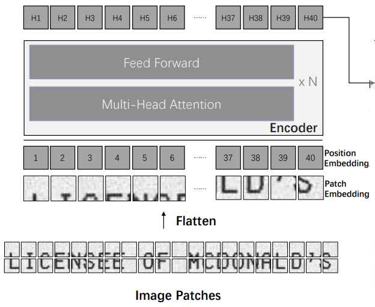{height=60%}
::::
:::

## TrOCR: decoder

The decoder is a standard transformer decoder cross-attending to the output of
the encoder:

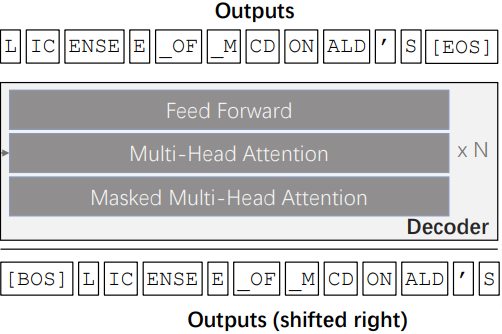{height=60%}

## TrOCR: initialization and training

+ The encoder weights are initialized using pretrained visual transformer weights
  (DeiT or BEiT).
+ The decoder weights are initialized using decoder-only LLM weights (RoBERTa or
  MiniLM), so structural differences (size, missing cross-attention) are taken
  care of by manually set mappings and random initialization.
+ The full model is first __pretrained__ on a very large synthetic dataset and
  then on a smaller collection of real-life datasets.
+ Final testing on downstream tasks was done using task-specific fine-tuning.

## LLaVA

LLaVA [Large Language and Vision Assistant, @liu2023visual] is a large
vision-language model which was trained for __visual instruction following__ by
extending an instruction fine-tuned LLM to be able to handle
multimodal instructions mixing visual and linguistic input.

LLaVA is based on

+ __Vicuna__, an instruction fine-tuned LLaMA, which is a transformer decoder-based
  LLM,
+ a pretrained, ViT-based __CLIP__ image encoder, and a
+ a trainable projection matrix mapping visual CLIP embeddings into the word
  embedding input space of the LLaMA model.

## LLaVA cont.

Architecturally, unlike TrOCR, LLaVA is not based on the original full transformer
architecture, because the decoder is not cross-attending to the encoded visual
input, it processes it with causal self-attention.

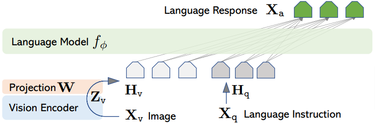{width=80%}

## LLaVA: dataset

The visual instruction following dataset was generated using language-only GPT-4
as a strong teacher:

+ The visual context is always a single image.
+ The image's description was provided in two forms:
  + as a list of captions describing the context image, and
  + as a list of bounding box coordinates together with their respective type
    [figure from @liu2023visual].

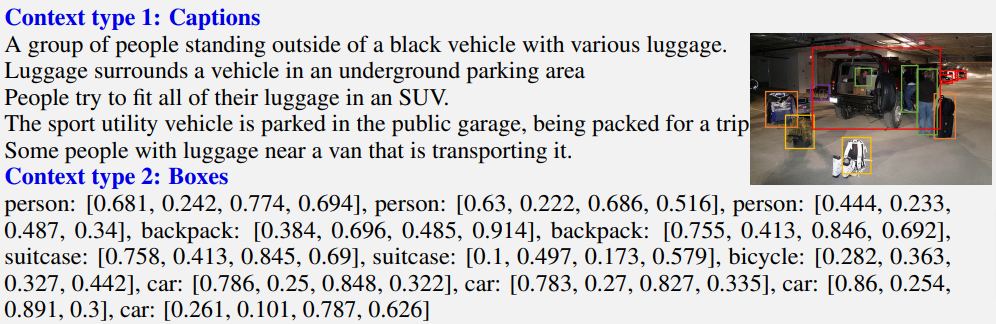{width=100%}

## LLaVA: dataset

Using images from the [COCO dataset](https://cocodataset.org), GPT-4 was
few-shot prompted to generate

+ __conversations__ between an assistant and a user asking questions about the image,
+ __detailed descriptions__ of the image, and
+ __in-depth step-by-step reasoning__ based on the image.

{width=100%}

## LLaVA: training

In general, cross-entropy loss was only generated for the assistant answer
parts of the examples. Training consisted of two phases:

+ __Pretraining__: First, the model was pretrained with frozen CLIP-encoder and
  Vicuna decoder on 595K image-caption pairs with simple image description
  instruction contexts. This can be interpreted as training the projection
  matrix to be a visual tokenizer for Vicuna.
+ __End-2-End fine-tuning__: The Vicuna weights were unfreezed, and the
  projection matrix + LLM weights were jointly fine-tuned on the GPT-4 generated 
  158K multimodal instruction following dataset.

## LLaVA 1.5

Recently (Oct 2023), a new, improved version 1.5 of LLaVA was released
[@liu2023improved], which is currently the best performing VLM on public VL
benchmarks. The changes were relatively minor:

+ using a 3-layer perceptron for the vision-language mapping instead of a linear
  projection,
+ using a larger LLaMA model (13B parameters instead of 7B),
+ upscaling the input image resolution,
+ refining prompts,
+ training on additional academic VQA datasets.

# References

## References {.allowframebreaks} 

\footnotesize
