# Introduction

## Vision-Language-Action models

An important direction in which VLMs have recently been extended is
__controlling embodied AI agents__ (robots) that should act on the basis of
verbal instructions and visual input from the environment. Tasks of this type
include

+ __vision-language-navigation__: navigate in a real 3D environment based on
  verbal instructions from humans,
+ __moving objects__, i.e., transferring an object from one location to another,
+ __manipulating objects__, e.g., opening and closing drawers, knocking objects,
  placing them upright etc.

## Approaches and challenges

- Currently, the dominant architectural approach is using __encoder-decoder__
  architectures to map visual observations and linguistic input to appropriate
  robot actions.
- The architectural bacbone is typically a transformer (encoder, decoder or
  both).

Challenges include

- utilizing __pretrained components__, 
- collecting sufficiently large instructed __robot behavior datasets__,
- __generalization__: create models that perform well across divergent tasks
  including unseen ones in unseen environments.
- __reducing hardware requirements__.

# Extended VL navigation with Episodic Transformer

## The Vision-and-Language Navigation Task

The VLN task is for an artificial agent

`\bigskip`{=latex}

> to navigate in an environment and to reach a goal specified by a
> natural language instruction.

[@pashevich2021episodic p. 3]

`\bigskip`{=latex}

The concrete setting for the Episodic Transformer model is provided by the
**ALFRED benchmark dataset** [@shridhar2020alfred], in which the instructions
specify "everyday tasks", in particular, moving objects around in indoor
environments.

## The ALFRED dataset

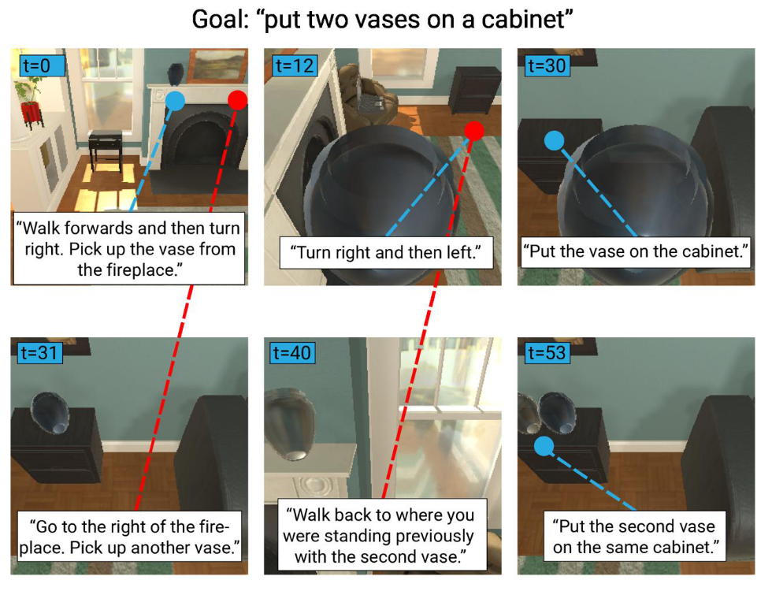{width=75%}

## The ALFRED dataset cont.

-   Two types of natural language instructions:
    -   A single "overall" goal, and
    -   several subgoal-instructions leading to the realization of the
        final goal.
-   The dataset consists of "expert demonstrations" of how to realize
    the described goals and subgoals in a given environment by
    performing appropriate actions.
-   Specifically, a single demonstration data point in ALFRED consists
    of
    -   the short overall goal description,
    -   a time series of egocentric visual observations together with
        what action is carried out in each timestep and with the
        corresponding interaction mask (in case the action has a target
        object), and
    -   a sequence of subgoal instructions, which is time-aligned with
        the observation/action time series.

## Evaluation metrics

-   **Task Success**: "1 if the object positions and state changes
    correspond correctly to the task goal-conditions at the end of the
    action sequence, and 0 otherwise."
-   **Goal-Condition Success**: "the ratio of goal-conditions completed
    at the end of an episode to those necessary to have finished a
    task."

Example: "Put a hot potato slice on the counter"

Goal-conditions:

1. A potato has to be sliced.
2. A potato has to be heated.
3. A potato slice should be put on a counter top.
4. The heated potato slice of (2) has to be on the counter top.

## Path weighted versions

For both of the aforementioned scores (task and goal-condition success),
there are path weighted versions that multiply the basic score with the
ratio of the number of actually performed actions ($\hat L$) to the
number of actions in the demonstration ($L^*$):

### Path weighted version of score $s$

$$
p_s = s \cdot \frac{L^*}{\max(L^*, \hat L)} 
$$

# Episodic Transformer

## Episodic Transformer: motivation

-   VLN models in the past were based on recurrent architectures [so does the
    ALFRED baseline model by @shridhar2020alfred], but 
-   recurrent nets do not
    capture **long-term dependencies** well, since history (previous
    observations and actions) is encoded in hidden states;
-   transformers, in contrast, can access the entire history of the entire
    episode.

The contrast a bit more formally [from @shridhar2020alfred, $\hat a_i$ is
predicted action, $x_{1:L}$ the instruction, $v_i$ amd $h_i$ are visual
observation and history representations]: $$\hat{a}_t, h_t =
\mathrm{RNN}(x_{1:L}, v_t, \hat{a}_{t-1}, h_{t-1})$$ $$\hat{a}_t =
\mathrm{Transformer}(x_{1:L}, v_{1:t}, \hat{a}_{1:t-1})$$

## Episodic Transformer: architecture

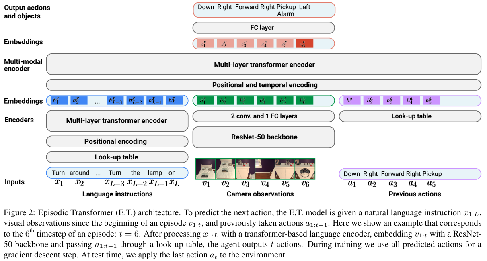

## Architecture cont.

Separate initial encoders for the three history components:

-   **language instructions**: a transformer encoder embeds the text
    tokens,
-   **camera observations**: a ResNet-50 + 2 conv and 1 FC embeds
    independently all of them,
-   **previous actions** are simply embedded by a learned look-up
    table.

## Architecture cont.

A multimodal transformer encoder fuses the unimodal embeddings

-   the ordering of text tokens, visual observations and previous
    actions is represented by **positional and temporal
    embeddings**;
-   employs "causal attention" to prevent visual and action
    embeddings to attend to previous time steps;
-   the output layer is an FC predicting the next action $\hat a_t$;
-   target object bitmasks are predicted using a pretrained instance
    segmentation model based on the predicted target object class.

## Instruction encoder pretraining

The encoder is pretrained on an encoding-decoding task of converting
natural language instructions into synthetic, controlled "translations"
(generated from the expert path planner arguments):

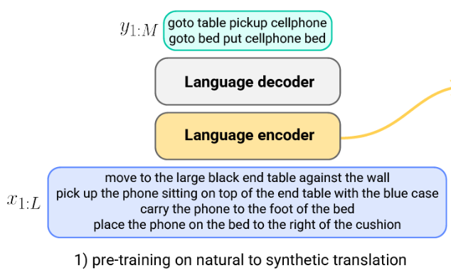{width=60%}

## Data augmentation with synthetic instructions

In addition to pretraining the language encoder, synthetic instructions
are also used for generating additional training data points:

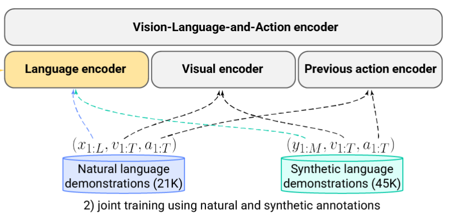{width=80%}

## Training

1.  Pretraining

    -   As we saw, the language encoder is pretrained on the synthetic
        translation task,
    -   the visual encoder and the mask generator are both pretrained on
        frames and corresponding class segmentation masks from the
        training data set.

2.  Training

    The training of the entire model uses **teacher forcing**:

    -   for an expert demonstration input $(x_{1:L}, v_{1:T}, a_{1:T})$
        all $\hat{a}_{1:T}$ actions are predicted at once, and
    -   the loss to be minimized is the cross-entropy loss between
        $a_{1:t}$ and $\hat{a}_{1:T}$.

## Results

+ Results were better than the original ALFRED LSTM baseline (33.8 vs
  23.3% task success rate on seen tasks).
+ It is especially interesting that using a pretrained BERT for encoding
  actually decreased performance

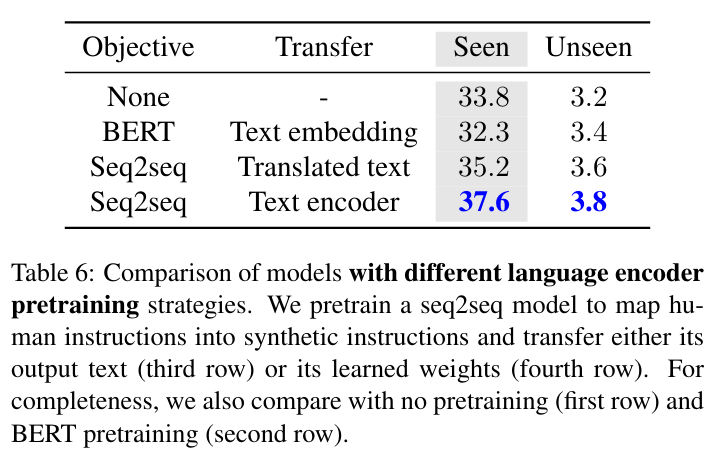{height=50%}

# VLMs as general VLA models: RT-2

## Starting points

+ The goal is to __adapt__ pretrained VLMs to act as __general__ instruction
  following VLA models.
+ The concrete implementations are based on PaLI-X and PaLM-E, two
  transformer-based VLMs that use ViT variants to encode images into visual
  tokens and linear projections to map them into the LM embedding space.
+ The used robot action specific dataset uses relatively simple instructions and
  tasks, tuning pretrained VLMs on them is expected to result in __complex
  instruction following capabilities__.

## Robot instruction following dataset

The used RT-1 dataset [@brohan2022rt] contains 130K examples about 13 __human
teleoperated__ robots following more than 700 different instructions in office
kitchen like environments.

The tasks/skills have the following distribution:

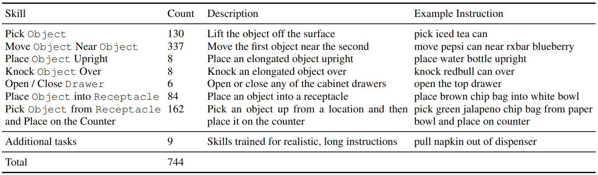{height=50%}

## Robot instruction following dataset cont.

"Demonstrations are collected with direct line-of-sight between operator and
robot using 2 virtual reality remotes." [@brohan2022rt.]

The collected action data contains.

+ 3 continuous variables for __base movement__: $x$, $y$, yaw;
+ 7 continuous variables for __arm movement__: $x$, $y$, $z$, roll, pitch, yaw,
  and opening of the gripper;
+ a discrete variable for __switching between three modes__: controlling the arm, the base,
  or terminating the episode.

## Model architecture

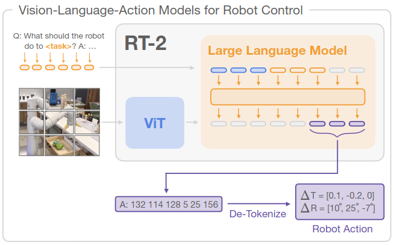{width=85%}

## Model architecture: PaLM-E

One of the  used VLMs was __PaLM-E__ [@driess2023palm], a 12B-parameter VLM based on a
pretrained PaLM language model, which is a transformer decoder-type LM. 

Images are encoded using a ViT or [Object Scene Representation Transformer
(OSRT)](https://osrt-paper.github.io/). Multiple images represented as sequences
of vectors in the LLM's embedding space can be interleaved with text token
embeddings to form __multi-modal sentences__ as the input, e.g.:

    Q: What happened between  and ?

where `` and `` are vector sequences representing images.

## Model architecture: PaLI-X

The other used VLMs were __PaLI-X__, which 

+  uses a very large (22B parameters) ViT as a visual component, which is
   pretrained on OCR-centric classification tasks, 
+  a 32B transformer encoder-decoder as the architectural backbone,
+  and its visual input can be several images (or video frames), and its representations
   are __concatenated__ to (not interleaved with) the text embeddings.

Its smaller variant, __PaLI-3B__ with a 2B ViT and 3B backbone was also
experimented with.

## VLM pretraining

+ The __visual encoder__ is separately pretrained on image tasks, e.g., the PaLI's
  OCR-classification tasks.
+ The __language backbone__ is pretrained using standard LLM pretraining on next token
  prediction (plus various denoising tasks in the case of PaLI).
+ __VLM training__ itself is performed on a large number of vision-language 
  datasets including
  + the WebLI dataset, which contains 10B image-text pairs (from alt-text
    fields, OCR, etc.), and
  + visual question answering datasets.

## Robot-action fine-tuning

The adapted VLMs have to to output robot actions, so the possible actions need
to be mapped to token sequences. To achieve this,

+ the continuous action values are __discretized__ using 256 bins,
+ all possible variable values are __mapped to entries in the VLMs' vocabularies__
  (for PaLI-X the first 1000 integers have their own entries and they are used,
  for PaLM-E the 256 least frequent entries are overwritten),
+ and __action vectors__ are mapped to the corresponding __value-token sequences__
  separated by spaces. 
  

## Robot-action fine-tuning cont.

For instance, and action vector of the form

$\langle$ terminate $\Delta pos_x$,  $\Delta pos_y$, $\Delta pos_z$, $\Delta rot_x$, $\Delta rot_y$, $\Delta rot_z$, gripper_extension$\rangle$

could be mapped -- using the PaLI-X encoding -- to the string

\begin{center}
"1 128 91 241 5 101 127"
\end{center}
[the example is from @brohan2023rt].

## Robot-action fine-tuning cont.

Key finding: Instead of naively fine-tuning the model on the robot data, it is
better to __co-fine-tune__ it on the original VL data __and__ the robot data,
because this leads to more generalizable policies as the model is exposed to
abstract visual concepts and low-level robot actions simultaneously.

+ During co-fine-tuning the sampling weight on the robot dataset examples is gradually
  increased in the minibatches.
+ The training objective is the standard next token prediction objective, which
  corresponds to __behavior cloning__ (a type of imitation learning) in robotics.

## Results

+ For robot-action prompts sampling is restricted to valid robot-action
  tokens to avoid producing inexecutable output.

The evaluation focused on:

* performance on seen tasks, and __generalization__ to new objects, backgrounds
  and environments;
* observability of __emergent capabilities__;
* the effects of model size and architecture on performance;
* observability of __chain-of-thought reasoning__.

## Results on onseen tasks

The VLM-based RT-2 generalized better than models without VLM pretraining:

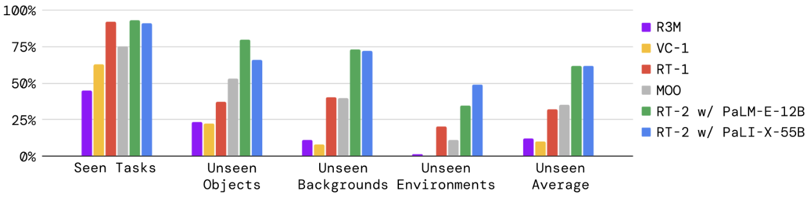{width=100%}

## Results: emergent capabilities

Emergent capabilities were split into three categories:

+ __reasoning__: applying VLM reasoning to control tasks,
+ __symbol understanding__: VLM transfer of semantic knowledge that was not in
  any robot data,
+ __human recognition__: human-centric understanding and recognition.

## Results: emergent capabilities cont.

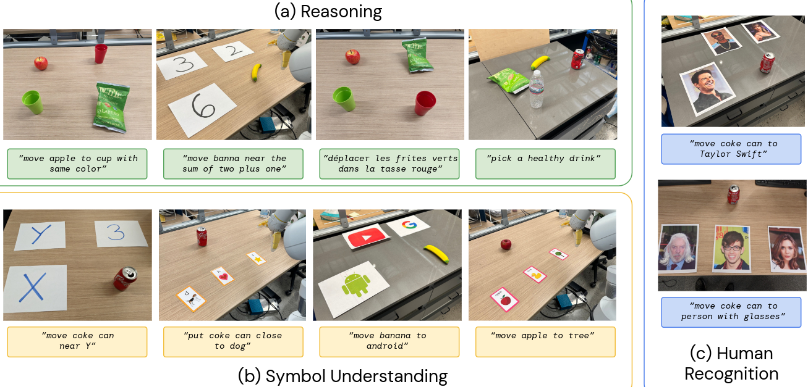{width=103%}

## Results: emergent capabilities cont.

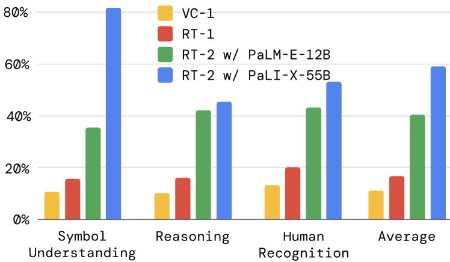{width=75%}

## Results: CoT reasoning

The RT-2 model was fine-tuned on additional data including a "Plan" part after
the instruction, e.g., 

`Instruction: I’m hungry. Plan: pick rxbar chocolate. Action: 1 128 124 136 121
158 111 255.`

According to "qualitative observations", this fine-tuning made it possible for
the model to follow more complex instructions.

## Results: CoT reasoning cont.

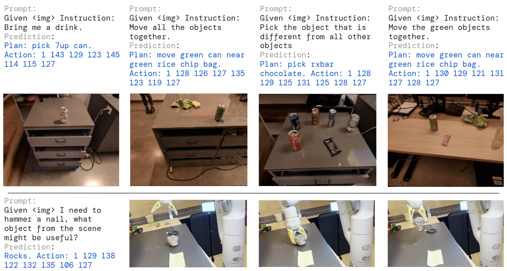{width=100%}

# References

## References

\footnotesize
