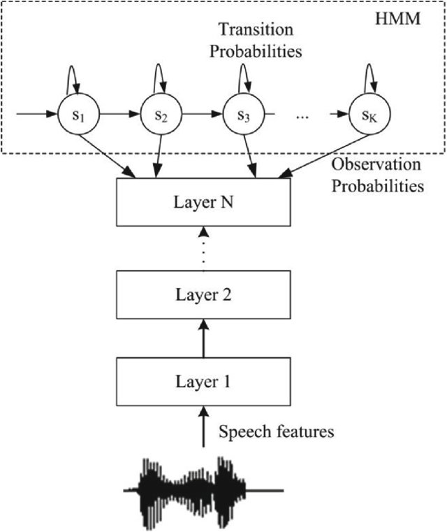
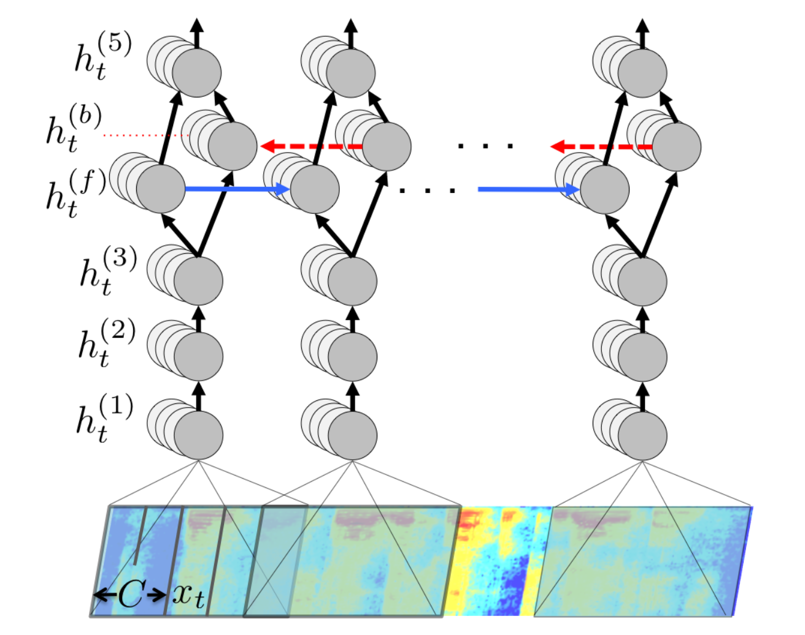
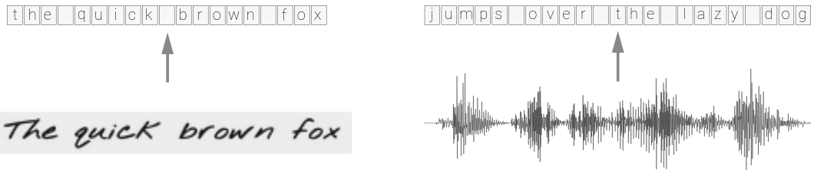
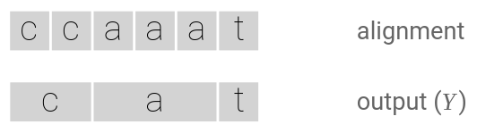
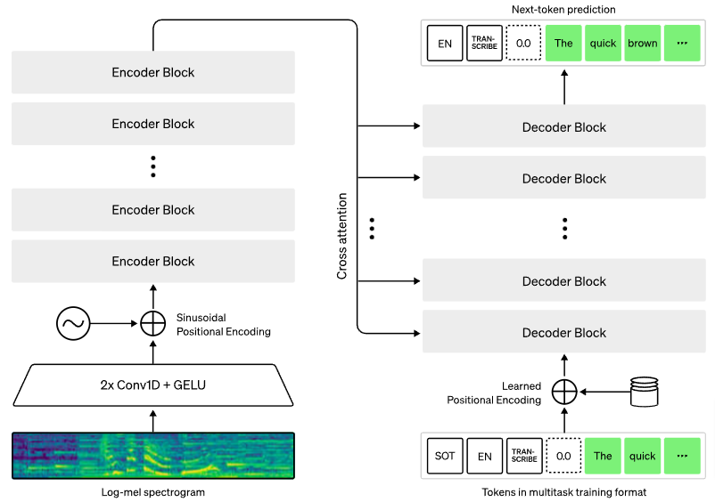

# HMM-ANN hybrid models

## HMM-ANN hybrid models

Neural networks can be used in HMM-based STT models instead of traditional
__emission models__. The model is trained in two steps:

1. A traditional HMM-GMM model is trained on the dataset.
2. A neural network __classifier__ is trained to predict the HMM-GMM model's
   hidden states based on observable acoustic features. The training dataset is
   the hidden-state--acoustic alignment produced by the HMM-GMM model on the
   training data.

The architectures used for these neural emission models ranges from simple MLP-s
to complex DL-based ones, e.g. LSTMs.

## HMM-ANN hybrid models cont.

{height=70%}

## HMM-ANN hybrid models cont.

The trained neural classifier  outputs  $P(hidden | acoustic)$
probabilities, but for Viterbi decoding the emission probabilities
$$P( acoustic | hidden) =  \frac{P(hidden | acoustic) P(acoustic)}{P(hidden)}$$
are used. Fortunately, for decoding it is enough to calculate the scaled 
$$ \frac{P(hidden | acoustic)}{P(hidden)} \propto P( acoustic | hidden)$$ 
values since $acoustic$ is fixed, and the $P(hidden)$ values can be estimated
from the hidden state frequencies in the aligned data.

# End-2-end DL-based ASR systems 

## Deep Speech (Baidu, 2014)

The first significant model of this type was Baidu's __Deep Speech__
[@hannun2014deep], and it introduced radical changes compared to traditional
HMM-based ASR solutions:

- The acoustic model was an __end-to-end trained DNN__.
- __Phone-level representations__ were totally __eliminated__: the system was trained
  simply on written transcripts, without any sort of phonetic information.
- The DNN's input consisted simply of the __spectrum representation__ of the
  audio signal (no MFCC etc.).
- Instead of words, the system's output was a __character-level__ transcription
  of the input.
- The network was trained with __CTC (Connectionist Temporal Classification)
  loss__ and used CTC decoding for producing the final ouput.

## Deep Speech (Baidu, 2014) cont.

::: columns
:::: column

\ 

The surprisingly simple architecture contained only 5 hidden layers, and only one of
them was a simple (bidirectional, but not LSTM) RNN. The input was a window
containing the spectra for a moving window of frames at each time-step.

::::
:::: column

{height=70%}

::::
:::

## Deep Speech cont.

+ Performance was acceptable without a dedicated language model but the full
  system made use of an __N-gram LM__.
+ Although Deep Speech improved on the state of art at the time (18.4%->16% WER
  on the Switchboard corpus), and did this with a surprisingly simple and clean
  architecture, 
+ it was trained on data sets that were significantly larger than those
  typically used for HMM-based training: while a 200 hours long data set was
  considered to be more than adequate for HMM-based systems, Deep Speech's
  largest model was trained on "5000 hours of read speech from 9600 speakers."

# Connectionist Temporal Classification loss^[This section is based on and closely follows @hannun2017sequence which should be consulted for details.]

## Connectionist Temporal Classification loss

The MLE for HMM-based ASR models is either based on

+ a fully aligned and annotated corpus for which the hidden states are known, in
  which case estimates can be frequency-based, or uses
+ the backward-forward algorithm, which is an application of the
  Expectation-Maximization algorithm to HMMs.
  
What type of loss should be used for Deep Speech-like models, which 

+ predict a __character__ for every speech __time-step__, and 
+ for which, crucially, the ground truth is the transcript character sequence 
  consisting of normally written words?

## Connectionist Temporal Classification loss cont.

The problem is very general, and it comes up in many sequence classification
applications where the ground truth is unaligned, e.g. in OCR, action
classification of video frames in addition to STT:

## Connectionist Temporal Classification loss cont.

In the context of a ground truth transcript $\mathbf y$ and a sequence of
__time-step-wise character distribution outputs__ $\mathbf X$ (the two lengths
are typically different) we would like to calculate

+ the __training loss__ based on computing $P(\mathbf y | \mathbf X)$ in a differentiable
  fashion to be able to do MLE-based parameter optimization with GD, and
+ do __inference__ by calculating 
  $${\mathbf{y}^*}=\underset{\mathbf y}{\operatorname{argmax}} ~ P(\mathbf y | \mathbf X)$$ 
  efficiently.

## Connectionist Temporal Classification loss cont.

The main idea is to calculate $P(\mathbf y | \mathbf X)$ by finding all
individual $\mathbf x_y$ sequences that can be aligned with $\mathbf y$ and 
sum up their predicted probabilities according to the distributions in $\mathbf X$:

$$P(\mathbf y | \mathbf X)= \sum_{\mathbf x_y}P(\mathbf x_y | \mathbf X).$$

{width=70%}

## Connectionist Temporal Classification loss cont.

Complications:

+ There can be time-steps where no classification in terms of the final expected
  output is appropriate, e.g., _silence_ in the input. 
+ Sometimes character repetitions are not simply collapsable, e.g. in the case
  of `hello`.

These problems are handled by introducing the "blank" $\epsilon$ label/character
in the output vocabulary.

## Connectionist Temporal Classification loss cont.

![Alignment using the $\epsilon$ character  [@hannun2017sequence].](figures/ctc_blank.png){width=90%}

## Connectionist Temporal Classification loss cont.

The number of possible $\mathbf x$ character combinations over a fixed sequence
of time-steps is, of course, exponential in terms of the sequence length $T$,
and the number of $\mathbf y$-alignable sequences can also be very large, so it
is important to calculate $\sum_{\mathbf x_y}P(\mathbf x_y | \mathbf X)$
efficiently.

Fortunately, similarly to the Viterbi algorithm for HMMs, there is a fast
dynamic programming algorithm which can calculate the sum in $\mathcal O(T)$
time.

There are also linear time complexity algorithms for decoding, i.e., calculating
the most probable final output sequence $\underset{\mathbf
y}{\operatorname{argmax}} ~ P(\mathbf y | \mathbf X).$

# Whisper

## Whisper (OpenAI, 2022)

Whisper [@radford2023robust] is a transformer encoder-decoder-based model
trained to perform a variety of speech processing tasks including

+ multilingual speech recognition,
+ speech translation (any to English),
+ spoken language identification,
+ voice activity detection.

Innovation is not so much architectural but scaling up the model and training on
a large amount of heterogeneous, weakly supervised data for a large set of
speech tasks.

## Whisper cont.

{width=80%}

## Whisper cont.

Noteworthy details:

+ The preprocessed audio consists of 80-channel Log-Mel spectrograms representations
  of 25-millisecond windows strided 10 milliseconds.
+ "Audio tokenization" for the transformer encoder consists of two 3 wide 1D
  convolutional filters, the second using a stride of 2.
+ The task to be executed by the model is indicated by task specifier special tokens. 

## Whisper: task-specific representation

{width=104%}

## Whisper: training 

+ The model is trained on 680000 hours of (weakly) labeled data including 117000
  hours for non-English languages and 125000 hours of speech translation to
  English.
+ The dataset is filtered to contain only human-generated data.
+ Model sizes ranged from 39M to 1550M parameters.
+ The decoders input contained previous segment transcripts for randomly
  selected datapoints.

## Whisper: results

Whisper's ASR performance was competitive with SOTA commercial ASR systems and
outperformed all open source ones. It was also very close to that of
human professionals.

![Whisper's comparative performance on 25 recordings from the Kincaid46 dataset 
[@radford2023robust].](figures/whisper_performance.png){width=70%}

# References

## References {.allowframebreaks}

\footnotesize

