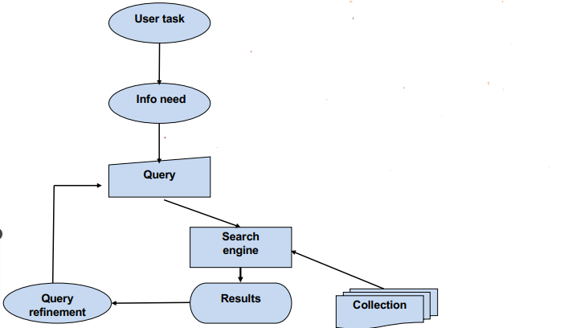

### Acknowledgement {.alert}

**Acknowledgement**: This notebook was inspired and follows in many details the following two sets of slides:

- [Stanford IR and Web Search course slides](https://web.stanford.edu/class/cs276/)
- [Sebastian Hoefstatter's IR course slides](https://github.com/sebastian-hofstaetter/teaching)

# Introduction

## What is Information Retrieval?

- **Finding material** (mostly documents, texts)
- Within a **large unstructured collection** (a lot of text sources)
- Which satisfies an **information need**

A typical setup concentrates on the user stating __a query and getting back a result set__. Based on the results, the user may __refine the query__, adjusting it to get better and more relevant information.

## Typical IR setup

<!-- {width=85%}\ -->

## Query Types

- **Simple Exact Matching**: a word or a list of words, all documents retrieved which match the words
- **Boolean Query**: consists words and boolean operators(AND, OR, NOT) between them
- **Expanded Query**: query is automatically expanded with synonyms and other related words
- **Wildcards**: the query expression(s) may contain wildcards matching any sequence of word-constituent characters
- **Phrases**: query matching consecutive word sequences occurring in the given order
- **Free Text Query**: match the "expressed content" of the query text

# Exact term-matching-based IR

## Implementation details

\large
- Needs significant preprocessing steps
- requires the building of an **inverted index**, which maps terms to document ids which they occur
- requires at least **tokenization**, can be extended with:
  - **stemming** or **lemmatization**
  - **normalization** (spell-checking, spelling-correction)
  - removing **stopwords**

## IMplementation details cont.

{width=85%}

## Inverted index

- Allows to retrieve documents from large collections efficiently
- Having a __dictionary__ containing the terms
- **Binary Bag of words** (terms) representing the term frequency of words in each document
- The BoW vectors will be merged __into the dictionary__ where for each word there is a list called __posting list__ containing __the document ids__ (sometimes term frequencies as well) in __sorted__ way

- Important to choose a suitable data structure for the variable length posting lists (examples: Hash Table, Prefix Tree or Trie, B-Tree or self balancing tree)

## Inverted Index cont.

- Posting lists are variable-length vectors, typically sorted by __docuemnt ID__, to make __merging posting lists__ easier in case of a query

{width=85%}

## Processing different queries with an inverted index

- **Single term** query is trivial
- **Boolean query** can be done efficiently (OR operator requires merging the postings lists)
- **Extensions**:
  - **Phrase Search**:  querying for an exact sequence of words (e.g., finding documents with "functional programming" in that order as a phrase). Solutions include extending the dictionary and recording occurrence positions in the index
  - **Expressions with Wildcards**: if index implemeted as a **Trie** easy ones can be handled.

## Optimization and scaling
\large
Term-based Boolean search dominant for decades, efforts went into:

- compressing inverted index
- dealing with frequent index updates
- designing efficient algorithms when the index is in **external memory**
- scaling up indexing and search by parallelization

## Basic Evaluation of IR systems

Dividing documents into 4 categories based on the given information and the result set returned:

- positives:
  - **true positives**: relevant and in the result set
  - **false positives**: in result set but not relevant
- negatives:
  - **true negatives**: irrelevant and not in the result set
  - **false negatives**: relevant but not in the result set

There is often classification evaluation.

## Basic evaluation metrics:

__Precision:__
$$precision= \frac{TP}{TP+ FP}=\frac{TP}{returned\_documents}$$

__Recall:__
$$recall= \frac{TP}{TP+ FN}=\frac{TP}{relevant\_documents}$$

__$F_1$-Measure:__
$$F_1 = \frac{2\times Presision\times Recall}{Precision + Recall}$$

<!-- $$precision= \frac{\#true\_positives}{\#true\_positives + \#false\_positives}=\frac{\#true\_positives}{\#returned\_documents}$$

$$recall= \frac{\#true\_positives}{\#true\_positives + \#false\_negatives}=\frac{\#true\_positives}{\#relevant\_documents}$$ -->

# Ranked Information Retrieval

## Problem with previous IR system

- crucial simplification: **query-document** matching is **binary** (yes/no)
- ignoring the **ranked list** by relevance for the user
- Boolean term-matching is difficult for most users $\rightarrow$ too big or too small result set.

{width=85%}

## Solution
\large
- switching to a different IR paradigm: **ranked retrieval with free text queries**
  <!-- - query is **NOT** a formula, just a sequence of natural language words -->
  - query is a sequence of natural language words
  - instead of the result set, an **ordered list** of (most relevant) documents
  - the size of the result set does not matter, the user only sees the **Top K**

- needs the introduction of a **scoring model**

## Scoring models

- calculating a document's relevance to a query, sorting documents based on this relevance
- simplest: using Bag of Words vectors to calculate relevance score:

$$
Score(q, d) = \Phi(BoW(q), BoW(d))
$$

Where $BoW(.)$ is simply the function mapping a text to a **dictionary-long vector of term frequencies** (term counts) (of course, with all the complications (stemming, spell-check etc.) discussed concerning the inverted index.

## Scoring models cont.
**Term Frequency**:

- the **more** the term occurs, the larger is term frequency
- But relevance does not increase proportionally, frequently **logarithmic scale** used
\small
 $$
 score(q,d) = \sum_{t\in T_q \cap T_d}\log(1 + \mathrm{tf}(t,d))
 $$

\normalfont
**Inverse Document Frequency**:

- terms which appear in a **smaller number of documents** are more informative (rare occurrences)
\small
 $$
 \mathrm{idf}(t) = \log\left(\frac{|D|}{\mathrm{df}(t)}\right)
 $$

\normalfont
 Where $|D|$ is the number of documents in our collection and $\mathrm{df}(t)$ is the number of documents in which $t$ occurs.

## Tf-Idf

- a term score should be impacted by the document occurrences (IDF)
\small
$$
score(q, d) = \sum_{t\in T_q \cap T_d} \mathrm{TfIdf}(t,d) = \sum_{t\in T_q \cap T_d}\log(1 + \mathrm{tf}(t,d))\log\left(\frac{|D|}{\mathrm{df}(t)}\right)
$$

\normalfont
- it is a family of methods, with several ways to compute:
  - whether to take the log of the TF or not
  - whether the whole vector is normalized
  - whether the query's term Tf-Idf is also used

## Tf-Idf as sparse embeddings

\normalfont

- not only a scoring method but provides an __alternative document representation__
- reweighted term-frequency vector can be useful document representation (__embedding__) in other tasks
- Different metrics for calculating similarities between query and document embeddings:
  - Cosine Similarity 
  - Dot Product
- For finding the topK documents __K-Nearest neighbour__ used (more later)

## BM25 (BestMatch25)

- __Okapi BM25__ introduced in 1994 Okapi IR system
- Important Tf-Idf variant, __the dominant baseline__ in ranked IR
- where calculating the score is:
\small
$$
\sum_{t\in T_q \cap T_d}\frac{\mathrm{tf}(t,d)}{k_1((1-b) + b\frac{\mathrm{dl}(d)}{\mathrm{avgdl}}) + \mathrm{tf}(t,d) } \log\left(\frac{|D| -\mathrm{df}(t) + 0.5}{\mathrm{df}(t) +0.5}\right)
$$

\normalfont
where $\mathrm{dl}(d)$ is the length of $d$, $\mathrm{avgdl}$ is the average document length, and $k_1$ and $b$ are hyperparameters (frequency scaling and length normalization). 

## BM25 cont.

{width=90%}

## Traditional ways of dealing with "semantics"

- Tf-Idf is strictly __term-occurence based__
- does not find documents that are relevant but do not contain terms from the query

__Typical solutions:__

- __Query expansion__: expand the query with terms expressing the same content but with different wording
- __Relevance feedback__: relies on the user's active participation in refining the query
- __Pseudo-relevance-feedback__: __Automates__ relevance feedback by assuming the top k retrieved documents are relevant, refining the query to improve retrieval performance __without user interaction.__

<!-- ## Relevance Feedback cont.

- user formulates a query
- query processed, gives back the topK result
- user indicating which documents are relevant/irrelevant
- system generates improved query, could be several refinement iterations -->

## Multistage ranking with reranking
\large
Using several ranking algorithms sequentially
\large

- using __"cheaper"__ methods on huge amount of documents and use __"expensive"__ methods to refine them
- Each stage receives a set of documents and provides the topK results for the next stage

## Multistage ranking with reranking cont.

{width=70%}

## Evaluating ranked IR systems

Requires a __test dataset__ that contains

- a __collection__ of documents
- __set of queries__ with information need descriptions (manually created or preferably from real-life users)
- __relvance judgemnets__: can be binary or graded (0-4 scale) measures if a retrieved document matches the information needed 

Evaluation metrics based on the relevance judgments:

- __binary metrics__
- __graded metrics__

## Binary Metrics:
- __Mean Reciprocal Rank (MRR)__: The average of the __reciprocal ranks__ of the __first relevant document__ in the ranked result list for the queries:
\small
$$
MRR(Q)= \frac{1}{|Q|}\sum_{q\in Q}\frac{1}{\mathrm{first\_rank}(q) }$$
There are __MRR@k__ variants that consider only the top k results, and for later ones set the reciprocal rank to 0.

\normalfont
- __Mean Average Precision (MAP)__: the mean of the average precision scores across queries, where average precision is the mean precision at each relevant document.
\small
$$
MAP(Q) = \frac{1}{|Q|}\sum_{q\in Q}\frac{\sum_{i=1}^k P(q)@i \cdot Rel(q)_i}{|Rel(q)|}
$$
Here there are MAP@k variants considering only the top k results as well.

## Graded metrics

- for a certain query the __discounted cumulative gain__ for a $D$ ordering of the documents is
\small
$$DCG(D)=\sum_{i=1}^{|D|}\frac{rel(d_i)}{\log(1 + i)}$$

\normalfont
- the __normalized discounted cumulative gain__: is the per query average DCG normalized by comparing it to the "ideal DCG", i.e., the DCG of the perfect ordering, which sorts according to the (graded) relevance:
\small
$$
nDCG(Q) = \frac{1}{|Q|}\sum_{q\in Q}\frac{DCG(D_q)}{DCG(D_q^*)}
$$
This metric is commonly also calculated to the top $k$ documents.

\normalfont

## Test Datasets

Difficult to produce, not a lot of quality datasets

Examples:

- __MS MARCO__: 
  - released by Microsoft, based on real-life Bing queries and answers
  - 5ook queries with human-annotated sparse relevance labels
  - contains documents and passages as answers, over 8 million passages

- __TREC (Text Retrieval Conference)__ datasets:
  - annual conference with IR competitions on diverse tasks and datasets
  - recent one is __TREC-COVID__

## Test Datasets cont. BEIR (Benchmarking IR)

- Super influential benchmark containing 18 tasks and datasets to measure __zero-shot performance__ of IR methods
- An official leaderboard can be found at [EvalAI](https://eval.ai/web/challenges/challenge-page/1897/leaderboard/4475).

{width=50%}

# Search for relevant documents in the Embedding space

## Approximating nearest neighbour search

Let's assume that we have __feature vectors__ ($e^i$) of certain documents ($i\in I$), where $||e^i||_2^2 = 1$.

The retrieval process should return the closest documents to the embedded user query $e^q$.

This is achieved by __classical nearest-neighbor search__. Assuming that $e \in \mathcal{R}^d$ and $|I| = N$ the complexity of retrieval is __$O(Nd)$__.

This scales hard with embedding size (quality) and the number of documents. Searching for the $k$ nearest neighbours is the same.

## Approximating nearest neighbour search cont.

Prebuilt indices can reduce inference time, but memory and building time are still limitations. Approximation is needed for storing and index building.

Possible solutions:

- Hashing
- Quantization
- Tree structure
- Graph-based

The above principles are refined and often combined in practice.

## Hashing

Instead of returning an exact result bins are constructed with a hashing function. The family of LSH (Locality-Sensitive Hashing) functions is used as with them the probability of collision monotonically decreases with the increasing distance of two vectors.

](figures/LSH_hash.png){height=30%}

## Hashing

Complexity is reduced via binning. A fine-grained search is possible after finding the closest bins.
For more advanced solutions refer to [@wang2021comprehensive]!

](figures/LSH_cluster.png){height=45%}

## Tree-based solutions

In tree structures, the branching factor $b$ reduces the search complexity to __$\log_b(N)$__. 

In the case of a binary __KD-tree__ $b=2$ a simple solution for building such a tree is just drawing a hyper-plane at the median orthogonal to the highest-variance data dimension. Then each half is split using the same principle. This continues until each node contains a single element only.

Then combined tree and embedding space search algorithms could be used to find nearest neighbors. For example: __priority search__.

## Priority Search

::: columns

:::: column

First, the node (or cell) containing the query is selected, and then the closest neighbouring tree nodes are visited and bounded by a maximal embedding space distance initialized by the distance between the query and the embedding vector in the query's cell.

::::

:::: column

![Geometric visualization of priority search. From [@silpa2008optimised]](figures/approxnn_priority_search.png){width=95%}

::::

:::

## Quantization

Given a codebook defined by centroids $\mathcal{C} = {c_i | i\in I}$ where $I = {0, 1, ... m-1}$ is finite.

We map $q(\cdot)$ each real vector to the closest centroids. The set of real vectors mapped to $c_i$ is the Voronoi cell of it denoted by $V_i$.

Meaning that $q(x) = \text{arg}\min\limits_{c_i \in C}d(x, c_i)$, where $d(\cdot)$ is the distance function.

$c_i = E_x[x|i] = \int_{V_i}p(x)\cdot x dx$, then should be defined as the centre of the Voronoi cell.

## Product Quantization

Simple quantization is still inefficient as cluster centres are to be calculated using demanding algorithms such as k-means (complexity $O(dm)$). In the case of a simple 1 bit/component $128$-dimensional quantized vector, it would take $m = 2^{128}$ centroids to calculate and store.

That's too much!

Solution: We should factor the vector into multiple segments (similar to MHA).

## Product Quantization

In the case of a vector split into $L$ segments, each can be quantized by its specific quantizer. That means $\mathcal{C} = \mathcal{C}_1 \times \mathcal{C}_2 \times ... \times \mathcal{C}_L$ and $I = I_1 \times I_2 \times ... \times I_L$ should be decomposed into the Cartesian-product of the sub-quantizers and sub-indices.

In this case the complexity is reduced to $O(dm^{\frac{1}{L}})$ according to @jegou2010product.

Distances between quantized values of each segment can be calculated and stored for the search step.

## Product Quantization

Using __pre-computed tables__ of $d(c_i, c_j)$, we can easily calculate the distance of the full vectors $e^i$ and $e^q$. Which, in the Euclidean distance case equals:

\small
$d(e^i, e^q)=d(q(e^i), q(e^q))=\sqrt{\sum\limits_{l \in L} d(q_l(e^i), q_l(e^q))^2}$
\normalsize

This results in an average search complexity of $N$ comparisons plus looking up and summing the corresponding distances in the $L$ lookup tables. This boils down to $O(N + L\ \log L \cdot \log\ \log N )$ if $N>>L$ according to @jegou2010product.

## Product Quantization

![Symmetric search using product-quantized approximate NN, from [@jegou2010product]](figures/prodquant_voronoi.png){height=60%}

## Graph-based

Graph methods build an index, that takes the form that suits neighbor-relationship representation. Such as Delaunay-graphs, relative nearest neighbor graphs, k-nearest neighbor graphs, minimal spanning trees, etc...

![Example graphs to be used as a Graph index for ANN search, from [@wang2021comprehensive]](figures/graph_types.png){height=35%}

## Graph-based

These graphs are hard to construct and store, thus approximation comes in during this building process. Usually, graphs with the __"small world"__ property are built. These networks have the following properties given a regular network's edge rewiring probability $p$:

- __$L(p)$__ shortest path between two vertices on average should be small.
- __$C(p)$__ clustering coefficient (ratio of the fully connected triples (triangles) and all triples in the graph), should be large.

## Small world

![Graphs with different $p$ rewiring probabilities. [@watts1998collective]](figures/small_world_graphs.png){height=50%}

## Small world

![Small world networks are located in the high $C$ low $L$ interval of randomity. [@watts1998collective]](figures/small_world.png){height=50%}

## Building graphs

__NSW (navigable small worlds)__ is used to create navigable small worlds. Here, vertices are iteratively inserted into the network. Connections are selected with a randomity level that creates a small world network while making sure that the whole network is traversable.

__HNSW (hierarchical NSW)__ takes one further step by organizing the nodes and links into layers. Those layers, that have a long link distance should be inserted into the top layer, while smaller distance (later inserted) nodes are placed in the lower layers.

## HNSW inference

::: columns

:::: column

A greedy search algorithm is initialized from one of the top nodes. It then looks for a local minimum (in the layer), and upon finding it switches to a lower layer, until the closest point to the query is found. The algorithm's average complexity is $O(\log(N))$.

::::

:::: column

![HNSW inference from [@malkov2018efficient]](figures/hnsw_infer.png){height=70%}

::::

:::

## Graph inference

In general other graph-based solutions work according to similar principles. They start from a seed vertex, then travel through the graph taking steps in the direction of a lower distance from the query.

![How graph-based ANN search works: [@wang2021comprehensive]](figures/approx_nn_example.png){height=30%}

# References

## References {.allowframebreaks}

\footnotesize
