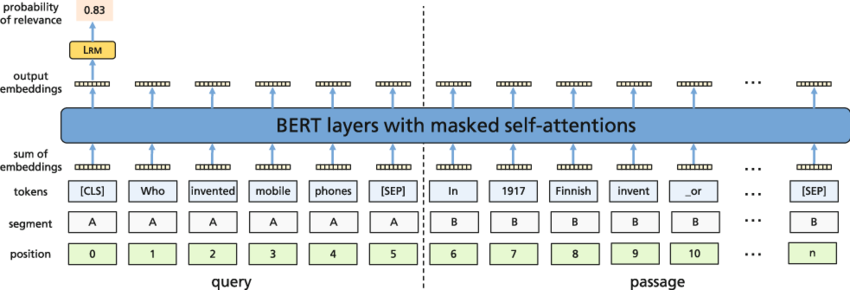

### Acknowledgement {.alert}

**Acknowledgement**: This notebook was inspired and follows in many details the following two sets of slides:

- [Stanford IR and Web Search course slides](https://web.stanford.edu/class/cs276/)
- [Sebastian Hoefstatter's IR course slides](https://github.com/sebastian-hofstaetter/teaching)

# Introduction

## What is Information Retrieval?

- **Finding material** (mostly documents, texts)
- Within a **large unstructered collection** (a lot text source)
- Which satisfies an **information need**

Typical setup is concentrating on the user stating **a query** and gets back a **result set**. Based on the results, the user may **refine the query**:

## Typical IR setup

](figures/typical_setup.png)

<!-- {width=85%}\ -->

## Query Types

- **Simple Exact Matching**: a word or a list of words, all documents retriedved which matches the the words
- **Boolean Query**: consists words and boolean operators(AND, OR, NOT) between them
- **Expanded Query**: query is automatically expanded with synonyms and other related words,
- **Wildcards**: the query expression(s) may contain wildcards matching any sequence of word-constituent characters,
- **Phrases**: query matching consecutive word sequences occurring in the given order.
- **Free Text Query**: match the "expressed content" of the query text.

# Exact term-matching based IR

## Implementation details

- Needs significant processing steps
- requires the building of an **inverted index**, which maps terms to document ids which they occur
- requires at least a **tokenization**, can be extended with:
  - **stemming** or **lemmatization**
  - **normalization** (spell-checking, spelling-correction)
  - removing **stopwords**, which requires part of speech tagging

](figures/inversed_index_construction.png){width=45%}

## Inverted index

- Needs to build a **dictionary** containing the terms
- **Binary Bag of words** (terms) required to represent the documents in terms of the dictionary

- Inverted Index will contain for each term it's **frequency** and **postings**: sorted!! indexes of the documents containig the term

- Important to choose a suitable data structure (examples: Hash Table, Prefix Tree or Trie, B-Tree or self balacing tree)

## Inverted Index cont.

- Posting lists are sparse binary vectors, and represented with variable-length vectors, typically sorted (explained later)

](figures/postings.png){width=85%}

## Processing different querys with inverse index

- **Single term** query is trivial
- **Boolean query** can be done efficiently (OR operator requires merging the postings lists)
- **Extensions**:
  - **Phrase Search**:
  - **Expressions with Wildcards**: if index implemeted as a **Trie** easy ones can be handled.

## Optimization and scaling

Term-based Boolean search dominant for decades, efforts went into:

- compressing reverse index
- dealing with frequent index updates
- designing efficient algorithms when the index is in **external memory**
- scaing up indexing and search by parallelization

## Basic Evalution of IR systems

Deviding documents into 4 categories based on the given information and the result set returned:

- positives:
  - **true positives**: relevant and in the result set
  - **false positives**: in result set but not relevant
- negatives:
  - **true negatives**: irrrelevant and not in the result set
  - **false negatives**: relevant but not in the result set

Basic evaluation metrics:
$$precision= \frac{TP}{TP+ FP}=\frac{TP}{returned\_documents}$$

$$recall= \frac{TP}{TP+ FN}=\frac{TP}{relevant\_documents}$$

<!-- $$precision= \frac{\#true\_positives}{\#true\_positives + \#false\_positives}=\frac{\#true\_positives}{\#returned\_documents}$$

$$recall= \frac{\#true\_positives}{\#true\_positives + \#false\_negatives}=\frac{\#true\_positives}{\#relevant\_documents}$$ -->

# Ranked Information Retrieval

## Problem with previous IR system

- crucial simplication: **query-document** matching is **binary** (yes/no)
- ignoring the **ranked list** by relevance for the user
- Boolean term-matching difficut for most users $\rightarrow$ too big or to small result set.

](figures/queries.png){width=85%}

## Solution

- switching to a different IR paradigm: **ranked retrieval with free text queries**
  - query is **NOT** a formula, just a sequence of natural language words
  - instead of result set, an **ordered list** of (most relevant) documents
  - size of result set does not matter, user only see the **Top K**
- needs the introduction of a **scoring model**

## Scoring models

- calculating a document's relevance to a query, sort documents based on this relevance
- simplest: using Bag of Words vectors to calculate relevance score:

$$
Score(q, d) = \Phi(BoW(q), BoW(d))
$$

where $BoW(.)$ is simply the function mapping a text to a **dictionary-long vector of term frequencies** (term counts) (of course, with all the complications (stemming, spell-check etc.) discussed concerning the inverted index.

## Scoring models cont.
**Term Frequency**:
- the **more** the term occurs, the larger is term frequency
- But relevance does not increase proportionally, frequently **logratihmic scale** used
  $$
  score(q,d) = \sum_{t\in T_q \cap T_d}\log(1 + \mathrm{tf}(t,d))
  $$
**Inversed Document Frequency**:
- terms which appears in a **smaller number of documents** are more informative (rare occurences)
  $$
  \mathrm{idf}(t) = \log\left(\frac{|D|}{\mathrm{df}(t)}\right)
  $$
  Where $|D|$ is the number of documents in our collection and $\mathrm{df}(t)$ is the number of documents in which $t$ occurs.

## Term-Frequency Inversed Document Frequency

- a term score should be impacted by the document occurences (IDF)
- it is a family of methods, several ways to compute:
  - whether take the log of the TF or not
  - whether the whole vector is normalized
  - whether the query's term Tf-Idf are also used

We have a variant of the highly influential Tf-Idf scoring
\small
$$
score(q, d) = \sum_{t\in T_q \cap T_d} \mathrm{TfIdf}(t,d) = \sum_{t\in T_q \cap T_d}\log(1 + \mathrm{tf}(t,d))\log\left(\frac{|D|}{\mathrm{df}(t)}\right)
$$

## Tf-Idf as sparse embeddings

\normalfont

- not only a scoring method, provides an __alternative document representation__
- reweighted termfrequency vector can be useful document representation (__embedding__) in other tasks
- Different metrics for calculating simmilarities between query and document embeddings:
  - Cosine Similarity 
  - Dot Product
- For finding the topK documents __K-Nearest neighbour__ used (more later)

## BM25 (BestMatch25)

- __Okapi BM25__ introduced in 1994 Okapi IR system
- Important Tf-Idf variant, __the dominant baseline__ in ranked IR
- where calculating the score is:
\small
$$
\sum_{t\in T_q \cap T_d}\frac{\mathrm{tf}(t,d)}{k_1((1-b) + b\frac{\mathrm{dl}(d)}{\mathrm{avgdl}}) + \mathrm{tf}(t,d) } \log\left(\frac{|D| -\mathrm{df}(t) + 0.5}{\mathrm{df}(t) +0.5}\right)
$$

\normalfont
where $\mathrm{dl}(d)$ is the length of $d$, $\mathrm{avgdl}$ is the average document length, and $k_1$ and $b$ are hyperparameters (frequency scaling and length normalization). 

## BM25 cont.

](figures/bm25.png){width=90%}

## Traditional ways of dealing with "semantics"

- Tf-Idf is strictly __term-occurence based__
- do not find docuemnts that relevant but does not contain terms from the query

__Typical solutions:__

- __Query expansion__: expand query with terms expressing the same content but with different wording
- __Relevance feedback__: relies on user's active participation in refining the query
- __Pseudo-relevance-feedback__: __Simulates__ relevance feedback by assuming that the top-n documents are the relevant ones.

<!-- ## Relevance Feedback cont.

- user formulates query
- query processed, gives back the topK result
- user indicating whic docuemnts are relevant/irrelevant
- system generates improved  query, could be several refinemnet iterations -->

## Multistage ranking with reranking

Using several ranking algorithms sequentially

- using __"cheaper"__ methods on huge amount of documents and use __"expesive"__ methods to refine them
- Each stage receive set of docuemnets, and provide the topK results for the next stage

{width=95%}

## Evaluating ranked IR systems

Requires a __test dataset__ that contains

- a __collection__ of documents
- __set of queries__ with information need descriptions (manually created or preferably from real-life users)
- __relvance judgemnets__: can be binary or graded (0-4 scale) measures if a rerieved document matches the information needed 

Evaluation metrics based on the relevance judgments:

- __binary metrics__
- __graded metrics__

## Binary Metrics:
- __Mean Reciprocal Rank (MRR)__: The average of the __reciprocal ranks__ of the __first relevant document__ in the ranked result list for the queries:
\small
$$
MRR(Q)= \frac{1}{|Q|}\sum_{q\in Q}\frac{1}{\mathrm{first\_rank}(q) }$$
There are __MRR@k__ variants that consider only the top k results, and for later ones set the reciprocal rank to 0.

\normalfont
- __Mean Average Precision (MAP)__ (pretty difficult to interpret):
\small
$$
MAP(Q) = \frac{1}{|Q|}\sum_{q\in Q}\frac{\sum_{i=1}^k P(q)@i \cdot Rel(q)_i}{|Rel(q)|}
$$
here there are MAP@k variants considering only the top k results as well.

## Graded metrics

- for a certain query the __discounted cumulative gain__ for a $D$ ordering of the documents is
\small
$$DCG(D)=\sum_{i=1}^{|D|}\frac{rel(d_i)}{\log(1 + i)}$$

\normalfont
- the __normalized discounted cumulative gain__: is the per query average DCG normalized by comparing it to the "ideal DCG", i.e., the DCG of the perfect ordering, which sorts according to the (graded) relevance:
\small
$$
nDCG(Q) = \frac{1}{|Q|}\sum_{q\in Q}\frac{DCG(D_q)}{DCG(D_q^*)}
$$
this metric is commonly also calculated to the top $k$ documents.

\normalfont

## Test Datasets

Difficult to produce, not a lot of quality datasets

Examples:

- __MS MARCO__: 
  - released by Microsoft, based on real-life Bing queries and answers
  - 5ook queries with human -annotated sparse relevance lavbels
  - contains documents and passages as answers, over 8 million passages

- __TREC (Text Retrieval Congference)__ datasets:
  - annual conference with IR competitions on diverse tasks and datasets
  - recent one is __TREC-COVID__

## Test Datasets cont. BEIR (Benchmarking IR)

- Super influential benchmark containing 18 tasks and datasets to measure __zero-shot performance__ of IR methods
- An official leader-board can be found at [EvalAI](https://eval.ai/web/challenges/challenge-page/1897/leaderboard/4475).

{width=50%}

# Transformer-based reranking (Mono reranking)

- First influential approach is from @nogueira2020passagererankingbert, with applying pretrain and fine-tuning on the raning task:
  - input is the concatenation of the query and the passage to be ranked (truncated to fit context window)
  - standard binary classification head produces the relevance probability ranking score

{width=85%}

## Advantages Disadvantages

__Pros__:

- results very gooood compared to classical and neural scoring methods
- BERT doubled the performance of BM25

__Cons__:

- models needs to be fine-tuned on IR datasets
- Ranking D documents for Q requires D $\times$ Q inferences
- The scores are diffcult to interpret

## Advantages Disadvantages cont.

{width=95%}

## Expando-Mono-Duo

- originally made by @pradeep2021expandomonoduodesignpatterntext
- improve monoLM architecture by doing __pairwise reranking__
- model gets __(query, document_1, document_2)__ triplets and ouputs the __probability__ of document_1 is more relevant than document_2
- pairwise scores __aggregated__ to produce final ranking (multiple aggregation startegies, simplest is __summing__ or __multiplying__ each pairwise score of a document)
- The complexity is __quadratic__ ("expensive"), can be used as the final stage of a multi-satgae ranking system

## Expando-Mono-Duo cont.

In the original paper authors used it together with akeyword-based and MonoLM stages:

- __Document Expansion__: enrich documents with additions reflects their content, implemented as a Seq-2-Seq model generates possible queries concatenated to the documents. Inverse index built after this
- __Do BM25 keyword retrieval__. It can be enchanced with "pseudo-relevance feedback"
- __Do Mono reranking__
- __Do a Duo pairwise reranking__

Good results reaching more than __0.40MRR@10__ on the MS MARCO dataset

## Expando-Mono-Duo cont.

{width=95%}

# First-stage dense retrieval

- in the multi-stage reranking using __neural methods__ for the first stage instead of the inversed index-based BM25
- replacing inversed index with __nearest neighbor index__ and relying on __nearest neighbour search__
- Challenges:
  - how to generate good __quality embeddings__ for the IR task?
  - What type of __similarity metric__ should be used?
  - How to __build and query__ the index?

](figures/first_stage_retrieve_setup.png){width=65%}

## Document Embedding Computation

- prodcuing document and query embeddings
- For __BERT-style__ models uses __[CLS]__ Token embedding  as final embedding, but can be fine-tuned
- for other Transformer architectures (encoder only, full-stack) __no [CLS] token__, other choices:
  - using the mebedding of a single token ex. OpenAI uses the input-ending [EOS] token embedding (see @neelakantan2022textcodeembeddingscontrastive)
  - __pooling__ the embeddings of different tokens (typically __average__ or __max pooling__)
  - for decoder-only transformer models only the __last token__ has information about the whole document, use that embedding or a __positionally weighted pooling__
- If the embeddings produced have a larger than desirable size then they can be __"downsized"__ by a single linear layer.

## Document Embedding Computation cont.

The __SentenceT5 project__ (see @ni2021sentencet5scalablesentenceencoders) experimented with __3 ways__ of computing sentence embeddings and found that average pooling the encoder embeddings worked best

__Similarity Metrics__: most common is __cosine similarity__ and __Dot product__

## (Pre)Train Embedder model

- embedder models typically pre-trained on __representation learning tasks__ specifically designed for this purpose
- usually this pre-training happens __after a pre-training__ on another task frequently __language modelling__
- Trained with __unsupercised learning__, the dominnat methods are:
  - __Contrastive Learning__: The training task is to map "semantically similar" texts to close representations and randomly sampled pairs of texts to distant ones (see @neelakantan2022textcodeembeddingscontrastive). More on that in the C module
  - __Knowledge Distillation__: Use a more expensive and powerful model, such as a MonoLM or DuoLM as a teacher and train the embedder to approximate their output. 

## Zero-shot vs fine-tuned performance

__Zero-shot dense retrieval__

- results depend on the target domain but BM25 seems a strong baseline
- not-always improved by zero-shot dense retrival model (see @thakur2021beirheterogenousbenchmarkzeroshot for more)
- One possible reason is that the evaluation datasets themselves are biased towards BM25.
- Best is the __BM25 First stage + Transformer-based reranker__ combination

__Fine-tuned dense retireval__:

- significantly better than BM25 baseline
- not significantly better than the best __BM25 First stage + Transformer-based reranker__ combo

<!-- ## Contrastive Learning

- __Positive pairs__ are "neighboring texts on the Internet" while __negatives__ are randomly sampled. 
- The training objective can be, e.g., minimizing nll with the cosine similarity as logit for the binary   classification between positive (nearby) and negative pairs.
- The main challenge is sampling __hard negatives__, simple in-batch sampling strategies can be uninformative.

{width=50%} -->

# Search for relevant documents in the Embedding space

## Approximating nearest neighbour search

Let's assume that we have __feature vectors__ ($e^i$) of certain documents ($i\in I$), where $||e^i||_2^2 = 1$.

The retrieval process should return the closest documents to the embedded user query $e^q$.

This is achieved by __classical nearest-neighbor search__. Assuming that $e \in \mathcal{R}^d$ and $|I| = N$ the complexity of retrieval is __$O(Nd)$__.

This scales hard with embedding size (quality) and the number of documents. Searching for the $k$ nearest neighbors is the same.

## Approximating nearest neighbour search cont.

Prebuilt indices can reduce inference time, but memory and building time are still a limitation. Approximation is needed for storing and index building.

Possible solutions:

- Hashing
- Quantization
- Tree structure
- Graph-based

The above principles are refined and often combined in practice.

## Hashing

Instead of returning an exact result bins are constructed with a hashing function. The family of LSH (Locality-Sensitive Hashing) functions is used as with them the probability of collision monotonically decreases with the increasing distance of two vectors.

](figures/LSH_hash.png){height=30%}

## Hashing

Complexity is reduced via binning. Fine-grained search is possible after finding the closest bins.
For more advanced solutions refer to [@wang2021comprehensive]!

](figures/LSH_cluster.png){height=45%}

## Tree-based solutions

In tree structures, the branching factor $b$ reduces the search complexity to __$\log_b(N)$__. 

In case of a binary __KD-tree__ $b=2$ a simple solution for building such a tree is just drawing a hyper-plane at the median orthogonal to the highest-variance data dimension. Then each half is split using the same principle. This continues until each node contains a single element only.

Then combined tree and embedding space search algorithms could be used to find nearest neighbors. For example: __priority search__.

## Priority search

::: columns

:::: column

First, the node (or cell) containing the query is selected, then the closest neighboring tree nodes are visited bounded by a maximal embedding space distance initialized by the distance between the query and the embedding vector in the query's cell.

::::

:::: column

![Geometric visualization of priority search. From [@silpa2008optimised]](figures/approxnn_priority_search.png){width=95%}

::::

:::

## Quantization

Given a codebook defined by centroids $\mathcal{C} = {c_i | i\in I}$ where $I = {0, 1, ... m-1}$ is finite.

We map $q(\cdot)$ each real vector to the closest centroids. The set of real vectors mapped to $c_i$ is the Voronoi cell of it denoted by $V_i$.

Meaning that $q(x) = \text{arg}\min\limits_{c_i \in C}d(x, c_i)$, where $d(\cdot)$ is the distance function.

$c_i = E_x[x|i] = \int_{V_i}p(x)\cdot x dx$, then should be defined as the center of the Voronoi cell.

## Product Quantization

Simple quantization is still inefficient as cluster centers are to be calculated using demanding algorithms such as k-means (complexity $O(dm)$). In the case of a simple 1 bit/component $128$-dimensional quantized vector, it would take $m = 2^{128}$ centroids to calculate and store.

That's too much!

Solution: We should factor the vector into multiple segments (similar to MHA).

## Product Quantization

In case of a vector split into $L$ segments, each can be quantized by its specific quantizer. That means $\mathcal{C} = \mathcal{C}_1 \times \mathcal{C}_2 \times ... \times \mathcal{C}_L$ and $I = I_1 \times I_2 \times ... \times I_L$ should be decomposed into the Cartesian-product of the sub-quantizers and sub-indices.

In this case the complexity is reduced to $O(dm^{\frac{1}{L}})$ according to @jegou2010product.

Distances between quantized values of each segment can be calculated and stored for the search step.

## Product Quantization

Using __pre-computed tables__ of $d(c_i, c_j)$, we can easily calculate the distance of the full vectors $e^i$ and $e^q$. Which, in the Euclidean distance case equals:

\small
$d(e^i, e^q)=d(q(e^i), q(e^q))=\sqrt{\sum\limits_{l \in L} d(q_l(e^i), q_l(e^q))^2}$
\normalsize

This results in an average search complexity of $N$ comparisons plus looking up and summing the corresponding distances in the $L$ lookup tables. This boils down to $O(N + L\ \log L \cdot \log\ \log N )$ if $N>>L$ according to @jegou2010product.

## Product Quantization

![Symmetric search using product-quantized approximate NN, from [@jegou2010product]](figures/prodquant_voronoi.png){height=60%}

## Graph-based

Graph methods build an index, that takes the form that suits neighbor-relationship representation. Such as Delaunay-graphs, relative nearest neighbor graphs, k-nearest neighbor graphs, minimal spanning trees, etc...

![Example graphs to be used as a Graph index for ANN search, from [@wang2021comprehensive]](figures/graph_types.png){height=35%}

## Graph-based

These graphs are hard to construct and store, thus approximation comes in during this building process. Usually, graphs with the __"small world"__ property are built. These networks have the following properties given a regular network's edge rewiring probability $p$:

- __$L(p)$__ shortest path between two vertices on average should be small.
- __$C(p)$__ clustering coefficient (ratio of the fully connected triples (triangles) and all triples in the graph), should be large.

## Small world

![Graphs with different $p$ rewiring probabilities. [@watts1998collective]](figures/small_world_graphs.png){height=50%}

## Small world

![Small world networks are located in the high $C$ low $L$ interval of randomity. [@watts1998collective]](figures/small_world.png){height=50%}

## Building graphs

__NSW (navigable small worlds)__ is used to create navigable small worlds. Here, vertices are iteratively inserted into the network. Connections are selected with a randomity level that creates a small world network while making sure that the whole network is traversable.

__HNSW (hierarchical NSW)__ takes one further step by organizing the nodes and links into layers. Those layers, that have a long link distance should be inserted into the top layer, while smaller distance (later inserted) nodes are placed in the lower layers.

## HNSW inference

::: columns

:::: column

A greedy search algorithm is initialized from one of the top nodes. It then looks for a local minimum (in the layer), and upon finding it switches to a lower layer, until the closest point to the query is found. The algorithm's average complexity is $O(\log(N))$.

::::

:::: column

![HNSW inference from [@malkov2018efficient]](figures/hnsw_infer.png){height=70%}

::::

:::

## Graph inference

In general other graph-based solutions work according to similar principles. They start from a seed vertex, then travel through the graph taking steps in the direction of a lower distance from the query.

![How graph-based ANN search works: [@wang2021comprehensive]](figures/approx_nn_example.png){height=30%}

## Late interaction model

- compromise between the document-query based mebedding pair (default in first stage dense retrieval) and full interaction (like Mono reranking)
- most notable is Colbert (see @khattab2020colbertefficienteffectivepassage)

## Calculating score between document and query

- encoding both into a sequence of contectual token embedings
- for each query embedding cosine similarity calculated with each document embedding and maximal similarity recorded as the query's token similarity score
- final score is the sum of all token scores.

{width=50%}

## Advantages and disadvantages

__Pros:__

- (query, document) score is relatively lightweigth compared to complex SOTA rerankers
- performance can be still competitive with them

__Cons:__

- __huge index__ without sophisticated compression -- the Colbert paper reports that Wikipedia's index was 600GB!!!
- __increased search latency__: scoring each document is still more expensive than just taking a __single__ dot product or cosine similarity!

## Improvements

Introduced by @santhanam2022colbertv2effectiveefficientretrieval, trying to address the issues mentioned above:

- __sophisticated index compression__: only __residual__ contextual token representations are stored in a radically __quantized__ form (based on KNN clustering).
- __fully score only promising documents__: prefilters documents by first doing individual NN searches for the individual query word embeddings and collecting the highest ranked documents, but this brings the system close to late stage reranking.

# Enchanced Sparse representations

## Enchanced Sparse representations

Previous representations like BM25 work with BoW (Bag-of-Words) which are:

- __static vectors__
- __over interpretable dimensions__ (the dimensions are terms in the dictionary)

Another important aspect of these vectors next to interpretability is they can be used easily by traditional search engines based on __sparsed vector indexes__.

## DocT5Query

- used by previously mentioned model __Expando-Mono-Duo__, where a Seq-2-Seq model is trained for generate queries for every document, which were appended to the indexing
- this approaach (among others) called __DocT5Query__ (see @nogueira2019documentexpansionqueryprediction)

{width=45%}

## SPARTA (Sparse Transformer Matching)

- introduced by @zhao2020spartaefficientopendomainquestion, trains a neural ranker working with full token-level interaction matrix 
- query tokens represented by __static embeddings__, while document embeddings are __contextual__

{width=65%}

## SPARTA (Sparse Transformer Matching) cont.

For any document ("answer candidate"), the query token scores indicate semantic closeness to dictionary terms. These sparse scores, shaped by the 
b bias and ReLU, serve as a __"synthetic BoW representation,"__ capturing the document's content more effectively than the original.

\
> For example, if the answer sentence is “Bill Gates founded Microsoft”,
a SPARTA index will not only contain the tokens
in the answer, but also include relevant terms, e.g.
who, founder, entrepreneur and etc. (From the SPARTA paper.)
>

Importantly, these "synthetic BoW" representations can be __calculated during indexing__ and __used in a traditional reverse index__.

## SPLADE (SParse Lexical AnD Expansion model)

- most influential, transformer-based using sparse represenation, dominated IR leaderboards across sparse alternatives
- it builds on is to use and fine-tune (!) the __masked language modeling head__ output of BERT-type pretrained transformer encoders as local importance scores for dictionary elements:

## Expanded SPLADE 

- SPLADE uses traditional dictionary representations, making it more interpretable and compatible with inverted-index systems.
- Problem: 
  - __Subword-Based Dictionary:__ SPLADE relies on a transformer's tokenizer, reducing interpretability and index integration.
- The paper @dudek2023learning solves these by modifying the SPLADE output heads to work with any independently specified dictionary, and the results show that this can be done __without performance degradation__.

## Hybrid Search

- Combinig dense and sparse approaches, to overcome each others weaknesses
- running both of them independently to obtain two top-K scored result lists,
- standardizing the two score lists (e.g., min-max scaling them to [0, 1])
- and computing the final scores as the (possibly weighted) average of the two scores for each documents.

# Conclusion

## Which approach is optimal?

So which approach should one use? There are too many moving parts:

- domain
- document collection size
- availability of training data
- availability of pretrained models
- available computational resources

## Which approach is optimal? cont.

- huge difference where dense retrieval methods can be __fine-tuned__ and __zero-shot situations__
- if data available fine-tuning produce best results (but huge cost)
- zero-shot is cimplicated:

{width=65%}

## Which approach is optimal? cont.

- hybrid approaches getting more attention

{width=60%}

## Which approach is optimal? cont.

__Conclusion__: In a __really zero-shot__ setting, one can do worse than using a __hybrid combination__ of

- __good general IR-tuned (!!) dense representation__ based scoring (typically using dot-product or cosine), and 
- a __SOTA sparse representation__ (usually SPLADE) based scoring.  

# References

## References {.allowframebreaks}

\footnotesize
