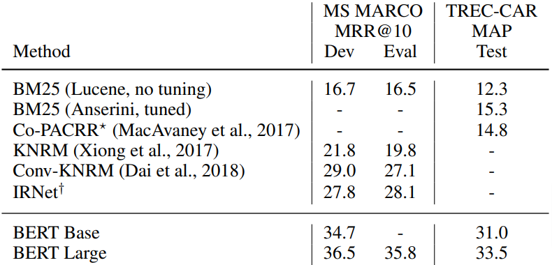
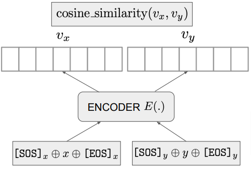
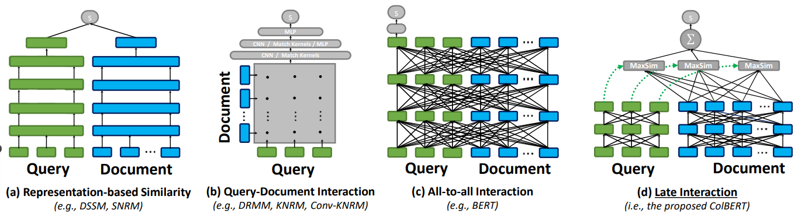
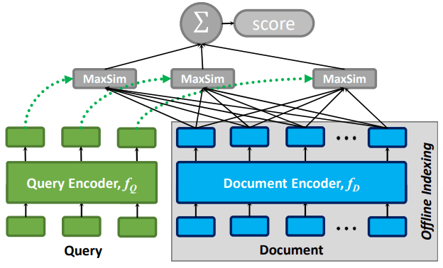
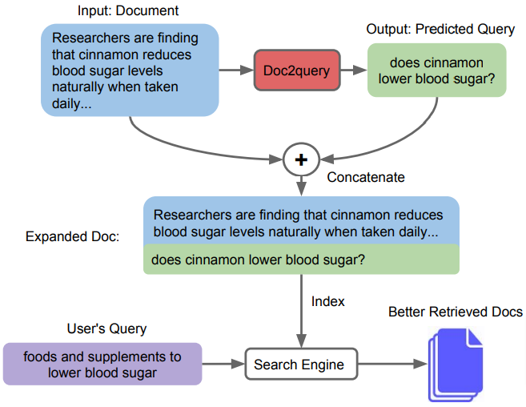
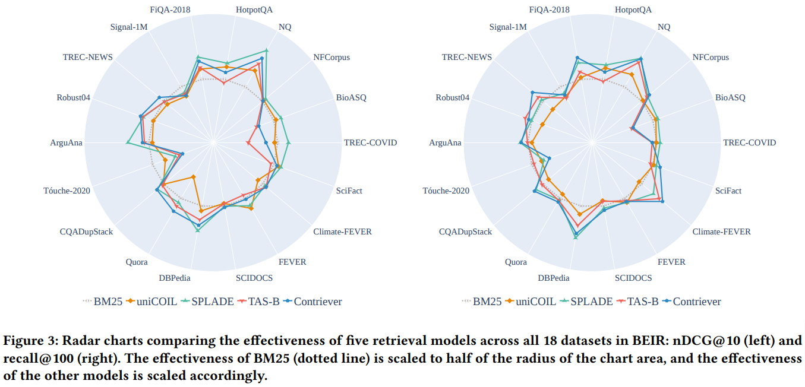

### Acknowledgement {.alert}

**Acknowledgement**: This notebook was inspired and follows in many details the following two sets of slides:

- [Stanford IR and Web Search course slides](https://web.stanford.edu/class/cs276/)
- [Sebastian Hoefstatter's IR course slides](https://github.com/sebastian-hofstaetter/teaching)

# Transformer-based reranking (Mono reranking)

- First influential approach is from @nogueira2020passagererankingbert, with applying pretrain and fine-tuning on the raning task:
  - input is the concatenation of the query and the passage to be ranked (truncated to fit context window)
  - standard binary classification head produces the relevance probability ranking score

{width=85%}

## Advantages Disadvantages

__Pros__:

- results very gooood compared to classical and neural scoring methods
- BERT doubled the performance of BM25

__Cons__:

- models needs to be fine-tuned on IR datasets
- Ranking D documents for Q requires D $\times$ Q inferences
- The scores are diffcult to interpret

## Advantages Disadvantages cont.

{width=95%}

## Expando-Mono-Duo

- originally made by @pradeep2021expandomonoduodesignpatterntext
- improve monoLM architecture by doing __pairwise reranking__
- model gets __(query, document_1, document_2)__ triplets and ouputs the __probability__ of document_1 is more relevant than document_2
- pairwise scores __aggregated__ to produce final ranking (multiple aggregation startegies, simplest is __summing__ or __multiplying__ each pairwise score of a document)
- The complexity is __quadratic__ ("expensive"), can be used as the final stage of a multi-satgae ranking system

## Expando-Mono-Duo cont.

In the original paper authors used it together with akeyword-based and MonoLM stages:

- __Document Expansion__: enrich documents with additions reflects their content, implemented as a Seq-2-Seq model generates possible queries concatenated to the documents. inverted index built after this
- __Do BM25 keyword retrieval__. It can be enchanced with "pseudo-relevance feedback"
- __Do Mono reranking__
- __Do a Duo pairwise reranking__

Good results reaching more than __0.40MRR@10__ on the MS MARCO dataset

## Expando-Mono-Duo cont.

{width=95%}

# First-stage dense retrieval

- in the multi-stage reranking using __neural methods__ for the first stage instead of the inverted index-based BM25
- replacing inverted index with __nearest neighbor index__ and relying on __nearest neighbour search__
- Challenges:
  - how to generate good __quality embeddings__ for the IR task?
  - What type of __similarity metric__ should be used?
  - How to __build and query__ the index?

](figures/first_stage_retrieve_setup.png){width=65%}

## Document Embedding Computation

- prodcuing document and query embeddings
- For __BERT-style__ models uses __[CLS]__ Token embedding  as final embedding, but can be fine-tuned
- for other Transformer architectures (encoder only, full-stack) __no [CLS] token__, other choices:
  - using the mebedding of a single token ex. OpenAI uses the input-ending [EOS] token embedding (see @neelakantan2022textcodeembeddingscontrastive)
  - __pooling__ the embeddings of different tokens (typically __average__ or __max pooling__)
  - for decoder-only transformer models only the __last token__ has information about the whole document, use that embedding or a __positionally weighted pooling__
- If the embeddings produced have a larger than desirable size then they can be __"downsized"__ by a single linear layer.

## Document Embedding Computation cont.

The __SentenceT5 project__ (see @ni2021sentencet5scalablesentenceencoders) experimented with __3 ways__ of computing sentence embeddings and found that average pooling the encoder embeddings worked best

__Similarity Metrics__: most common is __cosine similarity__ and __Dot product__

## (Pre)Train Embedder model

- embedder models typically pre-trained on __representation learning tasks__ specifically designed for this purpose
- usually this pre-training happens __after a pre-training__ on another task frequently __language modelling__
- Trained with __unsupercised learning__, the dominnat methods are:
  - __Contrastive Learning__: The training task is to map "semantically similar" texts to close representations and randomly sampled pairs of texts to distant ones (see @neelakantan2022textcodeembeddingscontrastive). More on that in the C module
  - __Knowledge Distillation__: Use a more expensive and powerful model, such as a MonoLM or DuoLM as a teacher and train the embedder to approximate their output. 

## Zero-shot vs fine-tuned performance

__Zero-shot dense retrieval__

- results depend on the target domain but BM25 seems a strong baseline
- not-always improved by zero-shot dense retrival model (see @thakur2021beirheterogenousbenchmarkzeroshot for more)
- One possible reason is that the evaluation datasets themselves are biased towards BM25.
- Best is the __BM25 First stage + Transformer-based reranker__ combination

__Fine-tuned dense retireval__:

- significantly better than BM25 baseline
- not significantly better than the best __BM25 First stage + Transformer-based reranker__ combo

<!-- ## Contrastive Learning

- __Positive pairs__ are "neighboring texts on the Internet" while __negatives__ are randomly sampled. 
- The training objective can be, e.g., minimizing nll with the cosine similarity as logit for the binary   classification between positive (nearby) and negative pairs.
- The main challenge is sampling __hard negatives__, simple in-batch sampling strategies can be uninformative.

{width=50%} -->

## Late interaction model

- compromise between the document-query based mebedding pair (default in first stage dense retrieval) and full interaction (like Mono reranking)
- most notable is Colbert (see @khattab2020colbertefficienteffectivepassage)

## Calculating score between document and query

- encoding both into a sequence of contectual token embedings
- for each query embedding cosine similarity calculated with each document embedding and maximal similarity recorded as the query's token similarity score
- final score is the sum of all token scores.

{width=50%}

## Advantages and disadvantages

__Pros:__

- (query, document) score is relatively lightweigth compared to complex SOTA rerankers
- performance can be still competitive with them

__Cons:__

- __huge index__ without sophisticated compression -- the Colbert paper reports that Wikipedia's index was 600GB!!!
- __increased search latency__: scoring each document is still more expensive than just taking a __single__ dot product or cosine similarity!

## Improvements

Introduced by @santhanam2022colbertv2effectiveefficientretrieval, trying to address the issues mentioned above:

- __sophisticated index compression__: only __residual__ contextual token representations are stored in a radically __quantized__ form (based on KNN clustering).
- __fully score only promising documents__: prefilters documents by first doing individual NN searches for the individual query word embeddings and collecting the highest ranked documents, but this brings the system close to late stage reranking.

# Enchanced Sparse representations

## Enchanced Sparse representations

Previous representations like BM25 work with BoW (Bag-of-Words) which are:

- __static vectors__
- __over interpretable dimensions__ (the dimensions are terms in the dictionary)

Another important aspect of these vectors next to interpretability is they can be used easily by traditional search engines based on __sparsed vector indexes__.

## DocT5Query

- used by previously mentioned model __Expando-Mono-Duo__, where a Seq-2-Seq model is trained for generate queries for every document, which were appended to the indexing
- this approaach (among others) called __DocT5Query__ (see @nogueira2019documentexpansionqueryprediction)

{width=45%}

## SPARTA (Sparse Transformer Matching)

- introduced by @zhao2020spartaefficientopendomainquestion, trains a neural ranker working with full token-level interaction matrix 
- query tokens represented by __static embeddings__, while document embeddings are __contextual__

{width=65%}

## SPARTA (Sparse Transformer Matching) cont.

For any document ("answer candidate"), the query token scores indicate semantic closeness to dictionary terms. These sparse scores, shaped by the 
b bias and ReLU, serve as a __"synthetic BoW representation,"__ capturing the document's content more effectively than the original.

\
> For example, if the answer sentence is “Bill Gates founded Microsoft”,
a SPARTA index will not only contain the tokens
in the answer, but also include relevant terms, e.g.
who, founder, entrepreneur and etc. (From the SPARTA paper.)
>

Importantly, these "synthetic BoW" representations can be __calculated during indexing__ and __used in a traditional reverse index__.

## SPLADE (SParse Lexical AnD Expansion model)

- most influential, transformer-based using sparse represenation, dominated IR leaderboards across sparse alternatives
- it builds on is to use and fine-tune (!) the __masked language modeling head__ output of BERT-type pretrained transformer encoders as local importance scores for dictionary elements:

## Expanded SPLADE 

- SPLADE uses traditional dictionary representations, making it more interpretable and compatible with inverted-index systems.
- Problem: 
  - __Subword-Based Dictionary:__ SPLADE relies on a transformer's tokenizer, reducing interpretability and index integration.
- The paper @dudek2023learning solves these by modifying the SPLADE output heads to work with any independently specified dictionary, and the results show that this can be done __without performance degradation__.

## Hybrid Search

- Combinig dense and sparse approaches, to overcome each others weaknesses
- running both of them independently to obtain two top-K scored result lists,
- standardizing the two score lists (e.g., min-max scaling them to [0, 1])
- and computing the final scores as the (possibly weighted) average of the two scores for each documents.

# Conclusion

## Which approach is optimal?

So which approach should one use? There are too many moving parts:

- domain
- document collection size
- availability of training data
- availability of pretrained models
- available computational resources

## Which approach is optimal? cont.

- huge difference where dense retrieval methods can be __fine-tuned__ and __zero-shot situations__
- if data available fine-tuning produce best results (but huge cost)
- zero-shot is cimplicated:

{width=65%}

## Which approach is optimal? cont.

- hybrid approaches getting more attention

{width=60%}

## Which approach is optimal? cont.

__Conclusion__: In a __really zero-shot__ setting, one can do worse than using a __hybrid combination__ of

- __good general IR-tuned (!!) dense representation__ based scoring (typically using dot-product or cosine), and 
- a __SOTA sparse representation__ (usually SPLADE) based scoring.  

# References

## References {.allowframebreaks}

\footnotesize
