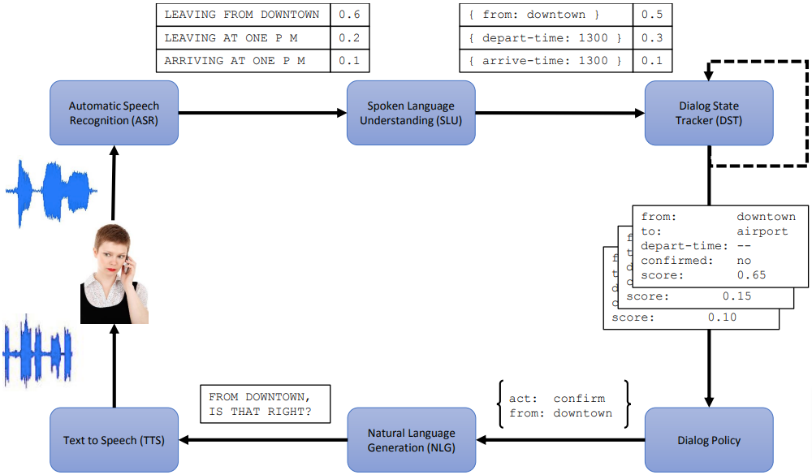
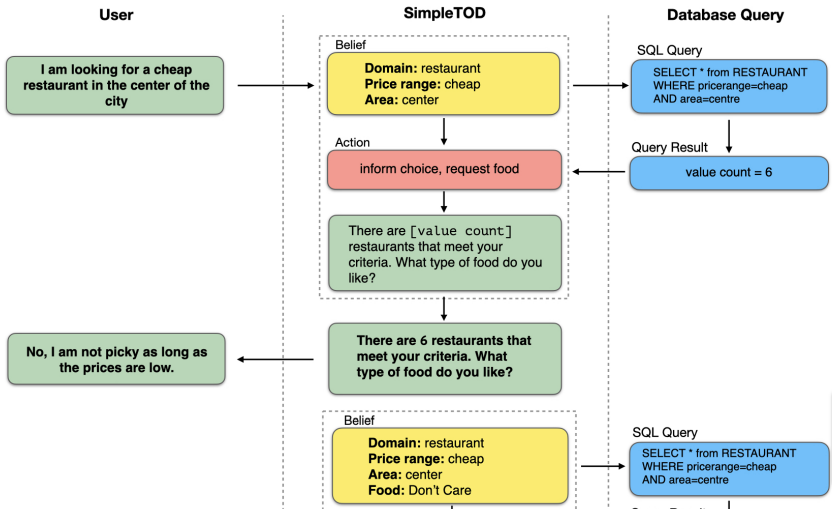

# Acknowledgement

## Acknowledgement {.alert}

The following slides are based on and very closely follow the online freely
available Chapter 24 of Jurafsky and Martin's *Speech and Language Processing
3rd ed.* [-@jurafsky2019speech], please read the original!

# Dialogue system types

## Task-oriented dialogue agent

The goal of the dialogue is to complete a task or tasks in a predefined task
set, e.g., order something, make a call, transfer money, get directions etc.

##  Chatbot

-   The goal is open-ended and unstructured, extended conversation.
-   There is no predetermined task (or set of tasks) whose
    successful execution would be the goal.
-   The main result in many cases is simply "entertainment".
-   Can be additional components of mainly task-oriented systems.

# Chatbot requirements

The system needs to be able to reproduce the important features of
human-human conversations, among others

-   **grounding**: there is a constantly evolving **common ground**
    established by the speakers who constantly acknowledge understanding
    what the other said.
-   **adjacency pairs**: different utterance types are associated with
    different expectations as to the next utterance:
    -   question $\Rightarrow$ answer
    -   proposal $\Rightarrow$ acceptance
    -   compliment $\Rightarrow$ downplayer etc.
-   **inferences** based on the assumption of utterances being
    -   relevant,
    -   informative,
    -   truthful, and
    -   clear and brief (or at least that the speakers aim at this).

# Chatbot approaches

1.  Rule-based

    Traditionally, rule-based, "pattern-match and substitute" type
    systems were used, famously

    -   **Eliza** (1966), simulating a Rogerian psychologist, and
    -   **PARRY** (1971), for studying schizophrenia.

2.  Corpus-based

    The more modern alternative is, of course, to build a
    **corpus-based** system, which is trained on a data set containg a
    large number of dialogues.

# Corpus-based chatbot architectures

-   **Response by retrieval** Respond with the utterance in the data set
    that is
    -   most similar to the last turn, or
    -   is the response to the utterance which is most similar to the
        last turn.
    -   similarity can be totally pretrained, or trained/fine-tuned
        embedding based.
-   **Response by generation** Train a genator model on the data set,
    typical architectures:
    -   RNN or Transformer based encoder-decoder, or
    -   "Predict next", language-model, e.g., a GPT-like architecture.

# Task oriented dialog agents

![Traditional frame-based architecture [from @jurafsky2019speech].](figures/frame.png)

# Task oriented dialog agents cont.

The task is to determine the domain, intent, and slot fillers for each
user utterance. E.g, for

*Show me morning flights from Boston to San Francisco on Tuesday*

We want the analysis

  ------------- ---------------
  DOMAIN        AIR-TRAVEL
  INTENT        SHOW-FLIGHTS
  ORIGIN-CITY   Boston
  ORIGIN-DATE   Tuesday
  ORIGIN-TIME   morning
  DEST-CITY     San Francisco
  ------------- ---------------

# Dialog-state systems

{width=85%}

# Dialog-state systems cont.

# Dialog-state systems cont.

In modern implementations,

-   The **NLU** (natural language understanding) component can be
    implemented by text classifiers (domain, intent) and sequence
    labeling (slot/entity detection) models,
-   The **Dialog State Tracker** uses the NLU module to keep track of
    slot values and type of dialogue act that was performed.
-   The **Dialogue Policy** decides which action to take next, on the
    basis of the current dialogue state and maybe history -- this is
    also a classifier.
-   Finally, the **NLG** (natural language generation) component
    generates the actual utterance based on the required action and the
    dialog state. This can be rule/template-based, or by an
    encoder-decoder model, which possibly only produces a delexicalized
    template.

# End-to-end trained dialog-state systems cont.

{width=85%}

# End-to-end trained dialog-state systems cont.

{width=85%}

# References
