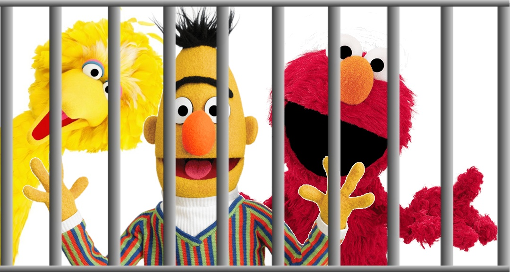

# LLM Zoo

## LLM Zoo

We have already seen a few denizens of the Zoo...
```{=latex}
\begin{center}
```

{height=45%}

```{=latex}
\end{center}
```

But there are many more! In this lecture, we take a look at some of the most
important or interesting language models.

# The BERT Family

## BERT

As a reminder: BERT [@devlin2018bert] is a contextual (sub)word representation
based on the **transformer encoder** architecture. It was trained on two
self- supervised tasks:

- masked language modeling (MLM)
- next sentence prediction (NSP)

It is available in several sizes:

- Base: 12 Transformer blocks, 110M parameters
- Large: 24 Transformer blocks, 340M parameters

BERT begat a whole family of models, which kept the architecture and sought
improvements by fine-tuning the details.

## Hyperparameters

BERT came with two new training task, but NSP proved to be too easy.

- ALBERT replaced it with sentence order prediction;
- RoBERTa dropped the task entirely.

RoBERTa [@liu2019roberta] proved the importance of training _longer_ and on
_more_ data.

- data size: 16GB $\rightarrow$ 160GB
- batch size: 256 $\rightarrow$ 8K
- training steps: 100K (relative $\rightarrow$ 500K
- dynamic masking: the `[MASK]` tokens change each run

These changes yielded a $3-4\%$ improvement on various tasks (meaning e.g. $60\%$
error reduction on SQuaD).


## Spans

BERT's masking scheme (`[MASK]` replaces a single token) makes it hard to use
in generation (e.g. for answer filling in question answering):

_What is the oldest settlement on the Orkneys?_

- `The oldest settlement is [MASK] .`
- `The oldest settlement is [MASK] [MASK] .`
- ...

(Skara Brae is actually 4 tokens: `S ##kara B ##rae`)

Another problem is that the masked tokens are presumed conditionally
independent.

## Spans cont.

SpanBERT [@joshi-etal-2020-spanbert]

- masks random-length spans (3.8 tokens on average)
- predicts them based on the tokens around the span: $\mathbf{y}_i = f(\mathbf{x}_{s-1}, \mathbf{x}_{e+1}, \mathbf{p}_{i-s+1})$
- introduces a Span Boundary Objective $\mathcal{L}_{SBO}$ so that

\vspace{-2em}
\begin{align*}
  \mathcal{L}(x_i) &= \mathcal{L}_{MLM}(x_i) + \mathcal{L}_{SBO}(x_i) \\
                   &= -\log P(x_i|\mathbf{x}_i) - \log P(x_i|\mathbf{y}_i)
\end{align*}

XLNet [@yang2019xlnet]

- does not use `[MASK]` tokens at all
- **autoregressive** training task on a **permutated** sequence (still
  bidirectional context!) 
- models dependencies between context and target


# References {.allowframebreaks} 
\footnotesize
