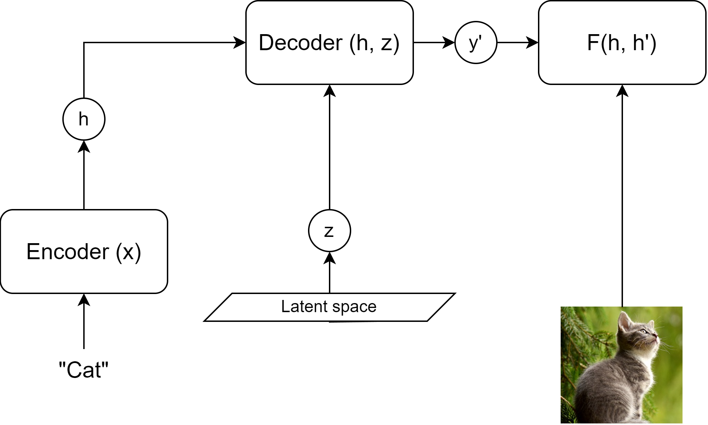
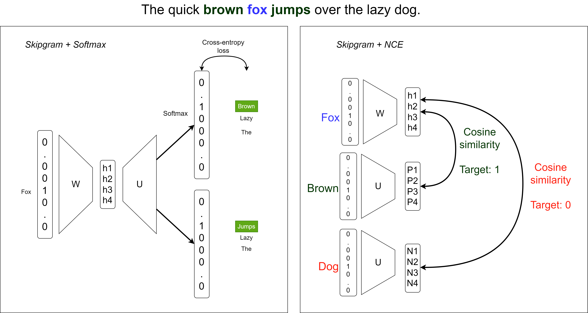

# Augmenting Language Models

## Motivations
From the early 2020s language models could be characterized by the following properties:

- Few-shot learners [@brown2020language].
- Capable of inferring logical problems. [@chang2023survey]
- Prone to hallucinations (due to active knowledge gaps). [@zheng2023does]
- Able to follow instructions in a step-by-step manner. [@wei2022chain]

## Motivations

Knowledge can be injected in a few-shot manner, which could be interpreted to overcome hallucinations. With step-by-step processing, an augmented model can use low-complexity knowledge sources to answer complex questions.

{height=45%}

## Connection to prompting

There are two ways of injecting external information into a transformer-like Language Model:

- Vector sequence in the embedding space (cross-attn, prefix, etc.)
- Injecting text information to a prompt (special tokens, format etc.)

Important! Using proper prompting techniques should be considered alongside augmentation. Transformer-based models' context windows have a fixed length, which is a limitation!

# Retrieval Augmentation

## Retrieval

Easiest solution: Retrieval Augmented Generation (RAG).

Take an external knowledge base and query it. The resulting answer could then be utilized by the model.

Example prompt:

\footnotesize
Answer the following question using the provided context only!

Question: \<USER_INPUT\>

Context: \<RETRIEVED_CONTEXT\>

Answer: \<LLM\>

## How to retrieve information?

The most common methods for finding related information are:

- Keyword-based search (occurence, regex, etc.)
- **Vector-similarity search (TF-IDF, LM-embedding, etc.)**
- Relational queries
- Taxonomy-based search (lexicon, wiki, WordNet)
- Direct access (links, documents)

## Vector-similarity based search methods

Let's assume that we have feature vectors ($e^i$) of certain documents ($i\in I$), where $||e^i||_2^2 = 1$.

The retrieval process should return the closest documents to the embedded user query $e^q$.

This is achieved by classical nearest-neighbor search. Assuming that $e \in \mathcal{R}^d$ and $|I| = N$ the complexity of retrieval is $O(Nd)$.

This scales hard with embedding size (quality) and the number of documents. Searching for the $k$ nearest neighbors is the same.

## Approximate nearest neighbor search

Prebuilt indices can reduce inference time, but memory and building time are still a limitation. Approximation is needed for storing and index building.

Possible solutions:

- Hashing
- Quantization
- Tree structure
- Graph-based

## Hashing

Instead of returning an exact result bins are constructed with a hashing function. The family of LSH (Locality-Sensitive Hashing) functions is used as with them the probability of collision monotonically decreases with the increasing distance of two vectors.

](figures/LSH_hash.png){height=30%}

## Hashing

Complexity is reduced via binning. Fine-grained search is possible after finding the closest bins.
For more advanced solutions refer to [@wang2021comprehensive]!

](figures/LSH_cluster.png){height=45%}

## Tree-based solutions

In tree structures, the branching factor $b$ reduces the search complexity to $log_b(N)$. 

In case of a binary KD-tree $b=2$ a simple solution for building such a tree is just drawing a hyper-plane at the median orthogonal to the highest-variance data dimension. Then each half is split using the same principle. This continues until each node contains a single element only.

Then combined tree and embedding space search algorithms could be used to find nearest neighbors. For example: priority search.

## Priority search

::: columns

:::: column

First, the node (or cell) containing the query is selected, then the closest neighboring tree nodes are visited bounded by a maximal embedding space distance initialized by the distance between the query and the embedding vector in the query's cell.

::::

:::: column

![Geometric visualization of priority search. From [@silpa2008optimised]](figures/approxnn_priority_search.png){width=95%}

::::

:::

## Quantization

Given a codebook defined by centroids $\mathcal{C} = {c_i | i\in I}$ where $I = {0, 1, ... m-1}$ is finite.

We map $q(.)$ each real vector to the closest centroids. The set of real vectors mapped to $c_i$ is the Voronoi cell of it denoted by $V_i$.

Meaning that $q(x) = \text{arg}\min\limits_{c_i \in C}d(x, c_i)$, where $d(.)$ is the distance function.

$c_i = E_x[x|i] = \int_{V_i}p(x)\cdot x dx$, then should be defined as the center of the Voronoi cell.

## Product Quantization

Simple quantization is still inefficient as cluster centers are to be calculated using demanding algorithms such as k-means (complexity $O(dm)$). In the case of a simple 1 bit/component $128$-dimensional quantized vector, it would take $m = 2^{128}$ centroids to calculate and store.

That's too much!

Solution: We should factor the vector into multiple segments (similar to MHA).

## Product Quantization

In case of a vector split into $L$ segments, each can be quantized by its specific quantizer. That means $\mathcal{C} = \mathcal{C}_1 \times \mathcal{C}_2 \times ... \times \mathcal{C}_L$ and $I = I_1 \times I_2 \times ... \times I_L$ should be decomposed into the Cartesian-product of the sub-quantizers and sub-indices.

In this case the complexity is reduced to $O(dm^{\frac{1}{L}})$ according to [@jegou2010product].

Distances between quantized values of each segment can be calculated and stored for the search step.

## Product Quantization

Using pre-computed tables of $d(c_i, c_j)$, we can easily calculate the distance of the full vectors $e^i$ and $e^q$. Which, in the Euclidean distance case equals:

\small
$d(e^i, e^q)=d(q(e^i), q(e^q))=\sqrt{\sum\limits{l \in L}d(q_l(e^i), q_l(e^q))}$
\normalsize

This results in an average search complexity of $N$ comparisons plus looking up and summing the corresponding distances in the $L$ lookup tables. This boils down to $O(N + L\ log L \cdot log\ log N )$ if $N>>L$ according to [@jegou2010product].

## Graph-based

Graph methods excel in 

![How graph-based ANN search works: [@wang2021comprehensive]](figures/approx_nn_example.png){height=30%}

## Approximate nearest neighbor search

Approximation is needed to successfully capture the graph construction and search problem effectively.

## Classical search

## Embedding models

## RAG

## Entity-knowledge base

## RAG pre-trained models (Retro-style)

# Tooling

## AutoGPT (Inner monologue)

## API calling

## Tool-finetuned models

# References {.allowframebreaks} 
\footnotesize

<!-- 
# Self-supervised learning

## Main objective
Self-supervised learning (SSL) aims to obtain supervision from the data itself.

"Predict everything from everything else."   
*Yann Lecun*

The data is partially known, and partially unknown.
An underlying structure of the data is utilized (e.g. sequentiality in language modeling).

## Main objective

![From [@dawid2023introduction]](figures/ssl_meme.png){height=50%}

Why not reinforcement learning?   
*Trial-and-error is ineffective.*

## Advantages

Self-supervised learning:

- Reduces the cost and complexity of labeling
- Adds extra generalization capabilities to the system
- Gives control to use the internal structure of the data
- Is able to reconstruct latent variables governing an input set

## Energy-based Modeling
Energy-based modeling (EBM) is a unifying principle of most SSL methods.

EBM solves the "averaging problem" of $L_2$-like losses.

- Imagine a case with multiple viable outputs (such as neighboring words in a Skipgram model)
- The loss will be minimal to the "average" of these individual outputs
- We want a loss function that will be close to minimal for each and every viable solution

## Energy function

An energy function $F(x, y)$ over the $x \in X$ input space and $y \in Y$ output space is designed to solve this problem, where low energy means a viable solution.

The inference of such a model could happen by: $\hat{y} = argmin_y F(x, y)$   
*It is important to note that multiple $\hat{y}$-s could be viable!*

The energy function $F(x, y)$ measures compatibility between $x$ and $y$.

## EBM as a probabilistic model

Using the Gibbs-Boltzmann distribution a generative (joint "distribution") EBM can be converted into a discriminative probabilistic model:

$P(y|x) = \frac{e^{-\beta F(x, y)}}{\int_{\acute{y}} e^{-\beta F(x, \acute{y})}}$

Here $\beta$ is a positive constant, and $\acute{y} \in Y$.

## Multimodal EBM architectures I.

EBMs are useful for creating joint multimodal representations.

{ height=50% }

## Multimodal EBM architectures II.

Latent variables could be used for generative processes (e.g. diffusion).
$z$ is an independent "explanatory" variable of variation.
Inference is possible with joint minimization with respect to $y$ and $z$.

{ width=70% }

## Methods of learning in EBMs
Main objective: Acquire low energy for viable $x$-$y$ pairs, while maintaining high energy for incompatible pairs.

### Contrastive Methods
- Push down $F(x, y)$ for each compatible pair (i.e. for *positive* elements of the dataset).
- Push up $F(x, y')$ for every other possible combination (i.e. for *negative* examples).

## Methods of learning in EBMs
Main objective: Acquire low energy for viable $x$-$y$ pairs, while maintaining high energy for incompatible pairs.

### Regularized Methods
- Ensure that the extent of low-energy regions is limited or minimized.
- Regularization, quantization, clustering, etc.

## Methods of learning in EBMs
Main objective: Acquire low energy for viable $x$-$y$ pairs, while maintaining high energy for incompatible pairs.

![Visualization of learning methods from [@dawid2023introduction]](figures/ebm_method_compare.png){ width=100% }

# Contrastive Learning & Variants

## Learning method
Contrastive learning generally includes the following main steps:

1. Select a $q$ query and sample the positive key $k^+\sim p^+(.|q)$ and negative key $k^-\sim p^-(.|q)$ distributions.
2. Apply model transformations that map $\mathcal{X} \rightarrow \mathcal{R}^N$ where $N$ is the resulting embedding dimension and $x \in \mathcal{X} | x = (q, k)$
3. Scoring the positive and negative pairs using an energy-based or probabilistic approach.
4. Parameter update

## Scoring functions

Scoring functions are the backbone of loss calculation and are determined by the desired embedding space's properties. They are simple functions such as:

- L1 or L2 distance
- Dot-product
- Bi-linear models $S(q, k) = qAk$

Distance and probabilistic loss functions are built on top of these measures.

## Distance-based loss functions

### Pair-loss
$\mathcal{L}_{pair} = \begin{cases} ||q-k^+||_2^2\\ max(0, m-||q-k^-||_2^2) \end{cases}$

where $m$ is a predefined margin around x.
This minimizes positive distance and tries to push the negative distance over the margin.

### Triplet-loss
$\mathcal{L}_{triplet} = max(0, ||q-k^+||_2^2 - ||q-k^-||_2^2 + m)$
This method enforces that the relative distance between the positive and negative examples.

## Softmax-based probabilistic loss functions
Motivation: Classify the pairs correctly.
As a classification problem using scoring function $S(.,.)$ we can formulate this as:

$p(k^+|q) = \frac{exp(S(q, k^+))}{\sum_k exp(S(q, k))}$

Introducing negative sampling to the process we can avoid calculating the denominator for all $k$. Instead, we reformulate the calculation as a binary problem.

## Noise Contrastive Estimation (NCE)
The probability of a pair being positive (C=1), if we sample negative examples $M$ times more frequently from a uniform distribution, is:
$p(C=1|q,k) = \frac{p(k^+|q)}{p(k^+|q)+m\cdot p(k^-|q)}$

Thus the binary classification loss is (using negative loglikelihoods) over all possible pairs:
\begin{align*}\begin{split} \mathcal{L}_{bin\_NCE} = - \mathbb{E}_{p^+}[logp(C=1|q,k)] \\ - \mathbb{E}_{p^-}[log(1-p(C=1|q,k))] \end{split}\end{align*}
where $p^-(.|q)$ is the noise (negative sample) distribution and $p^+(.,.)$ is the positive distribution.

 
## InfoNCE 
Instead of a binary classification, we could construct a set of several negative examples and a single positive example $K = \{k^+, k^-_1, k^-_2, ..., k^-_{M}\}$. Then the modified task would be to determine which element is the positive. This results in a softmax-like measure called InfoNCE:

$\mathcal{L}_{InfoNCE} = -log\frac{exp(S(q, k^+))}{\sum_{i=0}^{M+1}exp(S(q, k[i]))}$

$\mathcal{L}_{InfoNCE} = - S(q, k^+) + log\sum_{i=0}^{M+1}e^{S(q, k[i])}$

## Why does it work?
Training a model $f$ with an InfoNCE-like loss function inverts (decodes) the unknown generative process of data generation $g$.
Thus the latent distribution behind our data is reconstructed and made accessible.

![From [@zimmermann2022contrastive]](figures/latent_reconstruct.png)

## Examples of sampling
Data generation processes could include a wide range of self-supervised processes, such as:

- Neighborhood information (spatial or temporal)
- Masking
- Various augmentations (visual or audio noise, etc)

## Examples of sampling
![Visual augmentations from [@le2020contrastive]](figures/sample_example.png){height=60%}

## Examples of sampling
![Data generation from temporal streams from [@le2020contrastive]](figures/sample_example_temporal.png){height=60%}

## Adding label supervision

Data generation is possible via incorporating label information as well (adding classical supervision). In this case the normal InfoNCE equation will change, as multiple positive examples are present. Resulting in a sum over InfoNCE terms. There are two variants present with the sum inside and outside of the log.

$\mathcal{L}^{sup}_{in} = \sum\limits_{q \in J}-log\left(\frac{1}{|P(q)|}\sum\limits_{k^p\in P(q)}\frac{exp(S(q, k^p))}{\sum\limits_{i\in I}exp(S(q, k[i]))}\right)$

where $J$ is the set of batch elements, $q$ is the selected query element, $I$ is the set of batch elements excluding $q$, $P(q)$ is the set of elements with the same label as $q$.

## Adding label supervision

$\mathcal{L}^{sup}_{out} = \sum\limits_{q \in J}\frac{-1}{|P(q)|}log\sum\limits_{k^p\in P(q)}\frac{exp(S(q, k^p))}{\sum\limits_{i\in I}exp(S(q, k[i]))}$

where $J$ is the set of batch elements, $q$ is the selected query element, $I$ is the set of batch elements excluding $q$, $P(q)$ is the set of elements with the same label as $q$.

![From [@khosla2020supervised]](figures/supcl.png){height=35%}

## Invariant, Equivariant traits

In standard contrastive learning, the positive pairs have a required invariancy. $S(q, k)$ should be high.
Standard similarity metrics yield this behavior best when $q=k$.
This behavior will negate the effect of certain differences between the two original inputs $x_q$ and $x_k$

Let $T(.)$ transform represent this difference and $f(.)$ represent our function (or network) trained with CL.
In the invariant optimal case:

$x_k = T(x_q) \rightarrow k = q$

## Invariant, Equivariant traits

There are some cases where we would like to keep this transformation in the embedding space as well. Meaning that we would require that the same, or a similar transformation ($\acute{T}(.)$) be present in the embedding space as in the input space.

$x_k = T(x_q) \rightarrow k = \acute{T}(q)$

## Invariant, Equivariant traits

![Rotation equivariant and flip invariant contrastive training. From [@dangovski2021equivariant]](figures/equiv_inv.png){width=90%}

# Contrastive methods in NLP
## Word2Vec as Contrastive Learning

{height=70%}

## Word2Vec as Contrastive Learning

Reformulating skipgram, to a multi-encoder joint embedding-type self-supervised problem.

Instead of Softmax we use the Noise Contrastive Estimation loss (SGNS).

Positive pairs maximize similarity (minimize energy according to EBM modeling).

Negative pairs minimize similarity (maximize energy according to EBM modeling).

## BERT Next Sentence Prediction

](figures/bert_nsp.png){height=70%}

## Text-embedding models

Pre-trained and fine-tuned LMs could be used to produce semantic embeddings of text.

- This is good in terms of general language semantics only

{height=50%}

## Text-embedding models

Contrastive fine-tuning on additional SSL tasks comes in handy in the case of domain-dependent embeddings or multi-task embedders.
Such tasks could include [@su2022one]:

- Retrieval, reranking (find/rank documents based on query)
- Clustering (creating clusters in the embedding space)
- Text classification
- Summarization
- Deduplication

# Contrastive Multimodal Methods
## CLIP

Contrastive Language-Image Pre-training [@radford2021learning]

**Problem**: Visual classifiers are bound to a finite set of supervised labels.

**Solution**: Use natural language to describe visual features and try to achieve zero/few-shot learning.

**Data**: (image, text) pairs from web crawls (even filenames), including Instagram, Wikipedia-based Image Text, YFCC100M and MS-COCO.
Open-source large-scale datasets include Laion5B [@schuhmann2022laion5b].

## CLIP Structure

Image embedding ($E_I$) ResNet or **ViT** $[n \times d_I]$

Text embedding ($E_T$) Transformer LM $[n \times d_T]$

Linear projections ($W_I$, $W_T$) $[d_I \times d_E]$, $[d_T \times d_E]$

$t$ temperature parameter for classification

$L$ labels of similarity (usually one-hot) $[n,]$

$CE_{col | row}$ cross-entropy loss by columns (text) or rows (image) of the first argument.

$S_{scaled} = ||E_I \cdot W_I ||_{L2} \cdot ||E_T \cdot W_T||_{L2}^T \cdot exp(t)$ $[n \times n]$

$loss = 0.5 CE_{col}(S_{scaled}, L) + 0.5 CE_{row}(S_{scaled}, L)$

## CLIP Encoder details

- Modified global pooling: attentional pooling [@lee2019set]   
Cross-attention where the image features are K, V and Q is defined by a learned constant vector (or a set of vectors).
- ViT (Vision Transformer): Transformer that uses small patches (rectangular parts) of the image as tokens. (Covered in upcoming lectures.)
- The text encoder is a GPT-2 style model.

## CLIP Training

![CLIP training by [@radford2021learning]](figures/clip_train.png){height=70%}

## CLIP Zero-shot inference

![CLIP inference by [@radford2021learning]](figures/clip_infer.png){height=70%}

## CLIP Zero-shot inference

CLIP can classify images based on a corresponding text definition of classes.

Selection is done by finding the most similar class definition.

Other use-cases include:

- Base-model for custom classifiers
- Base-model for transfer-learning (outperforms previous ImageNet models)
- Image retrieval (search-engine)
- Condition vectors for image generation
- Multi-modal semantics

## ImageBind

CLIP demonstrated that additional generalization capabilities can originate from incorporating multiple modalities in one representation space.
ImageBind [@girdhar2023imagebind] takes it one step further and joins $7$ modalities in one embedding space.

![Modalities and data sources of ImageBind [@girdhar2023imagebind]](figures/imagebind_sources.png){height=40%}

## Emergent Alignment
::: columns

:::: column

Using InfoNCE again we can construct alignments of $(\mathcal{I}, \mathcal{M}_1)$ and $(\mathcal{I}, \mathcal{M}_2)$.
It is observed that this alignment is transitive and results in a partial $(\mathcal{M}_1, \mathcal{M}_2)$ alignment.
Encoders are now initialized from pre-trained models (e.g.: CLIP)

::::

:::: column

![Natural and emergent alignment in ImageBind [@girdhar2023imagebind]](figures/imagebind_pentagram.png){height=40%}

::::

:::

## ImageBind Results

Multimodal contrastive embeddings outperform supervised modality converters in the absence of naturally present multimodal signals (e.g.: text-to-audio).

ImageBind use-case examples include:
- Cross-modal retrieval
- Embedding-space arithmetics
- Cross-modal decoder re-utilization

## Cross-modal retrieval
![ImageBind retrievals of non-trivial modality pairs [@girdhar2023imagebind]](figures/imagebind_crossmod_1.png){width=90% margin=auto}

## Cross-modal retrieval

![ImageBind retrievals of non-trivial modality pairs (with object detection in the visual modality) [@girdhar2023imagebind]](figures/imagebind_crossmod_2.png){width=90% align=center}

## Cross-modal retrieval

![ImageBind retrievals of non-trivial modality pairs [@girdhar2023imagebind]](figures/imagebind_crossmod_3.png){width=90%}

## Embedding-space Arithmetics

![ImageBind multi-modal embedding arithmetics [@girdhar2023imagebind]](figures/imagebind_vector.png){width=90%}

## Cross-modal decoder re-utilization

![ImageBind re-utilizing text-to-image decoder as audio-to-image using the text-to-audio alignment [@girdhar2023imagebind]](figures/imagebind_decoder.png){width=90%}

# Decoding Methods

## How to invert a joint embedding?

- Iterative method
- Prefix decoder
- Zero-shot decoder
- Contrastive Captioners (CoCa)
- *Diffusion processes (detailed later in upcoming lectures)*

Our examples focus on the visual-language modality pair (mainly captioning), but these methods are adaptable for other pairs as well.

## Iterative decoder

Simplest solution, no training involved.

The method relies on a language model. During generation intermediate text outputs are iteratively encoded to the joint CLIP space, where the ones with the best similarities to the encoded image representation are selected.
New candidate captions (or continuations) are then generated based on these.

Problems: 

- Inaccurate (no proper guiding)
- Inefficient (scales with vocabulary size / caption length)

## Prefix decoders

Prefix-decoders use classical seq2seq decoding methods. By joining CLIP and a LM (typically GPT) the data needed for such a captioner decreases.

A small mapping network is enough to make the CLIP image embedding space and the LM compatible. Fine-tuning the LM as well usually results in a slight performance increase.

Let's imagine that the mapper is a small MLP or Transformer generating $[p_1^i, ..., p_k^i] = MAP(CLIP(x^i))$ prefix from input image $x^i$.

## Mapping in Prefix decoders

### Why do we need mapping?

- Contrastive loss does not ensure the exact match of positive text-image pair embeddings.
- Domain-dependent captioning could need a slightly different alignment/structure in the embedding space.

## Training of Prefix decoders
The model is finetuned on captioned images. Using the following loss function:

$L = - \sum_{i=1}^N\sum_{j=1}^M log p_\theta(c_j^i | p_1^i, ..., p_k^i, c_1^i, ..., c_{j-1}^i)$

Where $c_1^i, ..., c_{j-1}^i$ are the previous caption tokens, and $\theta$ represents the trainable params.

![ClipCap architecture with frozen CLIP and GPT. [@mokady2021clipcap]](figures/clipcap.png){height=35%}

## Zero-shot decoders

While prefix decoders are effective and have acceptable performance, they still need domain-dependent (image, caption) training data. 

Most popular solutions use text-only prefix-finetuned decoders with different tricks to replace CLIP space mapping:

- Non-trained projection based on previously encoded text embeddings [@li2023decap]
- Noise injection to train a robust decoder [@nukrai2022text]

## DeCap
![DeCap with a text-only finetuned decoder (reconstruction loss) and training-free projection [@li2023decap]](figures/DeCap.png){height=60%}

## CapDec
![CapDec with a noise-robust decoder (step b) is similar to a denoising VAE) [@nukrai2022text]](figures/CapDec.png){height=60%}

## Contrastive Captioners (CoCa)

Performance and efficiency concerns related prefix decoders:

- Do we need a prefix when we have cross-attention?
- Why not design the original model with decoding capabilities by training a decoder parallel to the contrastive training phase?
- Encoders should be transfer-learned.

## CoCa Architecture
![From [@yu2022coca]](figures/coca_detailed.png){height=75%}

## CoCa Training

1. Initialize models from single-modality pre-trained models
2. Change vision heads (different attentive pooling for captioning and contrastive learning)
3. Split the text omitting cross-attention from the first half
4. Perform simultaneous contrastive and reconstruction (captioning) training.   
Image-only datasets could also be used in the reconstruction task if the vocabulary is exactly the set of possible classes.

## CoCa Inference

Contrastive Captioner models can be used with further fine-tuning or in a zero-shot manner as any combination of its building blocks.

CoCa-s are not limited to the visual-language modalities.
[CoCa use cases from [@yu2022coca](figures/coca_usecases.png){width=90%}

# Summary

## Summary

Self-supervised learning (SSL) is a strong and cost-efficient training method that can capture the underlying latent distribution of a given dataset. A widespread neural formulation is via Contrastive Learning (defined by InfoNCE-like losses).

Contrastive methods produce joint embeddings of multiple modalities, which create powerful semantic representations by cross-modality alignment.
These methods are useful for retrieval and zero-shot classification tasks. Decoders (e.g.: captioners) can also be constructed to perform inverse tasks.  -->
