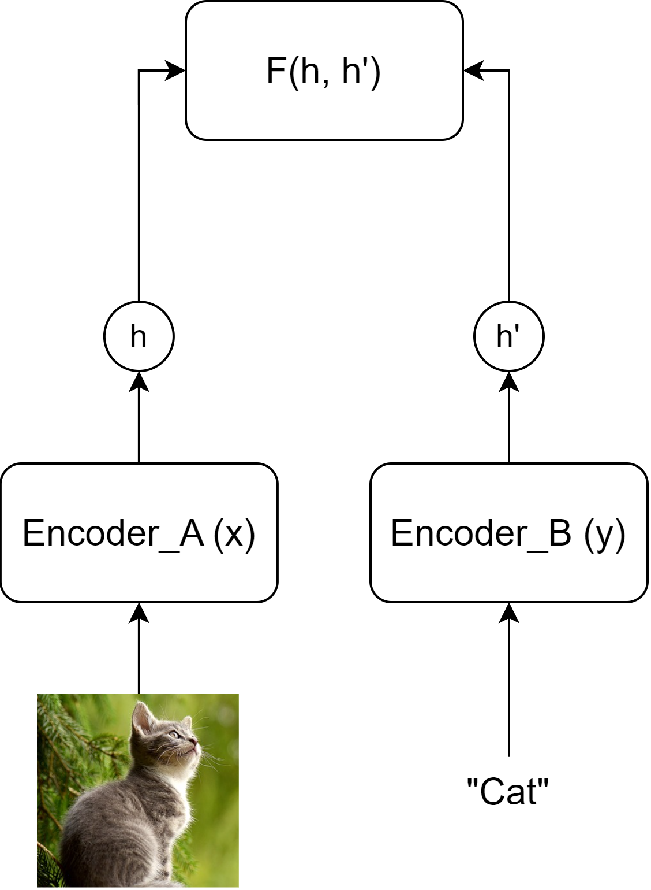
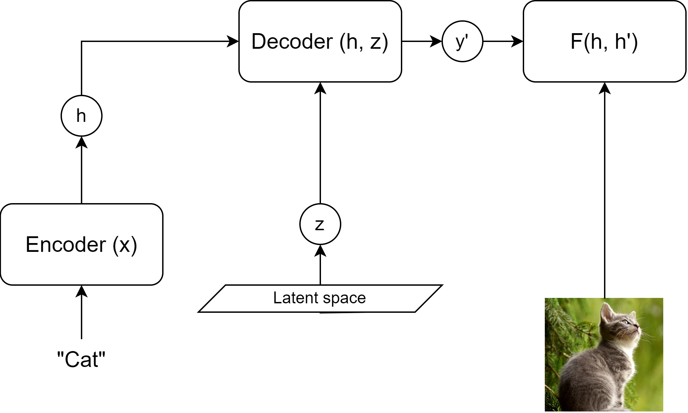

## Acknowledgement

### Acknowledgement {.alert}

The following slides are based on the following review articles [@le2020contrastive; @jaiswal2020survey] as well as Yann LeCun's hybrid lecture on Energy-based SSL available [online](https://www.youtube.com/watch?v=4lthJd3DNTM).

# Self-supervised learning

## Main objective
Self-supervised learning (SSL) aims to obtain supervision from the data itself.

"Predict everything from everything else."   
*Yann Lecun*

The data is partially known, and partially unknown.
An underlying structure of the data is utilized (e.g. sequentiality in language modeling).

## Main objective

![From [@dawid2023introduction]](figures/ssl_meme.png){height=50%}

Why not reinforcement learning?   
*Trial-and-error is ineffective.*

## Advantages

Self-supervised learning:

- Reduces the cost and complexity of labeling
- Adds extra generalization capabilities to the system
- Gives control to use the internal structure of the data
- Is able to reconstruct latent variables governing an input set

## Energy-based Modeling
Energy-based modeling (EBM) is a unifying principle of most SSL methods.

EBM solves the "averaging problem" of $L_2$-like losses.

- Imagine a case with multiple viable outputs (such as neighboring words in a Skipgram model)
- The loss will be minimal to the "average" of these individual outputs
- We want a loss function that will be close to minimal for each and every viable solution

## Energy function

An energy function $F(x, y)$ over the $x \in X$ input space and $y \in Y$ output space is designed to solve this problem, where low energy means a viable solution.

The inference of such a model could happen by: $\hat{y} = argmin_y F(x, y)$   
*It is important to note that multiple $\hat{y}$-s could be viable!*

The energy function $F(x, y)$ measures compatibility between $x$ and $y$.

## EBM as a probabilistic model

Using the Gibbs-Boltzmann distribution a generative (joint "distribution") EBM can be converted into a discriminative probabilistic model:

$P(y|x) = \frac{e^{-\beta F(x, y)}}{\int_{\acute{y}} e^{-\beta F(x, \acute{y})}}$

Here $\beta$ is a positive constant, and $\acute{y} \in Y$.

## Multimodal EBM architectures I.

EBMs are useful for creating joint multimodal representations.

{ height=50% }

## Multimodal EBM architectures II.

Latent variables could be used for generative processes (e.g. diffusion).
$z$ is an independent "explanatory" variable of variation.
Inference is possible with joint minimization with respect to $y$ and $z$.

{ width=70% }

## Methods of learning in EBMs
Main objective: Acquire low energy for viable $x$-$y$ pairs, while maintaining high energy for incompatible pairs.

### Contrastive Methods
- Push down $F(x, y)$ for each compatible pair (i.e. for *positive* elements of the dataset).
- Push up $F(x, y')$ for every other possible combination (i.e. for *negative* examples).

## Methods of learning in EBMs
Main objective: Acquire low energy for viable $x$-$y$ pairs, while maintaining high energy for incompatible pairs.

### Regularized Methods
- Ensure that the extent of low-energy regions is limited or minimized.
- Regularization, quantization, clustering, etc.

## Methods of learning in EBMs
Main objective: Acquire low energy for viable $x$-$y$ pairs, while maintaining high energy for incompatible pairs.

![Visualization of learning methods from [@dawid2023introduction]](figures/ebm_method_compare.png){ width=100% }

# Contrastive Learning & Variants

## Learning method
Contrastive learning generally includes the following main steps:

1. Select a $q$ query and sample the positive key $k^+\sim p^+(.|q)$ and negative key $k^-\sim p^-(.|q)$ distributions.
2. Apply model transformations that map $\mathcal{X} \rightarrow \mathcal{R}^N$ where $N$ is the resulting embedding dimension and $x \in \mathcal{X} | x = (q, k)$
3. Scoring the positive and negative pairs using an energy-based or probabilistic approach.
4. Parameter update

## Scoring functions

Scoring functions are the backbone of loss calculation and are determined by the desired embedding space's properties. They are simple functions such as:

- L1 or L2 distance
- Dot-product
- Bi-linear models $S(q, k) = qAk$

Distance and probabilistic loss functions are built on top of these measures.

## Distance-based loss functions

### Pair-loss
$\mathcal{L}_{pair} = \begin{cases} ||q-k^+||_2^2\\ max(0, m-||q-k^-||_2^2) \end{cases}$

where $m$ is a predefined margin around x.
This minimizes positive distance and tries to push the negative distance over the margin.

### Triplet-loss
$\mathcal{L}_{triplet} = max(0, ||q-k^+||_2^2 - ||q-k^-||_2^2 + m)$
This method enforces that the relative distance between the positive and negative examples.

## Softmax-based probabilistic loss functions
Motivation: Classify the pairs correctly.
As a classification problem using scoring function $S(.,.)$ we can formulate this as:

$p(k^+|q) = \frac{exp(S(q, k^+))}{\sum_k exp(S(q, k))}$

Introducing negative sampling to the process we can avoid calculating the denominator for all $k$. Instead, we reformulate the calculation as a binary problem.

## Noise Contrastive Estimation (NCE)
The probability of a pair being positive (C=1), if we sample negative examples $M$ times more frequently from a uniform distribution, is:
$p(C=1|q,k) = \frac{p(k^+|q)}{p(k^+|q)+m\cdot p(k^-|q)}$

Thus the binary classification loss is (using negative loglikelihoods) over all possible pairs:
\begin{align*}\begin{split} \mathcal{L}_{bin\_NCE} = - \mathbb{E}_{p^+}[logp(C=1|q,k)] \\ - \mathbb{E}_{p^-}[log(1-p(C=1|q,k))] \end{split}\end{align*}
where $p^-(.|q)$ is the noise (negative sample) distribution and $p^+(.,.)$ is the positive distribution.

 
## InfoNCE 
Instead of a binary classification, we could construct a set of several negative examples and a single positive example $K = \{k^+, k^-_1, k^-_2, ..., k^-_{M}\}$. Then the modified task would be to determine which element is the positive. This results in a softmax-like measure called InfoNCE:

$\mathcal{L}_{InfoNCE} = -log\frac{exp(S(q, k^+))}{\sum_{i=0}^{M+1}exp(S(q, k[i]))}$

$\mathcal{L}_{InfoNCE} = - S(q, k^+) + log\sum_{i=0}^{M+1}e^{S(q, k[i])}$

## Why does it work?
Training a model $f$ with an InfoNCE-like loss function inverts (decodes) the unknown generative process of data generation $g$.
Thus the latent distribution behind our data is reconstructed and made accessible.

![From [@zimmermann2022contrastive]](figures/latent_reconstruct.png)

## Examples of sampling
Data generation processes could include a wide range of self-supervised processes, such as:

- Neighborhood information (spatial or temporal)
- Masking
- Various augmentations (visual or audio noise, etc)

## Examples of sampling
![Visual augmentations from [@le2020contrastive]](figures/sample_example.png){height=60%}

## Examples of sampling
![Data generation from temporal streams from [@le2020contrastive]](figures/sample_example_temporal.png){height=60%}

## Adding label supervision

Data generation is possible via incorporating label information as well (adding classical supervision). In this case the normal InfoNCE equation will change, as multiple positive examples are present. Resulting in a sum over InfoNCE terms. There are two variants present with the sum inside and outside of the log.

$\mathcal{L}^{sup}_{in} = \sum\limits_{q \in J}-log\left(\frac{1}{|P(q)|}\sum\limits_{k^p\in P(q)}\frac{exp(S(q, k^p))}{\sum\limits_{i\in I}exp(S(q, k[i]))}\right)$

where $J$ is the set of batch elements, $q$ is the selected query element, $I$ is the set of batch elements excluding $q$, $P(q)$ is the set of elements with the same label as $q$.

## Adding label supervision

$\mathcal{L}^{sup}_{out} = \sum\limits_{q \in J}\frac{-1}{|P(q)|}log\sum\limits_{k^p\in P(q)}\frac{exp(S(q, k^p))}{\sum\limits_{i\in I}exp(S(q, k[i]))}$

where $J$ is the set of batch elements, $q$ is the selected query element, $I$ is the set of batch elements excluding $q$, $P(q)$ is the set of elements with the same label as $q$.

![From [@khosla2020supervised]](figures/supcl.png){height=35%}

## Invariant, Equivariant traits

In standard contrastive learning, the positive pairs have a required invariancy. $S(q, k)$ should be high.
Standard similarity metrics yield this behavior best when $q=k$.
This behavior will negate the effect of certain differences between the two original inputs $x_q$ and $x_k$

Let $T(.)$ transform represent this difference and $f(.)$ represent our function (or network) trained with CL.
In the invariant optimal case:

$x_k = T(x_q) \rightarrow k = q$

## Invariant, Equivariant traits

There are some cases where we would like to keep this transformation in the embedding space as well. Meaning that we would require that the same, or a similar transformation ($\acute{T}(.)$) be present in the embedding space as in the input space.

$x_k = T(x_q) \rightarrow k = \acute{T}(q)$

## Invariant, Equivariant traits

![Rotation equivariant and flip invariant contrastive training. From [@dangovski2021equivariant]](figures/equiv_inv.png){height=70%}

# Contrastive methods in NLP
## BERT
## ?

# Contrastive Visual-Language Methods
## CLIP
## ImageBind

# Inverted methods
## CoCa, UnCLIP

# References {.allowframebreaks}