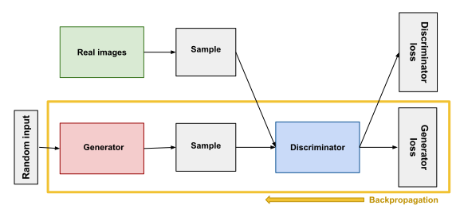
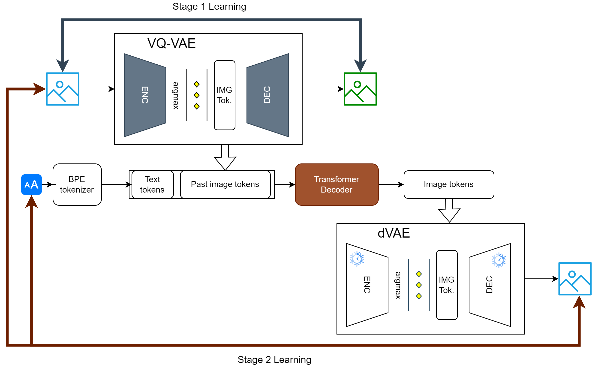
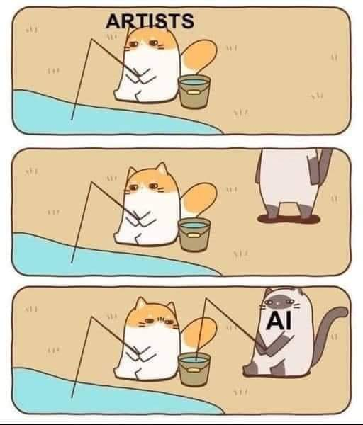

# Introduction

## Conditional text-to-image generation

Conditional text-to-image generation is a task where a model is trained to generate an image based on a given text description.
The task can be formulated as one of the following methods:

- *(Sequence-to-sequence (seq2seq) generation)* (connections to autoregression)
- Generative Adversarial Network (GAN) approach
- Autoregressive approach
- Diffusion approach

## Sequence-to-sequence (seq2seq) generation

In 2015 DeepMind published DRAW [@gregor2015draw] which is a sequential, unconditional image generation model. Such models were used to generate images like the MNIST dataset, etc. 

Later that year AlignDRAW [@mansimov2016generating] was published which is a conditional version of DRAW. It was able to generate images based on a given text description.

## AlignDRAW

AlignDRAW works by first encoding the text description into a latent vector by a Bidirectional LSTM (BiLSTM) encoder. Then the decoder is a set of "drawing" operations that tries to generate the image based on the latent vector.

![AlignDRAW early results from [@mansimov2016generating]](figures/aligndraw_output.png){height=30%}

## AlignDRAW

![AlignDRAW architecture from [@mansimov2016generating]](figures/aligndraw_arch.png){width=100%}

## AlignDRAW

The training is a variational lower bound (ELBO) optimization (maximization).

Given $x$, the image, $y$, the text description, and $Z$, the series of latent vectors, the loss is:

\small
$\mathcal{L} = \sum\limits_{Z}Q(Z|x,y)logP(x|y,Z)-D_{KL}(Q(Z|x,y)||P(Z|y))$

\normalsize
Here $Q(Z|x,y)$ is the approximate posterior distribution. $P(x|y,Z)$ is the likelihood of the image given the text description and the latent vector. $P(Z|y)$ is the prior distribution of the latent vector given the text description.

## AlignDRAW Neural Distribution Modeling

$Q(Z_t|x,y,Z_{1:t-1})$ and $P(Z_t|Z_{1:t-1})$ are modeled by a Gaussian distribution that is parametrized based on the inference and generative networks respectively. The latents depend on eachother in a sequential manner.

$P(Z_t|Z_{1:t-1}) = \mathcal{N}\left(\mu(h_{t-1}^{gen}),\sigma(h_{t-1}^{gen})\right)$

$Q(Z_t|x,y,Z_{1:t-1}) = \mathcal{N}\left(\mu(h_t^{infer}),\sigma(h_t^{infer})\right)$

$\mu(h) = tanh(W_{\mu}h)$

$\sigma(h) = exp\left(tanh(W_{\sigma}h)\right)$

## AlignDRAW read and write operations

The read and write operations are parametrized by fixed Gaussian (blur) filter sets of different sizes, strides and locations. The write operation is a combination of the filter sets ($F_x$, $F_y$) and a generated ($K$) patch.

$write(h_t^{gen}) = F_x(h_t^{gen})K(h_t^{gen})F_y(h_t^{gen})^T$

While read is the inverse of this operation.

## Read and write operations

![Input image, patch, result and example gaussian filters of read operation from [@gregor2015draw]](figures/aligndraw_read.png){height=70%}

# GAN

## Generative Adversarial Network (GAN) Architecture

{height=60%}

## Generative Adversarial Network (GAN) Recap

GANs are a generative model that consists of two networks: a generator and a discriminator. The generator tries to generate data that are similar to the real dataset, while the discriminator tries to distinguish between the real and generated data points.

The goal of the adversarial game is the following:

\small

$min_G max_D V(D,G) = \mathbb{E}_{x\sim p_{data}(x)}\left[log(D(x))\right] + \mathbb{E}_{z\sim p(z)}\left[log(1-D(G(z)))\right]$

\normalsize

Thus the generator tries to maximize $log(D(G(z)))$ while the discriminator tries to maximize $log(D(x)) + log(1-D(G(z)))$.
Here $z$ is sampled from a random prior distribution $p(z)$ and $x$ is sampled from the real data distribution $p_{data}(x)$.

## Text-Conditional GAN Architecture

@reed2016generative proposed a text conditional GAN architecture that takes a text encoding as part of the latent vector. The architecture is a deconvolution-convolution network.

![Text-conditional GAN architecture from [@reed2016generative]](figures/textconditional_gan.png){width=100%}

## Text-Conditional GAN Training

Naive GAN discriminator task: separate real and unreal images.

With text conditioning we get additional tasks:

- Reject unreal images for any text description.
- Reject mismatched text-image pairs.

The latter is achieved by providing a set of mismatched examples in each training batch.

$\mathcal{L}_{CLS} = log(D(I_{real}, T_{real})) + 0.5 log(1-D(I_{real}, T_{fake})) + 0.5 log(1-D(I_{fake}, T_{real}))$

## Text embedding interpolation

As back then text-image datasets were sparse, the authors used a text embedding interpolation method to generate more training examples for unseen text descriptions. This way the input text embedding is a linear combination of two text embeddings. One which is the correct text embedding and the other is a random text embedding from the dataset. This is then passed to the generator. This way even if the discriminator does not have real examples for a given pair it can still learn when to reject a generated image. This augments the generator.
The authors propose $\beta=0.5$ for $t_1$ and $t_2$ text embeddings:

$D(G(z, t_1)) \rightarrow D(G(z, \beta t_1 + (1-\beta)t_2))$

## Text-Conditional GAN Results

Text input: the gray bird has a light grey head and grey webbed feet

![Text-conditional GAN results from [@reed2016generative].](figures/textconditional_gan_results.png){height=55%}

## Style encoding

@reed2016generative suspect that the latent variable should contain information that is missing from the text but could be inferred from an image (or a set of images). They call this the "style" of the image and propose a method to encode this information into the latent variable.

Namely they propose an inversion method that inverts the generator. S(x) is trained with the following objective, where $x$ is the image:
$\mathcal{L}_{style}||z - S(G(z,t_1))||_2^2$

The style transfer inference procedure then goes as follows:

$s \leftarrow S(x), \hat{x} \leftarrow G(s, t_1)$

## Style encoding results

![Style encoding results from [@reed2016generative]](figures/textconditional_style_results.png){height=75%}

## ControlGAN

ControlGAN offers a fine-grained multi-stage generative process with additional supervisory methods to achieve better results [@li2019controllable].

They add:

- Word and image feature-level discriminator
- Multi-stage generation and discrimination
- Unconditional and conditional losses, perceptual loss, word/image feature-level correlation loss, text-to-image cosine loss
- Customized attention-like mechanisms

## ControlGAN Architecture

![ControlGAN architecture from [@li2019controllable]](figures/controlgan_arch.png){height=75%}

## ControlGAN Locality

![Attention guided local feature generation from [@li2019controllable]](figures/controlgan_locality.png){height=70%}

## Perceptual Loss

Perceptual Loss is used to generate consistent images including parts that are not directly guided by text. This is done by using a pretrained network (trained for classification on ImageNet). The network is used to extract features from the generated and the real image. The loss is then the L2 distance between the features. The features are extracted from the middle layers of the network to get an abstract but not too low-level representation.

$\mathcal{L}_{perceptual}^i(I, I') = \frac{1}{C_iH_iW_i} ||\phi_i(I) - \phi_i(I')||_2^2$

Where $\phi_i$ is the feature extractor, $C_i$, $H_i$ and $W_i$ are the number of channels, height and width of the $i$-th layer of the network.

## Word-level features

![Word-level (attention-like) discriminator from [@li2019controllable]. Providing word and image feature-level gradients is important for local generator training.](figures/controlgan_wordlevel.png){height=70%}

# Autoregressive approach

## Autoregressive approach

Variational Autoencoders (VAE) could also be used to create images from text description if the latent prior includes text conditioning. On way of including text conditioning is to use an autoregressive prior model. 

This autoregressive prior is similar to the autoregressive models used in language modeling. The difference is that the vocabulary is not only the text tokens but also the latent image features which use the same representation as the VAE.

The image encoding and decoding is handled by the VAE in general while the text encoding is part of the autoregressive model.

## DALL-E Architecture

{height=80%}

## DALL-E Training

The first DALL-E model [@ramesh2021zeroshot] is a transformer-based autoregressive model that uses a dVAE for encoding and a sparse transformer [@child2019generating] for the autoregressive latent conditioning.

The training consists of $2$ stages:

First the ResNet-style VAE with a bottleneck block in the middle is trained with ELBO loss. The latent features are quantized using argmax. The goal is image reconstruction here.
This stage learns a $~8k$ visual codebook (as dVAE utilizes argmax to quantize), that is later used in the autoregressive model.

## DALL-E dVAE Reconstruction

![dVAE reconstruction of different geometries from [@ramesh2021zeroshot]](figures/dalle_vqvae.png){height=70%}

## DALL-E Autoregressive prior

In the second stage the dVAE weights are fixed and the decoder-style latent transformer is trained to learn the conditioned prior. The model is trained with cross-entropy loss, where the image tokens have a $7$ times larger weight than the text tokens.

The BPE-tokenized text is concatenated with special padding tokens (if needed) and a specific [START OF IMAGE] token. The image tokens are then serialized and added to the end. The text has a 1D positional encoding, while the image tokens have a separate column and row positional encoding. The model uses sparse attention to predict the next token for both text and image.

## DALL-E Attention

Text tokens have a causal attention, however image tokens have separate row and column attentions, plus a $3x3$ local attention in the last layer. Column attentions are transposed to rows in order to reduce computation. The row and column attentions are alternating in a (r, c, r, r) manner.

![DALL-E attention from [@ramesh2021zeroshot]](figures/dalle_attn_mask.png){height=40%}

## DALL-E Generated Images

![Images generated on zero-shot joint image-text conditioning from [@ramesh2021zeroshot]](figures/dalle_generated.png){height=70%}

# Diffusion approach

## Diffusion models
Diffusion models are highly effective models that rely on a Markovian process to generate images. Diffusion is defined by an iterative noising and denoising process. Noising is a Gaussian noise injection process. The dimensionality does not change.

](figures/diff_transform.png){height=45%}

## Diffusion models
Forward (encoding) and reverse (decoding) diffusions could be seen as a VAE equivalent.

](figures/diffprocess.png){height=60%}

## DDPM: Denoising Diffusion Probabilistic Models

![DDPM processing chain from [@ho2020denoising]](figures/ddpm_chain.png){height=20%}

**Forward process**

$x_0$ is the starting image, while $x_T$ is the final step of the diffusion process $t\in[0,..., T]$.

Each step $q(x_t|x_{t-1})=\mathcal{N}(x_t;\sqrt{1-\beta_t}x{t-1}, \beta_tI)$ Markovian transition distribution adds noise regulated by fixed $\beta_t$.

## DDPM: Denoising Diffusion Probabilistic Models

![DDPM processing chain from [@ho2020denoising]](figures/ddpm_chain.png){height=20%}

**Reverse process**

$x_T$ is sampled from the final $p(x_T)=\mathcal{N}(x_T;0,I)$ distribution.

Each reverse step learns a $p_\theta(x_{t-1}|x_{t})=\mathcal{N}(x_{t-1};\mu_\theta, \Sigma_\theta)$ Gaussian distribution as a transition parametrized by $\theta$.

## DDPM: Denoising Diffusion Probabilistic Models

The two Markovian processes are modelled in the following equations:

$q(x_{1:T}|x_0)=\prod\limits_{t=1}^Tq(x_t|x_{t-1})$

$p_\theta(x_{0:T})=p(x_T)\prod\limits_{t=1}^Tp_\theta(x_{t-1}|x_t)$

Given $\alpha_t = 1-\beta_t$ and $\bar\alpha_t=\prod\limits_{s=1}^t\alpha_s$ direct computation is possible for $q(x_t|x_0)=\mathcal{N}(x_t;\sqrt{\bar\alpha_t}x_0,(1-\bar\alpha_t)I)$. This speeds up training as recurrence is not needed.

## DDPM: Learning the reverse

We have to optimize (the authors negate and minimize) the variational lower bound $L = \sum\limits_{t=0}^TL_t$ again (applying directly computed terms):

$L_T = \mathbb{E}_q(D_{KL}(q_(x_T|x_0)||p_\theta(x_T)))$ this ensures that the first reverse step is close to the final forward step.

$L_{t-1} = \mathbb{E}_q(D_{KL}(q(x_{t-1}|x_t,x_0)||p_\theta(x_{t-1}|x_t)))$
Here $q(x_{t-1}|x_t,x_0)$ is the posterior (after Bayes) distribution which is the optimal reverse distribution for each step.

$L_0 = \mathbb{E}_q(-logp_\theta(x_0|x_1))$ data log-likelihood conditioned on the end of the latent-chain.

## DDPM: Simplify everything

For more details on the training goal derivation see [@ho2020denoising] Appendix A.

If we fix the standard deviation of both processes and tie them together at each step (using $\sigma_tI$ in each Gaussian) the $L_{t-1}$ terms fall back to the distance of the two means.

$L_{t-1} = \mathbb{E}_q\left(\frac{1}{2\sigma_t^2}||\tilde\mu(x_t,x_0)-\mu_\theta(x_t, t)||^2\right) + C$

Here $\tilde\mu_\theta(x_t,x_0)$ is the mean of the forward posterior distribution (reversed by Bayes) and $\mu_\theta(x_t, t)$ is the mean of the learnable reverse distribution. $C$ is a constant.

## DDPM: Simplify everything

Applying the reparametrization trick to $q(x_t|x_0)=\mathcal{N}(x_t;\sqrt{\bar\alpha_t}x_0,(1-\bar\alpha_t)I)$ we get:

$x_t = \sqrt{\bar\alpha_t}x_0 + \sqrt{1-\bar\alpha_t}\epsilon$ where $\epsilon\sim\mathcal{N}(0,I)$

Reordering the equation gives: $x_0 = \frac{x_t-\sqrt{1-\bar\alpha_t}\epsilon}{\sqrt{\bar\alpha_t}}$

After Bayes (for details see [@ho2020denoising]): $\tilde\mu_\theta(x_t,x_0)=\frac{\sqrt{\bar\alpha_{t-1}}\beta_t}{1-\bar\alpha_t}x_t+\frac{\sqrt{\alpha_t}(1-\alpha_{t-1})}{1-\bar\alpha_t}x_0$

Substituting $x_t$ and $x_0$ we get: $\tilde\mu_\theta(x_t,x_0)=\frac{1}{\sqrt{\alpha_t}}\left(x_t - \frac{\beta_t}{\sqrt{1-\bar\alpha_t}}\epsilon\right)$

## DDPM: Noise prediction

Finally we arrive to the conclusion that in order to minimize the KL-divergence (which is minimized by approximating $\tilde\mu(x_t,x_0)$ with $\mu_\theta(x_t,t)$) We have to predict the unknown part of $\tilde\mu(x_t,x_0)$ which is $\epsilon$, since $x_t$, the $\alpha$-s and $\beta$-s are known. In order to do this we create an approximator for $\epsilon$, which is $\epsilon_\theta(x_t, t)$.

If we neglect $C$, $L_0$ and $L_T$ we get the following function to optimize:

$L_{simp}(\theta) = \mathbb{E}_{t, x_0, \epsilon} ||\epsilon - \epsilon_\theta(x_t, t) ||^2 = \mathbb{E}_{t, x_0, \epsilon} ||\epsilon - \epsilon_\theta\left(\sqrt{\bar\alpha_t}x_0 + \sqrt{1-\bar\alpha_t}\epsilon, t\right) ||^2$

## DDPM Properties

DDPM works with small step sizes accumulating around $500-1000$ steps of generation. The scheduling of $\beta$-s over time is linear. The authors use a relatively small $256\times256$ size U-Net architecture for $\epsilon_\theta$ prediction.

![Unconditional generation from [@ho2020denoising]](figures/ddpm_uncond.png){height=47%}

## DDPM Latent Interpolation

![Latent interpolation from [@ho2020denoising]. The latent interpolation is a valid point in the image manifold opposed to the pixel-space interpolation](figures/ddpm_interpol.png){height=50%}

## DDPM Latent Interpolation

![The results depend on the step at which the images are interpolated. "Deeper" mixing results in high fidelity, but the original information is lost [@ho2020denoising]](figures/ddpm_interpol_result.png){height=70%}

## DDIM: Denoising Diffusion Implicit Models

DDPM reports that sampling a batch of $128$ images of $256\times256$ size takes around $300$ seconds to sample. This is due to the large number of small denoising steps.

DDIM [@song2022denoising] solves this by loosening the Markovian constraint and using fewer denoising steps by formulating implicit steps during the forward and reverse processes.

![DDIM processing chain from [@song2022denoising]](figures/ddim_chain.png){height=20%}

## DDIM: Redefine as non-Markovian

In DDPM @ho2020denoising formulates an approach by which we can directly compute the forward distribution $q(x_t|x_0)$ for each step. Utilizing this property we can directly compute $L$ at any given step $t$ with a known $x_0$, as DDPM loss depends on the predicted error $\epsilon_\theta(x_0, t)$ only.

DDIM extends this loss even further by using a $\gamma$ positive coefficient vector to weigh each step (as $t$ only influences the added noise $\epsilon$ we denote the $t$ dependency with $\epsilon^t$):

$L_{\gamma}(\epsilon_\theta) = \mathbb{E}_{x_0, \epsilon^t, t} \sum\limits_{t=1}^T\gamma_t||\epsilon^t - \epsilon_\theta^t(x_0, \epsilon^t)||^2$

By fixing $\gamma = 1$ for all steps we get the original DDPM loss.  

## DDIM: Redefine as non-Markovian

If we select a set of $Q$ forward distributions in such a way that they can be marginalized to the same $q(x_t|x_0)$ distribution DDPM uses we get the same traning goal thus the same DDPM trained models could be used for forward and reverse processes, even if these processes are non-Markovian due to the selection of our $Q$ distributions.

Such a non-Markovian process exists for a given vector of positive $\sigma$ stds. It can be defined by the generative process first.

$q_\sigma(x_{1:T}|x_0) = q_\sigma(x_T|x_0)\prod\limits_{t=2}^Tq_\sigma(x_{t-1}|x_{t},x_0)$

## DDIM: Redefine as non-Markovian

By taking the posterior (with Bayes) of $q_\sigma(x_{t-1}|x_{t},x_0)$ we get $q_\sigma(x_{t}|x_{t-1},x_0)$. By marginalizing over $x_{t-1}$ we get $q_\sigma(x_{t}|x_{0})$, thus we can use the ($\gamma$) generalized DDPM training scheme.

We can redefine the reverse process $p_\theta(x_{t-1}|x_t)$ as well, which should approximate $q_\sigma(x_{t-1}|x_{t},x_0)$. During generation $x_0$ is unknown, but we can approximate it if we know all the errors $\epsilon_t$. We have an approximator for this as well, which is $\epsilon_\theta^t$.

Let $f_\theta(x_t)$ approximate this $x_0$ original input via subtracting the properly scaled error approximation $\epsilon_\theta^t$ from $x_t$.

The reverse is then $p_\theta(x_{t-1}|x_t) = q_\sigma(x_{t-1}|x_t, f_\theta(x_t))$ for $t>1$ and $\mathcal{N}(f_\theta(x_1), \sigma_1^2I)$ for $t=1$.

## DDIM: Redefine as non-Markovian

The optimization goal can then be formulated as the ELBO, where $\simeq$ is used to describe equal up to a constant that does not depend on $\theta$ for $t>1$:

$\mathbb{E}_{x_{0:T}}(\sum\limits_{t=2}^TD_{KL}(q_\sigma(x_{t-1}|x_{t},x_0)||p_\theta(x_{t-1}|x_t)) - logp_\theta(x_1|x_0))$

$\simeq \mathbb{E}_{x_0, x_t}(\sum\limits_{t=2}^TD_{KL}(q_\sigma(x_{t-1}|x_{t},x_0)||q_\sigma(x_{t-1}|x_{t},f_\theta(x_t))))$

$\simeq \mathbb{E}_{x_0, x_t}(\sum\limits_{t=2}^T||x_0 - f_\theta(x_t)||^2) \simeq \mathbb{E}_{x_0, \epsilon, x_t}(\sum\limits_{t=2}^T||\epsilon - \epsilon_\theta^t(x_0, \epsilon)||^2)$
$=L_{\gamma}(\epsilon_\theta)+C$

Given this we get the original DDPM loss back if we select the correct $\gamma$ and $C$ terms.

## DDIM reverse process

If we define $p_\theta(x_{t-1}|x_t) = q_\sigma(x_{t-1}|x_t, f_\theta(x_t))$ and use the reparametrization trick on it (without the details contained by [@song2022denoising]) we get the following:

$x_{t-1} = \sqrt{\alpha_{t-1}}f_\theta(x_t)+\sqrt{1-\bar\alpha_{t-1}-\sigma_t^2}\epsilon_\theta^t + \sqrt{\sigma_t}\epsilon$

Where the first term is the scaled predicted $x_0$ input (which includes the $\epsilon_\theta^t$ error term as well), the second term is the "direction" that points to $x_t$ and the third random term is the independent noise difference between $x_{t-1}$ and $x_t$.

## DDIM reverse process
If we select $\sigma_t = \sqrt{(1-\bar\alpha_{t-1})/(1-\bar\alpha_t)}\sqrt{1-\bar\alpha_t/\bar\alpha_{t-1}}$ for all $t$ the forward process is Markovian and the reverse process is DDPM. 

If $\sigma_t = 0$, then the forward process becomes deterministic given a known $x_0$ and $x_{t-1}$. The reverse process then will not contain the independent noise term, thus a fixed procedure could be used for prediction.

We can also interpolate between the two versions by a hyperparameter $\eta$:

$\sigma_t = \eta \sqrt{(1-\bar\alpha_{t-1})/(1-\bar\alpha_t)}\sqrt{1-\bar\alpha_t/\bar\alpha_{t-1}}$

## DDIM accelerated generation

![DDIM accelerated generation from [@song2022denoising]](figures/ddim_accel.png){height=30%}

Since we can now use a fixed reverse process (with the exception that we have to predict $x_0$ from $x_t$) we can directly sample from the reverse process at any set of $x_t$-s including skipping steps, or subsampling steps. @song2022denoising even considers continuous time-based sampling.

## DDIM accelerated generation

Accelerated generation holds for a $\tau_i \in [0, T]$ set of steps as long as $q_\sigma(x_{\tau_i}|x_{\tau_{i-1}},x_0)$ is known, as the reverse process could then approximate $q_\sigma(x_{\tau_{i-1}}|x_{\tau_i},x_0)$ by predicting $\epsilon_\theta^{\tau_i}$ which is utilized in $f_\theta(x_{\tau_i})$ as well.

The important part is that only by approximating $\epsilon_\theta^t$ this rescheduling of sampling steps is possible (at least in the DDIM $\eta=0$ case), as we can mathematically account for the changes.

This way the sampling is not tied to the training (forward) step number and about $10-50$ times faster generation is possible facilitating the use of larger models in close-to-real-time applications.

## DDIM results

![DDIM results from [@song2022denoising]. The model was trained on T=1000 forward steps. DDIM slightly benefits from longer sampling as well (estimation errors add less noise as the estimated distributions are closer to Gaussians which we approximate them with). $\hat\sigma$ stands for the original DDPM parameter designed for 1000 steps.](figures/ddim_results.png){height=60%}

## Beyond DDIM

By reformulating DDIM as an ODE solver (ordinary differential equation) @song2022denoising conclude that it is equivalent to the Euler method of ODE solving. Other, expanded ODE solvers could also be used such as DPM++ propozed by @lu2023dpmsolver. Late 2023 these are the most popular diffusion samplers. There has been some research in the domain of higher-order ODE solvers, but no wide-spread use could be observed yet.

@karras2022elucidating also proposes new ways of noise scheduling beyond the linear $\beta$-s used by DDPM and DDIM.

## Guided Diffusion - Classifier

Diffusion guidance is also possible similarly to the case of text dependent GANs and VAEs. In this case our diffusion model's estimator should be perturbed by the guidance signal (e.g. text embedding).

Given a noise estimator $\epsilon_\theta$ in a reverse process we add conditional shift additively to this estimation of the noise term.

$\hat\epsilon_\theta(x_t,y) = \epsilon_\theta(x_t,y) + s\sigma_t \nabla_{x_t}logp_\phi(y|x_t)$

Where $s$ is the guidance scale, $p_\phi(y|x_t)$ is a classifier that guides the diffusion process using the derivative of the log-likelihood with respect to the class we want to generate.

## Guided Diffusion - Classifier-free

This needs the diffusion model to be trained with a classifier as well, and the classifier gradients are also needed during generation. In order to avoid this classifier-free networks operate on an unconditional estimator $\epsilon_\theta(x_t)$ and a conditional estimator $\epsilon_\theta(x_t,y)$ by differing from the unconditioned prediction $\hat\epsilon_\theta(x_t,y) = \epsilon_\theta(x_t,y) + s(\epsilon_\theta(x_t,y)-\epsilon_\theta(x_t))$

This is essentially done by adding $0$ labels to the classifier during training, thus the classifier-free estimator is just $\epsilon_\theta(x_t,0)$.

Read @ho2022classifierfree for more details!

## CLIP-guided Diffusion: GLIDE

@nichol2022glide introduces a method where they replace the classifier with a CLIP [@radford2021learning] dot-product similarity measure.

$\hat\epsilon_\theta(x_t,y) = \epsilon_\theta(x_t,y) + s\sigma_t \nabla_{x_t}(f(x_t)\cdot g(y))$

Here $f$ is the image encoder and $g$ is the text encoder. Importantly this CLIP version is trained with noisy images in order to match the noise level of the diffusion model.

@nichol2022glide also concludes that classifier-free guidance seems to be more effective on niche tasks, than CLIP-guidance. Here text is encoded by a GPT-like model utilizing the last embedding vector.

## GLIDE results

![GLIDE results from [@nichol2022glide].](figures/glide_results.png){height=75%}

## Latent Diffusion

Latent diffusion refers to the method, where diffusion is performed in the latent space of a VAE or GAN. DALL-E 2 [@ramesh2022hierarchical] and Stable Diffusion [rombach2022highresolution] offer two popular examples to this method.

While DALL-E 2 uses a CLIP-like model as the VAE with a Transformer-based diffusion prior, Stable Diffusion utilizes a VQ-GAN generator and a U-Net style prior. 

## DALL-E 2

![DALL-E 2 architecture from [@ramesh2022hierarchical]](figures/dalle2_arch.png){height=75%}

## DALL-E 2 Decoder

DALL-E 2 includes a VAE that is built from the CLIP text encoder and a diffusion model that is used as an image decoder (thus OpenAI also names the model behind DALL-E 2 "unCLIP"). This decoder is conditioned on CLIP image embeddings and optionally on caption text embeddings as well. It uses GLIDE's architecture and includes some classifier-free improvements by dropping the CLIP embedding and caption embedding occasionally during the decoder training.
The training uses Sharpness Aware Minimization [@foret2021sharpnessaware].

The decoder uses $\eta>0$ in the DDIM process to allow for variations in the generated images.

## DALL-E 2 Prior

The priors they compare for the VAE are DALL-E (1) style autoregressive prior, and a diffusion prior that turns out to be superior. The diffusion process uses Transformer decoder as well in order to predict the next latent token version. The loss is not $\epsilon$-based but an L2 loss between the predicted and the true latent representation. This is interpreted as a loss on the predicted $x_0$ parametrized by $f_\theta(x_t, t, y)$ in the diffusion process.

During generation the prior is generated two times, the one with the higher dot-product with the text embedding is selected.

## Stable Diffusion - Architecture

![Stable Diffusion architecture from [@rombach2022highresolution]](figures/stable_arch.png){height=75%}

## Stable Diffusion - VQ-GAN

In Stable Diffusion [@rombach2022high], to project the images to the latent space a VQ-GAN from @esser2021taming is utilized to encode the images. The VQ-GAN consists of a VQ-VAE generator and a discriminator on adversarial and perceptual loss. This in the case of Stable Diffusion the VQ-VAE gets a slight KL-divergence regularization to produce latent representations closer to a Gaussian distribution.

Furthermore the discriminator is later ignored and only the generator VQ-VAE is used in a way that the quantization is merged with the decoder. Compression factors of $4-8$ found to perform best using 2D representations.

## Stable Diffusion - VQ-GAN

![VQ-GAN [@rombach2022highresolution]](figures/stable_vqgan.png){height=70%}

## Stable Diffusion - Prior

The prior itself is a convolutional U-Net architecture with cross-attention blocks in every layer. These cross-attentions attend to an encoded conditional modality. This U-Net performs the reverse diffusion process (predicting $\epsilon_\theta$).

Modalities that are encoded as a condition could be text (transformer-decoder or CLIP), image, segmentation masks, etc... Even low-resolution images could be used to construct a latent super resolution model. Classifier-free guidance is also explored and beneficial.

This is a latent diffusion which implies the name LDM (Latent Diffusion Model) which is a generalization of the model used in Stable Diffusion.

## Stable Diffusion - Examples

# Extensions to Diffusion Models

## Multi-stage Networks

Multi-stage networks are utilized to improve efficiency of diffusion and latent diffusion models. DALL-E 2 [@ramesh2022hierarchical] uses a multi-stage diffusion in the pixel space with a CLIP + caption-based text-conditional super-resolution model. The DALL-E 3 paper [@BetkerImprovingIG] also mentions that they use a three-stage diffusion model on different resolutions. Details are not disclosed.

![High resolution DALL-E 3 generation from [@BetkerImprovingIG]](figures/dalle3_results.png){height=27%}

## Multi-stage Networks

Imagen [@saharia2022photorealistic] uses a text-only condition on the prior diffusion, then two text-conditioned super-resolutions in the pixel space.

![Imagen architecture from [@saharia2022photorealistic]](figures/imagen_arch.png){height=53%}

## Multi-stage Networks

Autoregressive models could also be used in a multi-stage fashion. Parti [@yu2022scaling] for example consists of a ViT-VQ-GAN tokenizer and detokenizer to encode and decode images. The autoregressive model is a full-stack Transformer where the condition is encoded and the image is generated.

![Parti architecture from [@yu2022scaling]](figures/parti_arch.png){height=75%}

## Multi-stage Networks

A recent upgrade, Würstchen [@pernias2023wuerstchen] is a latent model, that uses an encoder-decoder architecture similar to Stable Diffusion's VQ-GAN generator (which is a VQ-VAE), however the quantization is later dropped. The prior is a multi-stage diffusion model, that uses a text-only condition on a highly-compressed step, then this compressed latent prior and the text is used as a conditioning step for a latent upscaler, which generates the final prior.

## Multi-stage Networks

![Würtschen architecture from [@pernias2023wuerstchen]](figures/wurstchen_arch.png){height=75%}

## Multi-stage Networks

![Würtschen training steps from [@pernias2023wuerstchen]](figures/wurstchen_training.png){height=75%}

## Inpainting

Inpainting is possible by replacing parts of the original image (either in the pixel or the latent space) with a generated part. This is done by using a mask that is provided by the user. During the diffusion process the sufficently noised version of the unmasked part is used at each step of the diffusion process. The masked part is initialized by either the noised original $x_0 \rightarrow x_T$ or a generated random initial value.

## Inpainting

![Inpainting from [@rombach2022highresolution]](figures/inpaint_example.png){width=100%}

## Textual Inversions

Textual inversions [@gal2022image] are used to extend the capabilities of text-to-image models. They are trained on a small set of images that are fed to a pre-trained text-to-image model. The model is frozen except the text encoder's embedding layer. This embedding layer is extended by a small set of embedding vectors (could be more than one), that are trained on the diffusion loss of a small set of images. This way the model learns to generate images with the same object or style encoded in the newly added embedding vectors.

## Textual Inversions

![Textual inversion from [@gal2022image]](figures/textual_inversion.png){width=100%}

## Textual Inversions

![Textual inversion from [@gal2022image]](figures/textual_inversion_arch.png){height=75%}

## Adapters / LoRA-s

Open-source diffusion models are usually fine-tuned using full fine-tuning or adapters like LoRA-s [@hu2022lora]. This needs a higher ammount of GPU memory, training data and time in order to train, but the quality is higher as well.

Fusing such adapters or textual inversions is possible in multiple ways as outlined by @gu2023mixofshow. These LoRA-s could be combined by taking a weighted average of them or by training a fused LoRA on features extracted from the individual LoRA-s.
$W = \sum\limits_{i=1}^n w_i W_i$

$W = argmin_W \sum\limits_{i=1}^n ||(W_0 + \Delta W_i) X_i - W X_i||_F^2$

## Adapters / LoRA-s

![LoRA fusion results from [@gu2023mixofshow]](figures/lora_fusion.png){width=100%}

## Latent Consistency

@luo2023latent introduced another speedup for LDMs which is Latent Consistency Model. Instead of predicting $\epsilon_\theta$ in the reverse process LCMs predict $x_0$ directly training the $f_\theta$ estimator. As a self-distillation task we could run the reverse process for a long generation sequence and then use a lower-ranked timestep's $x_0$ prediction as the target.

$\mathcal{L}_{LCM} = \mathbb{E}_{x, y, w, i} [d(f_\theta(x_{\tau_{i+1}}, w, y, \tau_{i+1}), f_{\theta'}(x^{\psi,w}_{\tau_{i}}, w, y, \tau_{i}))]$

Where $\theta'$ is an extended set of parameters, $\psi$ is a solver such as DDIM, $w$ is a guidance weight, $d$ is a distance function and $\tau$ is a set of decoding time steps.

DALL-E 3 uses this method to achieve $2-4$ step generations.

## Latent Consistency Results

![Latent Consistency results from [@luo2023latent]](figures/lcm_results.png){height=75%}

## Latent Consistency LoRA

This above mentioned training goal is suitable for LoRA training as well [@luo2023lcmlora]. This LoRA model is then usable as an accelerator for multiple LDMs and the original LDM's adapters are also usable together with this LCM-LoRA.

![Latent Consistency LoRA from [@luo2023latent]](figures/lcm_lora_results.png){height=40%}

## ControlNet

Controlling the condition injection of an LDM is hard, adding extra control modalities would need re-training. The family of ControlNets create a set of adapting methods that could be used to control a text-to-image model without re-training.

The original ControlNet [@zhang2023adding] is a full parallel copy of the SD UNet encoder that is trained to guide the original model on the extra modalities such as segmentation masks, pose, scribbles, etc.

Text-to-image adapters and LoRAs [@mou2023t2iadapter] could also be used to achieve control without re-training.

These methods can be mixed with each other at inference time.

## ControlNet

![ControlNet unit from [@zhang2023adding]](figures/controlnet.png){height=75%}

## T2I Adapter

![T2I Adapter from [@mou2023t2iadapter]](figures/t2i_adapter.png){height=75%}

## ControlNet Results

![ControlNet results from [@zhang2023adding]](figures/controlnet_results.png){height=75%}

# References

## Review for more information

For more information on the topic, please refer to the following review article by @zhang2023texttoimage.

{height=55%}

## References {.allowframebreaks}
\footnotesize