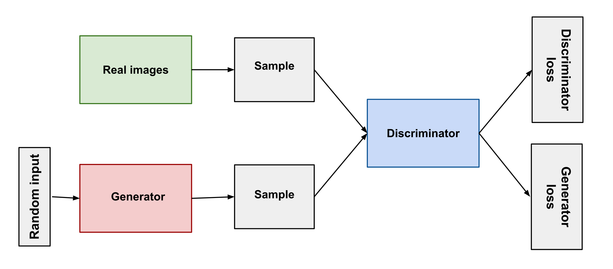

# Introduction

## Conditional text-to-image generation

Conditional text-to-image generation is a task where a model is trained to generate an image based on a given text description.
The task can be formulated as one of the following methods:

- *(Sequence-to-sequence (seq2seq) generation)* (connections to autoregression)
- Generative Adversarial Network (GAN) approach
- Autoregressive approach
- Diffusion approach

## Sequence-to-sequence (seq2seq) generation

In 2015 DeepMind published DRAW [@gregor2015draw] which is a sequential, unconditional image generation model. Such models were used to generate images like the MNIST dataset, etc. 

Later that year AlignDRAW [@mansimov2016generating] was published which is a conditional version of DRAW. It was able to generate images based on a given text description.

## AlignDRAW

AlignDRAW works by first encoding the text description into a latent vector by a Bidirectional LSTM (BiLSTM) encoder. Then the decoder is a set of "drawing" operations that tries to generate the image based on the latent vector.

![AlignDRAW early results from [@mansimov2016generating]](figures/aligndraw_output.png){height=30%}

## AlignDRAW

![AlignDRAW architecture from [@mansimov2016generating]](figures/aligndraw_arch.png){width=100%}

## AlignDRAW

The training is a variational lower bound (ELBO) optimization (maximization).

Given $x$, the image, $y$, the text description, and $Z$, the series of latent vectors, the loss is:

\small
$\mathcal{L} = \sum\limits_{Z}Q(Z|x,y)logP(x|y,Z)-D_{KL}(Q(Z|x,y)||P(Z|y))$

\normalsize
Here $Q(Z|x,y)$ is the approximate posterior distribution. $P(x|y,Z)$ is the likelihood of the image given the text description and the latent vector. $P(Z|y)$ is the prior distribution of the latent vector given the text description.

## AlignDRAW Neural Distribution Modeling

$Q(Z_t|x,y,Z_{1:t-1})$ and $P(Z_t|Z_{1:t-1})$ are modeled by a Gaussian distribution that is parametrized based on the inference and generative networks respectively. The latents depend on eachother in a sequential manner.

$P(Z_t|Z_{1:t-1}) = \mathcal{N}\left(\mu(h_{t-1}^{gen}),\sigma(h_{t-1}^{gen})\right)$

$Q(Z_t|x,y,Z_{1:t-1}) = \mathcal{N}\left(\mu(h_t^{infer}),\sigma(h_t^{infer})\right)$

$\mu(h) = tanh(W_{\mu}h)$

$\sigma(h) = exp\left(tanh(W_{\sigma}h)\right)$

## AlignDRAW read and write operations

The read and write operations are parametrized by fixed Gaussian (blur) filter sets of different sizes, strides and locations. The write operation is a combination of the filter sets ($F_x$, $F_y$) and a generated ($K$) patch.

$write(h_t^{gen}) = F_x(h_t^{gen})K(h_t^{gen})F_y(h_t^{gen})^T$

While read is the inverse of this operation.

## Read and write operations

![Input image, patch, result and example gaussian filters of read operation from [@gregor2015draw]](figures/aligndraw_read.png){height=70%}

# GAN

## Generative Adversarial Network (GAN) Architecture

{height=60%}

## Generative Adversarial Network (GAN) Recap

GANs are a generative model that consists of two networks: a generator and a discriminator. The generator tries to generate data that are similar to the real dataset, while the discriminator tries to distinguish between the real and generated data points.

The goal of the adversarial game is the following:

\small

$min_G max_D V(D,G) = \mathbb{E}_{x\sim p_{data}(x)}\left[log(D(x))\right] + \mathbb{E}_{z\sim p(z)}\left[log(1-D(G(z)))\right]$

\normalsize

Thus the generator tries to maximize $log(D(G(z)))$ while the discriminator tries to maximize $log(D(x)) + log(1-D(G(z)))$.
Here $z$ is sampled from a random prior distribution $p(z)$ and $x$ is sampled from the real data distribution $p_{data}(x)$.

## Text-Conditional GAN Architecture

@reed2016generative proposed a text conditional GAN architecture that takes a text encoding as part of the latent vector. The architecture is a deconvolution-convolution network.

![Text-conditional GAN architecture from [@reed2016generative]](figures/textconditional_gan.png){width=100%}

## Text-Conditional GAN Training

Naive GAN discriminator task: separate real and unreal images.

With text conditioning we get additional tasks:

- Reject unreal images for any text description.
- Reject mismatched text-image pairs.

The latter is achieved by providing a set of mismatched examples in each training batch.

$\mathcal{L}_{CLS} = log(D(I_{real}, T_{real})) + 0.5 log(1-D(I_{real}, T_{fake})) + 0.5 log(1-D(I_{fake}, T_{real}))$

## Text embedding interpolation

As back then text-image datasets were sparse, the authors used a text embedding interpolation method to generate more training examples for unseen text descriptions. This way the input text embedding is a linear combination of two text embeddings. One which is the correct text embedding and the other is a random text embedding from the dataset. This is then passed to the generator. This way even if the discriminator does not have real examples for a given pair it can still learn when to reject a generated image. This augments the generator.
The authors propose $\beta=0.5$ for $t_1$ and $t_2$ text embeddings:

$D(G(z, t_1)) \rightarrow D(G(z, \beta t_1 + (1-\beta)t_2))$

## Text-Conditional GAN Results

Text input: the gray bird has a light grey head and grey webbed feet

![Text-conditional GAN results from [@reed2016generative].](figures/textconditional_gan_results.png){height=55%}

## Style encoding

@reed2016generative suspect that the latent variable should contain information that is missing from the text but could be inferred from an image (or a set of images). They call this the "style" of the image and propose a method to encode this information into the latent variable.

Namely they propose an inversion method that inverts the generator. S(x) is trained with the following objective, where $x$ is the image:
$\mathcal{L}_{style}||z - S(G(z,t_1))||_2^2$

The style transfer inference procedure then goes as follows:

$s \leftarrow S(x), \hat{x} \leftarrow G(s, t_1)$

## Style encoding results

![Style encoding results from [@reed2016generative]](figures/textconditional_style_results.png){height=75%}

## ControlGAN

ControlGAN offers a fine-grained multi-stage generative process with additional supervisory methods to achieve better results [@li2019controllable].

They add:

- Word and image feature-level discriminator
- Multi-stage generation and discrimination
- Unconditional and conditional losses, perceptual loss, word/image feature-level correlation loss, text-to-image cosine loss
- Customized attention-like mechanisms

## ControlGAN Architecture

![ControlGAN architecture from [@li2019controllable]](figures/controlgan_arch.png){height=75%}

## ControlGAN Locality

![Attention guided local feature generation from [@li2019controllable]](figures/controlgan_locality.png){height=70%}

## Perceptual Loss

Perceptual Loss is used to generate consistent images including parts that are not directly guided by text. This is done by using a pretrained network (trained for classification on ImageNet). The network is used to extract features from the generated and the real image. The loss is then the L2 distance between the features. The features are extracted from the middle layers of the network to get an abstract but not too low-level representation.

$\mathcal{L}_{perceptual}^i(I, I') = \frac{1}{C_iH_iW_i} ||\phi_i(I) - \phi_i(I')||_2^2$

Where $\phi_i$ is the feature extractor, $C_i$, $H_i$ and $W_i$ are the number of channels, height and width of the $i$-th layer of the network.

## Word-level features

![Word-level (attention-like) discriminator from [@li2019controllable]. Providing word and image feature-level gradients is important for local generator training.](figures/controlgan_wordlevel.png){height=70%}

# Autoregressive approach

## Autoregressive approach

Variational Autoencoders (VAE) could also be used to create images from text description if the latent prior includes text conditioning. On way of including text conditioning is to use an autoregressive prior model. 

This autoregressive prior is similar to the autoregressive models used in language modeling. The difference is that the vocabulary is not only the text tokens but also the latent image features which use the same representation as the VAE.

The image encoding and decoding is handled by the VAE in general while the text encoding is part of the autoregressive model.

## DALL-E Architecture

{height=80%}

## DALL-E Training

The first DALL-E model [@ramesh2021zeroshot] is a transformer-based autoregressive model that uses a dVAE for encoding and a sparse transformer [@child2019generating] for the autoregressive latent conditioning.

The training consists of $2$ stages:

First the ResNet-style VAE with a bottleneck block in the middle is trained with ELBO loss. The latent features are quantized using argmax. The goal is image reconstruction here.
This stage learns a $~8k$ visual codebook (as dVAE utilizes argmax to quantize), that is later used in the autoregressive model.

## DALL-E dVAE Reconstruction

![dVAE reconstruction of different geometries from [@ramesh2021zeroshot]](figures/dalle_vqvae.png){height=70%}

## DALL-E Autoregressive prior

In the second stage the dVAE weights are fixed and the decoder-style latent transformer is trained to learn the conditioned prior. The model is trained with cross-entropy loss, where the image tokens have a $7$ times larger weight than the text tokens.

The BPE-tokenized text is concatenated with special padding tokens (if needed) and a specific [START OF IMAGE] token. The image tokens are then serialized and added to the end. The text has a 1D positional encoding, while the image tokens have a separate column and row positional encoding. The model uses sparse attention to predict the next token for both text and image.

## DALL-E Attention

Text tokens have a causal attention, however image tokens have separate row and column attentions, plus a $3x3$ local attention in the last layer. Column attentions are transposed to rows in order to reduce computation. The row and column attentions are alternating in a (r, c, r, r) manner.

![DALL-E attention from [@ramesh2021zeroshot]](figures/dalle_attn_mask.png){height=40%}

## DALL-E Generated Images

![Images generated on zero-shot joint image-text conditioning from [@ramesh2021zeroshot]](figures/dalle_generated.png){height=70%}

# Diffusion approach

## Diffusion models
Diffusion models are highly effective models that rely on a Markovian process to generate images. Diffusion is defined by an iterative noising and denoising process. Noising is a Gaussian noise injection process. The dimensionality does not change.

](figures/diff_transform.png){height=45%}

## Diffusion models
Forward (encoding) and reverse (decoding) diffusions could be seen as a VAE equivalent.

](figures/diffprocess.png){height=60%}

## DDPM: Denoising Diffusion Probabilistic Models

![DDPM processing chain from [@ho2020denoising]](figures/ddim_chain.png){height=20%}

**Forward process**

$x_0$ is the starting image, while $x_T$ is the final step of the diffusion process $t\in[0,..., T]$.

Each step $q(x_t|x_{t-1})=\mathcal{N}(x_t;\sqrt{1-\beta_t}x{t-1}, \beta_tI)$ Markovian transition distribution adds noise regulated by fixed $\beta_t$.

## DDPM: Denoising Diffusion Probabilistic Models

![DDPM processing chain from [@ho2020denoising]](figures/ddim_chain.png){height=20%}

**Reverse process**

$x_T$ is sampled from the final $p(x_T)=\mathcal{N}(x_T;0,I)$ distribution.

Each reverse step learns a $p_\theta(x_{t-1}|x_{t})=\mathcal{N}(x_{t-1};\mu_\theta, \Sigma_\theta)$ Gaussian distribution as a transition parametrized by $\theta$.

## DDPM: Denoising Diffusion Probabilistic Models

The two Markovian processes are modelled in the following equations:

$q(x_{1:T}|x_0)=\prod\limits_{t=1}^Tq(x_t|x_{t-1})$

$p_\theta(x_{0:T})=p(x_T)\prod\limits_{t=1}^Tp_\theta(x_{t-1}|x_t)$

Given $\alpha_t = 1-\beta_t$ and $\bar\alpha_t=\prod\limits_{s=1}^t\alpha_s$ direct computation is possible for $q(x_t|x_0)=\mathcal{N}(x_t;\sqrt{\bar\alpha_t}x_0,(1-\bar\alpha_t)I)$. This speeds up training as recurrence is not needed.

## DDPM: Learning the reverse

We have to optimize (the authors negate and minimize) the variational lower bound $L = \sum\limits_{t=0}^TL_t$ again (applying directly computed terms):

$L_T = \mathbb{E}_q(D_{KL}(q_(x_T|x_0)||p_\theta(x_T)))$ this ensures that the first reverse step is close to the final forward step.

$L_{t-1} = \mathbb{E}_q(D_{KL}(q(x_{t-1}|x_t,x_0)||p_\theta(x_{t-1}|x_t)))$
Here $q(x_{t-1}|x_t,x_0)$ is the posterior (after Bayes) distribution which is the optimal reverse distribution for each step.

$L_0 = \mathbb{E}_q(-logp_\theta(x_0|x_1))$ data log-likelihood conditioned on the end of the latent-chain.

## DDPM: Simplify everything

For more details on the training goal derivation see [@ho2020denoising] Appendix A.

If we fix the standard deviation of both processes and tie them together at each step (using $\sigma_tI$ in each Gaussian) the $L_{t-1}$ terms fall back to the distance of the two means.

$L_{t-1} = \mathbb{E}_q\left(\frac{1}{2\sigma_t^2}||\tilde\mu(x_t,x_0)-\mu_\theta(x_t, t)||^2\right) + C$

Here $\tilde\mu_\theta(x_t,x_0)$ is the mean of the forward posterior distribution (reversed by Bayes) and $\mu_\theta(x_t, t)$ is the mean of the learnable reverse distribution. $C$ is a constant.

## DDPM: Simplify everything

Applying the reparametrization trick to $q(x_t|x_0)=\mathcal{N}(x_t;\sqrt{\bar\alpha_t}x_0,(1-\bar\alpha_t)I)$ we get:

$x_t = \sqrt{\bar\alpha_t}x_0 + \sqrt{1-\bar\alpha_t}\epsilon$ where $\epsilon\sim\mathcal{N}(0,I)$

Reordering the equation gives: $x_0 = \frac{x_t-\sqrt{1-\bar\alpha_t}\epsilon}{\sqrt{\bar\alpha_t}}$

After Bayes (for details see [@ho2020denoising]): $\tilde\mu_\theta(x_t,x_0)=\frac{\sqrt{\bar\alpha_{t-1}}\beta_t}{1-\bar\alpha_t}x_t+\frac{\sqrt{\alpha_t}(1-\alpha_{t-1})}{1-\bar\alpha_t}x_0$

Substituting $x_t$ and $x_0$ we get: $\tilde\mu_\theta(x_t,x_0)=\frac{1}{\sqrt{\alpha_t}}\left(x_t - \frac{\beta_t}{\sqrt{1-\bar\alpha_t}}\epsilon\right)$

## DDPM: Noise prediction

Finally we arrive to the conclusion that in order to minimize the KL-divergence (which is minimized by approximating $\tilde\mu(x_t,x_0)$ with $\mu_\theta(x_t,t)$) We have to predict the unknown part of $\tilde\mu(x_t,x_0)$ which is $\epsilon$, since $x_t$, the $\alpha$-s and $\beta$-s are known. In order to do this we create an approximator for $\epsilon$, which is $\epsilon_\theta(x_t, t)$.

If we neglect $C$, $L_0$ and $L_T$ we get the following function to optimize:

$L_{simp}(\theta) = \mathbb{E}_{t, x_0, \epsilon} ||\epsilon - \epsilon_\theta(x_t, t) ||^2 = \mathbb{E}_{t, x_0, \epsilon} ||\epsilon - \epsilon_\theta\left(\sqrt{\bar\alpha_t}x_0 + \sqrt{1-\bar\alpha_t}\epsilon, t\right) ||^2$

## DDPM Properties

DDPM works with small step sizes accumulating around $500-1000$ steps of generation. The scheduling of $\beta$-s over time is linear. The authors use a relatively small $256\times256$ size U-Net architecture for $\epsilon_\theta$ prediction.

![Unconditional generation from [@ho2020denoising]](figures/ddpm_uncond.png){height=47%}

## DDPM Latent Interpolation

![Latent interpolation from [@ho2020denoising]. The latent interpolation is a valid point in the image manifold opposed to the pixel-space interpolation](figures/ddpm_interpol.png){height=50%}

## DDPM Latent Interpolation

![The results depend on the step at which the images are interpolated. "Deeper" mixing results in high fidelity, but the original information is lost [@ho2020denoising]](figures/ddpm_interpol_result.png){height=70%}

# Multi-stage networks (+ superres)

# Costumization (DreamBooth, Adapters, ControlNet)

# Extra methods (inpaint, animate(?), instruct, poison, realistic fill) 1-2 slides each

# References

## Review for more information

For more information on the topic, please refer to the following review article by @zhang2023texttoimage.

{height=55%}

## References {.allowframebreaks}
\footnotesize

<!-- ## Acknowledgement

### Acknowledgement {.alert}

The following slides are based on the following review articles [@le2020contrastive; @jaiswal2020survey] as well as Yann LeCun's hybrid lecture on Energy-based SSL available [online](https://www.youtube.com/watch?v=4lthJd3DNTM).

# Self-supervised learning

## Main objective
Self-supervised learning (SSL) aims to obtain supervision from the data itself.

"Predict everything from everything else."   
*Yann Lecun*

The data is partially known, and partially unknown.
An underlying structure of the data is utilized (e.g. sequentiality in language modeling).

## Main objective

![From [@dawid2023introduction]](figures/ssl_meme.png){height=50%}

Why not reinforcement learning?   
*Trial-and-error is ineffective.*

## Advantages

Self-supervised learning:

- Reduces the cost and complexity of labeling
- Adds extra generalization capabilities to the system
- Gives control to use the internal structure of the data
- Is able to reconstruct latent variables governing an input set

## Energy-based Modeling
Energy-based modeling (EBM) is a unifying principle of most SSL methods.

EBM solves the "averaging problem" of $L_2$-like losses.

- Imagine a case with multiple viable outputs (such as neighboring words in a Skipgram model)
- The loss will be minimal to the "average" of these individual outputs
- We want a loss function that will be close to minimal for each and every viable solution

## Energy function

An energy function $F(x, y)$ over the $x \in X$ input space and $y \in Y$ output space is designed to solve this problem, where low energy means a viable solution.

The inference of such a model could happen by: $\hat{y} = argmin_y F(x, y)$   
*It is important to note that multiple $\hat{y}$-s could be viable!*

The energy function $F(x, y)$ measures compatibility between $x$ and $y$.

## EBM as a probabilistic model

Using the Gibbs-Boltzmann distribution a generative (joint "distribution") EBM can be converted into a discriminative probabilistic model:

$P(y|x) = \frac{e^{-\beta F(x, y)}}{\int_{\acute{y}} e^{-\beta F(x, \acute{y})}}$

Here $\beta$ is a positive constant, and $\acute{y} \in Y$.

## Multimodal EBM architectures I.

EBMs are useful for creating joint multimodal representations.

{ height=50% }

## Multimodal EBM architectures II.

Latent variables could be used for generative processes (e.g. diffusion).
$z$ is an independent "explanatory" variable of variation.
Inference is possible with joint minimization with respect to $y$ and $z$.

{ width=70% }

## Methods of learning in EBMs
Main objective: Acquire low energy for viable $x$-$y$ pairs, while maintaining high energy for incompatible pairs.

### Contrastive Methods
- Push down $F(x, y)$ for each compatible pair (i.e. for *positive* elements of the dataset).
- Push up $F(x, y')$ for every other possible combination (i.e. for *negative* examples).

## Methods of learning in EBMs
Main objective: Acquire low energy for viable $x$-$y$ pairs, while maintaining high energy for incompatible pairs.

### Regularized Methods
- Ensure that the extent of low-energy regions is limited or minimized.
- Regularization, quantization, clustering, etc.

## Methods of learning in EBMs
Main objective: Acquire low energy for viable $x$-$y$ pairs, while maintaining high energy for incompatible pairs.

![Visualization of learning methods from [@dawid2023introduction]](figures/ebm_method_compare.png){ width=100% }

# Contrastive Learning & Variants

## Learning method
Contrastive learning generally includes the following main steps:

1. Select a $q$ query and sample the positive key $k^+\sim p^+(.|q)$ and negative key $k^-\sim p^-(.|q)$ distributions.
2. Apply model transformations that map $\mathcal{X} \rightarrow \mathcal{R}^N$ where $N$ is the resulting embedding dimension and $x \in \mathcal{X} | x = (q, k)$
3. Scoring the positive and negative pairs using an energy-based or probabilistic approach.
4. Parameter update

## Scoring functions

Scoring functions are the backbone of loss calculation and are determined by the desired embedding space's properties. They are simple functions such as:

- L1 or L2 distance
- Dot-product
- Bi-linear models $S(q, k) = qAk$

Distance and probabilistic loss functions are built on top of these measures.

## Distance-based loss functions

### Pair-loss
$\mathcal{L}_{pair} = \begin{cases} ||q-k^+||_2^2\\ max(0, m-||q-k^-||_2^2) \end{cases}$

where $m$ is a predefined margin around x.
This minimizes positive distance and tries to push the negative distance over the margin.

### Triplet-loss
$\mathcal{L}_{triplet} = max(0, ||q-k^+||_2^2 - ||q-k^-||_2^2 + m)$
This method enforces that the relative distance between the positive and negative examples.

## Softmax-based probabilistic loss functions
Motivation: Classify the pairs correctly.
As a classification problem using scoring function $S(.,.)$ we can formulate this as:

$p(k^+|q) = \frac{exp(S(q, k^+))}{\sum_k exp(S(q, k))}$

Introducing negative sampling to the process we can avoid calculating the denominator for all $k$. Instead, we reformulate the calculation as a binary problem.

## Noise Contrastive Estimation (NCE)
The probability of a pair being positive (C=1), if we sample negative examples $M$ times more frequently from a uniform distribution, is:
$p(C=1|q,k) = \frac{p(k^+|q)}{p(k^+|q)+m\cdot p(k^-|q)}$

Thus the binary classification loss is (using negative loglikelihoods) over all possible pairs:
\begin{align*}\begin{split} \mathcal{L}_{bin\_NCE} = - \mathbb{E}_{p^+}[logp(C=1|q,k)] \\ - \mathbb{E}_{p^-}[log(1-p(C=1|q,k))] \end{split}\end{align*}
where $p^-(.|q)$ is the noise (negative sample) distribution and $p^+(.,.)$ is the positive distribution.

 
## InfoNCE 
Instead of a binary classification, we could construct a set of several negative examples and a single positive example $K = \{k^+, k^-_1, k^-_2, ..., k^-_{M}\}$. Then the modified task would be to determine which element is the positive. This results in a softmax-like measure called InfoNCE:

$\mathcal{L}_{InfoNCE} = -log\frac{exp(S(q, k^+))}{\sum_{i=0}^{M+1}exp(S(q, k[i]))}$

$\mathcal{L}_{InfoNCE} = - S(q, k^+) + log\sum_{i=0}^{M+1}e^{S(q, k[i])}$

## Why does it work?
Training a model $f$ with an InfoNCE-like loss function inverts (decodes) the unknown generative process of data generation $g$.
Thus the latent distribution behind our data is reconstructed and made accessible.

![From [@zimmermann2022contrastive]](figures/latent_reconstruct.png)

## Examples of sampling
Data generation processes could include a wide range of self-supervised processes, such as:

- Neighborhood information (spatial or temporal)
- Masking
- Various augmentations (visual or audio noise, etc)

## Examples of sampling
![Visual augmentations from [@le2020contrastive]](figures/sample_example.png){height=60%}

## Examples of sampling
![Data generation from temporal streams from [@le2020contrastive]](figures/sample_example_temporal.png){height=60%}

## Adding label supervision

Data generation is possible via incorporating label information as well (adding classical supervision). In this case the normal InfoNCE equation will change, as multiple positive examples are present. Resulting in a sum over InfoNCE terms. There are two variants present with the sum inside and outside of the log.

$\mathcal{L}^{sup}_{in} = \sum\limits_{q \in J}-log\left(\frac{1}{|P(q)|}\sum\limits_{k^p\in P(q)}\frac{exp(S(q, k^p))}{\sum\limits_{i\in I}exp(S(q, k[i]))}\right)$

where $J$ is the set of batch elements, $q$ is the selected query element, $I$ is the set of batch elements excluding $q$, $P(q)$ is the set of elements with the same label as $q$.

## Adding label supervision

$\mathcal{L}^{sup}_{out} = \sum\limits_{q \in J}\frac{-1}{|P(q)|}log\sum\limits_{k^p\in P(q)}\frac{exp(S(q, k^p))}{\sum\limits_{i\in I}exp(S(q, k[i]))}$

where $J$ is the set of batch elements, $q$ is the selected query element, $I$ is the set of batch elements excluding $q$, $P(q)$ is the set of elements with the same label as $q$.

![From [@khosla2020supervised]](figures/supcl.png){height=35%}

## Invariant, Equivariant traits

In standard contrastive learning, the positive pairs have a required invariancy. $S(q, k)$ should be high.
Standard similarity metrics yield this behavior best when $q=k$.
This behavior will negate the effect of certain differences between the two original inputs $x_q$ and $x_k$

Let $T(\cdot)$ transform represent this difference and $f(\cdot)$ represent our function (or network) trained with CL.
In the invariant optimal case:

$x_k = T(x_q) \rightarrow k = q$

## Invariant, Equivariant traits

There are some cases where we would like to keep this transformation in the embedding space as well. Meaning that we would require that the same, or a similar transformation ($\acute{T}(\cdot)$) be present in the embedding space as in the input space.

$x_k = T(x_q) \rightarrow k = \acute{T}(q)$

## Invariant, Equivariant traits

![Rotation equivariant and flip invariant contrastive training. From [@dangovski2021equivariant]](figures/equiv_inv.png){width=90%}

# Contrastive methods in NLP
## Word2Vec as Contrastive Learning

{height=70%}

## Word2Vec as Contrastive Learning

Reformulating skipgram, to a multi-encoder joint embedding-type self-supervised problem.

Instead of Softmax we use the Noise Contrastive Estimation loss (SGNS).

Positive pairs maximize similarity (minimize energy according to EBM modeling).

Negative pairs minimize similarity (maximize energy according to EBM modeling).

## BERT Next Sentence Prediction

](figures/bert_nsp.png){height=70%}

## Text-embedding models

Pre-trained and fine-tuned LMs could be used to produce semantic embeddings of text.

- This is good in terms of general language semantics only

{height=50%}

## Text-embedding models

Contrastive fine-tuning on additional SSL tasks comes in handy in the case of domain-dependent embeddings or multi-task embedders.
Such tasks could include [@su2022one]:

- Retrieval, reranking (find/rank documents based on query)
- Clustering (creating clusters in the embedding space)
- Text classification
- Summarization
- Deduplication

# Contrastive Multimodal Methods
## CLIP

Contrastive Language-Image Pre-training [@radford2021learning]

**Problem**: Visual classifiers are bound to a finite set of supervised labels.

**Solution**: Use natural language to describe visual features and try to achieve zero/few-shot learning.

**Data**: (image, text) pairs from web crawls (even filenames), including Instagram, Wikipedia-based Image Text, YFCC100M and MS-COCO.
Open-source large-scale datasets include Laion5B [@schuhmann2022laion5b].

## CLIP Structure

Image embedding ($E_I$) ResNet or **ViT** $[n \times d_I]$

Text embedding ($E_T$) Transformer LM $[n \times d_T]$

Linear projections ($W_I$, $W_T$) $[d_I \times d_E]$, $[d_T \times d_E]$

$t$ temperature parameter for classification

$L$ labels of similarity (usually one-hot) $[n,]$

$CE_{col | row}$ cross-entropy loss by columns (text) or rows (image) of the first argument.

$S_{scaled} = ||E_I \cdot W_I ||_{L2} \cdot ||E_T \cdot W_T||_{L2}^T \cdot exp(t)$ $[n \times n]$

$loss = 0.5 CE_{col}(S_{scaled}, L) + 0.5 CE_{row}(S_{scaled}, L)$

## CLIP Encoder details

- Modified global pooling: attentional pooling [@lee2019set]   
Cross-attention where the image features are K, V and Q is defined by a learned constant vector (or a set of vectors).
- ViT (Vision Transformer): Transformer that uses small patches (rectangular parts) of the image as tokens. (Covered in upcoming lectures.)
- The text encoder is a GPT-2 style model.

## CLIP Training

![CLIP training by [@radford2021learning]](figures/clip_train.png){height=70%}

## CLIP Zero-shot inference

![CLIP inference by [@radford2021learning]](figures/clip_infer.png){height=70%}

## CLIP Zero-shot inference

CLIP can classify images based on a corresponding text definition of classes.

Selection is done by finding the most similar class definition.

Other use-cases include:

- Base-model for custom classifiers
- Base-model for transfer-learning (outperforms previous ImageNet models)
- Image retrieval (search-engine)
- Condition vectors for image generation
- Multi-modal semantics

## ImageBind

CLIP demonstrated that additional generalization capabilities can originate from incorporating multiple modalities in one representation space.
ImageBind [@girdhar2023imagebind] takes it one step further and joins $7$ modalities in one embedding space.

![Modalities and data sources of ImageBind [@girdhar2023imagebind]](figures/imagebind_sources.png){height=40%}

## Emergent Alignment
::: columns

:::: column

Using InfoNCE again we can construct alignments of $(\mathcal{I}, \mathcal{M}_1)$ and $(\mathcal{I}, \mathcal{M}_2)$.
It is observed that this alignment is transitive and results in a partial $(\mathcal{M}_1, \mathcal{M}_2)$ alignment.
Encoders are now initialized from pre-trained models (e.g.: CLIP)

::::

:::: column

![Natural and emergent alignment in ImageBind [@girdhar2023imagebind]](figures/imagebind_pentagram.png){height=40%}

::::

:::

## ImageBind Results

Multimodal contrastive embeddings outperform supervised modality converters in the absence of naturally present multimodal signals (e.g.: text-to-audio).

ImageBind use-case examples include:
- Cross-modal retrieval
- Embedding-space arithmetics
- Cross-modal decoder re-utilization

## Cross-modal retrieval
![ImageBind retrievals of non-trivial modality pairs [@girdhar2023imagebind]](figures/imagebind_crossmod_1.png){width=90% margin=auto}

## Cross-modal retrieval

![ImageBind retrievals of non-trivial modality pairs (with object detection in the visual modality) [@girdhar2023imagebind]](figures/imagebind_crossmod_2.png){width=90% align=center}

## Cross-modal retrieval

![ImageBind retrievals of non-trivial modality pairs [@girdhar2023imagebind]](figures/imagebind_crossmod_3.png){width=90%}

## Embedding-space Arithmetics

![ImageBind multi-modal embedding arithmetics [@girdhar2023imagebind]](figures/imagebind_vector.png){width=90%}

## Cross-modal decoder re-utilization

![ImageBind re-utilizing text-to-image decoder as audio-to-image using the text-to-audio alignment [@girdhar2023imagebind]](figures/imagebind_decoder.png){width=90%}

# Decoding Methods

## How to invert a joint embedding?

- Iterative method
- Prefix decoder
- Zero-shot decoder
- Contrastive Captioners (CoCa)
- *Diffusion processes (detailed later in upcoming lectures)*

Our examples focus on the visual-language modality pair (mainly captioning), but these methods are adaptable for other pairs as well.

## Iterative decoder

Simplest solution, no training involved.

The method relies on a language model. During generation intermediate text outputs are iteratively encoded to the joint CLIP space, where the ones with the best similarities to the encoded image representation are selected.
New candidate captions (or continuations) are then generated based on these.

Problems: 

- Inaccurate (no proper guiding)
- Inefficient (scales with vocabulary size / caption length)

## Prefix decoders

Prefix-decoders use classical seq2seq decoding methods. By joining CLIP and a LM (typically GPT) the data needed for such a captioner decreases.

A small mapping network is enough to make the CLIP image embedding space and the LM compatible. Fine-tuning the LM as well usually results in a slight performance increase.

Let's imagine that the mapper is a small MLP or Transformer generating $[p_1^i, ..., p_k^i] = MAP(CLIP(x^i))$ prefix from input image $x^i$.

## Mapping in Prefix decoders

### Why do we need mapping?

- Contrastive loss does not ensure the exact match of positive text-image pair embeddings.
- Domain-dependent captioning could need a slightly different alignment/structure in the embedding space.

## Training of Prefix decoders
The model is finetuned on captioned images. Using the following loss function:

$L = - \sum_{i=1}^N\sum_{j=1}^M log p_\theta(c_j^i | p_1^i, ..., p_k^i, c_1^i, ..., c_{j-1}^i)$

Where $c_1^i, ..., c_{j-1}^i$ are the previous caption tokens, and $\theta$ represents the trainable params.

![ClipCap architecture with frozen CLIP and GPT. [@mokady2021clipcap]](figures/clipcap.png){height=35%}

## Zero-shot decoders

While prefix decoders are effective and have acceptable performance, they still need domain-dependent (image, caption) training data. 

Most popular solutions use text-only prefix-finetuned decoders with different tricks to replace CLIP space mapping:

- Non-trained projection based on previously encoded text embeddings [@li2023decap]
- Noise injection to train a robust decoder [@nukrai2022text]

## DeCap
![DeCap with a text-only finetuned decoder (reconstruction loss) and training-free projection [@li2023decap]](figures/DeCap.png){height=60%}

## CapDec
![CapDec with a noise-robust decoder (step b) is similar to a denoising VAE) [@nukrai2022text]](figures/CapDec.png){height=60%}

## Contrastive Captioners (CoCa)

Performance and efficiency concerns related prefix decoders:

- Do we need a prefix when we have cross-attention?
- Why not design the original model with decoding capabilities by training a decoder parallel to the contrastive training phase?
- Encoders should be transfer-learned.

## CoCa Architecture
![From [@yu2022coca]](figures/coca_detailed.png){height=75%}

## CoCa Training

1. Initialize models from single-modality pre-trained models
2. Change vision heads (different attentive pooling for captioning and contrastive learning)
3. Split the text omitting cross-attention from the first half
4. Perform simultaneous contrastive and reconstruction (captioning) training.   
Image-only datasets could also be used in the reconstruction task if the vocabulary is exactly the set of possible classes.

## CoCa Inference

Contrastive Captioner models can be used with further fine-tuning or in a zero-shot manner as any combination of its building blocks.

CoCa-s are not limited to the visual-language modalities.
[CoCa use cases from [@yu2022coca](figures/coca_usecases.png){width=90%}

# Summary

## Summary

Self-supervised learning (SSL) is a strong and cost-efficient training method that can capture the underlying latent distribution of a given dataset. A widespread neural formulation is via Contrastive Learning (defined by InfoNCE-like losses).

Contrastive methods produce joint embeddings of multiple modalities, which create powerful semantic representations by cross-modality alignment.
These methods are useful for retrieval and zero-shot classification tasks. Decoders (e.g.: captioners) can also be constructed to perform inverse tasks.

# References {.allowframebreaks} 
\footnotesize  -->
