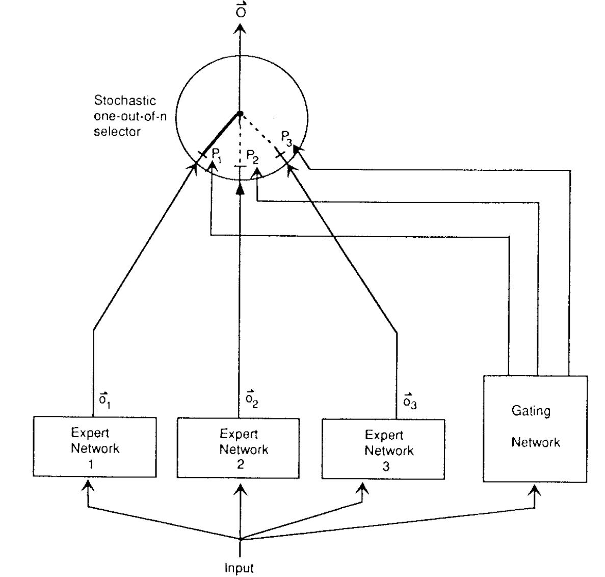
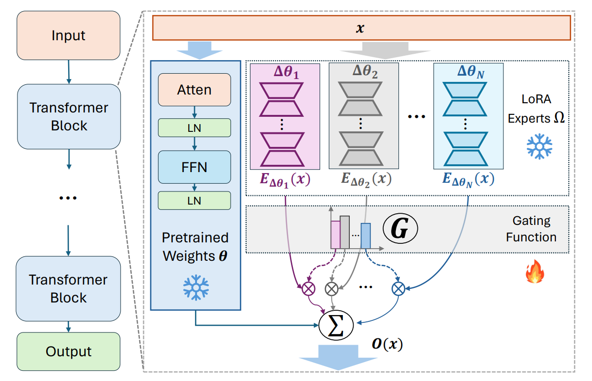
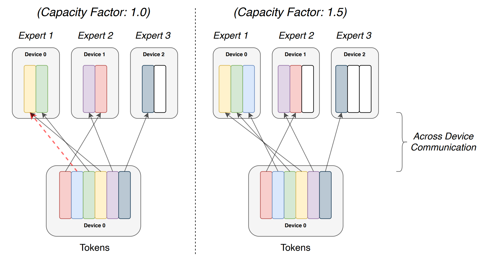
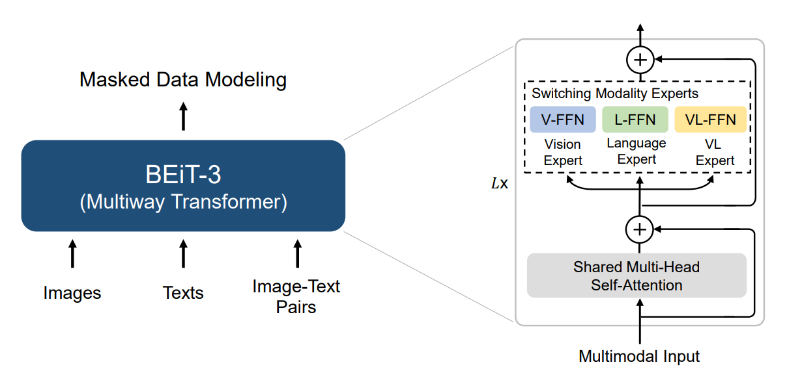
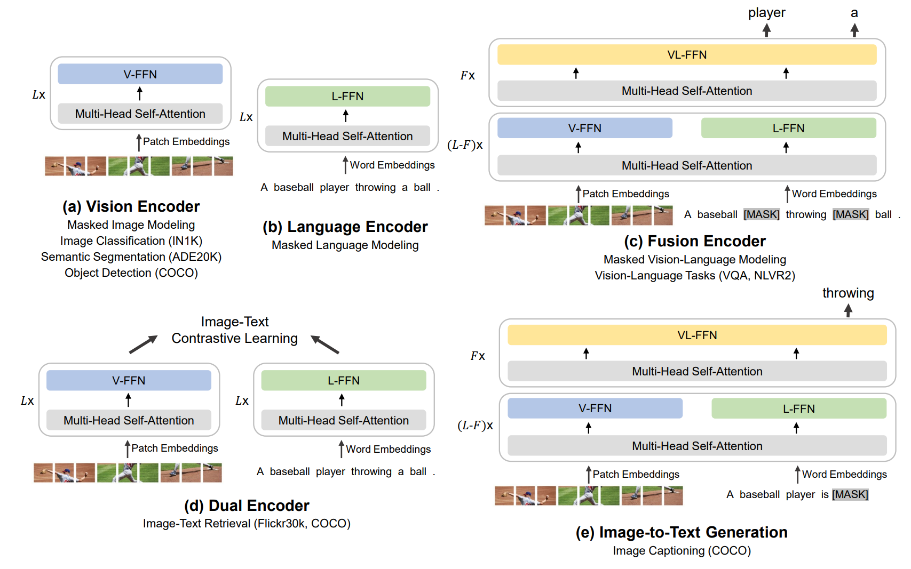

# Introduction

## Ensemble methods

Ensemble machine learning methods are a set of methods that work with multiple estimators and combine their results to produce the final output. Common methods include bagging, boosting, stacking, etc. The idea behind these methods is that the combination of multiple estimators is more accurate than a single estimator. @dietterich2000ensemble details multiple classical ensemble algorithms.

Popular ensemble methods include Random Forests, Gradient Boosting, 

## Ensemble methods

- Bagging (Bootstrap Aggregating) uses different subsets of the training data to train multiple models and then combines their results.
- Boosting uses multiple models sequentially, where each model is trained to correct the errors of the previous model.
- Stacking uses multiple models to generate predictions, and then uses another model to combine the predictions of the previous models.
- Mixture of Experts differentiates between different types of inputs and uses different models to process them, then combines the results from the selected models.

# Mixtures of Experts (MoE)

## MoE in general

@jacobs1991adaptive introduced the Mixture of Experts (MoE) model in 1991. The model is a generalization of the mixture model, where the input is used to select the model that is used to generate the output. The model is trained to select the best model for each input.

In the original paper, this model consists of multiple feed-forward neural networks as experts, and a gating network that decides the probability of each expert being selected. The gating network is also a feed-forward neural network with softmax activation. Here each expert has the same input and the output dimensions are the same for all experts, only the weights are different.

## MoE in general

{height=80%}

## MoE Parts

The main parts of the MoE model we have to account for are:

- Dataset partitioning (what is the input of each expert)
- Experts (what is the architecture of each expert)
- Gating network (how to weight the expert outputs)
- Aggregation (how to combine the weighted outputs)
- Routing (do not use experts with zero/low weight)
- Sparsity (how to separate the knowledge of the experts)

Sparsity and routing can substitute dataset partitioning in deep learning models.

## Modern MoE

![Routed topK=2 additive sparsely-gated MoE from [@shazeer2017outrageously]](./figures/moe_modern.png){height=70%}

## Sparse Gating

@shazeer2017outrageously introduces a noisy-Top-K sparse gating procedure where the output is the gated sum of the experts. On $x$ input using $n$ experts ($E(.)$) with $G_i(.)$ gating network the output is:

$O(x)=\sum\limits_{i=1}^n G_i(x)E_i(x)$

Instead of the softmax-based gating procedure, this architecture uses:

$G(x)=Softmax(KeepTopK(H(x),k))$

KeepTopK lets the original value through for the top $k$ values and sets the rest to $-\infty$ before the softmax.

## Sparse Gating

Here, $H(x)$ is a noisy gating value:

$H_i(x) = (x\cdot W_g)_i + z_i \cdot Softplus((x\cdot W_N)_i)$

where $z_i \sim \mathcal{N}(0,1)$ is a random variable and $W_g$ and $W_N$ are tunable weights, and softplus is a smooth approximation of the ReLU function.

This ensures that the network activates a small number of experts at each input. The problem is, that if an expert gets activated frequently, it will get trained more often, so it will perfrom better, thus it will get activated even more often. This can lead to a situation where only a small number of experts are used for most of the inputs.

## Balancing Expert Utilization

To counteract the problem of over-used experts we can introduce an extra importance loss term. This importance loss tries to minimize the variation of expert importances over each training batch.

$I_{batch}(X) = \sum\limits_{x\in X} G(x)$

$I_{batch}(X)$ is the vector of sums of the expert importances for the inputs in the batch $X$. The loss is proportional to the coefficient of variation of the expert importances:

$\mathcal{L}_{importance} = w_{importance} \cdot CV(X)$ where $w_{importance}$ is a hyperparameter and $CV(X) = \frac{\sigma(I_{batch}(X))}{\mu(I_{batch}(X))}$ is the coefficient of variation.

## Optimization and load balancing

On top of the even utilization of the experts some solutions define a loss for load inequality for each bach (load means the number of inputs assigned to each expert in a batch). Equal load is beneficial for parallelization of the model.

As balancing works better with large batches, multi-gpu data and model parallelism is used. The standard layers and the gates are replicated in a data-parallel way, while the experts are model-parallel shards with a single copy of each subset of the experts in the whole system. Different subsets are stored on different GPUs, and the information is passed between the GPUs according to the gates.

## Hierarchical MoE

@shazeer2017outrageously also introduces a hierarchical MoE model for language modeling, where the first router/gating network activates sets of experts, and then this set of experts acts like a traditional MoE block.

Fast Feed-Forward Layers [@belcak2023fast] are hierarchical MoE blocks with a logarithmic complexity tree-like gating procedure. Each layer in this tree is a gate network of $[dim_{in}, dim_{node_{hidden}}, 1]$ layer dimensions with a sigmoid activation. The output denotes which child the input should be routed to. The leaf nodes are normal, larger feed-forward experts.

## Parameter Efficiency + MoE

There are a number of recently introduced models that use the MoE architecture to improve on adapters, prefix tuning or LoRA-s [@liu2023moelora] [@zadouri2023pushing] [@wu2023pituning] in order to provide efficient and performant adaptation. In general these MoE-style adapters work better than the dense counterparts.

A recent paper proposed to ICLR 2024 [@anonymous2023mole] also introduces MoE layers, where each expert is a LoRA. This opens up possibilities for extending a MoE model with newly added experts and dynamically activating or deactivating experts.

## Parameter Efficiency + MoE

{height=70%}

## Why do they work well?

![The motivation behind MoEs is that they learn to classify (brown lines) different parts/clusters of the input space, thus a set of local function approximators could be used instead of a single global one. The optimal partitioning (colors) is learnt by the gating network. This way MoE outperform dense representations. [@chen2022understanding]](./figures/moe_motivation.png){height=55%}

# Text-only MoEs

## Switch Transformer

Switch transformers [@fedus2022switch] build on top of the sparse MoE idea, but instead of routing each input to a single expert they split the input and route each token independently to a single expert.

To guide load balancing, on top of the importance and load losses (which they fuse together), @fedus2022switch introduce an expert capacity ($tokens_{batch}/num_{experts}\cdot capacity\_factor$), that is a hard limit on the number of tokens each expert can process. In case of an overflow the token that would be routed to the expert is not processed (but its original value is passed through the residual connection).

## Switch Transformer

{height=70%}

## Switch Transformer

Switch transformers replace the feed-forward layers in the transformer modules with the switch MoE blocks. Switch transformers achieve state-of-the-art results compared to traditional MoE and T5 models.

The authors also note that special weight initialization, 32-bit gating precision and dropout (including experts and other parts as well) are beneficial. Q,K,V weights could also be replaced by MoE models, but training instabilities are observed at 16-bit calculaitons, refer to @fedus2022switch for details.

Given the same performance, switch transformers are 2-3 times faster to train than full T5 models.

## UltraFastBERT

@belcak2023exponentially introduces the UltraFastBERT which is an implementation of BERT using Fast Feed-Forward Layers. Replacing the intermediate layer in the encoder's pointwise feed-forward layer @belcak2023exponentially reports that using single neuron experts with a GELU activation function (after 11 layers of binary decisions) is enough to achieve $96+%$ of the original BERT's performance.

The training time is reduced by a significant factor as well, but inference times are exponentially faster. The authors report a $80x$ speedup on a naive GPU implementation and $250x$ speedup on CPUs.

# Multimodal MoEs

## BeiT

In case of multimodal networks selecting "subsets" of the input data is trivial, as experts can be selected based on the input modality.
BeiT-3 [@wang2022image] along with two preceeding models, handles image and text inputs in the same masked modeling task.
The model is enhanced with a set of vision, language and vision-language combined experts. Each input token has corresponding modality information avaliable. An expert is selected with from the corresponding pool for each token based on the modality information.

This model at its publication achieves top performance in retrieval tasks, object detection, segmentation and image classification.

## BeiT Architecture

{height=70%}

## BeiT Use Cases

{height=80%}

## References {.allowframebreaks}
\footnotesize